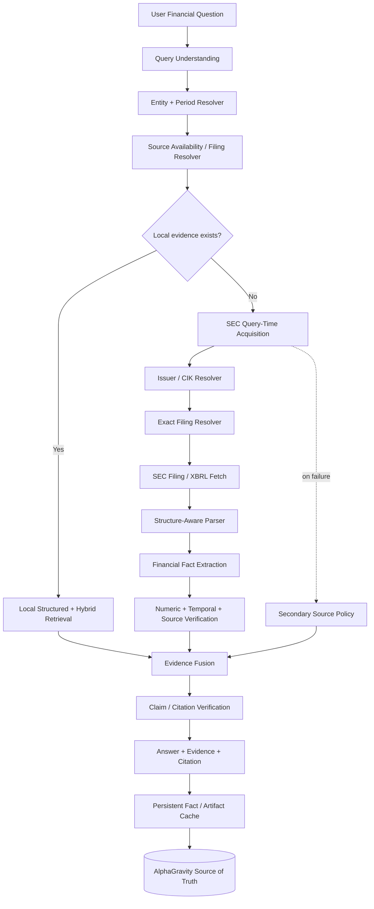

# FIX_SECFILING.md

# AlphaGravity — SEC Filing Retrieval & Financial Fact Reliability Roadmap

**Objective:** make AlphaGravity answer SEC/financial-fact questions from authoritative primary sources without requiring continuous SEC filing ingestion.

**Core constraint:** **Do not build a continuous SEC polling/ingestion requirement for interactive Q&A.** The database remains the durable knowledge layer. SEC becomes an authoritative source-acquisition layer that can resolve and fetch a specific filing on demand, then persist the useful artifact/facts into AlphaGravity.

**Success condition:** a query such as:

> What was NVIDIA's Data Center revenue in Q3 FY2026?

must resolve to the correct issuer, fiscal period, filing, evidence/table, value, and citation even when that filing was not previously indexed.

---

## 0. Ruthless diagnosis

The current repository already has substantial SEC infrastructure and a hybrid retrieval stack. The SEC source code can fetch company filings through `edgartools`, and it has a raw EDGAR fallback that resolves ticker → CIK and constructs filing URLs. That capability should be promoted from an ingestion-only path into a **query-time authoritative source resolver**.

The product failure exposed by the NVIDIA Q3 FY2026 test is not primarily a model problem:

```text
authoritative SEC evidence exists
        ↓
not present in local corpus
        ↓
local retrieval returns zero
        ↓
application reports "No indexed documents found"
```

That behavior must become:

```text
local retrieval miss
        ↓
financial/source resolver
        ↓
resolve issuer + period + filing
        ↓
SEC acquisition
        ↓
parse / XBRL / table extraction
        ↓
verify fact
        ↓
answer + citation
        ↓
persist artifact/facts asynchronously
```

The existing repository describes a multi-database search architecture and an SEC ingestion source. The upgrade should **reuse the existing infrastructure**, not create another independent RAG stack.

---

# 1. Design principles

## P0 — Source existence is not equivalent to index existence

Never emit:

> "No indexed documents found"

as the final answer when an authoritative supported source can still be resolved.

Internal state may be `LOCAL_CORPUS_MISS`; user-facing state should be `ACQUIRING_PRIMARY_SOURCE`.

## P0 — Primary financial facts are structured before semantic

For exact financial facts, retrieval priority should be:

1. XBRL / structured fact
2. authoritative filing table
3. filing text
4. secondary source

Embeddings must never be the sole authority for an exact financial number.

## P0 — Fiscal periods are issuer-specific

The resolver must model:

- ticker
- CIK
- fiscal year
- fiscal quarter
- period start
- period end
- filing date
- filing form
- accession number
- amendment status

Do not infer Q3 FY2026 from calendar-quarter assumptions.

## P0 — Acquisition is query-time; persistence is asynchronous

The user should not wait for a full re-indexing job.

```text
query
  ↓
resolve
  ↓
fetch minimum required evidence
  ↓
answer
  ↓
persist/cache/index in background
```

## P0 — Never invent evidence

If the resolver cannot establish the exact filing or fact, the system must say what is missing and continue with a lower-authority source only when the answer policy permits it.

---

# 2. Target architecture



---

# 3. Query classification

Introduce a deterministic `question_class` before retrieval.

Minimum classes:

```text
EXACT_FINANCIAL_FACT
FINANCIAL_TABLE
FINANCIAL_CALCULATION
FILING_QUALITATIVE
MULTI_DOCUMENT_RESEARCH
MARKET_NEWS
GENERAL
```

For `EXACT_FINANCIAL_FACT` and `FINANCIAL_TABLE`, activate the financial-source resolver before broad semantic retrieval.

Example:

```json
{
  "question_class": "EXACT_FINANCIAL_FACT",
  "entity": {
    "ticker": "NVDA",
    "cik": "0001045810"
  },
  "period": {
    "fiscal_year": 2026,
    "fiscal_quarter": 3
  },
  "metric": "Data Center revenue",
  "preferred_source": "SEC",
  "preferred_forms": ["10-Q", "10-K", "8-K"]
}
```

---

# 4. Filing resolver

Create a dedicated service/module:

```text
services/gravity-api/app/research/sources/sec/
    resolver.py
    client.py
    filing_selector.py
    xbrl.py
    parser.py
    facts.py
    models.py
```

Do not duplicate SEC logic inside the generic RAG orchestrator.

## Resolver responsibilities

### Step A — ticker → CIK

Use a durable company identity table/cache.

Required fields:

```text
ticker
company_name
cik
exchange
sic
lei (when available)
valid_from
valid_to
```

### Step B — period → expected filing

Resolve:

```text
NVDA
Q3
FY2026
```

to:

```text
period_end = 2025-10-26
form = 10-Q
```

Do not guess. Validate against issuer filing metadata.

### Step C — choose exact filing

Ranking:

1. exact form + exact period
2. amended filing only if it is the latest authoritative version
3. filing date consistency
4. accession number
5. primary document
6. filing index

### Step D — fetch minimum required artifact

Prefer:

```text
XBRL facts / filing HTML / structured tables
```

before downloading unnecessary assets.

---

# 5. Exact-fact retrieval

For a query like:

> NVIDIA Data Center revenue Q3 FY2026

the system should search structured facts first.

Concept resolution must support synonym sets such as:

```text
Data Center
Data Center revenue
data center end market
data-center revenue
```

But the synonym resolver must not confuse:

```text
Data Center revenue
Data Center growth
Data Center operating income
Data Center compute revenue
```

Create a concept ontology:

```text
metric_family
metric_name
xbrl_concepts[]
aliases[]
unit
sign
segment/end-market dimension
```

---

# 6. Table-aware extraction

Never flatten a financial table into ordinary chunks and hope retrieval finds the right number.

Preserve:

```text
table_id
caption
section_path
row_label
column_label
period
unit
value
source_location
```

Example internal fact:

```json
{
  "metric": "Data Center revenue",
  "value": 51215,
  "unit": "USD millions",
  "period_end": "2025-10-26",
  "fiscal_year": 2026,
  "fiscal_quarter": 3,
  "issuer": "NVIDIA Corporation",
  "source": {
    "form": "10-Q",
    "accession": "0001045810-25-000230"
  }
}
```

The LLM should receive the verified fact and evidence, not be responsible for discovering a number from an ambiguous chunk.

---

# 7. Amendment and restatement handling

This is mandatory for world-class financial reliability.

The source layer must understand:

```text
10-Q
10-Q/A
10-K
10-K/A
8-K earnings release
```

For conflicting values:

```text
same issuer
same metric
same period
multiple filings
```

apply deterministic authority rules and surface the conflict when necessary.

Never silently mix:

```text
original filing
amended filing
restated annual value
later comparative table
```

---

# 8. Evidence object

Standardize every source result into one evidence schema.

```json
{
  "evidence_id": "...",
  "source_type": "SEC",
  "issuer": "NVIDIA Corporation",
  "ticker": "NVDA",
  "cik": "0001045810",
  "filing_type": "10-Q",
  "filing_date": "2025-11-19",
  "period_start": "2025-07-28",
  "period_end": "2025-10-26",
  "fiscal_year": 2026,
  "fiscal_quarter": 3,
  "accession_number": "0001045810-25-000230",
  "document_url": "...",
  "section_path": "...",
  "table_id": "...",
  "row_label": "Data Center",
  "column_label": "Three Months Ended October 26, 2025",
  "value": 51215,
  "unit": "USD millions",
  "text_span": "...",
  "xbrl_concept": "...",
  "retrieved_at": "...",
  "parser_version": "...",
  "verification_status": "verified"
}
```

This object becomes the contract between source acquisition, retrieval, verification, and answer generation.

---

# 9. Database strategy

The goal is **not** continuous SEC ingestion.

Use three states:

```text
DISCOVERED
FETCHED
PERSISTED
```

### DISCOVERED

Filing metadata is resolved.

### FETCHED

The exact source was downloaded for the current question.

### PERSISTED

Useful normalized facts/artifacts are stored in AlphaGravity.

The system should be allowed to answer after `FETCHED + VERIFIED`.

Persistence should not block the response.

---

# 10. Suggested database model

Reuse PostgreSQL as the financial source of truth.

Minimum tables:

```text
sec_issuers
sec_filings
sec_filing_versions
sec_filing_artifacts
financial_facts
financial_fact_dimensions
financial_tables
source_evidence
source_fetch_log
```

Important uniqueness constraints:

```text
issuer.cik UNIQUE

filing:
  UNIQUE(cik, accession_number)

fact:
  UNIQUE(
    issuer_id,
    metric_id,
    period_end,
    fiscal_year,
    fiscal_quarter,
    dimensions_hash,
    source_filing_id
  )
```

Do not use a vector ID as the identity of a financial fact.

---

# 11. Cache strategy

Redis/cache should store:

```text
ticker → CIK
CIK + period → filing
accession → document metadata
query signature → evidence bundle
```

Use explicit TTLs for mutable metadata.

Persist authoritative filing/fact identity in PostgreSQL.

---

# 12. Retrieval routing policy

Replace:

```text
retrieve everything
→ RRF
→ rerank
```

with a routed policy:

```text
if exact financial fact:
    structured source resolver
    ↓
    SEC/XBRL
    ↓
    local financial facts
    ↓
    table/text retrieval
    ↓
    verify

elif filing qualitative:
    filing resolver
    ↓
    structure-aware retrieval
    ↓
    rerank
    ↓
    verify

elif deep research:
    planner
    ↓
    source acquisition
    ↓
    hybrid retrieval
    ↓
    multi-hop research
    ↓
    verification
```

The goal is not fewer retrieval technologies for ideological reasons. The goal is to **route the right question to the right evidence system**.

---

# 13. Failure policy

Never convert source failure into a fabricated answer.

Required states:

```text
ANSWERED_VERIFIED
ANSWERED_SECONDARY
PARTIAL
SOURCE_NOT_FOUND
SOURCE_UNAVAILABLE
CONFLICTING_EVIDENCE
UNSUPPORTED
```

Example:

```text
SEC source found → ANSWERED_VERIFIED
SEC unavailable but company IR supports → ANSWERED_SECONDARY
SEC filing found but metric absent → UNSUPPORTED
Two authoritative filings conflict → CONFLICTING_EVIDENCE
```

---

# 14. UI behavior

Replace implementation leakage:

```text
No indexed documents found.
Ingest relevant SEC filings first.
```

with progressive research states:

```text
Analyzing question
✓ NVIDIA identified
✓ Q3 FY2026 resolved
✓ SEC 10-Q required

Searching primary source
✓ Filing resolved
✓ Relevant table found
✓ Number verified

Answer
```

The UI must distinguish:

```text
Searching local knowledge
Acquiring primary source
Parsing source
Verifying evidence
Writing answer
```

---

# 15. Acceptance tests

These are mandatory before declaring the SEC fix complete.

## P0 exact-fact tests

- NVDA Q3 FY2026 Data Center revenue
- NVDA Q3 FY2025 Data Center revenue
- TSLA FY2025 revenue
- AAPL FY2025 revenue
- MSFT FY2025 revenue
- AMZN FY2025 revenue

## P0 period tests

- fiscal year ≠ calendar year
- 52/53-week fiscal calendars
- quarter-end dates
- amended filings
- prior-year comparative columns

## P0 semantic tests

- revenue vs operating income
- segment revenue vs total revenue
- GAAP vs non-GAAP
- quarterly vs YTD
- millions vs billions
- percentage vs absolute value

## P0 negative tests

- nonexistent quarter
- unsupported company
- metric absent from filing
- ambiguous company name
- conflicting filings
- SEC temporarily unavailable

## P0 no-index tests

Every supported exact-fact test must pass when the local database starts with **zero relevant filing chunks**.

That test is the direct regression for the screenshot failure.

---

# 16. Performance targets

Do not claim targets without measurement.

Track:

```text
source_resolution_latency_ms
fetch_latency_ms
parse_latency_ms
fact_extraction_latency_ms
verification_latency_ms
total_latency_ms
cost_per_query
cache_hit_rate
source_resolution_success_rate
```

Recommended initial gates:

```text
≥99% exact filing resolution on supported test set
≥98% exact-fact correctness
≥98% citation correctness
≤2% adversarial citation rate
0 silent numeric hallucinations
0 "no indexed docs" terminal failures when supported source exists
```

These are engineering gates, not claims about current performance.

---

# 17. Evaluation integration

Connect this work to AlphaGravity's existing financial benchmark infrastructure.

Measure separately:

```text
local-only
query-time-source
hybrid
```

This allows you to prove that source acquisition actually improves the product.

Minimum report:

```text
Answer accuracy
Source resolution accuracy
Citation precision
Citation recall
Span Recall@5
Adversarial citation rate
Latency
Cost/query
Tool calls
```

Do not declare "world class" from architecture alone.

---

# 18. Implementation phases

## Phase 0 — Reconnaissance

- [ ] Inspect current SEC ingestion code.
- [ ] Inspect financial database schema.
- [ ] Inspect structured retrieval.
- [ ] Inspect query parser/entity resolver.
- [ ] Inspect citation/evidence types.
- [ ] Identify existing functions that already resolve ticker → CIK.
- [ ] Reuse existing code instead of duplicating it.
- [ ] Write a short architecture decision record before changing code.

**Gate:** no duplicate SEC client is introduced without justification.

## Phase 1 — SEC Source Resolver

- [ ] Create query-time SEC resolver.
- [ ] Implement issuer resolution.
- [ ] Implement fiscal-period resolution.
- [ ] Implement exact filing selection.
- [ ] Support amended forms.
- [ ] Return canonical filing identity.
- [ ] Add unit tests.

**Gate:** exact filing resolution ≥99% on deterministic fixture set.

## Phase 2 — Fact Acquisition

- [ ] Add XBRL/structured fact retrieval.
- [ ] Add table-aware filing extraction.
- [ ] Add financial concept mapping.
- [ ] Add unit normalization.
- [ ] Add period normalization.
- [ ] Create canonical evidence object.

**Gate:** no LLM required to determine exact numeric value.

## Phase 3 — Retrieval Router

- [ ] Add question classification.
- [ ] Route exact facts to structured source resolver.
- [ ] Route qualitative filing questions to filing retrieval.
- [ ] Preserve generic hybrid retrieval for general research.
- [ ] Add fallback from local corpus miss to authoritative source.

**Gate:** NVIDIA Q3 FY2026 regression passes from an empty local corpus.

## Phase 4 — Verification

- [ ] Numeric verification.
- [ ] Temporal verification.
- [ ] Filing identity verification.
- [ ] Citation/span validation.
- [ ] Conflict detection.
- [ ] Negative-answer policy.

**Gate:** unsupported answers cannot pass verification.

## Phase 5 — Persistence

- [ ] Persist fetched filing metadata.
- [ ] Persist normalized facts.
- [ ] Persist evidence spans.
- [ ] Background indexing.
- [ ] Deduplicate by accession/document/fact identity.

**Gate:** repeated question becomes local-fast without requiring another SEC fetch.

## Phase 6 — Product UX

- [ ] Replace "No indexed documents found" terminal state.
- [ ] Add source-acquisition progress.
- [ ] Show primary-source status.
- [ ] Show filing date and period.
- [ ] Show exact evidence/citation.
- [ ] Distinguish verified vs secondary answers.

## Phase 7 — Benchmark Gate

- [ ] Run exact-fact suite.
- [ ] Run citation suite.
- [ ] Run negative controls.
- [ ] Run adversarial period/company tests.
- [ ] Measure latency and cost.
- [ ] Store results as machine-readable artifacts.

**Gate:** no "world-class" claim unless measured gates pass.

---

# 19. Do not do these things

- [ ] Do not add another vector database.
- [ ] Do not create a second SEC ingestion pipeline.
- [ ] Do not require full corpus ingestion before answering.
- [ ] Do not ask the LLM to guess fiscal periods.
- [ ] Do not use embeddings as authority for exact financial numbers.
- [ ] Do not silently prefer a secondary source over SEC.
- [ ] Do not hide source failures.
- [ ] Do not call a filing "missing" merely because it is not indexed.
- [ ] Do not optimize for number of retrieval channels.
- [ ] Do not declare completion from passing unit tests alone.

---

# 20. Definition of done

The SEC system is DONE only when all are true:

```text
[ ] Exact supported financial question can start with empty local corpus.
[ ] Issuer is resolved deterministically.
[ ] Fiscal period is resolved deterministically.
[ ] Exact filing is resolved.
[ ] Primary evidence is acquired.
[ ] Exact fact is extracted without LLM guessing.
[ ] Units are normalized.
[ ] Filing identity is verified.
[ ] Citation points to the exact evidence.
[ ] Answer passes numeric verification.
[ ] Source failure produces a truthful state.
[ ] Fetched evidence is persisted asynchronously.
[ ] Second query can use local persisted evidence.
[ ] Regression suite passes.
[ ] Benchmark results are recorded.
```

---

# 21. Final product principle

**AlphaGravity should not be a database that happens to have an LLM.**

It should be:

> **an evidence engine that can search its database, acquire authoritative evidence when necessary, verify it, and then reason over it.**

That is the architectural correction required by the NVIDIA failure.
