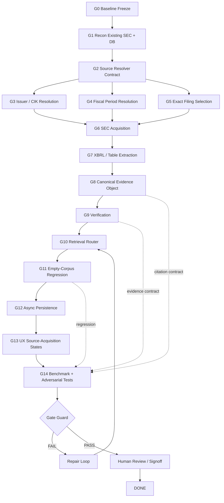

# LOOP_GRAPH_NOTE.md

# AlphaGravity LOOP Graph — Engineering Control Plane

**Purpose:** define how AlphaGravity's existing LOOP/graph discipline should drive the SEC reliability upgrade without allowing Claude Code to drift into uncontrolled implementation.

## Important evidence boundary

The public `AlphaGravity` main branch currently exposes the application architecture, SEC ingestion, benchmark specifications and roadmap documents, but the previously discussed local LOOP files (`gate-guard.mjs`, `graph-lint.mjs`, `LOOP_SPEC.md`, `LOOP_STANDARD.md`, `LOOP_CONVENTIONS.md`) are not present at the repository root on the current public branch.

Therefore this document does **not** pretend to have re-read their exact current source. It incorporates the known LOOP design from the prior project review:

- explicit goal / contract
- bounded iteration budget
- Target / Budget / Stall stopping
- maker/checker separation
- independent/adversarial checking
- gate guard
- graph linting
- executable dependency graph
- evidence-based completion
- no fabricated pass
- persistent loop state

**Claude Code MUST inspect the actual local LOOP files before execution and treat them as higher-priority project conventions.**

---

# 1. LOOP objective

Drive the SEC source-resolution failure from:

```text
LOCAL_CORPUS_MISS
    ↓
"No indexed documents found"
```

to:

```text
LOCAL_CORPUS_MISS
    ↓
AUTHORITATIVE_SOURCE_RESOLUTION
    ↓
SEC ACQUISITION
    ↓
STRUCTURED FACT / TABLE EXTRACTION
    ↓
VERIFICATION
    ↓
ANSWER + CITATION
    ↓
ASYNC PERSISTENCE
```

while preserving existing AlphaGravity architecture and avoiding unnecessary new infrastructure.

---

# 2. LOOP graph



---

# 3. Graph node contract

| Node | Goal | Required evidence | Done condition |
|---|---|---|---|
| G0 | Freeze baseline | git status, tests, current behavior | baseline recorded |
| G1 | Understand current system | actual files/schema/routes | reuse map written |
| G2 | Define source contract | typed interface | contract tests |
| G3 | Resolve issuer | ticker/CIK fixtures | deterministic pass |
| G4 | Resolve fiscal period | issuer calendar fixtures | deterministic pass |
| G5 | Select filing | form/accession fixtures | exact filing selected |
| G6 | Fetch source | HTTP/EDGAR fixtures | source bytes/metadata valid |
| G7 | Extract facts | XBRL/table fixtures | exact fact recovered |
| G8 | Canonical evidence | evidence object | schema validated |
| G9 | Verify | numeric/temporal/source tests | unsupported facts fail |
| G10 | Route query | router tests | exact-fact path selected |
| G11 | Empty corpus | clean DB fixture | query succeeds without pre-index |
| G12 | Persist | DB/cache tests | second query local-fast |
| G13 | UX | API/UI tests | no implementation error leaks |
| G14 | Benchmark | evaluation report | thresholds recorded |
| G15 | Gate | independent checker | pass/fail/uncertain |
| G17 | Human signoff | explicit human decision | recorded |
| G18 | Done | all gates | no unresolved P0 debt |

---

# 4. Critical dependency graph

```text
Entity Resolution
        │
        ├──→ Filing Resolution
        │        │
Fiscal Period ──┘        │
                         ▼
                  Source Acquisition
                         │
                         ▼
                  Fact / Table Parsing
                         │
                         ▼
                    Evidence Object
                         │
             ┌───────────┼───────────┐
             ▼           ▼           ▼
          Numeric     Temporal     Citation
          Verify       Verify       Verify
             └───────────┼───────────┘
                         ▼
                    Query Router
                         │
                         ▼
                  Empty-Corpus Test
                         │
                         ▼
                    Persistence
                         │
                         ▼
                     Benchmark
                         │
                         ▼
                    Gate Guard
```

---

# 5. LOOP invariants

These must never be violated.

## I1 — No fake completion

A model may not mark a node complete because code "looks right."

Completion requires executable evidence.

## I2 — Maker does not grade itself

The implementation agent may produce code and tests, but the final gate must be independently checked.

## I3 — No source, no claim

A financial fact without authoritative evidence cannot pass the final gate.

## I4 — Empty corpus is a first-class test

The exact NVIDIA regression must start with no relevant local filing.

## I5 — Database persistence is not acquisition

Fetching a source for a query must not require a full ingestion job.

## I6 — No infrastructure expansion without measured need

New databases, queues, vector stores or agents require a benchmark-backed justification.

## I7 — Existing project conventions win

Claude must inspect and obey the real local LOOP files before modifying the graph or gate behavior.

---

# 6. Target / Budget / Stall policy

## Target

The target is not "implement SEC resolver."

The target is:

> **For supported exact financial questions, AlphaGravity reliably resolves and verifies primary-source evidence even when the evidence is absent from the local corpus.**

## Budget

Use bounded iterations.

Suggested initial loop budget:

```text
max_iterations: 18
max_failed_gates: 3
max_unresolved_P0_debt: 0
```

The actual project LOOP configuration takes precedence.

## Stall

Declare STALL when:

- the same gate fails twice without new evidence;
- a dependency is missing and cannot be resolved from the repository;
- an external source contract is unverifiable;
- a proposed architecture change requires a new infrastructure component without benchmark evidence;
- tests are being weakened to obtain a pass.

STALL is not FAIL and is not DONE.

---

# 7. Checker strategy

The checker must attack the implementation.

Required adversarial cases:

```text
NVDA Q3 FY2026
NVDA Q3 FY2025
NVDA fiscal/calendar mismatch
10-Q vs 10-Q/A
quarter vs YTD
millions vs billions
Data Center revenue vs Data Center growth
segment vs consolidated revenue
missing metric
wrong company with similar name
empty local corpus
SEC temporary failure
conflicting source values
```

The checker must inspect:

```text
source identity
period identity
metric identity
unit
value
citation
fallback behavior
persistence
```

---

# 8. Gate graph

```text
GATE A — SOURCE
    exact issuer + filing resolved

GATE B — FACT
    exact value extracted

GATE C — EVIDENCE
    exact evidence location stored

GATE D — VERIFICATION
    numeric + temporal + source checks pass

GATE E — ROUTING
    local miss invokes authoritative resolver

GATE F — REGRESSION
    empty-corpus test passes

GATE G — PERSISTENCE
    second query can use stored evidence

GATE H — BENCHMARK
    measurable thresholds pass

GATE I — GUARD
    no blocking comprehension debt
```

No downstream gate can compensate for a failed upstream source gate.

---

# 9. LOOP memory

Persist only durable information:

```text
memory:
- existing SEC fetch code
- existing DB tables/schema
- exact source resolver contract
- rejected architecture alternatives
- benchmark results
- known provider limitations
- parser edge cases
- verification failures
```

Do not persist:

```text
- speculative claims
- unverified performance
- "should work"
- model confidence without evidence
```

---

# 10. Definition of done

The LOOP may close only when:

```text
[ ] G0–G14 complete.
[ ] Independent checker passes.
[ ] Gate guard passes.
[ ] Human signoff is real and recorded.
[ ] No P0/P1 debt is hidden.
[ ] Empty-corpus NVIDIA regression passes.
[ ] Benchmark report exists.
[ ] Existing tests remain green.
[ ] No unjustified new infrastructure introduced.
```

---

# 11. World-class interpretation

The LOOP is not successful because Claude writes a lot of code.

It is successful if the resulting system demonstrates:

```text
source resolution
→ evidence acquisition
→ fact extraction
→ verification
→ citation
→ persistence
→ measurable reliability
```

The graph should therefore optimize for **evidence quality and failure elimination**, not feature count.
