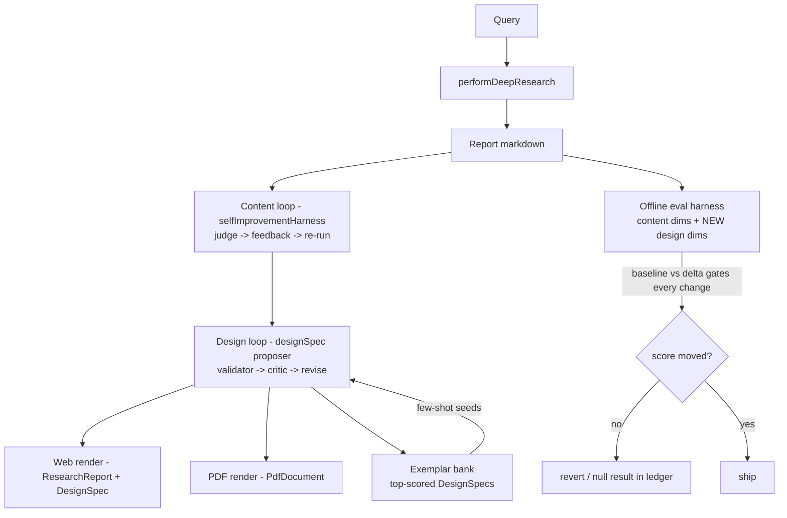

# LOOP TASK — Gamma-class self-improving reports (design + content, measured)

> **New-session loop prompt (paste this):**
> `/loop Read GAMMA_LOOP_TASK.md + GAMMA_PROGRESS.md, execute the single next unchecked task per the cycle rules (honesty rules override everything), update progress, end iteration.`

Successor to WC_LOOP_TASK.md (closed 2026-07-10). Target: reports that look and read like a Gamma-designed document — visually structured, chart-rich, self-improving — with every claim of improvement MEASURED, never asserted.

## Verified current state (audited 2026-07-10 — build on this, don't rebuild it)
A parallel session already shipped the foundations (uncommitted in worktree — check `git status` first; coordinate, don't clobber):
- `src/services/selfImprovementHarness.ts` — CONTENT loop: judge → feedback → re-run (`maybeRunQualityLoop`, wired into SearchPage), `llmChat` helper, `LOOP_SELF_IMPROVE.sh`.
- `src/services/pdfDesigner.ts` — DESIGN loop for PDF export: LLM proposes bounded `DesignSpec` → deterministic validator (whitelisted palette, verbatim pull quotes, clamps) → critic scores → revise. Wired into `pdfExport.ts` + `PdfDocument.tsx`.
- `src/services/evalRubric.ts` — race-lite-v1 rubric (4 CONTENT dims; `eval/rubric.ts` is a shim re-export). Eval harness `eval/drEval.test.ts` (model now `deepseek-v4-flash` per that session — do not revert).
- `src/services/reportQaGates.ts` (37K) — QA gates incl. `ExhibitSpec`.
- `presentationExport.ts` — pptx export exists.
- Content baseline archived: `eval/out/v2-prew1/baseline.json` (judge 8.2/6.6/7.0/8.0, density 0.67, entail 0.97).

## Ruthless gap analysis (why this isn't Gamma-class yet)
1. **Web view gets zero design.** The design loop only styles the PDF; the on-screen report (`ResearchReport.tsx`) is plain ReactMarkdown — and the screen is the primary surface. Gamma designs the live document, not the export.
2. **No design baseline.** The design critic runs at export time but nothing scores design offline; rubric has zero design dimensions. Improvement claims are unmeasurable.
3. **No charts on the web.** No chart lib installed (verified package.json); numbers live in prose/tables. Gamma auto-visualizes.
4. **No memory.** Every design loop starts cold; winning DesignSpecs are discarded. Gamma has curated exemplars.
5. **Design judged as text, not pixels.** No live vision model (deepseek only). Structure-level judging is the honest ceiling until a vision key exists.
6. **Content insight = 6.6/10** in baseline — reports summarize more than they analyze. Untouched.

## Loop-of-loops architecture (target)

## Honesty rules (override everything)
- Never fabricate a score or delta. Design scores come from a real judge over real artifacts.
- Design dims are judged from markdown/HTML STRUCTURE (hierarchy, exhibits, scannability) — say so; do not claim visual/pixel judging without a vision model.
- Every phase ships with before→after numbers or an explicit null result. Regression → revert (W1c precedent).
- Another session works this repo: `git status` before editing; never commit files you didn't change; never revert their edits (e.g. `deepseek-v4-flash`).
- Blocked (dead key, quota) = documented + move on. Tavily quota may still be exhausted — G0/G1/G3 are quota-immune by design (they score ARCHIVED reports and add rendering); only full-pipeline re-evals need live search.

## Per-iteration cycle
1. Read `GAMMA_PROGRESS.md`. Pick single highest-priority UNCHECKED task. Skip BLOCKED.
2. Smallest correct diff (ponytail). New logic = exported pure fns + vitest (pattern: `deepResearchService.p0b.test.ts`, 18 tests green today).
3. Verify: `npx tsc --noEmit -p tsconfig.app.json` + relevant vitest + `npm run build` for UI changes.
4. Commit on `roadmap/world-class`, one commit per task. Don't push unless told.
5. Ledger line in `GAMMA_PROGRESS.md` (MEASURED vs expected labeled), set NEXT, end iteration.
6. EXIT when G0–G3 done (G4 blocked-by-key, listed for the human).

## Plan

### G0 — Design baseline (quota-immune: scores the 5 ARCHIVED v2 reports)
- **G0a** Extend `evalRubric.ts` with `race-lite-v2`: +4 design dims judged from markdown structure — `visual_hierarchy` (heading logic, section balance), `scannability` (tables/lists/bold where they help, para length), `exhibit_readiness` (numeric series that SHOULD be charts, are they chartable/marked), `narrative_flow` (exec-summary→evidence→risk arc). Judge prompt versioned; content dims unchanged so v1 scores stay comparable.
- **G0b** `eval/designEval.test.ts`: score the 5 archived reports in `eval/out/v2-prew1/*.md` (no pipeline run, no Tavily) → `eval/out/design-baseline.json`. This is THE design baseline. Cost ≈ 5 judge calls.

### G1 — Web-surface design system (the Gamma look, on screen)
- **G1a** Reuse `pdfDesigner.ts`'s DesignSpec on the web: run (or reuse the export-time) spec for the on-screen report; `ResearchReport.tsx` renders key-finding hero block, pull quotes, tone accent, density — same validator bounds, zero new free-form CSS from the LLM.
- **G1b** Stat-callout row: deterministic extractor pulls 3-5 headline metrics ALREADY CITED in the report (verbatim numbers + their [n] tags) into Gamma-style stat cards. Invented numbers structurally impossible (extractor-only, no LLM generation).
- **G1c** Re-run design eval on re-rendered archived reports → delta vs G0 baseline. Honest sign reported.

### G2 — Auto-exhibits (charts, both surfaces)
- **G2a** Numeric-series extractor: tables/series in report markdown → bounded `ExhibitSpec` (reuse reportQaGates type). Pure fn + tests; values must match report text verbatim (QA gate).
- **G2b** Web renderer: inline SVG bar/line components (NO new chart dep — none installed, keep it that way unless measurement demands); PDF side reuses existing exhibit path.
- **G2c** Design eval re-run → delta (exhibit_readiness dim should move; if flat, say so).

### G3 — Exemplar memory (the self-improvement flywheel)
- **G3a** Persist every design-loop outcome: `{DesignSpec, critic score, report intent/tone}` → local JSON first (`eval/out/design-exemplars.json`); Supabase table only if cross-device needed later.
- **G3b** Seed the designer prompt with top-3 scored exemplars matching report tone/intent (few-shot). Measure: critic iterations-to-pass and final score, before vs after seeding, over the archived set. Null result → ledger it, keep the bank anyway (data compounds).

### G4 — BLOCKED / for the human
- Vision-model design judging (screenshot → VLM): needs a live vision key (none today).
- Full-pipeline content re-eval + W2a verification: needs Tavily quota.
- Insight dim (6.6): prompt work gated on content re-eval being possible.

## Targets (contingent, honest)
Design baseline exists; G1+G2 lift design-dim avg ≥1.5 points on archived set; exemplar seeding cuts design-loop iterations measurably or ledgers a null; zero content-dim regressions; zero fabricated numbers; total judge spend ≤ ~$2.
