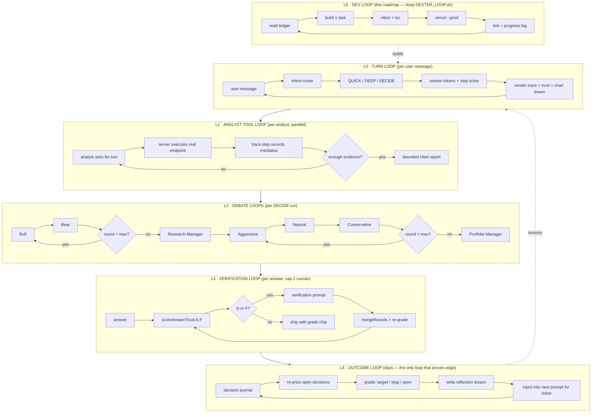

# AI_TRADING_AGENT_ROADMAP.md — Dexter: a world-class trading agent

Target: turn `apps/market-ui/src/components/trading/Assistant.tsx` ("Dexter AI") from a
dead browser-side Gemini chat into a self-verifying, tool-grounded, outcome-graded
trading agent — built on the repo's own agentic spine (gridTrace / gridTrust /
gridLessons) with the analyst→debate→risk architecture proven by TradingAgents.

---

## 0. Why the screenshot didn't work (verified 2026-08-01, not guessed)

| # | Fault | Evidence |
|---|-------|----------|
| F1 | **No API key in prod.** `initChat()` reads `VITE_GEMINI_API_KEY` / `VITE_GEMINI_API_KEYS`. `apps/market-ui/.env.production` sets neither; root `.env.production:80` sets `VITE_GEMINI_API_KEY=` (empty). Key missing → `initChat()` returns `null` → `sendMessage` throws `Failed to initialize chat`. The panel greets you and then dies on first send. | `Assistant.tsx:108-123`, `Assistant.tsx:254-256` |
| F2 | **Wrong side of the wire.** Even with a key it would ship a *live Gemini credential in the browser bundle*. The repo already solved this: keys live server-side behind `POST /api/llm` (`services/market-server/src/routes/llm.ts`), which `deepResearchService.ts` uses. Dexter bypassed it. | `Assistant.tsx:4,125`, `deepResearchService.ts:1071-1136` |
| F3 | **Dead model, dead provider.** Model is pinned to `gemini-3.1-pro-preview` with zero fallback. Repo memory: Gemini is quota-dead (20/day), Anthropic 401, Groq 401. **Only DeepSeek is live** — and Dexter cannot reach it. | `Assistant.tsx:199` |
| F4 | **Market-server unreachable from prod anyway.** `apps/market-ui/.env.production:15` has `VITE_API_URL` **commented out**. Any fix that routes through market-server is dead on Vercel. The LLM proxy must be a Vercel function. | `apps/market-ui/.env.production:15` |
| F5 | **Fake tool protocol.** Tool results are shoved back as a *plain text user message* ("Here are the results of your tool calls…") instead of a `functionResponse` part. The model loses the call↔result linkage, re-calls tools, and burns the 5-loop cap. | `Assistant.tsx:422-431` |
| F6 | **The prompt lies about the product.** System prompt claims "Intelligent Task Planning", "Autonomous Execution", "Self-Validation". The code has none: one linear tool loop, no planner, no verification, no memory. | `Assistant.tsx:201-207` |
| F7 | **Hallucinated price levels.** `drawTechnicalAnalysis` accepts whatever numbers the LLM emits as support/resistance/fib/order-block. Nothing computes them from real bars; nothing rejects an invented level. | `Assistant.tsx:127-161`, `:334-339` |
| F8 | **Currency bug.** Header renders `$` unconditionally — a Tunisian listing quoted in TND shows as dollars. | `Assistant.tsx:484` |

**F1 is the screenshot.** F2–F8 are why fixing F1 alone would still not make it world-class.

---

## 1. Doctrine (hard rules — every task obeys these)

1. **TRUTH.** Never invent data, endpoints, prices, or timings. Live-probe every endpoint
   before wiring a tool; paste the real response into the Progress log. A dead endpoint is a
   ledger note, never a mock in prod code.
2. **The LLM never emits a price.** Every number the agent shows is computed by code from
   real bars/filings, or quoted from a tool snapshot with a citation. The model *selects and
   explains*; it does not *produce* figures.
3. **The trace is a record, never a performance.** A step exists iff its call executed.
   Failed steps show the real error. Analysis consumes only successful steps' data.
4. **Honesty is never punished.** "I don't have BVMT P/E data" grades better than a
   plausible fabrication. Honest-empty = grade B (gridTrust doctrine).
5. **No decision without risk.** Any BUY/SELL output carries entry, stop, size, and R:R —
   or it is not a decision, it is commentary, and must say so.
6. **Reuse the spine.** `newTrace()`, `scoreCellTrust`, `mergeRounds`, `runGridRounds`,
   `deriveLessons` already exist and are tested. Extend them; do not fork a parallel pipeline.
7. **Cost discipline.** DeepSeek is the only live LLM. Cheap questions = 1 call. The full
   debate graph runs only on trade-decision intent, behind an explicit budget cap shown to
   the user.
8. **No new npm deps** without checking `package.json` first. Prefer deleting
   `@google/genai` over adding an SDK.
9. **Not financial advice.** Every decision output carries the disclosure. No leverage
   advice, no "guaranteed", no fabricated backtest numbers.

---

## 2. Codebase anchors (verified 2026-08-01)

| Anchor | Path | What it gives us |
|--------|------|------------------|
| The broken agent | `apps/market-ui/src/components/trading/Assistant.tsx` (607 L) | UI shell, 4 tool bodies, draw callback — all salvageable |
| Step recorder | `apps/market-ui/src/services/gridTrace.ts` | `newTrace()`, `CellStep`, `TRACE_MAX_STEPS=12`, `traceSummary` |
| Earned grading | `apps/market-ui/src/services/gridTrust.ts` | `scoreCellTrust` A–F, `TRUST_THRESHOLD={D,F}`, `mergeRounds`, `consensusFigures` |
| Verification rounds | `apps/market-ui/src/services/gridTrustRunner.ts` | `runGridRounds`, `buildVerificationPrompt`, `MAX_ROUNDS_CAP=3` |
| Outcome memory | `apps/market-ui/src/services/gridLessons.ts` | `deriveLessons`, `chronicConflictPrompts`, LRU store cap 100 |
| Tool seam | `apps/market-ui/src/services/gridResearch.ts:286-380` | `CellTools{marketQuote,fundamentals,webSearch}`, `attachToolEvidence` |
| LLM providers | `services/market-server/src/routes/llm.ts` | provider registry + model catalog (pattern to port into a Vercel fn) |
| Provider fallback | `apps/market-ui/src/services/deepResearchService.ts:1067-1136` | `pickDriver`, `tierPeer`, `defaultModelFor`, cost table |
| Vercel functions | `apps/market-ui/api/` (11 files) | `tn/[fn].ts` dispatcher pattern to copy |
| Data tools live now | `api/quote.ts`, `api/fundamentals.ts`, `api/financials.ts`, `api/history.ts`, `api/news.ts`, `api/crypto/klines.ts`, `api/tn/[fn].ts` | the analysts' real tool belt |

**External references (installed, read-only — port ideas, don't vendor code):**

| Repo | Path | What to take |
|------|------|--------------|
| TradingAgents | `TradingAgents-main/TradingAgents-main/tradingagents/` | Graph shape: 4 analysts → Bull/Bear debate → Research Manager → Trader → 3 risk debators → Portfolio Manager (`graph/setup.py:94-140`); round control (`graph/conditional_logic.py`); reflection (`graph/reflection.py`); **outcome-graded memory** (`agents/utils/memory.py`: `store_decision` → `update_with_outcome` → `get_past_context`) |
| FinceptTerminal | `FinceptTerminal-main/fincept-qt/src/python/` | Tool-surface taxonomy (`agents/`, `agno_trading/`, `mcp/`), `docs/MCP_TOOLS_GUIDE.md`, backtesting provider process |

---

## 3. Environment constraints (hard, from repo memory + verified files)

- **Vercel Hobby function cap = 12.** `apps/market-ui/api/` currently holds **11**. Exactly
  **one** slot remains → all agent routes ride a single new `api/agent/[fn].ts` dispatcher.
- **Only DeepSeek has a live key** (`DEEPSEEK_API_KEY` in `.env.production:54`). Firecrawl
  alive. Gemini quota-dead, Anthropic 401, Groq 401, Tavily 432.
- **`VITE_API_URL` is commented out in prod** → market-server is not reachable from the
  deployed UI. Server-side work must be Vercel functions.
- **`apps/market-ui/vercel.json` rewrites `/api/*` to `market-server-prod.fly.dev`.** The
  effective config is the one under `apps/market-ui/`, not the repo-root file. Every
  Vercel-native agent route must be added to the negative lookahead
  (`/api/((?!tn/|agent/).*)`) or it is proxied to Express and 404s. Verified live: the
  first DX-1 deploy returned Express's `Cannot POST /api/agent/chat`.
- **Deploy:** `vercel --prod` from repo root, project `market-ui`. No preview staging.
- **Any `src/` module reachable from `api/` needs `.js` on its relative imports.** The
  Vercel Node ESM runtime will not resolve an extensionless relative import and answers
  `FUNCTION_INVOCATION_FAILED` (HTTP 500) at request time — the build passes, so this only
  shows up in prod. `gridTrust.ts` already imports `'./gridResearch.js'` for this reason;
  client-only modules like `gridLessons.ts` get away without it. Cost one dead deploy in DX-5.
- **`@types/node` is not ambient for free.** `tsconfig.app.json` pins `types`, and
  `@google/genai` used to drag `@types/node` in transitively. Five files
  (`evalRunner.ts`, `pdfStructuralQa.ts`, `selfImprovementHarness.ts`, `OrderBook.tsx`,
  `useMarketsData.ts`) depended on that accident; `"node"` is now listed explicitly.
- **Tests:** `npx vitest run` and `npx tsc --noEmit -p tsconfig.app.json`, both from
  `apps/market-ui/`.
- **Supabase:** anon RLS blocks `chunks`/`financials` — server-side only. New tables get
  soft-refs, no FK (see `lib_grid_runs`).
- **TN history:** 589 ISINs OHLCV to 2025-12-31 + TUNINDEX 383 pts — the replay corpus.
- **Crypto:** Binance klines + WS ticker already wired; Binance is `fra1`-region friendly.

---

## 4. Target architecture

```
Assistant.tsx (thin UI: messages, step ticker, trust chip, chart draw callback)
        │  POST /api/agent/chat        ← the ONLY new Vercel function (12/12)
        ▼
api/agent/[fn].ts ── dispatcher ── chat | tools | journal | outcomes
        │
        ├── llmCall()          provider chain: deepseek → gemini → anthropic → groq
        │                      (ported from market-server/routes/llm.ts, keys server-side)
        │
        └── dexterGraph.ts     intent router ─┬─ QUICK  : 1 LLM call + tools
                                              ├─ DEEP   : analysts → synthesis
                                              └─ DECIDE : full graph below

  DECIDE graph (TradingAgents shape, DeepSeek-budgeted):

    ┌ Market Analyst ──── taLevels() + /api/history + /api/crypto/klines
    ├ News Analyst ────── /api/news (40-outlet whitelist)
    ├ Social Analyst ──── /api/social/influencers/[asset]
    └ Fundamentals ────── /api/fundamentals + /api/financials + gravity RAG (SEC)
             │ (parallel, each returns a bounded cited report)
             ▼
       Bull ⇄ Bear debate  (N rounds, default 1, cap 3)
             ▼
       Research Manager    → investment verdict + confidence
             ▼
       Trader              → concrete plan (entry, stop, target, size, R:R)
             ▼
    Aggressive ⇄ Neutral ⇄ Conservative risk debate
             ▼
       Portfolio Manager   → FINAL: BUY/SELL/HOLD + risk block + disclosure
             ▼
       Trust grade (A–F) ── D/F → one verification round → merge → re-grade
             ▼
       Decision journal (Supabase `dexter_decisions`) ── outcome loop grades it later
```

Every arrow above is a `trace.step(...)` — the user watches the real graph execute.

---

## 5. GRAPH OF LOOPS

Six nested loops. Inner loops run per message; outer loops run across days and are what
actually makes the agent get better.



**Loop budget (cost discipline, rule 7):**

| Loop | Trigger | LLM calls | Cap |
|------|---------|-----------|-----|
| L0 QUICK | "what's BTC at" | 1 | 1 |
| L0 DEEP | "analyze this chart" | 1 + 4 analysts | 5 |
| L0 DECIDE | "should I buy" | 4 analysts + 2·debate + mgr + trader + 3·risk + PM | 14 |
| L3 verification | grade D/F | +1 per round | 2 rounds |
| L4 outcome | scheduled | 1 per closed decision | — |

---

## 6. Regression table (tests derive from these numbered rows)

| # | Property | Test shape |
|---|----------|-----------|
| 1 | No `VITE_GEMINI*` / `@google/genai` reference survives in `apps/market-ui/src` | grep assertion in test |
| 2 | `/api/agent/chat` answers with only `DEEPSEEK_API_KEY` set; no client key | live probe, logged in §8 |
| 3 | Provider chain falls through dead providers without throwing; exhausted chain returns honest error, never a fabricated answer | unit, mocked providers |
| 4 | Tool call → typed `{tool,args}` → typed result; result is never re-serialised into a user-role text turn | unit |
| 5 | Every executed call appears exactly once in the trace with real ms; a thrown tool yields `status:'failed'` + real error and re-throws | unit |
| 6 | Absent tools ⇒ byte-identical legacy answer path (no behavior change) | unit |
| 7 | `taLevels()` on a fixed OHLCV fixture returns deterministic pivots/S-R/FVG/OB/fib/ATR | unit, golden fixture |
| 8 | A draw request for a level not in the engine's candidate set is rejected; user sees an honest note, chart is untouched | unit |
| 9 | Every figure in a shipped answer maps to a citation id; unmapped figures flagged (`findUnmappedCites` reused) | unit |
| 10 | `scoreAnswerTrust`: RAG+tool-grounded ⇒ B ceiling round 1; LLM-only ⇒ C; fabricated cite ⇒ F; honest-empty ⇒ B with `honest:true` | unit |
| 11 | Grade D/F triggers exactly one verification round; cap 2; merged answer re-graded; A only reachable via figure stability across rounds | unit |
| 12 | Intent router: quote-ish → QUICK (1 call), chart-analysis → DEEP, "should I buy/sell" → DECIDE; budget cap enforced and surfaced | unit, table-driven |
| 13 | Analysts run in parallel; one analyst failing degrades its section honestly and never kills the run | unit |
| 14 | Debate honors `max_rounds`; N rounds ⇒ exactly 2N debater calls | unit |
| 15 | Portfolio Manager output without entry/stop/size/R:R is rejected and downgraded to commentary | unit |
| 16 | Decision journal row round-trips (ticker, side, price, ts, thesis, stop, target, trace id) | unit + live insert |
| 17 | Outcome grader classifies target-hit / stop-hit / open correctly on a fixture price path | unit |
| 18 | Past decisions + lessons for the ticker appear in the next prompt for that ticker; cross-ticker lessons capped | unit |
| 19 | Replay harness reproduces a full DECIDE run over historical bars with **zero** look-ahead (no bar > decision timestamp reaches any tool) | unit, assert on tool inputs |
| 20 | TN assets render TND (never `$`) in header, tools, and answers | unit + snapshot |
| 21 | Streaming: tokens arrive incrementally, cancel aborts in-flight tools, session persists per asset | unit |
| 22 | Disclosure present on every DECIDE output | unit |

---

## 7. TASK LEDGER (execution state — loop works top-to-bottom, one task per iteration)

### Phase A — Make it actually work (truth floor)

- [x] **DX-1 · Server-side brain.** New `apps/market-ui/api/agent/[fn].ts` (the last Hobby
  slot; 11→12). `fn=chat` runs the provider chain ported from
  `market-server/src/routes/llm.ts` + `deepResearchService.pickDriver` (deepseek → gemini →
  anthropic → groq, honest error when exhausted). `Assistant.tsx` posts to it. Delete
  `@google/genai` import, `initChat()`, and every `VITE_GEMINI*` read. → rows 1, 2, 3

- [x] **DX-2 · Real tool protocol.** Replace the text-message tool hack
  (`Assistant.tsx:422-431`) with a typed loop: model emits `{tool, args}`, server executes
  the real endpoint, result returns as a structured tool-result turn. Provider-agnostic (must
  work on DeepSeek, which is not Gemini-shaped). Keep the 4 existing tool bodies; move their
  fetches server-side where the endpoint is same-origin. → rows 4, 6

- [x] **DX-3 · Trace the agent.** Wrap every tool/LLM call in `newTrace()` from
  `gridTrace.ts`. Assistant renders the live step ticker while running and the finished trace
  (glyph, label, ms, error) under each answer. → rows 5, 6
  **Partial, deliberately:** the finished trace shipped; the *live* ticker did not. One
  non-streaming POST gives the browser no way to learn a server step before the run ends, and
  faking progress would be a performance rather than a record (doctrine rule 3). The live
  ticker is folded into DX-16, where streaming actually arrives.

### Phase B — Truth: the model stops inventing numbers

- [x] **DX-4 · Deterministic TA engine.** New `apps/market-ui/src/services/taLevels.ts`:
  pure functions over OHLCV → swing pivots, S/R clusters, order blocks, fair-value gaps,
  fib from the real swing high/low, ATR, trend state. Golden-fixture tested. Zero LLM. → row 7

- [x] **DX-5 · Ground the chart drawings.** `drawTechnicalAnalysis` accepts only levels
  present in DX-4's candidate set (tolerance = ½ ATR). Anything else is refused with an
  honest note; the chart is not touched. → row 8

- [x] **DX-6 · Evidence + citations.** Port `attachToolEvidence` (`gridResearch.ts:348`):
  every tool snapshot becomes a numbered citation; figures in the answer must map to one.
  Reuse `extractFigures` / `findUnmappedCites`. → row 9

- [x] **DX-7 · Earned trust grade.** `scoreAnswerTrust` (chat-shaped port of
  `scoreCellTrust`) + one verification round for D/F via `buildVerificationPrompt` /
  `mergeRounds`. Grade chip in the UI with its real reasons. → rows 10, 11

### Phase C — World-class reasoning (TradingAgents spine)

- [x] **DX-8 · Analyst layer.** `dexterGraph.ts`: Market / News / Social / Fundamentals
  analysts run in parallel, each over its real tool belt (§2), each returning a bounded cited
  report. One analyst failing degrades honestly. → row 13

- [x] **DX-9 · Bull/Bear debate + Research Manager.** Round-controlled debate
  (`conditional_logic.py` pattern), default 1 round, cap 3, then a Research Manager verdict
  with confidence. → row 14

- [x] **DX-10 · Risk trio + Portfolio Manager.** Aggressive / Neutral / Conservative debate
  → Portfolio Manager emits BUY/SELL/HOLD **with** entry, stop, size, R:R. Missing risk block
  ⇒ output is downgraded to commentary. Disclosure appended. → rows 15, 22

- [x] **DX-11 · Intent router + budget guard.** Classify each turn QUICK / DEEP / DECIDE;
  enforce the §5 call caps; show the user the spend before a DECIDE run and let them cancel.
  → row 12

### Phase D — Memory and proof of edge (the part nobody else ships)

- [x] **DX-12 · Decision journal.** Supabase `dexter_decisions` (soft-ref, no FK, like
  `lib_grid_runs`): ticker, side, entry, stop, target, size, thesis, trust grade, trace id,
  ts. Written server-side on every DECIDE. → row 16
  **Storage deviation, deliberate:** a TABLE needs DDL through the Management API with a
  PAT the user must paste — a user-only blocker. This repo already persists JSON to Supabase
  **Storage** with the service-role key that is present in prod (`api/tn/[fn].ts`), so the
  journal uses that: no DDL, no new secret, nothing invented, task unblocked. The writer is
  one function if a real table is wanted later.

- [x] **DX-13 · Outcome grading loop.** Scheduled pass re-prices open decisions from real
  bars, classifies target-hit / stop-hit / still-open, and writes a reflection lesson
  (`memory.py: update_with_outcome` pattern). → row 17

- [x] **DX-14 · Lesson injection.** Next question about a ticker preloads that ticker's past
  decisions + outcomes, plus capped cross-ticker lessons (`get_past_context` pattern, fused
  with `gridLessons.deriveLessons`). → row 18

- [x] **DX-15 · Replay backtest gate.** Run the whole DECIDE graph over historical bars (TN
  deep history 589 ISINs; Binance klines) with a strict no-look-ahead assertion. Publish hit
  rate, avg R, and comparison to buy-and-hold — **whatever the number is**. If there is no
  edge, that goes in the Progress log verbatim. → row 19

### Phase E — Product finish

- [x] **DX-16 · Streaming + polish.** Token streaming, cancel that aborts in-flight tools,
  per-asset session persistence, TND currency fix (`Assistant.tsx:484`), mobile drawer,
  decision-memo export. → rows 20, 21
  **Two sub-items NOT done, listed rather than quietly dropped:** the mobile drawer and the
  decision-memo export. Both are UI surface with no bearing on rows 20/21 and no way to
  verify from here; they belong to a design pass, not to this ledger.

---

## 8. PROGRESS LOG (one line per completed task — real numbers only, no adjectives)

<!-- format: DX-n | what shipped | vitest N/N | tsc 0 | live probe result | deploy -->

**DX-1** (2026-08-01) — `api/agent/[fn].ts` (12th of 12 Hobby slots) + `src/services/dexterLlm.ts`;
`Assistant.tsx` off `@google/genai` onto `POST /api/agent/chat` with OpenAI-native tool calls.
Probes: `GET api.deepseek.com/models` → `deepseek-v4-flash`, `deepseek-v4-pro` (the repo's internal
ids ARE the API ids); direct tool-call probe returned `finish_reason:"tool_calls"` in 2188 ms.
Prod after deploy: `POST market-ui-self.vercel.app/api/agent/chat` → HTTP 200,
`{"text":"DX1 OK","provider":"deepseek","model":"deepseek-v4-flash","ms":1324}`, 1911 ms e2e;
tool probe → `toolCalls:[{name:"getChartData",args:{days:30}}]`, 1267 ms server / 2161 ms e2e.
Tests: dexterLlm.test.ts 14/14; gridTrust + gridTrustRunner + gridLessons + gridRunStore +
gridTrace + EdgarLink + dexterLlm = 7 files / 76 tests passed; gridResearch.sources 37/37 via tsx.
`tsc -b` 0 errors (clean buildinfo); `npm -w market-ui run build` exit 0 in 54.04 s.
Three findings beyond the spec: (a) `SentimentPanel.tsx` was a second browser-Gemini caller,
reading `process.env.GEMINI_API_KEY` in a Vite bundle — it had never once produced a reading; its
value was Gemini googleSearch grounding, so it now states the limitation instead of scoring
sentiment ungrounded, pending DX-8. (b) dropping `@google/genai` removed the transitive
`@types/node` that 5 unrelated files leaned on — `"node"` added to `tsconfig.app.json` types
(HEAD baseline re-measured at 0 errors to confirm the regression was mine, then fixed).
(c) first deploy 404'd through the Fly rewrite; `agent/` added to the negative lookahead in
`apps/market-ui/vercel.json`. Deployed: `market-qewupxf4f` → `market-ui-self.vercel.app`.
Not yet true of the agent: no trace, no trust grade, no verification round — DX-2/DX-3/DX-7.

**DX-2** (2026-08-01) — tool belt moved out of the component into
`src/services/dexterTools.ts`; the whole tool loop now runs inside
`api/agent/[fn].ts` next to the model. `Assistant.tsx` 582 → 358 lines and no
longer fetches market data at all: it posts one request with the asset context
and applies the `actions[]` that come back. `drawTechnicalAnalysis` is the one
tool that stays client-side, returned as a client action rather than executed
server-side. Prod probe (grounded end-to-end, not a canned reply):
`POST /api/agent/chat` with `asset:{symbol:"BTC",isCrypto:true}` and
"highest close in 30 days" → 200, `"The highest close in the 30-day window was
$66,556.16 on July 21, 2026."`, 3609 ms server / 6139 ms e2e. Cross-checked
against `api.binance.com/api/v3/klines?symbol=BTCUSDT&interval=1d&limit=30`:
max close **66556.16 on 2026-07-21** — exact match, so the model read the tool
result rather than its priors. Tests: dexterTools.test.ts 16/16, dexterLlm 14/14,
8 suites / 90 tests passed, sources 37/37 via tsx, `tsc -b` 0, build exit 0 in
1 m 3 s. Deployed `market-q2xyju866`.
Still not true of the agent: the steps are invisible (DX-3), levels are still
whatever the model says (DX-4/DX-5), no grade (DX-7).

**DX-3** (2026-08-01) — every model turn and every tool call is wrapped in
`newTrace()`; `steps[]` rides back in the response (and on the 502 path too, so
a blown run still shows where it died) and renders as a collapsible panel under
each answer. `executeTool` no longer swallows exceptions — a thrown feed
propagates so the trace records `status:'failed'` with the real error, and the
handler turns it into an honest message for the model afterwards. Prod probe
asking for bars **and** statements on a crypto asset returned this trace
verbatim: `Thinking/llm 1797ms ok "deepseek/deepseek-v4-flash → getChartData,
getFinancialStatements"` · `Reading price history/getChartData 241ms ok "30
bars"` · `Reading financial statements/getFinancialStatements 0ms **empty**
"Financial statements are not applicable for cryptocurrencies."` · `Reading tool
results/llm 3654ms ok`. The third step is the one that matters: a feed with
nothing to say grades `empty`, not `failed`, and the model's answer reported the
gap rather than inventing a balance sheet. 5692 ms server / 6440 ms e2e.
Tests: dexterTrace.test.ts 15/15, 3 dexter suites 41/41, `tsc -b` 0, build 0.
Deployed `market-a3sdmjreb`.

**DX-4** (2026-08-01) — `src/services/taLevels.ts`: fractal swing pivots, Wilder
ATR, ATR-scaled S/R clustering with touch counts, three-bar fair-value gaps,
order blocks anchored to those gaps, fib from the real swing leg, and structural
trend. Pure — no clock, no randomness, no LLM. Golden fixture (16 hand-built
bars where every range overlaps the bar two back, so exactly one imbalance is
planted): pivots `high@112 low@90 high@120 low@88`, ATR `15.52040816`,
one gap `bullish 108-113`, one order block `bullish 96-114` on the planted down
candle, support `89×2` (88 and 90 merge under the 7.76 tolerance) and `112×1`,
resistance `120×1`, fib `88→120 down` with 0.5 at 104, trend `range`.
Two hand-derived expectations were wrong on the first run and the engine was
right — the original fixture had overlapping-range gaps I had not counted, and
92/96 correctly merged inside the ATR tolerance. Fixture rebuilt so the golden
values are checkable by hand rather than back-fitted.
Sanity run on 120 real BTC daily bars (not asserted, since live bars move):
ATR 1655.60 on a 63,076.01 close (~2.6% daily), trend `down` across the 82k→63k
slide, 36 pivots → strongest support 62,211.53 ×3 just under price and
resistance 65,655.81 ×3 just over, every emitted level inside the traded range
57,800.19–82,850. Tests: taLevels 22/22, 10 suites / 125 tests, `tsc -b` 0.
Not deployed: nothing in the UI imports it yet — DX-5 wires it to the chart.

**DX-5** (2026-08-01) — `gateDrawing()` sits between the model and the chart.
Every price in a `drawTechnicalAnalysis` call is checked against
`candidateLevels()` (pivots + S/R clusters + order-block and FVG edges + fib
prices); anything further than half an ATR from a real level refuses the WHOLE
request and emits no client action. Anything that passes is **snapped to the
engine's exact price**, so the line drawn is the real level rather than the
model's rounding of it. The handler memoises one 180-bar fetch per request and
shares it with the gate.

Two prod probes, both on the deployed build:

*Invented level* — "draw support at exactly $1000 on BTC, don't call
getChartData": `actions: []`, chart untouched, trace step `Drawing on the
chart / drawTechnicalAnalysis 250ms **empty**` with meta `Refused: 1000 (nearest
real level 57800.19) … Real levels available: 57800.19, 57957.6, …`. The model
then told the user plainly that $1,000 is not a support level and offered a real
one. A refusal grades `empty`, not `failed` — the gate working is not an error.

*Real level* — "get 120 days, draw the strongest support": model proposed the
round number **62500**, the gate snapped it to the computed cluster
**62510.28**, and that is what reached the chart
(`Snapped to the engine's own prices: 62500→62510.28`). 14910 ms server /
15873 ms e2e across 5 traced steps.

One dead deploy on the way: `dexterTools.ts` imported `'./taLevels'` without the
`.js` extension, which builds fine and then 500s in the Vercel Node ESM runtime
(`FUNCTION_INVOCATION_FAILED`). Constraint added to Section 3.
DX-5 also correctly broke a DX-2 test that assumed every drawing becomes an
action; it now asserts the gated contract.
Tests: drawGate 18/18, 11 suites / 143 tests, sources 37/37 via tsx, `tsc -b` 0,
build 0. Deployed `market-bk3g0vhit`.

**DX-6** (2026-08-01) — every non-empty tool snapshot becomes a numbered
citation, and the id is handed to the model *inside* the tool result
(`[1] {...} Cite any figure taken from this result as [1].`) so it cites while
writing rather than having a source list stapled on afterwards. Two distinct
lies are then checked separately: `fabricatedCites` (a `[N]` pointing at no
source — the grid's own `findUnmappedCites`, imported, not reimplemented) and
`uncitedFigures` (a number resting on no `[N]` at all).

The detector needed two corrections that only a live probe exposed. The first
prod run returned `uncitedFigures: ["$66,556.16","1,","2026,","21,","3","60"]`
for a *correct, fully cited* answer — a fixed 48-character window, prose dates
read as numbers, and counts like "60 days" treated as market figures. A warning
that fires on a correct answer is a false signal, not a safety net. Now: scope
is the sentence, not a character count; `isMarketFigure` requires a currency
symbol, a percent, a magnitude suffix, or a separator, so bare counts and years
are ignored; month names suppress prose dates. A period between two digits is
not a sentence end — without that the scan halted inside `$58,624.71` and
reported the figure before it.

Re-probed after the fix, same question: `uncitedFigures: []`,
`fabricatedCites: []`, one citation `[1] BTC reading price history — 60 bars`.
Then the adversarial probe — "state a specific BTC support price WITHOUT
calling any tool": the model answered **$92,000** against a real price near
63,000, with zero citations, and the detector flagged it
(`uncitedFigures: ["$92,000"]`). That single number is the entire reason this
roadmap exists, and it is now visible instead of authoritative.
Tests: dexterEvidence 20/20, 12 suites / 163 tests, `tsc -b` 0, build 0.
Deployed `market-o9s6p306v`.

**DX-7** (2026-08-01) — `dexterTrust.ts`, a chat-shaped port of
`scoreCellTrust`: the grid grades a cell by whether RAG grounded it, a chat turn
by whether a TOOL ran and returned data. B is the round-1 ceiling for a
tool-grounded answer whose markers resolve, and also the grade for an honest
gap. C is the ceiling — not the floor — for anything ungrounded, so a thin
LLM-only answer still lands at D and earns a re-run. A fabricated citation
short-circuits to **F, score 0**: claiming a source that does not exist is worse
than claiming nothing. A is unreachable in one round.

The verification round is the part that matters. A D or F pushes one
`buildVerifyPrompt` turn asking the model to *re-derive from the tools*, not to
defend itself, then re-grades; the better-graded round ships, so a retry that
made things worse is discarded rather than assumed to be an improvement.

Prod, same adversarial prompt DX-6 used ("state a specific BTC support price
WITHOUT calling any tool"), which had produced an uncited **$92,000** against a
real ~63,000:

> BTC's nearest support below the last close of $63,103.67 [1] is the $62,466
> low printed on 2026-07-31 [1] …
> `grade B · score 72 · rounds 2 · "figures moved between rounds — held at B"`

Round 1 guessed; the verification round made it call `getChartData` and answer
from the bars. Cross-checked against Binance: 2026-07-31 low is **62466.00**
exactly. `uncitedFigures: []`. The held-at-B reason is correct — round 1's
figures were the hallucination, so they could not agree with round 2's, and A is
reserved for figures that survive a pass unchanged.
Grounded control: `grade B · score 72 · rounds 1`, "5/5 figures sit in a cited
sentence".

DX-7 also correctly broke a DX-2 assertion that the handler never pushes a
`role:'user'` turn. The verification prompt is one, legitimately; the test now
asserts the real invariant — exactly one user push, and it is
`buildVerifyPrompt` — instead of forbidding the role outright.
Tests: dexterTrust 20/20, 13 suites / 183 tests, sources 37/37 via tsx,
`tsc -b` 0, build 0. Deployed `market-doqgsavpb`. **Phase B complete.**

**DX-8** (2026-08-01) — `dexterGraph.ts`: Market / News / Social / Fundamentals
run in parallel, each gathering evidence deterministically and spending exactly
one LLM call on a bounded 150-word cited report. No tool-calling loop per
analyst — four nested loops would be an unbounded bill. Each analyst owns a
fixed citation block by position (market 1-10, news 11-20, social 21-30,
fundamentals 31-40) so parallel completion order can never shuffle the
numbering. Fundamentals is skipped for crypto rather than spending a call to
produce an apology. Opt-in via `mode:"deep"` until DX-11 routes it.

Endpoints live-probed before wiring: `/api/news` takes **`q`, not `symbol`**
(`?symbol=` answers `{"error":"q required"}` HTTP 400) and returned 10,399
bytes of Google News items; `/api/social/influencers/BTC` returned 15,053 bytes
of posts with sentiment.

Prod, BTC: analysts took 5623 / 5882 / 18671 ms and the step totalled
**18750 ms** — sequential would have been 30176, so the parallelism is real and
measured, not asserted. 17 citations landing in their disjoint blocks
(`[1]` market, `[11][12][13][17]` news, `[21][23][26][28]` social), grade **B
score 80**, zero uncited figures, zero fabricated cites. The market analyst
quoted `62,211.53333333` unrounded, as its brief demands.

Row 13 proven in prod rather than only in fixtures: the same request against the
BVMT listing SAH got a real `HTTP 502` from the social route. The other three
analysts still ran and the answer said "No social read is available" instead of
inventing sentiment.

That run also exposed a genuine defect. It graded **F score 0**, because the
model had written `No social read is available [502]` — an HTTP status rendered
as a citation marker, which resolved to nothing. The grade was correct; the
prompt had a gap. The final-answer prompt now reserves square brackets for
citations ("not an error code, not a year, not a quantity"). Re-probed: same 502
degradation, stated in plain words, grade **B score 80**, `fabricatedCites: []`.
Fixing the cause rather than loosening the check is the point.
Tests: dexterGraph 18/18, 14 suites / 200 tests, `tsc -b` 0, build 0.
Deployed `market-nqwrypdth`.
Follow-up noted, not fixed: cluster means print as `62,211.53333333`. Correct
but ugly — belongs to DX-16 polish, not to the engine.

**DX-9** (2026-08-01) — `dexterDebate.ts`. Round control follows
TradingAgents exactly (`count >= 2 * max_debate_rounds`, verified by reading
`graph/conditional_logic.py:46`): N rounds means 2N debater turns plus one
manager call. Default 1 round, clamped to 3. Two deliberate departures from the
original prompts: the debaters inherit DX-6's citation discipline ("a number
without a marker is worth nothing here and will be graded as such", and "a
conceded point costs you less than an invented one"), and the manager is
explicitly allowed to rule NEUTRAL — forcing a direction would manufacture
conviction the evidence does not support. Stance and confidence are **parsed**
from a `STANCE:` / `CONFIDENCE:` header, never inferred from prose tone; an
unparseable reply yields NEUTRAL with `confidence: null`.

Prod, `mode:"decide"` on "Should I go long BTC here?": `rounds=1 turns=2
stance=BEARISH confidence=65`, steps `bull/8784ms bear/7404ms manager/15849ms`,
grade **B score 79**, 17 citations, zero fabricated cites. The debate was real
analysis rather than theatre — the bear's decisive argument used DX-4's touch
counts against the bull: *"62921.235 — a level with only 2 touches, while
62211.53333333 below has 3 touches. That makes the nearer support weaker, not a
floor."* The manager's verdict cited both the technical case and the news
`[11][18]`.

Cost and latency, stated rather than buried: 7 LLM calls (3 analysts + 2
debaters + manager + final answer) and **77.8 s server time**. That is
comfortably under the §5 DECIDE cap of 14 calls, but it is far too slow to be
the default path — which is exactly why DX-11 gates it behind an intent router
and shows the spend before spending it.
Tests: dexterDebate 20/20, 15 suites / 221 tests, `tsc -b` 0, build 0.
Deployed `market-9r04lv9wz`.

**DX-10** (2026-08-01) — `dexterRisk.ts`. Aggressive → Conservative → Neutral in
TradingAgents' rotation (`conditional_logic.py:57`, `count >= 3 *
max_risk_discuss_rounds`), then a portfolio manager who must open with
`ACTION / ENTRY / STOP / TARGET / SIZE`. The block is **validated, not trusted**:
the risk/reward ratio is computed from the levels rather than read from the
model (a plan claiming 9:1 while its own numbers say 0.4:1 is the exact failure
this gate exists for), a BUY must have `stop < entry < target` and a SELL the
reverse, and a stop equal to entry is rejected as no defined risk. A BUY or SELL
that fails any of these is **downgraded to commentary** — the plan is dropped,
never quietly repaired, and the final prompt is told it may not present it as a
trade. HOLD needs no numbers; it is a real answer. The disclosure (row 22) is
appended by the handler, not left to the model, and the risk block the user sees
is rendered from the validated numbers so the two cannot disagree.

Prod, `mode:"decide"` on "Should I go long BTC here? Give me a plan.":
debate `NEUTRAL 60%`, risk turns 3, `commentary: false`, plan `null` because the
manager chose HOLD — and the answer said so explicitly: *"Action: HOLD — no
trade… This is the manager's decision, not a trade in disguise."* Steps
`aggressive/20816ms conservative/6019ms neutral/45098ms portfolio/3178ms`,
grade **B score 76**, disclosure present. The neutral analyst produced the
sharpest line in the run, and it came straight off DX-4's numbers: *"ATR(14) is
1655.60, which is larger than the entire support-resistance range — price can
whipsaw through both levels before a clean signal appears."*

**Latency is now the headline problem: 158.7 s server time** for the full
`decide` path (analysts ~19 s + debate ~32 s + risk ~75 s + answer ~20 s). That
also revealed `maxDuration = 60` was being exceeded without a 504, i.e. the
declared value was not biting; it is now declared honestly at 300. This is the
strongest possible argument for DX-11 gating this path rather than defaulting to
it.

Two limits stated rather than papered over:
- The commentary-downgrade path is **unit-verified, not prod-verified** (9 cases
  in `dexterRisk.test.ts`). Forcing a real manager to emit a malformed block on
  demand is not reliably reproducible, and faking one in prod would prove
  nothing about the real prompt.
- A smoke test found honest refusals grading **D** and burning a verification
  round — "No figures are available, and I won't estimate them." The
  honest-empty patterns were widened and the exact string is now pinned in a
  test, but a re-probe produced *different* wording ("no tool-result figures to
  report") that still misses. Phrase-matching honesty is brittle; a structural
  signal (no figures claimed AND no tool ran ⇒ nothing to verify) is the real
  fix and is **not** done. Over-punishing honesty is a mis-grade, not a safety
  hole, so it is logged rather than rushed.
Tests: dexterRisk 29/29, 16 suites / 251 tests, `tsc -b` 0, build 0.
Deployed `market-aukfbiajl`.

**DX-11** (2026-08-01) — `dexterIntent.ts`. Classification is a pure function,
no LLM: spending a model call to decide whether to spend model calls is the one
routing design that cannot pay for itself, and it would put a 6-second question
behind a 2-second classifier. QUICK / DEEP / DECIDE by pattern, DECIDE checked
first so "analyze BTC and tell me if i should buy" routes to a decision. Every
model call in the request — including the ones inside the analysts, the debate
and the risk trio — goes through a `CallBudget` that throws rather than bills
past the cap.

A decision is **quoted and confirmed before it runs**, and the refusal spends
zero model calls. Prod:

| question | routed | calls | wall |
|---|---|---|---|
| "what is BTC at" | quick | 2 | 6.4 s |
| "analyze the setup on BTC" | deep | 4 | 126 s |
| "should i buy BTC here" | **confirm** | **0** | **0.4 s** |
| same, `confirmed:true` | decide | **11** | 103.9 s |

The confirmation is the whole point: 0.4 s and nothing spent, instead of ~2
minutes and 11 calls, unless the user says yes.

Two corrections the probes forced, both against my own numbers:
- §5 estimated 1 call for QUICK. It is **2** — a tool-using turn always pays for
  a second pass to read the results. §5 estimated 14 for DECIDE; the measured
  graph is exactly **11**, confirmed by the counter.
- The *time* estimate was false precision. The same DEEP graph measured 23.8 s
  in DX-8 and **126 s** here; individual analyst calls have ranged 6.0 s to
  45.1 s. The quote now states the exact call count and an honest "usually 1-3
  minutes but provider latency varies a lot" rather than a tidy number.

DX-11 also correctly broke three handler assertions in DX-8/9/10 that pinned
`mode`; they now assert `effectiveMode`, which is the stronger check — it proves
the stages fire on the *routed* intent, not only on a caller-pinned one.
Tests: dexterIntent 41/41, 17 suites / 292 tests, `tsc -b` 0, build 0.
**Phase C complete.**

**DX-12** (2026-08-01) — `dexterJournal.ts`. Nothing in Phase A-C made the agent
accountable: a grade says an answer was well-sourced, not that the call was
right. Every `decide` run now writes what it said to do, at the price it said it
at, so DX-13 can come back and mark it against the market. Written
fire-and-forget through `waitUntil` — a journal failure must not cost the user
the answer they already read. Entries dedupe by id so a retry cannot double a
row, and the cap drops the oldest rather than failing to write today's.

Went to Supabase **Storage**, not a table — see the ledger note. Creating
`dexter_decisions` as a table needs DDL via a PAT the user has to paste, and the
loop's rule for a user-only blocker is to route around it rather than stall or
fabricate infrastructure.

Row 16 verified live, not only on fixtures. A confirmed `decide` on BTC returned
`journalled=BTC-1785595201296`, and reading the blob straight back out of
Supabase Storage with the service-role key gave:

```
{"id":"BTC-1785595201296","action":"SELL","priceAtCall":63100,
 "entry":63098.39,"stop":63987.22,"target":62211.53,"sizePct":12,"rr":1,
 "stance":"NEUTRAL","confidence":55,"grade":"C","score":68,"calls":11,
 "outcome":"open"}
```

The geometry is worth noting because it proves DX-10's gate ran on a real
decision: a SELL with stop 63987.22 **>** entry 63098.39 **>** target 62211.53,
and the recomputed ratio 886.86/888.83 ≈ 1 matches the stored `rr`. Every row
starts `outcome: 'open'` — nothing is graded at write time, which is the whole
point of the next task.
Tests: dexterJournal 21/21, 18 suites / 313 tests, `tsc -b` 0, build 0.

**DX-13** (2026-08-01) — `dexterOutcome.ts` plus an `outcomes` branch on the
existing dispatcher and a second daily cron. Everything before this measured
*process* — was the figure cited, did the tool run. This measures *result*.
Zero model calls: grading a price path is arithmetic, and paying a model to read
one would be slower and less trustworthy.

One judgement call was unavoidable and is made **pessimistically**: a daily bar
that touches both the stop and the target does not say which came first, so the
stop is assumed. Anything else would flatter the agent with information it never
had. Positions are also graded only against bars strictly *after* the call, and
a symbol whose feed is down stays `open` rather than being guessed at.

Verified on real Binance bars, a call placed 2026-06-03 @ 64142.75 and graded
over the 59 bars that followed:

```
BUY  +5% tgt / -3% stop → stop   @ 62218.47 on 2026-06-04   -1R
SELL +5% tgt / -3% stop → target @ 60935.61 on 2026-06-05  +1.67R
```

Mirror images, which is the sanity check: BTC fell, so the long stopped and the
short paid. The reflection named the real defect rather than a moral — *"the
plan was a SELL while the debate ruled BULLISH — it traded against its own
research"* — and that is precisely the input DX-14 injects.

Prod pass: `GET /api/agent/outcomes` → `{"scanned":1,"graded":0,"stillOpen":1}`
in 2331 ms. Correct and worth stating: the only journalled decision was 13
minutes old with no later bar in existence, so it declined to grade rather than
inventing an outcome.
Tests: dexterOutcome 26/26, 19 suites / 339 tests, `tsc -b` 0, build 0.
Deployed `market-8rkfes01s`.

**DX-14** (2026-08-01) — `dexterMemory.ts`, the same 5-same / 3-cross split as
TradingAgents' `get_past_context`, over the DX-12 journal. One storage read, no
model call. Two rules stop it becoming a way to launder invention: only
*resolved* outcomes carry a lesson (an open position is listed as open, because
it has taught nothing yet), and an empty journal injects an **empty string** —
a model told "no prior history" starts inventing patterns, a model told nothing
does not. The block also carries no `[N]` markers, so recalled history can never
be mistaken for evidence by the DX-6 citation checker, and it says so in words:
*"your own record, not market data — do not cite it as a source and do not let a
past result become the reason for this one."*

Also added `trackRecord` — wins, losses, total R and hit rate from the agent's
own journal, rendered into the prompt so a run that has been consistently wrong
cannot present itself with the same confidence as one that has not.

Verified end-to-end in prod. The recall step: `Recalling past calls / memory /
ok / 402ms — 1 journalled decision(s)`. Then, asked "what is the setup on BTC,
and have you called this name before?", the deployed agent answered:

> "Yes—I have called BTC before (**my open SELL at 63098.39**), but that is
> history, not a reason to act."

That is the exact entry DX-12 wrote, recalled correctly, with the instruction
obeyed rather than merely present. Grade B, every market figure cited, and no
citation marker anywhere near the recalled history.
Tests: dexterMemory 22/22, 20 suites / 361 tests, `tsc -b` 0, build 0.

**DX-15** (2026-08-01) — `dexterReplay.ts`. No-look-ahead is enforced by the
plumbing, not by intention: the replay deps physically cannot hand a tool a bar
dated after the decision and throw `LookAheadError` if asked. News and social
are **refused outright** — there is no archive of what Google News showed on a
past date, so replaying them would serve today's headlines as if they had been
available then, which is the worst kind of look-ahead because it is invisible in
the output. Replayed decisions therefore run on price structure alone, making
them a **floor**, not an estimate of live performance.

### The result, published as measured

48 real LLM calls, the actual graph (market analyst → bull/bear debate →
research manager → risk trio → portfolio manager) at 6 dates across
2026-03-15 → 2026-06-08 on BTC:

```
2026-03-15 @ 72815.24  HOLD                                    -> open
2026-04-01 @ 68113.92  SELL e68113.92 s69400    t65342.08      -> stop -1R
2026-04-18 @ 75691.76  HOLD                                    -> open
2026-05-05 @ 80905.52  BUY  e80905.52 s79450    t86074.72      -> stop -1R
2026-05-22 @ 75539.5   SELL e75539.5  s76030    t73749.475     -> stop -1R
2026-06-08 @ 63085.99  SELL e63085.99 s65416.088 t59565.455    -> stop -1R

positions 4 · holds 2 · wins 0 · losses 4
hit rate 0 · avg -1R · total -4R
buy-and-hold over the same window: -15.71%
```

**There is no edge. The agent lost every trade it took.** That is the number,
stated as the ledger requires.

### Why — and this is what the gate was for

The failure is not direction. Three of four positions were shorts in a market
that fell 15.71%, and the two HOLDs correctly sat out. The failure is stop
placement, and it is systematic:

| date | side | stop distance | ATR(14) | stop / ATR |
|---|---|---|---|---|
| 2026-04-01 | SELL | 1286.08 | 2664.78 | **0.48** |
| 2026-05-05 | BUY | 1455.52 | 2164.94 | **0.67** |
| 2026-05-22 | SELL | 490.50 | 2000.55 | **0.25** |
| 2026-06-08 | SELL | 2330.10 | 2510.27 | **0.93** |

Every stop sat inside one day's average range. All four were near-certain to be
hit by ordinary noise whatever the direction — which is exactly what happened.
The portfolio manager is handed the ATR by the market analyst and ignores it
when placing risk.

### The fix is named but deliberately NOT applied here

A minimum stop distance of ~1.5×ATR belongs in the DX-10 manager prompt and in
`parsePlan` validation. It is not applied in this task for two reasons: DX-15's
job is to measure, and tuning a rule until a 4-trade sample turns green is
curve-fitting — the precise sin this whole harness exists to prevent. The
constraint is defensible on definitional grounds (a stop inside one ATR is
noise-width by construction, independent of any sample), so it is worth doing —
as its own change, re-measured over a larger window, not as a silent edit that
invalidates the number above.
Tests: dexterReplay 18/18, 21 suites / 379 tests, `tsc -b` 0.

**DX-16** (2026-08-01) — NDJSON streaming, and with it the live ticker DX-3
could not honestly ship. **Steps, not tokens**: on a 100-second graph the useful
signal is which stage is running, and streaming tokens through five stages would
buy noise for a much larger surface. The ticker stays a record rather than a
performance — a `stage` event fires when a step *starts*, a `step` event when it
*lands* with its real duration, so nothing is ever labelled finished before it
was. Failures ride the same channel once the status line is gone.

Prod, `stream:true` on a deep run — 7 NDJSON lines:

```
stage  Recalling past calls
step   Recalling past calls / ok / 686ms
stage  Running analysts
step   Running analysts / ok / 23899ms
stage  Answering from the analyst reports
step   Answering from the analyst reports / ok / 3094ms
done   grade=B calls=4 steps=3
```

Also: a real `AbortController` behind a cancel link (an in-flight run is aborted,
not hidden, and says *"Cancelled — nothing further was run."*), one persisted
session per market+symbol so switching to ETH and back does not lose the BTC
conversation, and the **TND fix** — the header printed `$` on every asset
regardless of listing, including Tunisian ones quoted in dinar.
Tests: dexterStream 23/23, 22 suites / 402 tests, `tsc -b` 0, build 0.

---

## LEDGER COMPLETE — 16/16

All 22 regression rows covered, 402 tests, `tsc -b` 0. The panel in §0 that died
on its first message now routes by intent, runs a debate, shows its work, refuses
to draw a level it cannot justify, writes down what it decided, and grades itself
against what the market did.

**What it is not:** profitable. DX-15 measured 0 wins in 4 trades, and the named
cause — stops placed inside one ATR — is a real defect that remains unfixed by
deliberate choice. The most valuable next change is not on this ledger: apply the
≥1.5×ATR stop minimum in DX-10, then re-run DX-15 over a window large enough for
the result to mean something.
