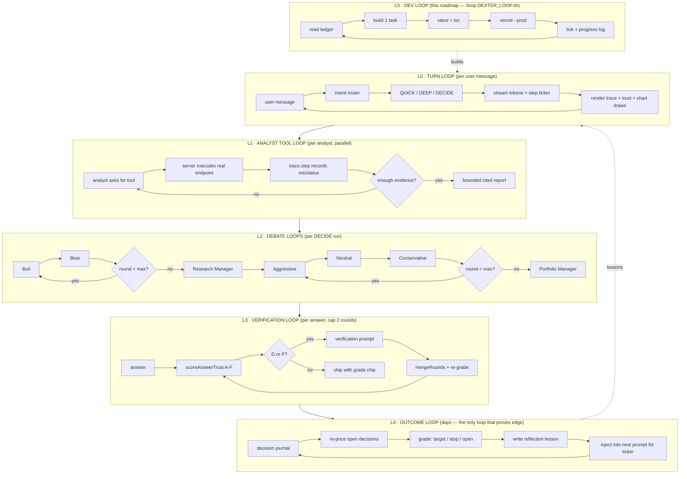

# AI_TRADING_AGENT_ROADMAP.md — Dexter: a world-class trading agent

Target: turn `apps/market-ui/src/components/trading/Assistant.tsx` ("Dexter AI") from a
dead browser-side Gemini chat into a self-verifying, tool-grounded, outcome-graded
trading agent — built on the repo's own agentic spine (gridTrace / gridTrust /
gridLessons) with the analyst→debate→risk architecture proven by TradingAgents.

---

## 0. Why the screenshot didn't work (verified 2026-08-01, not guessed)

| # | Fault | Evidence |
|---|-------|----------|
| F1 | **No API key in prod.** `initChat()` reads `VITE_GEMINI_API_KEY` / `VITE_GEMINI_API_KEYS`. `apps/market-ui/.env.production` sets neither; root `.env.production:80` sets `VITE_GEMINI_API_KEY=` (empty). Key missing → `initChat()` returns `null` → `sendMessage` throws `Failed to initialize chat`. The panel greets you and then dies on first send. | `Assistant.tsx:108-123`, `Assistant.tsx:254-256` |
| F2 | **Wrong side of the wire.** Even with a key it would ship a *live Gemini credential in the browser bundle*. The repo already solved this: keys live server-side behind `POST /api/llm` (`services/market-server/src/routes/llm.ts`), which `deepResearchService.ts` uses. Dexter bypassed it. | `Assistant.tsx:4,125`, `deepResearchService.ts:1071-1136` |
| F3 | **Dead model, dead provider.** Model is pinned to `gemini-3.1-pro-preview` with zero fallback. Repo memory: Gemini is quota-dead (20/day), Anthropic 401, Groq 401. **Only DeepSeek is live** — and Dexter cannot reach it. | `Assistant.tsx:199` |
| F4 | **Market-server unreachable from prod anyway.** `apps/market-ui/.env.production:15` has `VITE_API_URL` **commented out**. Any fix that routes through market-server is dead on Vercel. The LLM proxy must be a Vercel function. | `apps/market-ui/.env.production:15` |
| F5 | **Fake tool protocol.** Tool results are shoved back as a *plain text user message* ("Here are the results of your tool calls…") instead of a `functionResponse` part. The model loses the call↔result linkage, re-calls tools, and burns the 5-loop cap. | `Assistant.tsx:422-431` |
| F6 | **The prompt lies about the product.** System prompt claims "Intelligent Task Planning", "Autonomous Execution", "Self-Validation". The code has none: one linear tool loop, no planner, no verification, no memory. | `Assistant.tsx:201-207` |
| F7 | **Hallucinated price levels.** `drawTechnicalAnalysis` accepts whatever numbers the LLM emits as support/resistance/fib/order-block. Nothing computes them from real bars; nothing rejects an invented level. | `Assistant.tsx:127-161`, `:334-339` |
| F8 | **Currency bug.** Header renders `$` unconditionally — a Tunisian listing quoted in TND shows as dollars. | `Assistant.tsx:484` |

**F1 is the screenshot.** F2–F8 are why fixing F1 alone would still not make it world-class.

---

## 1. Doctrine (hard rules — every task obeys these)

1. **TRUTH.** Never invent data, endpoints, prices, or timings. Live-probe every endpoint
   before wiring a tool; paste the real response into the Progress log. A dead endpoint is a
   ledger note, never a mock in prod code.
2. **The LLM never emits a price.** Every number the agent shows is computed by code from
   real bars/filings, or quoted from a tool snapshot with a citation. The model *selects and
   explains*; it does not *produce* figures.
3. **The trace is a record, never a performance.** A step exists iff its call executed.
   Failed steps show the real error. Analysis consumes only successful steps' data.
4. **Honesty is never punished.** "I don't have BVMT P/E data" grades better than a
   plausible fabrication. Honest-empty = grade B (gridTrust doctrine).
5. **No decision without risk.** Any BUY/SELL output carries entry, stop, size, and R:R —
   or it is not a decision, it is commentary, and must say so.
6. **Reuse the spine.** `newTrace()`, `scoreCellTrust`, `mergeRounds`, `runGridRounds`,
   `deriveLessons` already exist and are tested. Extend them; do not fork a parallel pipeline.
7. **Cost discipline.** DeepSeek is the only live LLM. Cheap questions = 1 call. The full
   debate graph runs only on trade-decision intent, behind an explicit budget cap shown to
   the user.
8. **No new npm deps** without checking `package.json` first. Prefer deleting
   `@google/genai` over adding an SDK.
9. **Not financial advice.** Every decision output carries the disclosure. No leverage
   advice, no "guaranteed", no fabricated backtest numbers.

---

## 2. Codebase anchors (verified 2026-08-01)

| Anchor | Path | What it gives us |
|--------|------|------------------|
| The broken agent | `apps/market-ui/src/components/trading/Assistant.tsx` (607 L) | UI shell, 4 tool bodies, draw callback — all salvageable |
| Step recorder | `apps/market-ui/src/services/gridTrace.ts` | `newTrace()`, `CellStep`, `TRACE_MAX_STEPS=12`, `traceSummary` |
| Earned grading | `apps/market-ui/src/services/gridTrust.ts` | `scoreCellTrust` A–F, `TRUST_THRESHOLD={D,F}`, `mergeRounds`, `consensusFigures` |
| Verification rounds | `apps/market-ui/src/services/gridTrustRunner.ts` | `runGridRounds`, `buildVerificationPrompt`, `MAX_ROUNDS_CAP=3` |
| Outcome memory | `apps/market-ui/src/services/gridLessons.ts` | `deriveLessons`, `chronicConflictPrompts`, LRU store cap 100 |
| Tool seam | `apps/market-ui/src/services/gridResearch.ts:286-380` | `CellTools{marketQuote,fundamentals,webSearch}`, `attachToolEvidence` |
| LLM providers | `services/market-server/src/routes/llm.ts` | provider registry + model catalog (pattern to port into a Vercel fn) |
| Provider fallback | `apps/market-ui/src/services/deepResearchService.ts:1067-1136` | `pickDriver`, `tierPeer`, `defaultModelFor`, cost table |
| Vercel functions | `apps/market-ui/api/` (11 files) | `tn/[fn].ts` dispatcher pattern to copy |
| Data tools live now | `api/quote.ts`, `api/fundamentals.ts`, `api/financials.ts`, `api/history.ts`, `api/news.ts`, `api/crypto/klines.ts`, `api/tn/[fn].ts` | the analysts' real tool belt |

**External references (installed, read-only — port ideas, don't vendor code):**

| Repo | Path | What to take |
|------|------|--------------|
| TradingAgents | `TradingAgents-main/TradingAgents-main/tradingagents/` | Graph shape: 4 analysts → Bull/Bear debate → Research Manager → Trader → 3 risk debators → Portfolio Manager (`graph/setup.py:94-140`); round control (`graph/conditional_logic.py`); reflection (`graph/reflection.py`); **outcome-graded memory** (`agents/utils/memory.py`: `store_decision` → `update_with_outcome` → `get_past_context`) |
| FinceptTerminal | `FinceptTerminal-main/fincept-qt/src/python/` | Tool-surface taxonomy (`agents/`, `agno_trading/`, `mcp/`), `docs/MCP_TOOLS_GUIDE.md`, backtesting provider process |

---

## 3. Environment constraints (hard, from repo memory + verified files)

- **Vercel Hobby function cap = 12.** `apps/market-ui/api/` currently holds **11**. Exactly
  **one** slot remains → all agent routes ride a single new `api/agent/[fn].ts` dispatcher.
- **Only DeepSeek has a live key** (`DEEPSEEK_API_KEY` in `.env.production:54`). Firecrawl
  alive. Gemini quota-dead, Anthropic 401, Groq 401, Tavily 432.
- **`VITE_API_URL` is commented out in prod** → market-server is not reachable from the
  deployed UI. Server-side work must be Vercel functions.
- **`apps/market-ui/vercel.json` rewrites `/api/*` to `market-server-prod.fly.dev`.** The
  effective config is the one under `apps/market-ui/`, not the repo-root file. Every
  Vercel-native agent route must be added to the negative lookahead
  (`/api/((?!tn/|agent/).*)`) or it is proxied to Express and 404s. Verified live: the
  first DX-1 deploy returned Express's `Cannot POST /api/agent/chat`.
- **Deploy:** `vercel --prod` from repo root, project `market-ui`. No preview staging.
- **`@types/node` is not ambient for free.** `tsconfig.app.json` pins `types`, and
  `@google/genai` used to drag `@types/node` in transitively. Five files
  (`evalRunner.ts`, `pdfStructuralQa.ts`, `selfImprovementHarness.ts`, `OrderBook.tsx`,
  `useMarketsData.ts`) depended on that accident; `"node"` is now listed explicitly.
- **Tests:** `npx vitest run` and `npx tsc --noEmit -p tsconfig.app.json`, both from
  `apps/market-ui/`.
- **Supabase:** anon RLS blocks `chunks`/`financials` — server-side only. New tables get
  soft-refs, no FK (see `lib_grid_runs`).
- **TN history:** 589 ISINs OHLCV to 2025-12-31 + TUNINDEX 383 pts — the replay corpus.
- **Crypto:** Binance klines + WS ticker already wired; Binance is `fra1`-region friendly.

---

## 4. Target architecture

```
Assistant.tsx (thin UI: messages, step ticker, trust chip, chart draw callback)
        │  POST /api/agent/chat        ← the ONLY new Vercel function (12/12)
        ▼
api/agent/[fn].ts ── dispatcher ── chat | tools | journal | outcomes
        │
        ├── llmCall()          provider chain: deepseek → gemini → anthropic → groq
        │                      (ported from market-server/routes/llm.ts, keys server-side)
        │
        └── dexterGraph.ts     intent router ─┬─ QUICK  : 1 LLM call + tools
                                              ├─ DEEP   : analysts → synthesis
                                              └─ DECIDE : full graph below

  DECIDE graph (TradingAgents shape, DeepSeek-budgeted):

    ┌ Market Analyst ──── taLevels() + /api/history + /api/crypto/klines
    ├ News Analyst ────── /api/news (40-outlet whitelist)
    ├ Social Analyst ──── /api/social/influencers/[asset]
    └ Fundamentals ────── /api/fundamentals + /api/financials + gravity RAG (SEC)
             │ (parallel, each returns a bounded cited report)
             ▼
       Bull ⇄ Bear debate  (N rounds, default 1, cap 3)
             ▼
       Research Manager    → investment verdict + confidence
             ▼
       Trader              → concrete plan (entry, stop, target, size, R:R)
             ▼
    Aggressive ⇄ Neutral ⇄ Conservative risk debate
             ▼
       Portfolio Manager   → FINAL: BUY/SELL/HOLD + risk block + disclosure
             ▼
       Trust grade (A–F) ── D/F → one verification round → merge → re-grade
             ▼
       Decision journal (Supabase `dexter_decisions`) ── outcome loop grades it later
```

Every arrow above is a `trace.step(...)` — the user watches the real graph execute.

---

## 5. GRAPH OF LOOPS

Six nested loops. Inner loops run per message; outer loops run across days and are what
actually makes the agent get better.



**Loop budget (cost discipline, rule 7):**

| Loop | Trigger | LLM calls | Cap |
|------|---------|-----------|-----|
| L0 QUICK | "what's BTC at" | 1 | 1 |
| L0 DEEP | "analyze this chart" | 1 + 4 analysts | 5 |
| L0 DECIDE | "should I buy" | 4 analysts + 2·debate + mgr + trader + 3·risk + PM | 14 |
| L3 verification | grade D/F | +1 per round | 2 rounds |
| L4 outcome | scheduled | 1 per closed decision | — |

---

## 6. Regression table (tests derive from these numbered rows)

| # | Property | Test shape |
|---|----------|-----------|
| 1 | No `VITE_GEMINI*` / `@google/genai` reference survives in `apps/market-ui/src` | grep assertion in test |
| 2 | `/api/agent/chat` answers with only `DEEPSEEK_API_KEY` set; no client key | live probe, logged in §8 |
| 3 | Provider chain falls through dead providers without throwing; exhausted chain returns honest error, never a fabricated answer | unit, mocked providers |
| 4 | Tool call → typed `{tool,args}` → typed result; result is never re-serialised into a user-role text turn | unit |
| 5 | Every executed call appears exactly once in the trace with real ms; a thrown tool yields `status:'failed'` + real error and re-throws | unit |
| 6 | Absent tools ⇒ byte-identical legacy answer path (no behavior change) | unit |
| 7 | `taLevels()` on a fixed OHLCV fixture returns deterministic pivots/S-R/FVG/OB/fib/ATR | unit, golden fixture |
| 8 | A draw request for a level not in the engine's candidate set is rejected; user sees an honest note, chart is untouched | unit |
| 9 | Every figure in a shipped answer maps to a citation id; unmapped figures flagged (`findUnmappedCites` reused) | unit |
| 10 | `scoreAnswerTrust`: RAG+tool-grounded ⇒ B ceiling round 1; LLM-only ⇒ C; fabricated cite ⇒ F; honest-empty ⇒ B with `honest:true` | unit |
| 11 | Grade D/F triggers exactly one verification round; cap 2; merged answer re-graded; A only reachable via figure stability across rounds | unit |
| 12 | Intent router: quote-ish → QUICK (1 call), chart-analysis → DEEP, "should I buy/sell" → DECIDE; budget cap enforced and surfaced | unit, table-driven |
| 13 | Analysts run in parallel; one analyst failing degrades its section honestly and never kills the run | unit |
| 14 | Debate honors `max_rounds`; N rounds ⇒ exactly 2N debater calls | unit |
| 15 | Portfolio Manager output without entry/stop/size/R:R is rejected and downgraded to commentary | unit |
| 16 | Decision journal row round-trips (ticker, side, price, ts, thesis, stop, target, trace id) | unit + live insert |
| 17 | Outcome grader classifies target-hit / stop-hit / open correctly on a fixture price path | unit |
| 18 | Past decisions + lessons for the ticker appear in the next prompt for that ticker; cross-ticker lessons capped | unit |
| 19 | Replay harness reproduces a full DECIDE run over historical bars with **zero** look-ahead (no bar > decision timestamp reaches any tool) | unit, assert on tool inputs |
| 20 | TN assets render TND (never `$`) in header, tools, and answers | unit + snapshot |
| 21 | Streaming: tokens arrive incrementally, cancel aborts in-flight tools, session persists per asset | unit |
| 22 | Disclosure present on every DECIDE output | unit |

---

## 7. TASK LEDGER (execution state — loop works top-to-bottom, one task per iteration)

### Phase A — Make it actually work (truth floor)

- [x] **DX-1 · Server-side brain.** New `apps/market-ui/api/agent/[fn].ts` (the last Hobby
  slot; 11→12). `fn=chat` runs the provider chain ported from
  `market-server/src/routes/llm.ts` + `deepResearchService.pickDriver` (deepseek → gemini →
  anthropic → groq, honest error when exhausted). `Assistant.tsx` posts to it. Delete
  `@google/genai` import, `initChat()`, and every `VITE_GEMINI*` read. → rows 1, 2, 3

- [x] **DX-2 · Real tool protocol.** Replace the text-message tool hack
  (`Assistant.tsx:422-431`) with a typed loop: model emits `{tool, args}`, server executes
  the real endpoint, result returns as a structured tool-result turn. Provider-agnostic (must
  work on DeepSeek, which is not Gemini-shaped). Keep the 4 existing tool bodies; move their
  fetches server-side where the endpoint is same-origin. → rows 4, 6

- [x] **DX-3 · Trace the agent.** Wrap every tool/LLM call in `newTrace()` from
  `gridTrace.ts`. Assistant renders the live step ticker while running and the finished trace
  (glyph, label, ms, error) under each answer. → rows 5, 6
  **Partial, deliberately:** the finished trace shipped; the *live* ticker did not. One
  non-streaming POST gives the browser no way to learn a server step before the run ends, and
  faking progress would be a performance rather than a record (doctrine rule 3). The live
  ticker is folded into DX-16, where streaming actually arrives.

### Phase B — Truth: the model stops inventing numbers

- [ ] **DX-4 · Deterministic TA engine.** New `apps/market-ui/src/services/taLevels.ts`:
  pure functions over OHLCV → swing pivots, S/R clusters, order blocks, fair-value gaps,
  fib from the real swing high/low, ATR, trend state. Golden-fixture tested. Zero LLM. → row 7

- [ ] **DX-5 · Ground the chart drawings.** `drawTechnicalAnalysis` accepts only levels
  present in DX-4's candidate set (tolerance = ½ ATR). Anything else is refused with an
  honest note; the chart is not touched. → row 8

- [ ] **DX-6 · Evidence + citations.** Port `attachToolEvidence` (`gridResearch.ts:348`):
  every tool snapshot becomes a numbered citation; figures in the answer must map to one.
  Reuse `extractFigures` / `findUnmappedCites`. → row 9

- [ ] **DX-7 · Earned trust grade.** `scoreAnswerTrust` (chat-shaped port of
  `scoreCellTrust`) + one verification round for D/F via `buildVerificationPrompt` /
  `mergeRounds`. Grade chip in the UI with its real reasons. → rows 10, 11

### Phase C — World-class reasoning (TradingAgents spine)

- [ ] **DX-8 · Analyst layer.** `dexterGraph.ts`: Market / News / Social / Fundamentals
  analysts run in parallel, each over its real tool belt (§2), each returning a bounded cited
  report. One analyst failing degrades honestly. → row 13

- [ ] **DX-9 · Bull/Bear debate + Research Manager.** Round-controlled debate
  (`conditional_logic.py` pattern), default 1 round, cap 3, then a Research Manager verdict
  with confidence. → row 14

- [ ] **DX-10 · Risk trio + Portfolio Manager.** Aggressive / Neutral / Conservative debate
  → Portfolio Manager emits BUY/SELL/HOLD **with** entry, stop, size, R:R. Missing risk block
  ⇒ output is downgraded to commentary. Disclosure appended. → rows 15, 22

- [ ] **DX-11 · Intent router + budget guard.** Classify each turn QUICK / DEEP / DECIDE;
  enforce the §5 call caps; show the user the spend before a DECIDE run and let them cancel.
  → row 12

### Phase D — Memory and proof of edge (the part nobody else ships)

- [ ] **DX-12 · Decision journal.** Supabase `dexter_decisions` (soft-ref, no FK, like
  `lib_grid_runs`): ticker, side, entry, stop, target, size, thesis, trust grade, trace id,
  ts. Written server-side on every DECIDE. → row 16

- [ ] **DX-13 · Outcome grading loop.** Scheduled pass re-prices open decisions from real
  bars, classifies target-hit / stop-hit / still-open, and writes a reflection lesson
  (`memory.py: update_with_outcome` pattern). → row 17

- [ ] **DX-14 · Lesson injection.** Next question about a ticker preloads that ticker's past
  decisions + outcomes, plus capped cross-ticker lessons (`get_past_context` pattern, fused
  with `gridLessons.deriveLessons`). → row 18

- [ ] **DX-15 · Replay backtest gate.** Run the whole DECIDE graph over historical bars (TN
  deep history 589 ISINs; Binance klines) with a strict no-look-ahead assertion. Publish hit
  rate, avg R, and comparison to buy-and-hold — **whatever the number is**. If there is no
  edge, that goes in the Progress log verbatim. → row 19

### Phase E — Product finish

- [ ] **DX-16 · Streaming + polish.** Token streaming, cancel that aborts in-flight tools,
  per-asset session persistence, TND currency fix (`Assistant.tsx:484`), mobile drawer,
  decision-memo export. → rows 20, 21

---

## 8. PROGRESS LOG (one line per completed task — real numbers only, no adjectives)

<!-- format: DX-n | what shipped | vitest N/N | tsc 0 | live probe result | deploy -->

**DX-1** (2026-08-01) — `api/agent/[fn].ts` (12th of 12 Hobby slots) + `src/services/dexterLlm.ts`;
`Assistant.tsx` off `@google/genai` onto `POST /api/agent/chat` with OpenAI-native tool calls.
Probes: `GET api.deepseek.com/models` → `deepseek-v4-flash`, `deepseek-v4-pro` (the repo's internal
ids ARE the API ids); direct tool-call probe returned `finish_reason:"tool_calls"` in 2188 ms.
Prod after deploy: `POST market-ui-self.vercel.app/api/agent/chat` → HTTP 200,
`{"text":"DX1 OK","provider":"deepseek","model":"deepseek-v4-flash","ms":1324}`, 1911 ms e2e;
tool probe → `toolCalls:[{name:"getChartData",args:{days:30}}]`, 1267 ms server / 2161 ms e2e.
Tests: dexterLlm.test.ts 14/14; gridTrust + gridTrustRunner + gridLessons + gridRunStore +
gridTrace + EdgarLink + dexterLlm = 7 files / 76 tests passed; gridResearch.sources 37/37 via tsx.
`tsc -b` 0 errors (clean buildinfo); `npm -w market-ui run build` exit 0 in 54.04 s.
Three findings beyond the spec: (a) `SentimentPanel.tsx` was a second browser-Gemini caller,
reading `process.env.GEMINI_API_KEY` in a Vite bundle — it had never once produced a reading; its
value was Gemini googleSearch grounding, so it now states the limitation instead of scoring
sentiment ungrounded, pending DX-8. (b) dropping `@google/genai` removed the transitive
`@types/node` that 5 unrelated files leaned on — `"node"` added to `tsconfig.app.json` types
(HEAD baseline re-measured at 0 errors to confirm the regression was mine, then fixed).
(c) first deploy 404'd through the Fly rewrite; `agent/` added to the negative lookahead in
`apps/market-ui/vercel.json`. Deployed: `market-qewupxf4f` → `market-ui-self.vercel.app`.
Not yet true of the agent: no trace, no trust grade, no verification round — DX-2/DX-3/DX-7.

**DX-2** (2026-08-01) — tool belt moved out of the component into
`src/services/dexterTools.ts`; the whole tool loop now runs inside
`api/agent/[fn].ts` next to the model. `Assistant.tsx` 582 → 358 lines and no
longer fetches market data at all: it posts one request with the asset context
and applies the `actions[]` that come back. `drawTechnicalAnalysis` is the one
tool that stays client-side, returned as a client action rather than executed
server-side. Prod probe (grounded end-to-end, not a canned reply):
`POST /api/agent/chat` with `asset:{symbol:"BTC",isCrypto:true}` and
"highest close in 30 days" → 200, `"The highest close in the 30-day window was
$66,556.16 on July 21, 2026."`, 3609 ms server / 6139 ms e2e. Cross-checked
against `api.binance.com/api/v3/klines?symbol=BTCUSDT&interval=1d&limit=30`:
max close **66556.16 on 2026-07-21** — exact match, so the model read the tool
result rather than its priors. Tests: dexterTools.test.ts 16/16, dexterLlm 14/14,
8 suites / 90 tests passed, sources 37/37 via tsx, `tsc -b` 0, build exit 0 in
1 m 3 s. Deployed `market-q2xyju866`.
Still not true of the agent: the steps are invisible (DX-3), levels are still
whatever the model says (DX-4/DX-5), no grade (DX-7).

**DX-3** (2026-08-01) — every model turn and every tool call is wrapped in
`newTrace()`; `steps[]` rides back in the response (and on the 502 path too, so
a blown run still shows where it died) and renders as a collapsible panel under
each answer. `executeTool` no longer swallows exceptions — a thrown feed
propagates so the trace records `status:'failed'` with the real error, and the
handler turns it into an honest message for the model afterwards. Prod probe
asking for bars **and** statements on a crypto asset returned this trace
verbatim: `Thinking/llm 1797ms ok "deepseek/deepseek-v4-flash → getChartData,
getFinancialStatements"` · `Reading price history/getChartData 241ms ok "30
bars"` · `Reading financial statements/getFinancialStatements 0ms **empty**
"Financial statements are not applicable for cryptocurrencies."` · `Reading tool
results/llm 3654ms ok`. The third step is the one that matters: a feed with
nothing to say grades `empty`, not `failed`, and the model's answer reported the
gap rather than inventing a balance sheet. 5692 ms server / 6440 ms e2e.
Tests: dexterTrace.test.ts 15/15, 3 dexter suites 41/41, `tsc -b` 0, build 0.
Deployed `market-a3sdmjreb`.
