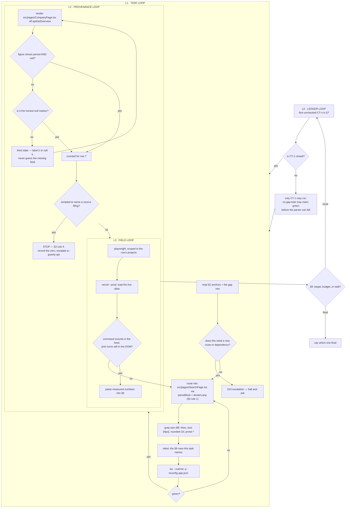

# Command Terminal Roadmap — every Company answer addressable, cited, and honest

**Ledger.** Task IDs `CT-n`. Loop file `COMMAND_TERMINAL_LOOP.sh`.
Contract: `docs/LOOP_CONVENTIONS.md` — done-criteria, truth rules, repo hard
constraints, escalation, cadence, stop, persistence. Not repeated here.

---

## 1. What the brief asked for, and what is actually true

`gemini-code-1786132427239.md` proposes a Bloomberg-style slash terminal: `/company NVDA`
in Quick Answer mounting the Company feature inline, plus seven "skills", across four
sprint phases. Every claim below was checked against the tree on 2026-08-07 before this
ledger was written.

| the brief says | the tree says |
|---|---|
| Phase 2: "inline mounting of the existing Company Feature" | **already shipped.** `SearchPage.tsx:1161` renders `<CompanyPage embedded />`, and `CompanyPage` has taken an `embedded` prop since `CompanyPage.tsx:164` |
| `/sentiment` and `/filings` are new skills | **already tabs.** `CompanyPage.tsx:183` — `'overview' \| 'filings' \| 'data' \| 'sentiment'`, backed by `sentiment`, `sentimentDelta`, `longitudinal`, `documents`, `metrics` state |
| Phase 1: build a slash parser | **genuinely absent.** Nothing in `src/` matches `slashCommand`, `CommandPalette`, or `'/company'` |
| `/capex`, `/tariff-risk` as inline skills | **unbuildable.** No service supplies either, and `apps/market-ui/api` holds **exactly 12** Vercel functions against a Hobby cap of 12 (`api/_sina.ts` is underscore-ignored). There is no route budget |
| "Backend Service Routing: WebSocket / SSE contracts" | market-ui has no WebSocket path. `CompanyPage` reads one function, `apiGetOverview` in `src/services/api.ts` |
| Tiptap / Slate rich-text editor | the input is a plain `<textarea>` at `SearchPage.tsx:1864` with `handleResearchKeyDown`. Adding an editor dependency is an escalation under `LOOP_CONVENTIONS.md` §4 |
| "inline citation drawer" for the figures | **the payload cannot support one.** `CompanyPage.tsx:65` — `GravityMetric` is `{ metric, value, unit?, period?, ticker? }`. No accession, no source document id, no report date, no GAAP/non-GAAP basis. A citation drawer over this data would have to *infer* which filing a period came from, and an inferred citation is a fabricated one. See §5 Q1 |

**So the work is not "build seven skills".** Five of the seven already have a surface; what
none of them has is an **address**. You cannot ask for one, link to one, or reach one
without navigating a mode toggle.

The second half is the part the brief does not mention and the user did ask for: the
Company output itself. `CompanyPage` carries 16 honest-null markers, which is good, and
**one** citation-shaped string — a prompt template at line 377. Every figure it renders is
unsourced at the point of display. A terminal that answers faster but cannot show where a
number came from is not institutional, it is quicker.

## 2. Anchors — verified to exist. Never invent one.

| what | where |
|---|---|
| the Company surface, all four tabs | `src/pages/CompanyPage.tsx` — `embedded` prop line 164, tab state line 183, filing row `FilingRow` line 131, `StatCard` line 121 |
| where it is already mounted inline | `src/pages/SearchPage.tsx:1161`, under `mode === 'company'` (line 1152); mode union at line 45 |
| the Quick Answer input to parse | `src/pages/SearchPage.tsx:1864` `<textarea>`, `handleResearchKeyDown` line 1868 |
| the Quick Answer answer canvas | `src/pages/SearchPage.tsx:1454`, `activeTab === 'answer'` |
| **the existing inline-widget mechanism** | `src/services/dexterBlocks.ts` — `parseBlock`, `dexterLang`, `LEVELS_LANG`, `PLAN_LANG`. Rendered by `src/components/trading/Assistant.tsx`. Fenced code blocks tagged with a language, parsed, rendered as a component |
| the one Company data call | `apiGetOverview` in `src/services/api.ts` |
| peer / compare + brief surfaces | `src/components/company/CompanyBrief.tsx`, `DevilsAdvocate.tsx`, `LatestQuarterCard.tsx`, `TranscriptSummary.tsx` |
| the function budget | `apps/market-ui/api` — 12 of 12 used |

## 3. Doctrine

1. **Reuse the widget mechanism that exists.** `dexterBlocks.ts` already turns a tagged
   fenced block into a rendered component inside a chat feed. A second, parallel widget
   system is the thing this ledger exists to prevent.
2. **An address, not a rebuild.** A command routes to a surface that already renders. If a
   task finds itself re-implementing a Company tab, it has taken the wrong turn.
3. **Every displayed figure carries its period and unit, or is visibly a null.** No third
   state. A bare number is not an answer at an institution; `215.94` is a rumour,
   `Revenue · FY2026 · USD billions` is a fact.
4. **Never infer a citation.** `GravityMetric` has no link to a filing. Guessing which
   document a period came from and presenting it as a source is fabrication with a
   footnote, which is worse than no footnote. Where provenance is absent, say it is
   absent and escalate the payload gap — see §5 Q1.
5. **Fiscal is not calendar.** NVDA's FY2026 ended January 2026. A period rendered without
   its fiscal-year-end is ambiguous, and a comparison that silently mixes fiscal calendars
   is wrong even when every number in it is right.
6. **A comparison states its basis or does not ship.** Same period, same units, same
   GAAP/non-GAAP treatment across both sides, or the difference is labelled. The payload
   does not carry basis, so where it cannot be established, the comparison says so.
7. **No new API route and no new dependency.** 12 of 12 functions are used; a rich-text
   editor is an escalation. A command that needs either is a `⛔` row, logged with the
   measurement that proves it, not a task that stays open.
8. **Tokens only in new code** — no hex literal, no `text-[Npx]`, no `rounded-2xl`,
   no `prose-*` (`@tailwindcss/typography` is not installed). Grep your own diff.
9. **A gate that cannot fail on the current tree is not a gate.** Every §6 row must be
   shown red before the task that turns it green. Record the red number in §8.

## 4. Command matrix — what is reachable, and at what cost

| command | routes to | status |
|---|---|---|
| `/company <ticker>` | `CompanyPage` embedded, overview tab | **buildable** — the surface exists |
| `/filings <ticker>` | `CompanyPage` filings tab | **buildable** — deep-link a tab |
| `/sentiment <ticker>` | `CompanyPage` sentiment tab | **buildable** — deep-link a tab |
| `/data <ticker>` | `CompanyPage` data tab | **buildable** — deep-link a tab |
| `/peer-compare <t1> <t2>` | the peer strip already shipped | **buildable, verify first** — probe before wiring |
| `/screening <query>` | the Research Grid, `src/components/grid/GridView.tsx` | **buildable, verify first** |
| `/capex <ticker>` | nothing | **⛔ blocked** — no service, no route budget |
| `/tariff-risk <ticker>` | nothing | **⛔ blocked** — no service, no route budget |

## 5. Gaps

**G — addressability. The surface exists and cannot be asked for.**

| id | gap |
|---|---|
| G1 | No `/` parser. Typing `/company NVDA` in Quick Answer sends it to the LLM as prose |
| G2 | No command palette, so the seven commands are undiscoverable even once they exist |
| G3 | `CompanyPage` tabs are local state — no tab is addressable, so `/filings NVDA` has no target to open |
| G4 | A resolved command produces no artifact in the answer feed; the mode toggle replaces the conversation instead of adding to it |

**Q — output quality. The answer renders and does not carry its weight.**

| id | gap |
|---|---|
| Q1a | **Figures render bare.** `GravityMetric` supplies `unit?` and `period?` and the view does not consistently show either. This is fixable inside market-ui with the payload as it stands |
| Q1b | **⛔ The payload carries no provenance at all** — no accession, no source document id, no report date, no GAAP/non-GAAP basis (`CompanyPage.tsx:65`). A true citation drawer is not buildable in this repo. The fix lives in gravity-api, which is out of this ledger's scope. **This row is closed by escalating with the measurement, never by inferring a source** |
| Q1c | Periods render without their fiscal-year-end, so `FY2026` is ambiguous across issuers with different fiscal calendars |
| Q2 | Loading states are not distinguished from empty ones, so "no data yet" and "no data exists" look identical |
| Q3 | No keyboard contract on any overlay — the palette in G2 must not repeat this |

## 6. Acceptance rows

Each §7 task names the rows it must turn green. **Written before the tasks that satisfy
them.** `R1` is the instrument; the rest are assertions.

**Instrument — must exist and must fail on the unmodified tree before anything else**

1. A **command parser** exists in `src/lib/commands.ts`, unit-tested, exporting
   `parseCommand`. Given the raw textarea value and a caret index it returns
   `{ name, args, complete }` or `null`, and it never treats a `/` inside a word or a URL
   as a command. Unit tests cover: bare `/`, `/company`, `/company NV`, `/company NVDA `,
   `/unknown`, `http://x/y`, and a `/` at caret 0 versus mid-word.

**G rows — addressability**

2. `parseCommand` resolves all six buildable commands in §4 and returns `null` for the two
   `⛔` rows, with a test naming each of the eight.
3. The palette opens on `/` at the start of the input, filters as characters are typed,
   and closes on `Escape` and on blur. Asserted at `mobile-360` and `desktop-baseline`.
4. **Keyboard contract**, asserted not described: `ArrowDown`/`ArrowUp` move the active
   option and wrap; `Enter` commits the active one; `Tab` completes the common prefix;
   `Escape` closes and returns focus to the textarea; the listbox exposes `role="listbox"`,
   each option `role="option"`, and the input `aria-activedescendant` pointing at the
   active option's id. Every one of those seven is a separate assertion.
5. Each of the six buildable commands, when committed, mounts its surface **in the answer
   feed** — the prior conversation is still in the DOM afterwards. `/filings NVDA` opens
   `CompanyPage` with the filings tab already active, proved by reading the rendered tab
   state, not by clicking it.
6. Committing a command performs **zero** new network calls beyond those the same surface
   makes when reached through the mode toggle. Compared by counting requests in both paths.

**Q rows — output quality**

7. Every numeric `StatCard` and every metric row rendered by `CompanyPage` shows **both**
   its `period` and its `unit`, or renders the honest-null marker. **Zero elements in the
   third state** — a value with neither. Counted over `/company` for 5 tickers, reported
   as `n figures / n labelled / n null / n bare`. A figure whose payload omits `period`
   or `unit` renders the null marker for the missing part; it does not guess.
   *This is the Q1a gate. Nothing weaker closes it.*

7b. **Q1b is closed by measurement, not by code.** Count, over the same 5 tickers, how
   many rendered figures could be traced to a source document with the payload as it
   stands. The expected answer is **zero**, and row 7b passes when that zero is recorded
   in §8 together with the exact fields `GravityMetric` would need. Any implementation
   that maps a metric to a filing by matching periods **fails this row**, however
   plausible the mapping looks.

7c. Every rendered fiscal period carries its period-end, so `FY2026` never appears without
   the month and year it ended. Asserted for at least one issuer whose fiscal year is not
   the calendar year — NVDA's FY2026 ended January 2026.
8. Loading and empty are visually distinct: while `apiGetOverview` is in flight the region
   carries a skeleton with `aria-busy="true"`; after it resolves empty it carries the
   null marker and `aria-busy="false"`. Asserted per tab.
9. A failed `apiGetOverview` renders a stated error with the failing surface named, never
   an empty card and never a placeholder number. Proved by forcing a 500.
10. The two `⛔` commands, if typed, return a stated refusal naming what is missing — no
    service and no function budget — and never a fabricated answer.

**Parity row**

11. For `/company`, `/filings` and `/sentiment`, the tap count from an empty Quick Answer
    input to the rendered surface is **≤ 3**, and lower than the mode-toggle path, measured
    by a scripted path recorded in §8.

## 7. Task ledger

Do the **first unchecked** task only. Its spec text is the requirement; the rows it names
are the acceptance tests.

- [ ] **CT-1 · Build the parser that can fail.**
      Nothing else may start. Write `src/lib/commands.ts` exporting `parseCommand`, with
      the unit tests row 1 names. Then run every §6 row against the **unmodified** tree
      and record, per gap G1–G4 and Q1–Q3, either the failing assertion with its measured
      number or the sentence explaining why it does not reproduce. Count today's
      third-state figures on `/company` for 5 tickers — that number is Q1's red baseline
      and row 7 is meaningless without it. **Rows R1, R2.**

- [ ] **CT-2 · G1 + G2 — the palette, with a keyboard contract that is asserted.**
      Hook `handleResearchKeyDown` at `SearchPage.tsx:1868`. No editor dependency: a
      `<textarea>` plus an absolutely positioned listbox. All seven assertions in row 4
      must be separate. **Rows R3, R4.**

- [ ] **CT-3 · G3 — make the Company tabs addressable.**
      `CompanyPage`'s tab state at line 183 becomes a controlled prop with the current
      value as its default, so nothing that mounts it today changes behaviour.
      **Rows R5** (the filings half).

- [ ] **CT-4 · G4 — a committed command mounts into the answer feed.**
      Reuse `parseBlock` / `dexterLang` from `src/services/dexterBlocks.ts` — the feed
      already renders tagged blocks as components. Do not build a second widget system.
      **Rows R5, R6.**

- [ ] **CT-5 · Q1a + Q1c — every figure carries its period and unit, or is a null.**
      The largest task. `StatCard` and the metric rows label what they show. Where the
      payload omits a field, render the null marker for that part — never infer it.
      Fiscal periods carry their period-end. **Rows R7, R7c.**

- [ ] **CT-6 · Q1b — measure the provenance gap and escalate it.**
      Count how many rendered figures can be traced to a source document today. Record
      the number and the exact fields `GravityMetric` would need to carry. Then **stop**
      and escalate: the fix is in gravity-api, outside this ledger. Do not add a route, do
      not map metrics to filings by period. A closed path is a valid output.
      **Rows R7b.**

- [ ] **CT-7 · Q2 + Q3 — loading is not empty, and failure is stated.**
      **Rows R8, R9.**

- [ ] **CT-8 · The two blocked commands refuse honestly.**
      `/capex` and `/tariff-risk` state what is missing. Do not add a route; do not invent
      a number. **Rows R10.**

- [ ] **CT-9 · `/peer-compare` and `/screening` — probe before wiring.**
      Both are listed "verify before reuse". Probe each surface first and log what it
      actually returns. If either cannot render without a new route, close its row as a
      `⛔` with the measurement. **Rows R2, R5.**

- [ ] **CT-10 · Parity sweep.**
      Record the tap path for row 11 and close it with numbers, or log the honest gap and
      close it as a null. **Rows R11.**

## 8. Progress log

One line per iteration. Real numbers — n, counts, status codes, measured px, request
counts. **No adjectives.**

- 2026-08-07 · ledger opened · 7 gaps catalogued against the tree · verified: 12 of 12
  Vercel functions used, 0 files matching `slashCommand|CommandPalette|'/company'`,
  `CompanyPage` tabs `overview|filings|data|sentiment` at line 183, `<CompanyPage embedded />`
  already mounted at `SearchPage.tsx:1161`, 16 honest-null markers and 1 citation-shaped
  string in `CompanyPage.tsx` · R1 not built, so every row below R1 is unmeasured, not green.

## 9. Stop

- **TARGET** — no `[ ]` remains in §7 **and** CT-10's sweep actually ran.
- **BUDGET** — 10 tasks or 22 iterations, whichever comes first.
- **STALL** — 3 consecutive iterations with no row changing state and no new failure mode.
  Report which row is stuck and on what. Do not widen scope or re-run a green sweep to
  manufacture activity.

## 10. Escalation

Per `docs/LOOP_CONVENTIONS.md` §4, plus: **any** new API route (12 of 12 used); **any** new
npm dependency, including a rich-text editor; any change to `vercel.json`; any command that
cannot render without one of those.

## 11. Cadence

Every iteration is edit → test → deploy → verify → log, performed by the agent, with no
external state to wait on. `ScheduleWakeup` **120 seconds**.

Playwright gates are scoped, never polled — see `docs/LOOP_CONVENTIONS.md` §1.

## 12. Graph of loops

