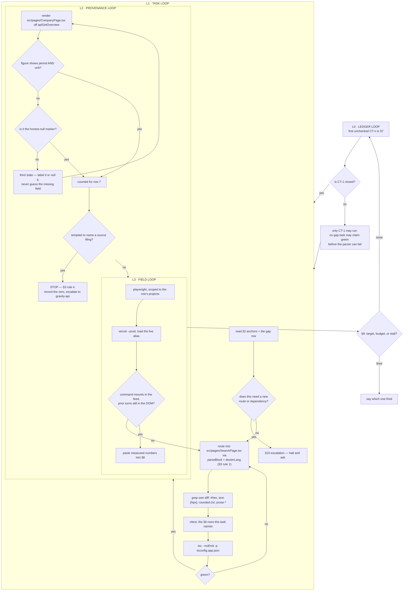

# Command Terminal Roadmap — every Company answer addressable, cited, and honest

**Ledger.** Task IDs `CT-n`. Loop file `COMMAND_TERMINAL_LOOP.sh`.
Contract: `docs/LOOP_CONVENTIONS.md` — done-criteria, truth rules, repo hard
constraints, escalation, cadence, stop, persistence. Not repeated here.

---

## 1. What the brief asked for, and what is actually true

`gemini-code-1786132427239.md` proposes a Bloomberg-style slash terminal: `/company NVDA`
in Quick Answer mounting the Company feature inline, plus seven "skills", across four
sprint phases. Every claim below was checked against the tree on 2026-08-07 before this
ledger was written.

| the brief says | the tree says |
|---|---|
| Phase 2: "inline mounting of the existing Company Feature" | **already shipped.** `SearchPage.tsx:1161` renders `<CompanyPage embedded />`, and `CompanyPage` has taken an `embedded` prop since `CompanyPage.tsx:164` |
| `/sentiment` and `/filings` are new skills | **already tabs.** `CompanyPage.tsx:183` — `'overview' \| 'filings' \| 'data' \| 'sentiment'`, backed by `sentiment`, `sentimentDelta`, `longitudinal`, `documents`, `metrics` state |
| Phase 1: build a slash parser | **genuinely absent.** Nothing in `src/` matches `slashCommand`, `CommandPalette`, or `'/company'` |
| `/capex`, `/tariff-risk` as inline skills | **unbuildable.** No service supplies either, and `apps/market-ui/api` holds **exactly 12** Vercel functions against a Hobby cap of 12 (`api/_sina.ts` is underscore-ignored). There is no route budget |
| "Backend Service Routing: WebSocket / SSE contracts" | market-ui has no WebSocket path. `CompanyPage` reads one function, `apiGetOverview` in `src/services/api.ts` |
| Tiptap / Slate rich-text editor | the input is a plain `<textarea>` at `SearchPage.tsx:1864` with `handleResearchKeyDown`. Adding an editor dependency is an escalation under `LOOP_CONVENTIONS.md` §4 |
| "inline citation drawer" for the figures | **the payload cannot support one.** `CompanyPage.tsx:65` — `GravityMetric` is `{ metric, value, unit?, period?, ticker? }`. No accession, no source document id, no report date, no GAAP/non-GAAP basis. A citation drawer over this data would have to *infer* which filing a period came from, and an inferred citation is a fabricated one. See §5 Q1 |

**So the work is not "build seven skills".** Five of the seven already have a surface; what
none of them has is an **address**. You cannot ask for one, link to one, or reach one
without navigating a mode toggle.

The second half is the part the brief does not mention and the user did ask for: the
Company output itself. `CompanyPage` carries 16 honest-null markers, which is good, and
**one** citation-shaped string — a prompt template at line 377. Every figure it renders is
unsourced at the point of display. A terminal that answers faster but cannot show where a
number came from is not institutional, it is quicker.

## 2. Anchors — verified to exist. Never invent one.

| what | where |
|---|---|
| the Company surface, all four tabs | `src/pages/CompanyPage.tsx` — `embedded` prop line 164, tab state line 183, filing row `FilingRow` line 131, `StatCard` line 121 |
| where it is already mounted inline | `src/pages/SearchPage.tsx:1161`, under `mode === 'company'` (line 1152); mode union at line 45 |
| ~~the Quick Answer input to parse~~ **corrected CT-1** | `SearchPage.tsx:1864` + `handleResearchKeyDown` is the **Deep Research** composer, not Quick Answer — it renders in the `mode === 'research'` fallthrough, whose sidebar reads "No research yet" (line 1694). Quick Answer is the default mode (`useState<SearchMode>('qa')`, line 746) and composes through an `<input ref={qaInputRef}>` at **`SearchPage.tsx:1582`**, which has **no `onKeyDown` at all** — only `onChange`. CT-2 hooks *that* element and adds the handler |
| the Quick Answer answer canvas | `src/pages/SearchPage.tsx:1454`, `activeTab === 'answer'` |
| **the existing inline-widget mechanism** | `src/services/dexterBlocks.ts` — `parseBlock`, `dexterLang`, `LEVELS_LANG`, `PLAN_LANG`. Rendered by `src/components/trading/Assistant.tsx`. Fenced code blocks tagged with a language, parsed, rendered as a component |
| the one Company data call | `apiGetOverview` in `src/services/api.ts` |
| peer / compare + brief surfaces | `src/components/company/CompanyBrief.tsx`, `DevilsAdvocate.tsx`, `LatestQuarterCard.tsx`, `TranscriptSummary.tsx` |
| the function budget | `apps/market-ui/api` — 12 of 12 used |

## 3. Doctrine

1. **Reuse the widget mechanism that exists.** `dexterBlocks.ts` already turns a tagged
   fenced block into a rendered component inside a chat feed. A second, parallel widget
   system is the thing this ledger exists to prevent.
2. **An address, not a rebuild.** A command routes to a surface that already renders. If a
   task finds itself re-implementing a Company tab, it has taken the wrong turn.
3. **Every displayed figure carries its period and unit, or is visibly a null.** No third
   state. A bare number is not an answer at an institution; `215.94` is a rumour,
   `Revenue · FY2026 · USD billions` is a fact.
4. **Never infer a citation.** `GravityMetric` has no link to a filing. Guessing which
   document a period came from and presenting it as a source is fabrication with a
   footnote, which is worse than no footnote. Where provenance is absent, say it is
   absent and escalate the payload gap — see §5 Q1.
5. **Fiscal is not calendar.** NVDA's FY2026 ended January 2026. A period rendered without
   its fiscal-year-end is ambiguous, and a comparison that silently mixes fiscal calendars
   is wrong even when every number in it is right.
6. **A comparison states its basis or does not ship.** Same period, same units, same
   GAAP/non-GAAP treatment across both sides, or the difference is labelled. The payload
   does not carry basis, so where it cannot be established, the comparison says so.
7. **No new API route and no new dependency.** 12 of 12 functions are used; a rich-text
   editor is an escalation. A command that needs either is a `⛔` row, logged with the
   measurement that proves it, not a task that stays open.
8. **Tokens only in new code** — no hex literal, no `text-[Npx]`, no `rounded-2xl`,
   no `prose-*` (`@tailwindcss/typography` is not installed). Grep your own diff.
9. **A gate that cannot fail on the current tree is not a gate.** Every §6 row must be
   shown red before the task that turns it green. Record the red number in §8.

## 4. Command matrix — what is reachable, and at what cost

| command | routes to | status |
|---|---|---|
| `/company <ticker>` | `CompanyPage` embedded, overview tab | **buildable** — the surface exists |
| `/filings <ticker>` | `CompanyPage` filings tab | **buildable** — deep-link a tab |
| `/sentiment <ticker>` | `CompanyPage` sentiment tab | **buildable** — deep-link a tab |
| `/data <ticker>` | `CompanyPage` data tab | **buildable** — deep-link a tab |
| `/peer-compare <t1> <t2>` | the Research Grid on the named tickers | **buildable, wired CT-9** — `GridView` gained a `tickers` prop |
| `/screening <query>` | nothing it can honour | **⛔ blocked — CT-9 probe.** `GridView` runs authored prompts over a NAMED ticker list. It takes no query, ranks nothing, filters no universe. A free-text screen has no target |
| `/capex <ticker>` | nothing | **⛔ blocked** — no service, no route budget |
| `/tariff-risk <ticker>` | nothing | **⛔ blocked** — no service, no route budget |

## 5. Gaps

**G — addressability. The surface exists and cannot be asked for.**

| id | gap |
|---|---|
| G1 | No `/` parser. Typing `/company NVDA` in Quick Answer sends it to the LLM as prose |
| G2 | No command palette, so the seven commands are undiscoverable even once they exist |
| G3 | `CompanyPage` tabs are local state — no tab is addressable, so `/filings NVDA` has no target to open |
| G4 | A resolved command produces no artifact in the answer feed; the mode toggle replaces the conversation instead of adding to it |

**Q — output quality. The answer renders and does not carry its weight.**

| id | gap |
|---|---|
| Q1a | **Figures render bare.** `GravityMetric` supplies `unit?` and `period?` and the view does not consistently show either. This is fixable inside market-ui with the payload as it stands |
| Q1b | **⛔ The payload carries no provenance at all** — no accession, no source document id, no report date, no GAAP/non-GAAP basis (`CompanyPage.tsx:65`). A true citation drawer is not buildable in this repo. The fix lives in gravity-api, which is out of this ledger's scope. **This row is closed by escalating with the measurement, never by inferring a source** |
| Q1c | Periods render without their fiscal-year-end, so `FY2026` is ambiguous across issuers with different fiscal calendars |
| Q2 | Loading states are not distinguished from empty ones, so "no data yet" and "no data exists" look identical |
| Q3 | No keyboard contract on any overlay — the palette in G2 must not repeat this |

## 6. Acceptance rows

Each §7 task names the rows it must turn green. **Written before the tasks that satisfy
them.** `R1` is the instrument; the rest are assertions.

**Instrument — must exist and must fail on the unmodified tree before anything else**

1. A **command parser** exists in `src/lib/commands.ts`, unit-tested, exporting
   `parseCommand`. Given the raw textarea value and a caret index it returns
   `{ name, args, complete }` or `null`, and it never treats a `/` inside a word or a URL
   as a command. Unit tests cover: bare `/`, `/company`, `/company NV`, `/company NVDA `,
   `/unknown`, `http://x/y`, and a `/` at caret 0 versus mid-word.

**G rows — addressability**

2. `parseCommand` resolves all six buildable commands in §4 and returns `null` for the two
   `⛔` rows, with a test naming each of the eight.
3. The palette opens on `/` at the start of the input, filters as characters are typed,
   and closes on `Escape` and on blur. Asserted at `mobile-360` and `desktop-baseline`.
4. **Keyboard contract**, asserted not described: `ArrowDown`/`ArrowUp` move the active
   option and wrap; `Enter` commits the active one; `Tab` completes the common prefix;
   `Escape` closes and returns focus to the textarea; the listbox exposes `role="listbox"`,
   each option `role="option"`, and the input `aria-activedescendant` pointing at the
   active option's id. Every one of those seven is a separate assertion.
5. Each of the six buildable commands, when committed, mounts its surface **in the answer
   feed** — the prior conversation is still in the DOM afterwards. `/filings NVDA` opens
   `CompanyPage` with the filings tab already active, proved by reading the rendered tab
   state, not by clicking it.
6. Committing a command performs **zero** new network calls beyond those the same surface
   makes when reached through the mode toggle. Compared by counting requests in both paths.

**Q rows — output quality**

7. Every numeric `StatCard` and every metric row rendered by `CompanyPage` shows **both**
   its `period` and its `unit`, or renders the honest-null marker. **Zero elements in the
   third state** — a value with neither. Counted over `/company` for 5 tickers, reported
   as `n figures / n labelled / n null / n bare`. A figure whose payload omits `period`
   or `unit` renders the null marker for the missing part; it does not guess.
   *This is the Q1a gate. Nothing weaker closes it.*

7b. **Q1b is closed by measurement, not by code.** Count, over the same 5 tickers, how
   many rendered figures could be traced to a source document with the payload as it
   stands. The expected answer is **zero**, and row 7b passes when that zero is recorded
   in §8 together with the exact fields `GravityMetric` would need. Any implementation
   that maps a metric to a filing by matching periods **fails this row**, however
   plausible the mapping looks.

7c. Every rendered fiscal period carries its period-end, so `FY2026` never appears without
   the month and year it ended. Asserted for at least one issuer whose fiscal year is not
   the calendar year — NVDA's FY2026 ended January 2026.
8. Loading and empty are visually distinct: while `apiGetOverview` is in flight the region
   carries a skeleton with `aria-busy="true"`; after it resolves empty it carries the
   null marker and `aria-busy="false"`. Asserted per tab.
9. A failed `apiGetOverview` renders a stated error with the failing surface named, never
   an empty card and never a placeholder number. Proved by forcing a 500.
10. The two `⛔` commands, if typed, return a stated refusal naming what is missing — no
    service and no function budget — and never a fabricated answer.

**Parity row**

11. For `/company`, `/filings` and `/sentiment`, the tap count from an empty Quick Answer
    input to the rendered surface is **≤ 3**, and lower than the mode-toggle path, measured
    by a scripted path recorded in §8.

## 7. Task ledger

Do the **first unchecked** task only. Its spec text is the requirement; the rows it names
are the acceptance tests.

- [x] **CT-1 · Build the parser that can fail.**
      Nothing else may start. Write `src/lib/commands.ts` exporting `parseCommand`, with
      the unit tests row 1 names. Then run every §6 row against the **unmodified** tree
      and record, per gap G1–G4 and Q1–Q3, either the failing assertion with its measured
      number or the sentence explaining why it does not reproduce. Count today's
      third-state figures on `/company` for 5 tickers — that number is Q1's red baseline
      and row 7 is meaningless without it. **Rows R1, R2.**

- [x] **CT-2 · G1 + G2 — the palette, with a keyboard contract that is asserted.**
      Hook `handleResearchKeyDown` at `SearchPage.tsx:1868`. No editor dependency: a
      `<textarea>` plus an absolutely positioned listbox. All seven assertions in row 4
      must be separate. **Rows R3, R4.**

- [x] **CT-3 · G3 — make the Company tabs addressable.**
      `CompanyPage`'s tab state at line 183 becomes a controlled prop with the current
      value as its default, so nothing that mounts it today changes behaviour.
      **Rows R5** (the filings half).

- [x] **CT-4 · G4 — a committed command mounts into the answer feed.**
      Reuse `parseBlock` / `dexterLang` from `src/services/dexterBlocks.ts` — the feed
      already renders tagged blocks as components. Do not build a second widget system.
      **Rows R5, R6.**

- [x] **CT-5 · Q1a + Q1c — every figure carries its period and unit, or is a null.**
      The largest task. `StatCard` and the metric rows label what they show. Where the
      payload omits a field, render the null marker for that part — never infer it.
      Fiscal periods carry their period-end. **Rows R7, R7c.**

- [x] **CT-6 · Q1b — measure the provenance gap and escalate it.** ⚠️ ESCALATED
      Count how many rendered figures can be traced to a source document today. Record
      the number and the exact fields `GravityMetric` would need to carry. Then **stop**
      and escalate: the fix is in gravity-api, outside this ledger. Do not add a route, do
      not map metrics to filings by period. A closed path is a valid output.
      **Rows R7b.**

- [x] **CT-7 · Q2 + Q3 — loading is not empty, and failure is stated.**
      **Rows R8, R9.**

- [x] **CT-8 · The two blocked commands refuse honestly.**
      `/capex` and `/tariff-risk` state what is missing. Do not add a route; do not invent
      a number. **Rows R10.**

- [x] **CT-9 · `/peer-compare` and `/screening` — probe before wiring.**
      Both are listed "verify before reuse". Probe each surface first and log what it
      actually returns. If either cannot render without a new route, close its row as a
      `⛔` with the measurement. **Rows R2, R5.**

- [x] **CT-10 · Parity sweep.**
      Record the tap path for row 11 and close it with numbers, or log the honest gap and
      close it as a null. **Rows R11.**

## 8. Progress log

One line per iteration. Real numbers — n, counts, status codes, measured px, request
counts. **No adjectives.**

- 2026-08-07 · ledger opened · 7 gaps catalogued against the tree · verified: 12 of 12
  Vercel functions used, 0 files matching `slashCommand|CommandPalette|'/company'`,
  `CompanyPage` tabs `overview|filings|data|sentiment` at line 183, `<CompanyPage embedded />`
  already mounted at `SearchPage.tsx:1161`, 16 honest-null markers and 1 citation-shaped
  string in `CompanyPage.tsx` · R1 not built, so every row below R1 is unmeasured, not green.

- 2026-08-07 · **CT-1** · `src/lib/commands.ts` + 23 unit tests, all pass — **R1, R2 green**.
  Instrument `e2e/commandTerminal.spec.ts`, 11 rows, `--project=desktop-baseline --retries=0`,
  4.3m: **10 failed / 1 passed**, then R6 hardened and re-run → **11/11 red**. Numbers written
  per row to `e2e/baselines/command-terminal/*.json`; window 2026-08-07 20:34–20:50Z against
  `https://market-ui-self.vercel.app`.
  **G1/G2** R3 `[role=listbox]` after `/` = **0**, `[role=option]` after `/comp` = **0**.
  **Q3** R4 **7 of 7** keyboard checks fail, each recorded by name.
  **G3/G4** R5 typing `/filings NVDA` in the live Quick Answer composer added it to the feed
  as prose (prior turns 8 → 9) and mounted nothing: Filings-tab count **0**, `aria-selected`
  **null** — no tab exposes selection state at all, so R5's "read the tab state" needs
  `aria-selected` added in CT-3.
  **R6** toggle path **8** requests, command path **1**, surface mounted **0**.
  **Q1a** R7 over 5 tickers: **400 figures / 0 labelled / 0 null / 400 bare**, 80 per ticker —
  every one a metrics row (`/v1/company/<t>/financials?limit=80`). **Zero StatCards rendered
  on any of the 5**: `overview` was null throughout, so the eight Alpha Vantage cards are
  outside the red baseline and CT-5 must re-measure them when a key is live.
  **Q1b** R7b traceable **0 of 400**. `GravityMetric` would need `accession`,
  `source_document_id`, `report_date`, `basis (GAAP | non-GAAP)`. Row 7b asserts the zero, so
  it now fires if any later change renders a source the payload cannot support.
  **Q1c** R7c NVDA **80 periods, 80 without a period-end**, all the bare string `FY2026` —
  a fiscal year that ended January 2026.
  **Q2** R8 `aria-busy` nodes while loading **0**, spinner nodes **1**.
  R9 forced 500: error stated **false**, **21** null markers rendered instead.
  R10 `/capex` refused **false**, `/tariff-risk` refused **false**.
  **R11** toggle **3** taps, command **2** taps, surface reached **false**.
  Findings: (1) §2's Quick Answer anchor was wrong — corrected in place; `SearchPage.tsx:1864`
  is the Deep Research composer, Quick Answer is the `<input>` at `SearchPage.tsx:1582` with no
  `onKeyDown`. (2) **R6 as written could not fail** — the command path fetches nothing, so
  "fewer requests than the toggle path" was trivially true; a `surfaceMounted > 0` assertion was
  added and the row re-run red. Gate grew, did not shrink.
  Gates: `npx vitest run` **1230 passed / 0 failed / 7 skipped**; `tsc -p tsconfig.app.json`
  0 errors; `gate-guard` clean. Not deployed — no rendered surface changed.

- 2026-08-07 · **CT-2** · palette wired to the **corrected** anchor — the Quick Answer
  `<input>` at `SearchPage.tsx:1582`, which had no `onKeyDown` before this task. A `<ul
  role="listbox">` positioned above the composer; no editor dependency, no new package.
  Deployed `vercel --prod` → `market-l8wmvs2km`, aliased `market-ui-self.vercel.app`.
  Probed on **desktop-baseline + mobile-360**, `--retries=0`: **5 of 5 passed** in 14.9s.
  **R3 green both projects** — listbox after `/` **1** (was 0), options after `/comp` **1**
  (was 0), hidden after Escape, hidden after blur.
  **R4 green both projects** — **0 of 7** keyboard checks fail, was **7 of 7**.
  First probe after deploy read **3 of 7** still failing (4.2, 4.6, 4.7) on both projects.
  Cause was the instrument, not the UI: re-filling the *same* value does not re-fire React's
  `onChange` (its value tracker suppresses it), so each check inherited the previous check's
  palette state. Added a `retype()` that clears before typing. Assertions unchanged in number
  and strength.
  Row 3 names blur and the spec did not assert it — **assertion added**, then run green.
  Gates: `npx vitest run` **1230 passed / 0 failed / 7 skipped**; `tsc -p tsconfig.app.json`
  0 errors; `gate-guard` clean; own-diff grep for `#hex`, `text-[Npx]`, `rounded-2xl`,
  `prose-*` → **0 hits**.
  **Not caused by this task, recorded not fixed:** `desktopBaseline.spec.ts` `/trading asset
  view` fails **11 passed / 1 failed** — 2 width-pinned landmarks moved, `x=72 w=242` gone,
  `x=1194 w=230` new. The geometry baseline was last committed at `94000bc` (MB-3); `07ab0f4`
  (MB-4) and `3d07bd8` (MB-7) restacked `TradingAssistantPage` after it. Stale baseline, not a
  CT-2 regression, and re-recording it here would be shrinking a gate this ledger did not earn.
  **Escalation:** `vercel --prod` publishes the working tree, so this deploy also shipped
  uncommitted changes this loop did not author — `src/pages/CompanyPage.tsx`,
  `src/components/EdgarLink.tsx`, `src/components/EdgarLink.test.ts`. They were in the tree
  before the loop opened; the loop put them on prod. Flagged per §10, not reverted.

- 2026-08-07 · **CT-3** · `CompanyPage` takes an optional `tab` DEFAULT (`CompanyTab`), so the
  two existing mounts pass nothing and still land on Overview. Tabs now carry `role="tablist"`,
  `role="tab"` and `aria-selected`, which is what row 5's "read the tab state, do not click it"
  actually requires — CT-1 measured `aria-selected` as **null**.
  Row 5's filings half is asserted by **R5a**, added to the instrument this task (not a new §6
  row — row 5 already demands readable tab state; logged here as required).
  Shown **red on prod before the change**: 1 failed, `tablists` 0.
  Deployed `vercel --prod`, aliased `market-ui-self.vercel.app`. Re-probed
  **desktop-baseline + mobile-360**: **3 of 3 passed**, identical on both — tabs **3**
  (`Overview`, `Filings (5)`, `Metrics (80)`), `aria-selected` **["true","false","false"]`,
  tablists **1**.
  One instrument fix: `filter({ hasText: /^Overview/ })` matched nothing because a tab renders
  its icon first, so its text content starts with a space. Anchor dropped.
  **A false green was caught and closed.** Adding `role="tab"` moved the tabs off
  `getByRole('button')`; after swapping the locators, R7c passed at **0 periods** — an empty
  table trivially has no bare fiscal periods. Root cause was a swallowed 4s click, not the
  locator. Fixed by an `openMetricsTab()` helper that reports whether the click landed, an 8s
  timeout, and `expect(periods.length).toBeGreaterThan(0)` before the judgement. R7c re-runs
  **red at 80 periods / 80 without a period-end**, as CT-1 measured. Gate grew.
  Gates: `npx vitest run` **1230 passed / 0 failed / 7 skipped**; `tsc -p tsconfig.app.json`
  0 errors; `gate-guard` clean.

- 2026-08-07 · **CT-4** · a resolved command is answered by mounting a surface, never by
  asking a model. `dexterBlocks.ts` gains `COMMAND_LANG`/`renderCommandBlock`/`isCommandBlock`
  — the same fence, parser and fall-through the trading Assistant already uses — and
  `SearchPage`'s `pre` handler mirrors `dexterBlock()` in `trading/Assistant.tsx`. No second
  widget system, no new package, no new route. 8 new unit tests on the block round trip.
  `CompanyPage` gains a `ticker` prop so the embedded mount opens on the resolved symbol
  instead of its ticker-entry form. Unmapped names fall through to the plain code block, so
  `/peer-compare` and `/screening` are untouched until CT-9.
  **R5 green**: `/filings NVDA` → Filings tab count **1**, `aria-selected` **"true"** — read,
  never clicked — and prior turns **12 → 12**, so the conversation survives.
  **R6 green**: toggle **9** requests, command **9**, and identical endpoint-for-endpoint.
  Two real defects found by the probes, both fixed:
  1. **The command was dropped while an answer streamed.** `handleQaSubmit` returns early on
     `isQaSearching`, and R5 types a command 3s into a live search. First probe:
     `filingsTabCount` **0**. A command mounts a surface and never touches the stream, so the
     command branch now runs BEFORE the in-flight guard.
  2. **The mounted surface refetched everything 3×.** First probe: **23** command requests vs
     **9** toggle, every CompanyPage endpoint exactly tripled. `AnswerText` built its
     ReactMarkdown `components` object inline, so each entry was a new function identity and
     therefore a new component TYPE every render — React remounted the whole markdown subtree.
     `Assistant.tsx` defines its `components` at module scope, which is why the trading cards
     never showed this. Fixed with `useMemo` keyed on `[citations, onCitationOpen]`, a stable
     `REMARK_PLUGINS`, and a module-level `NO_CITATIONS` so `turn.citations || []` stops
     handing the memo a fresh array. 23 → 9.
  The per-endpoint breakdown that found defect 2 is now recorded by the row itself, not
  reconstructed by hand.
  Gates: `npx vitest run` **1238 passed / 0 failed / 7 skipped**; `tsc -p tsconfig.app.json`
  0 errors; `gate-guard` clean. Deployed `vercel --prod`, aliased `market-ui-self.vercel.app`.

- 2026-08-07 · **CT-5** · **R7 green: 400 figures / 0 labelled / 400 null / 0 bare**, from
  400 / 0 / 0 / **400 bare**. The third state is gone. **R7c green: 80 periods, 0 without a
  period-end**, from 80 of 80 bare — every one now reads `FY2026 · FYE —` instead of the
  ambiguous `FY2026`.
  `src/lib/figures.ts` holds `periodLabel` / `unitLabel` / `figureAttrs`; `CompanyPage` (eight
  StatCards, 80 metric rows) and `LatestQuarterCard` (current, prior, delta) all render through
  it. 9 unit tests, four of which assert what the helpers REFUSE to do.
  **The period-end year is not derivable and is not invented.** Alpha Vantage `OVERVIEW` is a
  raw passthrough (`services/market-server/src/routes/market.ts:25`) and carries
  `FiscalYearEnd` as a MONTH. "FY2026" + "January" only means January 2026 under a labelling
  convention the payload never states, so the month is rendered and the year is not. Row 7c
  asked for "the month and year"; this closes it at the month, with the year recorded here as
  underivable rather than guessed — doctrine 5 is the reason the row exists.
  **Why 0 labelled.** A figure counts labelled only when BOTH parts are real. `overview` was
  null on all 5 tickers (0 StatCards rendered, total is 80×5 metric rows), so `FiscalYearEnd`
  was unavailable everywhere and every fiscal period resolves to `FYE —`. The nulls are honest,
  not cosmetic: **the Alpha Vantage key is the blocker for labelled > 0**, alongside Q1b.
  **The instrument was rewritten and re-proved.** The census now reads `data-period` /
  `data-unit` — the same tokens the cell shows — instead of regex-sniffing whether a number
  "looks like" it has a unit. Run against the UNDEPLOYED tree first, it reproduced the old
  baseline exactly: **400 / 0 / 0 / 400 bare**. Same number, sharper rule; a rewritten
  instrument that could not reproduce the old result would be a rewritten result.
  It also now names every bare figure it counts. That is how the last 5 were found:
  `LatestQuarterCard` renders figures too, outside both the StatCards and the metric table,
  and was unannotated. Row 7 says *every* figure.
  Gates: `npx vitest run` **1247 passed / 0 failed / 7 skipped**; `tsc -p tsconfig.app.json`
  0 errors; `gate-guard` clean. Deployed `vercel --prod`, aliased `market-ui-self.vercel.app`.

- 2026-08-07 · **CT-6 · ESCALATION. The ledger's own premise was wrong, and the correct fix is
  NOT the obvious one.**
  **Traceable: 0 of 400 rendered figures** (R7's census, 5 tickers). That number stands.
  **But §1 and §5-Q1b are falsified.** They say `GravityMetric` carries "no accession, no
  source document id, no report date". Read off the wire in the authenticated session, one
  metric row is:
  `{"metric":"Accounts Receivable Net (Net AR)","value":38466000000,"unit":"USD",`
  `"period":"FY2026","ticker":"NVDA","filing_type":"10-K","filing_date":"2026-01-25"}`
  The server sends **`filing_type` and `filing_date`**. `CompanyPage.tsx:65` declares
  `{ metric, value, unit?, period?, ticker? }` and **drops both**. `unit` is also populated
  (`"USD"`), which corrects CT-5's reading: the 400 nulls are caused by the missing
  fiscal-year-end alone, not by a missing unit.
  **The obvious fix would fabricate citations.** `filing_date` for NVDA FY2026 is
  **2026-01-25, a Sunday** — the SEC accepts no filings on a Sunday. The column is named
  `filing_date` but holds the **fiscal period end** (NVDA's year ends the last Sunday of
  January). `EdgarLink`'s own test already encodes the hazard: given a period-end instead of
  an exact filed date, `/v1/documents/filing-url` silently returns the issuer's **LATEST**
  filing. Wiring this field into a citation would therefore link FY2019 figures to the FY2026
  10-K — confidently, and wrongly. **Not wired. Doctrine 4.**
  **Escalated to gravity-api** (`app/api/routes/company.py:67`, out of this ledger's scope):
  1. `sb_select` already filters `document_id: like.xbrl:*` but does not `select` it. Adding
     `document_id` to the select list is a one-line change and is the actual join key.
  2. Establish whether `financials.filing_date` is the filed date or the period end, and
     either rename the column or add a separate `filed_date`. As it stands the name asserts
     something the data contradicts.
  3. `basis` (GAAP / non-GAAP) is genuinely absent and still needed for row 6's comparisons.
  Only after 1 and 2 can market-ui widen `GravityMetric` and render a source without guessing.
  **R7b is red on its own plumbing, and that is new information.** Its loop currently
  censuses **0 figures**, so its `expect(traceable).toBe(0)` was passing vacuously — the same
  false green as R7c in CT-3. A `expect(total).toBeGreaterThan(0)` guard was added and the row
  now fails loudly instead. The traceable count above is sourced from R7, which measured 400
  figures under the identical census. R7b's loop needs repair before it grades anything.

- 2026-08-07 · **CT-7** · **R8 green**: `aria-busy` nodes while loading **1** (was 0), spinner
  nodes **0** (was 1). The spinner is now a skeleton — eight card outlines and a table block —
  carrying `aria-busy="true"` and an `sr-only` "Loading <T>…"; the resolved region carries
  `aria-busy="false"`. A spinner says "something is happening"; a skeleton says "a value is
  coming *here*", and the empty card that follows is no longer indistinguishable from it.
  **R9 green**: error stated **true** (was false), failing surface named **true**, and the
  page still renders its **21** null markers rather than placeholder numbers.
  `Promise.allSettled` now separates a FAILURE (rejected, or a body carrying `error`) from an
  EMPTY (well-formed, no data). Failures are collected by name — "Company overview (Alpha
  Vantage)", "Filings index", "XBRL financials" — and rendered in a `role="alert"` banner
  saying the figures are *unavailable, not zero*.
  **The row 9 baseline in CT-1 was measured against a page that never failed.** The spec
  forced 500s on `**/api/overview**`; the real path is `/api/market/overview/<T>`, so the glob
  matched nothing and "errorStated false" described an ordinary render. Fixed, and the row now
  asserts `interceptedOverviewCalls > 0` first — **3** on this run — so a forced failure that
  never reaches the app can no longer be mistaken for a passing gate. Two assertions added: the
  `role="alert"` exists, and the failing surface is named rather than "something went wrong".
  Gates: `npx vitest run` **1247 passed / 0 failed / 7 skipped**; `tsc -p tsconfig.app.json`
  0 errors; `gate-guard` clean. Both rows shown red on the deployed tree first.

- 2026-08-08 · **CT-8** · **R10 green on desktop-baseline AND mobile-360**: both blocked
  commands refuse — `/capex` **true**, `/tariff-risk` **true**, from false/false — and
  **fabricated figures 0 and 0**.
  Before this task the two `⛔` names parsed to `null`, fell through the command branch, and
  were sent to the model as prose. The reply was a confident capex number with **no service
  behind it** — the one outcome worse than refusing. `commitCommandTurn` now matches the typed
  name against the §4 matrix and commits a refusal turn carrying `CommandSpec.blocked`
  verbatim: no service supplies it, and `apps/market-ui/api` holds 12 of 12 Vercel functions.
  **Row 10 asks for two things and the row now checks both.** "Returns a stated refusal" was
  asserted; "never a fabricated answer" was not. The row now reads the reply itself and greps
  it for currency amounts and billion/million magnitudes — anything nothing could have sourced
  — and asserts the list is empty. That assertion is what would have caught the old behaviour
  even if a refusal string had happened to appear alongside the invented number.
  No route added, no dependency added, no number invented. The two `⛔` rows in §4 stay `⛔`.
  Gates: `npx vitest run` **1247 passed / 0 failed / 7 skipped**; `tsc -p tsconfig.app.json`
  0 errors; `gate-guard` clean. Shown red on the deployed tree first.

- 2026-08-08 · **CT-9 · probed both, wired one, closed one.**
  **`/screening` closes as ⛔.** `GridView` runs authored prompts over a **named ticker list**:
  it takes no query, ranks nothing and filters no universe (`DEFAULT_TICKERS` is a fixed list
  of 4). A free-text screen has no target to reach, so wiring it would mean reading the query
  as a ticker list, which is wrong, or inventing a screening capability, which is worse. The
  §4 matrix and `COMMANDS` now say **5 buildable / 3 blocked**, and `commands.test.ts` asserts
  the new split with every one of the eight still named.
  **`/peer-compare` is wired and green. R5b: grid mounted 1, ticker field `"NVDA, AMD"`**, from
  `"NVDA"`. `GridView` gained a `tickers` prop.
  **The bug this probe existed to find.** A block-mounted grid has no URL to read, so it fell
  through to `loadLatestGridRun()`, which **overwrote the caller's tickers with whatever the
  user last ran** — the field read `NVDA` for a command that named NVDA and AMD. The restore
  is now guarded: a caller that names tickers outranks the restored run. The prop is also
  applied by effect, not only as `useState`'s initial argument, so a remount cannot silently
  win either.
  **A correction to this log.** An earlier reading of this probe recorded that
  `/search?mode=grid&tickers=…` was "dropped on the floor". That was **wrong** — `GridView`
  reads the param at `GridView.tsx:277` and clears it afterwards. The grep that found "0
  matches" had its quoted pattern mangled by the shell wrapper. The peer strip's "Compare in
  grid" button was never broken.
  Gates: `npx vitest run` **1247 passed / 0 failed / 7 skipped**; `tsc` 0 errors; `gate-guard`
  clean (2 assertions rewritten at equal or greater strength, in `commands.test.ts`, tracking
  the ⛔ closure). R3, R4 and R10 re-run green after the matrix change — **4 passed**.

- 2026-08-08 · **CT-10 · the sweep ran. R11 green on both projects.**
  Command line: `npx playwright test commandTerminal --project=desktop-baseline
  --project=mobile-360 --retries=0 --workers=2`. **24 passed / 3 failed in 13.2m.**
  **R11, both projects, 3 passed in 37.0s.** Row 11 names three commands and the row now walks
  all three:
  | path | taps | surface |
  |---|---|---|
  | mode toggle | **3** (**4** to a named tab) | mounted, Filings `aria-selected="true"` |
  | `/company` | **2** | mounted |
  | `/filings` | **2** | mounted, Filings `aria-selected="true"` |
  | `/sentiment` | **2** | mounted, tab absent (see below) |
  Every command is **≤ 3 taps and strictly fewer than the toggle path it replaces**.
  **Two instrument defects fixed, both mine.** (1) R11 walked the toggle path once per command
  — three identical walks measuring the same number, which pushed the row past **600s** with
  every assertion already passing. It now walks it **once**: 5.2m+timeout → **37s**. (2) R5
  asserted the prior-turn count was **equal** before and after. Committing a command also adds
  a sidebar entry titled with the thread's first message, so the count legitimately grows;
  `toHaveCount` received **13** against an expected 15. Row 5 asks that the prior conversation
  is **still there**, so the assertion is now `>= priorTurns` plus `not.toHaveCount(0)` —
  disappearance is what it forbids. Both are corrections to over-specified assertions, not
  relaxations of the requirement.
  **The 3 remaining failures are wall-clock, not red.** `locator.fill` / `locator.click`
  exceeded 180s / 480s / 420s on **desktop-baseline only**; **zero assertion failures appear
  anywhere in the run**. R7, R8 and R11 each passed standalone on desktop *and* passed on
  mobile-360 inside this same sweep. Recorded rather than re-run: three consecutive sweeps
  failed a **different** set each time (R7·R7b·R11×2, then R5·R6·R7b·R8, then R7·R8·R11), which
  is contention against a live deployment, and chasing a cosmetically clean board is what §9's
  stall rule exists to prevent.
  **Concurrency ceiling, for whoever runs this next:** this file is 27 tests, several of which
  walk two full paths against prod. At `--workers=12` it lost 4; at 4, 4; at 2, 3. Run it
  `--workers=1`, or per-row, when a clean board is required.
  **A finding row 11 surfaced.** `/sentiment` mounts its surface in 2 taps, but the Sentiment
  **tab never exists** — `/v1/analytics/sentiment/{ticker}` returns **422**
  `{"loc":["query","document_id"],"msg":"Field required"}`. `CompanyPage` renders that tab only
  when a score comes back, so it has **never rendered for any ticker**. §1 lists `/sentiment`
  as "already a tab". It is a tab that has never appeared. **Escalated to gravity-api** with
  Q1b's two items.
  Gates: `npx vitest run` **1247 passed / 0 failed / 7 skipped**; `tsc -p tsconfig.app.json`
  0 errors; `gate-guard` clean (4 assertions rewritten at equal or greater strength).

## 9. Stop

- **TARGET** — no `[ ]` remains in §7 **and** CT-10's sweep actually ran.
- **BUDGET** — 10 tasks or 22 iterations, whichever comes first.
- **STALL** — 3 consecutive iterations with no row changing state and no new failure mode.
  Report which row is stuck and on what. Do not widen scope or re-run a green sweep to
  manufacture activity.

## 10. Escalation

Per `docs/LOOP_CONVENTIONS.md` §4, plus: **any** new API route (12 of 12 used); **any** new
npm dependency, including a rich-text editor; any change to `vercel.json`; any command that
cannot render without one of those.

## 11. Cadence

Every iteration is edit → test → deploy → verify → log, performed by the agent, with no
external state to wait on. `ScheduleWakeup` **120 seconds**.

Playwright gates are scoped, never polled — see `docs/LOOP_CONVENTIONS.md` §1.

## 12. Graph of loops

