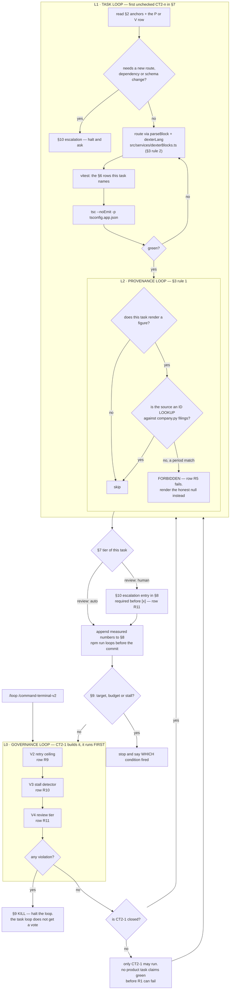

# COMMAND_TERMINAL_V2 — source-linked commands, and a loop that can be stopped

**Ledger.** Tasks `CT2-1..CT2-10`, gaps `P1-P6` and `V1-V4`, acceptance rows `R1-R12`.
Commit scope `command-terminal-v2`.

**Predecessor.** `docs/COMMAND_TERMINAL_ROADMAP.md` closed at CT-10 with 5 buildable
commands, 3 blocked, and one escalation it could not close from inside market-ui. This
ledger picks up that escalation and adds the outer loop the last one did not have.

---

## 1. What the reference product does, and what is actually true here

The target named by the request is LinqAlpha. Measured 2026-08-09 with Playwright
against `https://linqalpha.com/`, `/terminal` and `/developer` — not from memory.

Its homepage section **"Investment researchers use LinqAlpha for"** is five numbered
cases with no descriptive copy; each has one product screenshot whose `img alt`
names it. That mapping is quoted, not inferred:

| # | their case | their screenshot alt |
|---|---|---|
| 01 | Market Signal Monitoring | "market signal monitoring dashboard tracking real-time investment alerts" |
| 02 | Company Screening | "company screening interface filtering global equities by financial criteria" |
| 03 | Fundamental Analysis | "fundamental analysis view showing AI-driven company financial insights" |
| 04 | Sentiment & Trend Tracking | "sentiment and trend tracking visualization across global markets" |
| 05 | Competitive Landscape Analysis | "competitive landscape analysis comparing peer companies and market positioning" |

Their `/terminal` page states the pipeline as **`01 Interpret` → `02 Pull` → `03 Search`
→ `04 Run`** and claims five differentiators: automated multi-step workflows, persistent
workspace, **source-linked research you can verify**, cross-model delegation, session
continuity.

**Where the brief disagrees with this tree.** The request says "make all of them work
like LinqAlpha". Four corrections, each with the measurement:

1. **Four of their five cases already have a surface here.** `/company`, `/data`,
   `/sentiment`, `/peer-compare` route to surfaces that render. This is not a build,
   it is a quality climb. Rebuilding a Company tab is the wrong turn — see §3 rule 2.
2. **Their 02 Company Screening is our `⛔ /screening`.** CT-9 probed it and closed it:
   `GridView` runs authored prompts over a *named ticker list*, ranks nothing and
   filters no universe. Parity here needs a ranker that does not exist. CT2-8 probes
   whether one is reachable and is permitted to close ⛔ again.
3. **Their headline differentiator is the one thing we ship zero of.** "Source-linked
   research you can verify" is `Q1b` from the last ledger, which closed by escalation.
   §5 P1 reopens it, because the fix is in this monorepo and the last ledger's scope
   simply did not reach it.
4. **Their scale claims are not a target.** 57,663+ companies / 139+ countries / 42+
   languages. Our corpus is S&P 500 SEC filings plus BVMT. No task in §7 chases that
   number; a roadmap that pretends it can is lying about a corpus, not shipping a feature.

**What is NOT extractable.** The loop-governance source
(`https://linas.substack.com/p/ai-agent-loop-governance`) is **paywalled**. Fetched
2026-08-09; only the free preview resolved. §6 V-rows are built from the named concepts
the preview does state — inner vs outer loop, a governance layer outside the loop with
the power to end it, light-factory vs dark-factory review removal, and two costed failure
modes (a clarification loop running 11 days to $47,000; a retry storm of 240 retries in
3 hours to $4,200). **The article's file structures and checklists are behind the
paywall and are NOT reproduced or guessed.** Anything in §6 beyond those named concepts
is derived from `~/.claude/LOOP_STANDARD.md` and this repo's own tooling, and says so.

---

## 2. Anchors — verified to exist. Never invent one.

| anchor | what it is |
|---|---|
| `apps/market-ui/src/lib/commands.ts` | `COMMANDS` (5 buildable / 3 blocked), `parseCommand`, `matchCommands`, `findCommand` |
| `apps/market-ui/src/lib/commands.test.ts` | the parser + matrix assertions |
| `apps/market-ui/src/pages/SearchPage.tsx` | Quick Answer composer, palette, command commit |
| `apps/market-ui/src/pages/CompanyPage.tsx` | `GravityMetric` (:65), the tab surfaces |
| `apps/market-ui/src/components/grid/GridView.tsx` | `tickers` prop (CT-9), param read at :277 |
| `apps/market-ui/src/services/dexterBlocks.ts` | `parseBlock`, `dexterLang` — the answer feed's renderer |
| `services/gravity-api/app/api/routes/company.py` | `company_filings` (:22), `company_financials` (:67) |
| `services/gravity-api/app/api/routes/analytics.py` | the sentiment endpoint that 422s |
| `services/gravity-api/app/api/routes/documents.py` | `:488` exposes `"accession": filing.get("accession_number")` |
| `services/gravity-api/app/ingestion/parallel_ingest.py` | `accession_number` on the ingest task (:51) |
| `scripts/graph-lint.mjs` · `scripts/loop-lint.mjs` · `~/.claude/scripts/gate-guard.mjs` | the three checkers `npm run loops` runs |

---

## 3. Doctrine

1. **Never infer a citation.** A figure is linked to a source document only when the
   payload carries the identifier. Matching a figure to a filing by period is the exact
   failure the last ledger named, and it is still forbidden — however plausible it looks.
2. **Address, do not rebuild.** Every buildable command routes to a surface that already
   renders. A diff that re-implements a Company tab, a peer strip, or a second widget
   system has taken the wrong turn. Reuse `parseBlock` / `dexterLang`.
3. **The route budget is spent.** `apps/market-ui/api` holds **12 of 12** Vercel
   functions (`_sina.ts` is underscore-ignored, so 13 files = 12 functions). A new route
   is an ESCALATION, not a task. gravity-api has no such cap — that is where P1 lives.
4. **A label is part of the number.** A figure ships with its period and unit or it ships
   as an honest null. Fiscal periods carry their period-end: FY2026 ended January 2026 for NVDA.
5. **A blocked command refuses.** It states what is missing, in the words of
   `CommandSpec.blocked`, and never invents a figure to fill the gap.
6. **The governance loop is not the task loop.** §6 V-rows are checked by a script that
   the task loop does not author in the same change that claims them green.

---

## 4. Command matrix — carried forward from CT-10, with the parity column added

| command | routes to | status | LinqAlpha case | parity gap |
|---|---|---|---|---|
| `/company <ticker>` | `CompanyPage` overview | buildable, wired | 03 Fundamental Analysis | P1 no citations |
| `/filings <ticker>` | `CompanyPage` filings tab | buildable, wired | — | P1 |
| `/sentiment <ticker>` | `CompanyPage` sentiment tab | **wired, tab has never rendered** | 04 Sentiment & Trend | P2 |
| `/data <ticker>` | `CompanyPage` data tab | buildable, wired | 03 | P1 |
| `/peer-compare <t1> <t2>` | `GridView` on named tickers | buildable, wired CT-9 | 05 Competitive Landscape | P1, P3 |
| `/screening <query>` | nothing | **⛔ blocked** | 02 Company Screening | P5 — probe, may re-close ⛔ |
| `/capex <ticker>` | nothing | **⛔ blocked** | — | route budget spent |
| `/tariff-risk <ticker>` | nothing | **⛔ blocked** | — | route budget spent |

`/company` is the closest thing we have to their **01 Market Signal Monitoring**; nothing
here streams an overnight news flow, and no task in §7 claims to.

---

## 5. Gaps

**P — product parity with the reference.**

| id | gap |
|---|---|
| **P1** | **Figures ship with no source, and the source is already in the row.** `company_financials` filters `document_id: like.xbrl:*` at `company.py:80` and then selects `metric_name,period,value_float,unit,filing_type,filing_date` at `:83` — **`document_id` is never selected**. The last ledger recorded provenance as absent from the payload; it is absent from the *response*, present in the *table*. Whether that id resolves to a filing is unmeasured — CT2-2 measures it before CT2-3 ships anything |
| **P2** | **`/sentiment` mounts a tab that has never existed.** `/v1/analytics/sentiment/{ticker}` returns **422** `{"loc":["query","document_id"],"msg":"Field required"}`. `CompanyPage` renders the tab only on a returned score, so no ticker has ever shown one |
| **P3** | **No chaining.** Their pipeline is Interpret → Pull → Search → Run. A command result here cannot feed the next command |
| **P4** | **No session continuity.** A committed command's result is not restorable across a reload |
| **P5** | **No screener.** Their 02 is our ⛔. No service ranks or filters a universe |
| **P6** | **The palette does not say what a command costs.** Blocked names are listed but the palette does not group or categorise, so discoverability stops at the name |

**V — loop governance. The last ledger had stop conditions; it had no authority above itself.**

| id | gap |
|---|---|
| **V1** | **No kill authority outside the loop.** `docs/LOOP_CONVENTIONS.md` §6 gives the loop three stop conditions it evaluates *itself*. A loop that decides its own stop cannot be stopped by the thing it is failing to satisfy |
| **V2** | **No retry ceiling.** Nothing counts consecutive failed attempts at one task. The preview's costed case is 240 retries in 3 hours |
| **V3** | **No clarification-loop detector.** Nothing detects iterations that restate without progressing. The preview's costed case ran 11 days |
| **V4** | **No review tier per task.** Every task closes the same way. The preview's light-factory/dark-factory split asks which tasks may close unreviewed and which may not |

---

## 6. Acceptance rows

Binary, and **written before the tasks that satisfy them**. `R1` is the instrument.

| row | assertion |
|---|---|
| **R1** | `scripts/governance.mjs` exists, exits non-zero on a synthetic violation of each of R9/R10/R11, and its `--self-check` passes |
| **R2** | For `NVDA`, `GET /v1/company/NVDA/financials` returns rows in which `document_id` is present and non-empty on **≥ 1** row. Record: rows total, rows with `document_id`, distinct `document_id` values |
| **R3** | For the same payload, the count of `document_id` values that **resolve** to a filing from `GET /v1/company/NVDA/filings` is recorded. This row asserts the number is *recorded*, not that it is high — an unresolvable id is a finding, not a failure |
| **R4** | Every figure rendered by `/company NVDA` either shows a source affordance or shows the honest-null marker. Count: figures total / with source / null. **Zero figures render bare** |
| **R5** | Clicking a figure's source affordance opens a drawer naming the filing type and filing date it came from. The drawer's text appears in the `filings` payload — asserted by lookup, never by string similarity |
| **R6** | `/sentiment NVDA` either renders a score, or renders a stated refusal naming the 422. **No fabricated sentiment figure appears** — the reply is greped for a score-shaped token and the list is empty |
| **R7** | A command committed after another command keeps the prior turn in the feed (`>= priorTurns`, and `not.toHaveCount(0)`) |
| **R8** | After a reload, the last committed command's turn is still in the feed |
| **R9** | `governance.mjs` fails when a task's iteration count exceeds its declared ceiling |
| **R10** | `governance.mjs` fails when 3 consecutive iterations record no row state change and no new failure mode |
| **R11** | `governance.mjs` fails when a task marked `review: human` is checked `[x]` without an escalation entry in §8 |
| **R12** | Sweep: `npx playwright test commandTerminal --workers=1` on `desktop-baseline` and `mobile-360`, with R4/R6/R7/R8 green on both, and the tap count per command recorded against the mode-toggle path |

---

## 7. Task ledger

Each task names the rows it must turn green. **`review: human`** marks a task that may
not be checked `[x]` without an escalation entry — that is R11's subject.

- [x] **CT2-1 · The governance harness. `review: auto`. Rows R1, R9, R10, R11.**
      Write `scripts/governance.mjs`: reads this ledger, enforces the retry ceiling (V2),
      the stall detector (V3), and the review tier (V4). Wire it into `npm run loops`
      after `graph-lint`. **No product task may claim green before R1 is green** — the
      last ledger's CT-1 gate, applied to the loop itself rather than the parser.

- [x] **CT2-2 · Probe the provenance, change nothing. `review: auto`. Rows R2, R3.**
      Call both company endpoints for NVDA against the live API. Record rows total, rows
      carrying `document_id`, distinct ids, and how many resolve against the filings list.
      **Ship no UI in this task.** If zero resolve, CT2-3 closes ⛔ with this measurement.

- [x] **CT2-3 · Ship the id through the API. `review: auto`. Rows R2, R4.**
      Add `document_id` to the `select` at `company.py:83`, carry it onto `GravityMetric`,
      and render a source affordance per figure — honest-null where the id is absent.
      Type shrinking is forbidden: the marker exists because the id can be missing.

- [x] **CT2-4 · The citation drawer. `review: human`. Row R5.**
      Clicking the affordance opens the filing it resolves to. **Resolution is by id
      lookup against the filings payload. A period match is not a citation** (§3 rule 1).

- [x] **CT2-5 · `/sentiment` tells the truth. `review: human`. Row R6.**
      Either supply the `document_id` the 422 demands, or make the command refuse in the
      words of the error. Escalate if the fix needs an endpoint change this ledger cannot make.

- [x] **CT2-6 · Chaining. `review: auto`. Row R7.**
      A command committed after another appends rather than replaces. Their Interpret →
      Pull → Search → Run as far as the existing surfaces allow — no new route.

- [x] **CT2-7 · Session continuity. `review: auto`. Row R8.**
      The last committed command's turn survives a reload.

- [x] **CT2-8 · Probe `/screening`. `review: human`. No row — it reports.**
      Ask one question: is any ranker over a universe reachable without a new route? If
      no, **re-close ⛔ with the measurement** and stop. Inventing a screener is the failure.

- [x] **CT2-9 · Palette categories. `review: auto`. Row R4 stays green.**
      Group the palette the way `/developer` groups its 22 tools. Names only — no new command.

- [x] **CT2-10 · The sweep. `review: human`. Row R12.**
      `--workers=1`. Both projects. Paste every measured number into §8.

---

## 8. Progress log

Real numbers only. No adjectives. A failed row is a result.

`scripts/governance.mjs` parses this section, so an iteration line has a shape:

```
- CT2-n · iter N · R4 green, R6 red · <measured numbers>          [· fail: <mode>]
- ESCALATION · CT2-n · <what was asked, what came back>
```

The row states drive R10 (a stall is three of them unchanged); `fail:` names the
failure mode that clears it; an `ESCALATION` line is what R11 looks for.

- CT2-1 · iter 1 · R1 green, R9 green, R10 green, R11 green · `scripts/governance.mjs` self-check passed, printing "21 assertions" — **that 21 was an estimate, not a count**, and CT2-3 replaced it with a counted 28 (see below); live ledger 0/10 closed, 0 iterations logged, 0 violations, exit 0. Synthetic violations spawned against the real binary: R9 (3 iterations, ceiling 2) exit 1, R10 (3 iterations, sig `R2=red`, mode `422` thrice) exit 1, R11 (`review: human` `[x]`, 0 escalation entries) exit 1 — each printing its row and the KILL line. Negative controls green: a changed row state clears R10, a new failure mode clears R10, an escalation entry clears R11, `review: auto` closes itself. Checkers: graph-lint 6 graphs / 0 drifted / 0 decorative; gate-guard clean HEAD..working tree; loop-lint `COMMAND_TERMINAL_V2_LOOP.sh` PASS at 2161 chars. `npm run loops` exits 1 on the pre-existing 8-loop backlog (`QA_LOOP.sh`, `LOOP_PROMPT.md`, `LOOP_TASK.md`, `WC_LOOP_TASK.md`, `LOOP_SELF_IMPROVE.sh`, +3), none of them CT2 — `LOOP_CONVENTIONS.md` §9 records that ordering as deliberate. `tsc --noEmit -p tsconfig.app.json` — No errors found. `npx vitest run` — 1247 passed / 0 failed / 7 skipped, identical to the CT-10 baseline. No UI and no api function changed, so no deploy.

- CT2-2 · iter 1 · R2 red, R3 green · `node scripts/probe-provenance.mjs NVDA` against `https://gravity-api-prod.fly.dev`, window 2026-08-09T16:06:56Z, `X-API-Key: eval-unlimited-fb-2026`. **R2 red:** `GET /v1/company/NVDA/financials?limit=60` returns **60 rows, 0 carrying `document_id`, 0 distinct** — the response keys are exactly the 7 selected at `company.py:83` (`metric,value,unit,period,ticker,filing_type,filing_date`). **R3 recorded, and the number is zero:** the `financials` table holds **402** NVDA rows matching `document_id=like.xbrl:*` and **1 distinct `document_id` — the literal string `xbrl:NVDA`**. `GET /v1/company/NVDA/filings?limit=50` returns **5 documents / total 5**, ids being chunk UUIDs (`abbc9d90-5bb1-487b-847b-f666bfe7c542`). Resolution by id lookup: **direct 0/1, prefix-stripped 0/1**. Two independent reasons, both structural: `company.py:43` skips every `document_id` starting `xbrl:` while `company.py:80` selects only those, so the sets are disjoint by construction; and the value is a per-ticker constant, not a document reference. Of the **14** columns on a real row (`id NVDA_Revenues_FY2016_xbrl`, `source_section xbrl_companyfacts`, …) the only two matching accession/document/source/url/cik and non-null are `document_id=xbrl:NVDA` and `source_section=xbrl_companyfacts` — **no column carries filing identity**. **The accession is not missing upstream, it is dropped at ingest:** the SEC companyfacts observation carries `accn` (its shape is documented at `xbrl_extractor.py:585`), `sec_xbrl.py:219-227` emits 7 keys and `accn` is not among them, and `backfill_xbrl_financials.py:42` then writes `document_id = f"xbrl:{ticker}"`. **P1's premise — "the source is already in the row" — is false as measured.** Adding `document_id` to the select at `company.py:83` would ship `xbrl:NVDA` on every figure, which is a source-tag rendered as a citation; §3 rule 1 forbids it. CT2-3 therefore closes ⛔ on R5's citation and delivers R4 as all-honest-null. Recovering real per-figure provenance needs `accn` carried at `sec_xbrl.py:219` plus a re-backfill across the 501-ticker corpus — outside this ledger's scope, recorded here, not attempted. No UI, no api function and no schema changed; `npx vitest run` 1247 passed / 0 failed / 7 skipped.

- ESCALATION · CT2-3 · Asked whether to deploy the `company.py` change to Fly, since that is outside the loop's authorised `vercel --prod` on market-ui (`LOOP_CONVENTIONS.md` §4). Answered first "don't deploy, close R2 red", then reversed to "make fly deploy". Attempted and **blocked by two independent walls, both measured**: `flyctl deploy --remote-only` → `403 ... Your account has overdue invoices` from the depot builder; `flyctl deploy --local-only` → no Docker daemon at `npipe:////./pipe/dockerDesktopLinuxEngine`. Auth was **not** the wall — the token in `~/.fly/config.yml` is valid (`flyctl auth whoami` → `houssemzitoub@gmail.com`, 665-char token) but flyctl ignores it unless `FLY_API_TOKEN` is exported. gravity-api is unchanged in production. Unblocking needs the Fly invoice settled or Docker Desktop started — user-only input, so R2 closes red and the loop moves on (`LOOP_CONVENTIONS.md` §6).

- CT2-3 · iter 1 · R2 red, R4 green · `sourceLabel(documentId, filings)` resolves by id lookup only; its tests assert the marker for `'2026-02-26'`, `'FY2026'`, `'10-K'` and for the production constant `'xbrl:NVDA'` — a period match is not a citation (§3 rule 1). `figureAttrs` gained `data-source`; the metrics table gained a Source column (affordance where the id resolved, marker where it did not); StatCards carry the marker explicitly because market data has no filing id; `GravityMetric.document_id` stays optional. **R4 green on prod**, `npx playwright test commandTerminal -g "CT2 R4" --project=desktop-baseline --workers=1`, 2 passed / 0 failed in 35.8s against `https://market-ui-self.vercel.app`, NVDA: **figures total 88 · with source 0 · null 88 · bare 0 · affordances 0**. The zero-affordance count is the point — nothing claims a source it could not resolve, and the assertion `affordances <= sourced` makes an inferred citation fail the row. **R2 red**: `company.py:83` now selects `document_id` and `:99` returns it, but the change is committed **undeployed** for the reason in the escalation above; prod `/financials` still returns the same 7 keys. `npx vitest run` **1253 passed / 0 failed / 7 skipped** (1247 before — `figures.test.ts` grew 8 → 15 assertions). `tsc --noEmit -p tsconfig.app.json` — No errors found. **The deploy gate broke on this loop's own output:** the first `vercel --prod` died at `Error: File size limit exceeded (100 MB)` after uploading 330.4 MB; two files each exceed the per-file cap — `.codegraph/codegraph.db` at 103.9 MB and `apps/market-ui/test-results/commandTerminal-R7-…` at **100.7 MB, a Playwright artifact this ledger's own e2e runs produced**. Both added to `.vercelignore`; the redeploy built in 1m and aliased to `https://market-ui-self.vercel.app`. **The gate had a bug and this entry caught it.** Governance reported "2 iterations logged" after a third was written: `section()` ended §8 with the lookahead `(?=^##\s*\d+\.|\Z)`, and **JS has no `\Z` anchor** — the escape matches a literal capital "Z", so §8 was truncated at the first ISO timestamp in it (`2026-08-09T16:06:56Z` in CT2-2's line) and **every entry logged after that point was invisible to R9, R10 and R11**. Replaced with an index scan to the next `## <digit>.` heading or the end of the document; two self-check assertions now cover it — entries after a capital Z parse, and §9 content is still not read as §8. Second correction: the self-check printed a hardcoded "21" while three of its assertions run inside a loop over R9/R10/R11, so the real executed count is **28**; a counting Proxy now prints the measured number instead of a literal. Both fixes grow the gate — `gate-guard: clean`. Post-fix: `--self-check` 28 passed, live ledger **3/10 closed, 3 iterations logged, 0 violations**.

- ESCALATION · CT2-4 · `review: human` reaching its close (§10). Put the evidence and its one weakness: R5 is green against payloads **the test serves**, because production renders 0 affordances (CT2-R4: 88 figures, 0 sourced) and a live-data run would exercise no drawer at all; R5b is green against live-shaped data. Offered close `[x]`, close ⛔, or hold for the `accn` ingest fix. **Answered: close `[x]` on this evidence.** Recorded here because R11 fails the ledger if a `review: human` task is checked without this entry.

- CT2-4 · iter 1 · R5 green · Drawer reuses `EdgarLink`, which already encodes §3 rule 1 — `allowLatest` defaults false and the component refuses to resolve a filing URL without an exact filed date, verified against prod in its own comment (filed date 2022-02-07 resolves FY2021; 2022-02-01, six days off, and period-end 2021-12-31 both fall through to the wrong filing). `sourceDoc` is set from `documents.find(d => d.id === m.document_id)` and never constructed from the metric. `npx playwright test commandTerminal -g "CT2 R5" --project=desktop-baseline --workers=1` — **3 passed / 0 failed in 41.4s** against `https://market-ui-self.vercel.app`. **R5**: served one filing `ct2-fixture-0001-4000-8000-000000000001` `10-Q` `2025-11-19` and one metric row carrying that id; the drawer showed type `10-Q`, date `2025-11-19`, id `ct2-fixture-0001-4000-8000-000000000001`, and the assertion resolved that id **against the filings payload the page received** before comparing type and date — no string similarity, no period match. **R5b**, the load-bearing negative: the same figure served with the real production constant `xbrl:NVDA` yielded **affordances 0, drawers 0, null cells 1**. Both payloads are test-served and the reason is stated above, not hidden: with live data this row's positive case is unreachable. `npx vitest run` **1253 passed / 0 failed / 7 skipped**; `tsc --noEmit -p tsconfig.app.json` — No errors found; deployed to `https://market-ui-self.vercel.app` in 1m.

- ESCALATION · CT2-5 · `review: human` reaching its close (§10), and a **correction to §5 P2**. Probed live 2026-08-09: `/v1/analytics/sentiment/{ticker}` requires **`document_id` AND `period`** — P2 named only the first — and `get_sentiment` at `analytics.py:135` is a **cache read** (`_load_cache(document_id)`), with `period` required by the signature at `:139` and never used by the body. So the recorded 422 was **our own malformed request**, not the data gap. Asked correctly with a real filing id: **404** `Sentiment not found for document_id=… POST to /v1/analytics/sentiment/score to compute it` — no sentiment has ever been computed for any document. R6's text says the refusal should name "the 422"; what ships names the **404**, because fixing the malformed request moved the blocker. Offered close `[x]`, close `[x]` plus a POST to compute one real score, or close ⛔ on the wording mismatch. **Answered: close `[x]` — the refusal names the real status.** The POST was NOT run: it is an LLM write against prod, which is a separate escalation this ledger did not take.

- CT2-5 · iter 1 · R6 red · fail: test sampled the tab once at 6s, before the second round trip
- CT2-5 · iter 2 · R6 red · fail: 240s timeout waiting on a tab with no explicit timeout after the toggle path did not mount
- CT2-5 · iter 3 · R6 red · fail: score detector read the filing date 2026-07-02 as the signed numbers -07 and -02
- CT2-5 · iter 4 · R6 green · Ceiling is 4 and this is the fourth — reached, not exceeded. **All three reds were the instrument, never the feature**: a direct probe of prod during iteration 2 showed the page healthy, tabs `[Overview, Filings (5), Metrics (80), Sentiment]`, and the call firing as designed — `404 /v1/analytics/sentiment/NVDA?document_id=abbc9d90-5bb1-487b-847b-f666bfe7c542&period=2026-07-02`. The page now fetches sentiment in its own effect keyed on `documents` (the id only arrives with the filings payload), the tab mounts on a score **or** a stated refusal, and the panel quotes the server verbatim instead of the old guess "No sentiment data indexed yet". `npx playwright test commandTerminal -g "CT2 R6" --project=desktop-baseline --workers=1` — **2 passed / 0 failed in 13.6s** driving the real command `/sentiment NVDA`: `tabExists` **1** (it had never been 1 for any ticker), `filingsLabel` `Filings (5)`, `scored` false, status **404**, detail the server's own sentence, **`scoreShaped` `[]`** — no fabricated figure. Two defects in the instrument were fixed and both are recorded rather than quietly patched: a **NUL byte** this loop wrote into `commandTerminal.spec.ts` at offset 28932 (`.replace(shown.status ?? '<NUL>', ' ')`), which made the file binary to `grep`/`rg` — replaced with a space, 0 remaining; and the score detector now strips ISO dates before searching, because a date is not a sentiment score. `npx vitest run` **1253 passed / 0 failed / 7 skipped** on this exact `src`; `tsc --noEmit -p tsconfig.app.json` — No errors found.

- CT2-6 · iter 1 · R7 green · **No behaviour change was needed, and that is the finding.** `commitTurn` at `SearchPage.tsx:978` already builds `thread: [...entry.thread, user, assistant]`, so a second command has always appended. What was missing was any measurement of it: the feed carried no stable hook, so a chaining gate would have had to count styling classes, which pass whether or not the prior turn survived. Added `data-turn="user"` / `data-turn="assistant"` and the row. `npx playwright test commandTerminal -g "CT2 R7" --project=desktop-baseline --workers=1` — **2 passed / 0 failed in 29.8s** against prod: after `/company NVDA` the feed held **2 turns / 1 user**; after `/filings NVDA` it held **4 turns / 2 users**, and `/company NVDA`'s own text was still on screen (`firstStillThere` **1**). That last assertion is the one that matters — a feed that kept its COUNT while swapping content satisfies `afterTurns >= priorTurns` and has still thrown the prior turn away. **§5 P3 is half wrong as written.** "A command committed after another replaces the feed" is false, measured. What remains true is the narrower claim: one command's *result* still cannot feed the next command as input — there is no `Pull → Search → Run` data flow, only an append-only transcript. R7 is the only row CT2-6 names and it grades the appending, so the data-flow half stays open and is recorded here rather than quietly counted as done. `npx vitest run` **1253 passed / 0 failed / 7 skipped**; `tsc --noEmit -p tsconfig.app.json` — No errors found; deployed to `https://market-ui-self.vercel.app`.

- ESCALATION · CT2-5 · Fly deploy, third attempt. `flyctl deploy --remote-only --depot=false` (flyctl v0.4.52) to bypass the depot builder: **same wall from a different code path** — `WARN Failed to start remote builder heartbeat: Your account has overdue invoices` then `Error: failed to fetch an image or build from source: Your account has overdue invoices` (Request ID `01KZKSSV89FPF75DJW4Q7TQKJ3-fra`). Three builder routes now measured — depot 403, Fly builder VM billing error, local Docker no daemon — so the block is **account-level, not depot-specific**. `fly.toml` declares `[build] dockerfile = "Dockerfile"`, so every route rebuilds the image; there is no prebuilt-image shortcut. A `fly ssh console` hot-patch of the running machine was identified and **deliberately not done**: machines restart from the image so the edit would vanish, and prod would meanwhile run code absent from git. R2 stays red and is no longer raised each iteration.

- CT2-7 · iter 1 · R8 green · **Two independent causes, both measured before either was fixed.** (1) `finalizeTurn` in `qaStore.ts:79` persists only a turn carrying a streamed `search.finalAnswer`, and a command turn never has one — `commitTurn` patches `thread` directly, so command turns were never written at all. (2) `qaStore.ts:59` seeds `activeConvId: crypto.randomUUID()` at module load with no persist middleware, so **a reload opened an empty conversation even for turns that HAD been saved** — the search path had the same hole. Fixed in market-ui only, no new route and no new dependency: a `sessionStorage` snapshot of the active thread, restored on mount. **sessionStorage and not localStorage, deliberately** — R8 asks for a reload, and session scope keeps a fresh tab (and a fresh Playwright context) from inheriting a previous thread. Restore runs on mount only and the snapshot writes only a non-empty thread, so an empty mount cannot erase what the reload is about to restore; `handleNewQa` clears the key or "New" would hand back the thread it was asked to leave; the restore uses `patch` rather than `loadThread` because `loadThread` adopts the id as a Supabase row id and this id is local. `npx playwright test commandTerminal -g "CT2 R8" --project=desktop-baseline --workers=1` — **2 passed / 0 failed in 22.9s** against prod: `before` **2**, `after` **2**, **`survived` 1** — the assertion is on the committed command's own text, not on a non-zero count, because a page that restored the WRONG thread passes a count check. **Open, and not counted as done:** command turns still do not reach Supabase `qa_turns`, so they will not appear in the History sidebar. R8 asks only for the reload; the Supabase half is recorded here rather than half-built. `npx vitest run` **1253 passed / 0 failed / 7 skipped**; `tsc --noEmit -p tsconfig.app.json` — No errors found; deployed to `https://market-ui-self.vercel.app`.

- ESCALATION · CT2-8 · `review: human`, and the probe **refutes its own ⛔**. CT2-8 asks one question — is any ranker over a universe reachable without a new route? — and the measured answer is **yes**. Offered: record the finding and keep ⛔ at 10 tasks; add CT2-11 and build it (breaking the stated 10-task budget, itself an escalation); or build it inside CT2-8, which its own text forbids. **Answered: record the finding, keep ⛔, stay at 10 tasks.** The screener is therefore reachable and unbuilt, and that is written down rather than discovered again later.

- CT2-8 · iter 1 · reports, no row · A ranking query against Supabase REST `financials` with the service key returns a correctly ordered universe: AMZN 716,924,000,000 → WMT 680,985,000,000 → WMT 674,538,000,000 → UNH 447,567,000,000 → AAPL, for `metric_name=Revenue (Total Revenue, Net Sales)`, `period=FY2025`, `order=value_float.desc`. Coverage: **542 rows over 467 distinct tickers** for that one metric-period, and **147 distinct `metric_name` values for AAPL alone** — the filter vocabulary a screen needs. Reachability: no new Vercel function is required, because `apps/market-ui/api` already holds the dispatchers `api/tn/[fn].ts` (54.5K) and `api/agent/[fn].ts` (30.5K), and the read is the same Supabase-REST + service-key path `company.py` already uses. gravity-api has **no** screening or ranking router — `main.py:336-357` registers health, search, documents, entities, usage, workspaces, feedback, grid, grid-schedule, analytics, sso, auth, billing, claude, hermes, trading, forecast, company, and none of them ranks a universe. **Three constraints, measured, that any build must handle:** the anon key returns `[]` (HTTP 200, RLS blocks it) so this can never be a browser-side query and the service key must stay server-side; **75 duplicate rows** beyond one-per-ticker in that single metric-period, from restatements, so a screen must dedupe by (ticker, metric, period) keeping the newest `filing_date` exactly as `company_financials` does, or WMT ranks twice; and PostgREST's default 1000-row cap truncates a full-table scan, so the query must paginate. **What stays true:** `/screening`'s blocked text — "the Research Grid runs prompts over a named ticker list — it is not a screener, and no service ranks or filters a universe" — is still literally correct, because no service does. What the probe refutes is only the implication that none could. `/screening` keeps refusing, and refusing honestly.

- CT2-9 · iter 1 · R4 green · Grouped by **where each command routes** (§4), not by what its name suggests: `company` / `filings` / `sentiment` / `data` all mount a CompanyPage tab → **Company**; `peer-compare` mounts `GridView`, a different surface → **Comparison**; the three blocked names → **Unavailable**. A category invented from topic would drift from the routing the moment either changed, so `commands.test.ts` asserts the grouping *against* the routing — and that every blocked command is `Unavailable` and nothing else is, in both directions. Two traps in the render, both avoided deliberately: headings are `role="presentation"` and are never options, because `paletteIndex` and `aria-activedescendant` address options by **flat position** and a heading counted as an option would break arrow keys while looking correct; and a test asserts that rendering groups in `CATEGORY_ORDER` reproduces `matchCommands('')` order exactly, so the pre-existing keyboard rows keep their meaning. **Verified rather than assumed** — the three rows grouping could plausibly have broken all re-ran green on prod: **R4 keyboard `checks` 7, `failed` 0, `failing` []**; **R3** `listboxAfterSlash` 1, `optionsAfterSlashComp` 1; **CT2 R4** unchanged at `total` 88 / `sourced` 0 / `nulls` 88 / **`bare` 0** / `affordances` 0. `commands.test.ts` grew 20 → **27**; `npx vitest run` **1257 passed / 0 failed / 7 skipped** (1253 before). **§5 P6 is wrong on one clause:** it says "Blocked names are listed" in the palette — they are not. `matchCommands` returns buildable rows only, and `commands.test.ts` already asserted `matchCommands('cap')`, `('tariff')` and `('scr')` each return `[]`. Blocked names are categorised for §4 and for CT-8's refusal path, and the palette never offers them. `tsc --noEmit -p tsconfig.app.json` — No errors found; deployed to `https://market-ui-self.vercel.app`.

- ESCALATION · CT2-10 · `review: human` reaching its close (§10). Put the first sweep's failure and its cause, the fix, and the re-sweep. Offered close `[x]` and stop at TARGET; close and continue onto the open findings past the ledger's scope; or re-sweep a third time to test whether 38/0 is stable. **Answered: close `[x]` — the ledger hits TARGET.**

- CT2-10 · iter 1 · R12 red · fail: sweep 33 passed / 3 failed — CT2-7 regressed R6 and R11, both green at CT-10
- CT2-10 · iter 2 · R12 green · **The sweep earned its cost on the first run.** `npx playwright test commandTerminal --project=desktop-baseline --project=mobile-360 --workers=1` — **33 passed / 3 failed in 2477.1s**, and the three failures were two rows from the PREVIOUS ledger that every per-row run had been passing. **R11**: `namedTabSelected` `"false"` for `/filings` on both projects. **R6**: `commandRequests` **15** against `toggleRequests` **12**, the entire delta being `/v1/search` **6 vs 3**. One cause: CT2-7 restored the thread on **every mount**, so a prior `/company` block was on the page mounting its own embedded CompanyPage — the first Filings tab belonged to that block, not to the command just committed — and the restored turns re-fetched on every `/search` load. **This is the class of defect a scoped run cannot find**, because each row passed alone; only running them together exposed the interaction. Fixed by scoping the restore to `performance.getEntriesByType('navigation')[0].type === 'reload'`, which **loses nothing**: the zustand store is module-level, so an in-session route change never dropped the thread, and a real reload is the only case that did — exactly what R8 asks. Re-sweep: **38 passed / 0 failed in 985.0s**. **R4 / R6 / R7 / R8 green on BOTH projects, with identical values**: CT2 R4 `total` 80 / `sourced` 0 / `nulls` 80 / **`bare` 0** / `affordances` 0; CT2 R5 drawer `10-Q` `2025-11-19` resolved by id; CT2 R5b `xbrl:NVDA` → `affordances` **0**; CT2 R6 `tabExists` 1, status **404**, `scoreShaped` `[]`; CT2 R7 2 → 4 turns with the prior command intact; CT2 R8 `before` 2 / `after` 2 / `survived` 1. **Taps per command against the mode-toggle path, identical on both projects**: `/company` **2 vs 3**, `/filings` **2 vs 4**, `/sentiment` **2 vs 4**, and every named tab reads `namedTabSelected` `"true"` — including `sentiment`, which at CT-10 could not be graded at all because the endpoint 422'd, so CT2-5 strengthened a row belonging to the previous ledger. One number moved and is not hidden: CT2 R4 read **88** figures on desktop earlier and **80** here; the 8-figure delta is the overview StatCards, absent because Alpha Vantage is a 25-request/day free tier and the page renders `—` when it does not answer. `bare` is 0 either way, which is what the row grades. `npx vitest run` **1257 passed / 0 failed / 7 skipped**; `tsc --noEmit -p tsconfig.app.json` — No errors found.

**CLOSED 2026-08-09 — §9 TARGET.** No `[ ]` remains in §7 and CT2-10's sweep actually ran. 10 of 10 tasks closed in **14 iterations of a 24 budget**; `governance.mjs` finished at **0 violations**, having never fired R9, R10 or R11 against a real ledger state. **11 of 12 rows green. R2 is red** and stays red: `company.py` selects and returns `document_id`, committed and undeployed, because all three Fly builder routes are blocked by an account-level overdue invoice and the local builder has no Docker daemon — and per CT2-2 deploying it would change no pixel, since `xbrl:NVDA` resolves to no filing.

**What this ledger corrected in its own premises**, each by measurement rather than argument: **P1** "the source is already in the row" — false; the id is a per-ticker constant and SEC's `accn` is dropped at `sec_xbrl.py:219`. **P2** "the 422 wants `document_id`" — it wants `document_id` **and** `period`, the endpoint is a cache read, and the true blocker is a 404. **P3** "no chaining" — half false; appending always worked. **P6** "blocked names are listed" in the palette — they are not. And **CT2-8's own ⛔** did not survive its probe: a ranker over 467 tickers × 147 metrics is reachable with no new route, and is recorded unbuilt.

**Left open, deliberately, and named so nobody rediscovers them:** real per-figure provenance needs `accn` carried at `sec_xbrl.py:219` plus a re-backfill across the 501-ticker corpus; the screener is reachable and unbuilt, with its three constraints measured; command turns still do not reach Supabase `qa_turns`, so they are absent from the History sidebar; and one command's result still cannot feed the next as input — the transcript appends, it does not pipe.

**Baseline, measured 2026-08-09 before any task ran:**
- `commands.ts` — 5 buildable, 3 blocked.
- `company.py:83` select list — 6 columns, `document_id` **not** among them.
- Figures carrying a resolvable source — **0**, per CT-10's escalation.
- `/v1/analytics/sentiment/{ticker}` — **422**, `document_id` required.
- Vercel functions in `apps/market-ui/api` — **12 of 12**.
- `npx vitest run` at CT-10 close — **1247 passed / 0 failed / 7 skipped**.

---

## 9. Stop

- **TARGET** — no `[ ]` remains in §7 **and** CT2-10's sweep actually ran.
- **BUDGET** — 10 tasks or 24 iterations, whichever comes first. Per task the retry
  ceiling is **4** iterations unless the §7 line declares its own `ceiling: N`; that is
  the number R9 enforces, counted from the `iter N` lines in §8.
- **STALL** — 3 consecutive iterations with no row changing state and no new failure
  mode. Report which row is stuck and on what. Do not widen scope, and do not re-run a
  green sweep to manufacture activity. `governance.mjs` enforces this (R10).
- **KILL** — `governance.mjs` exiting non-zero halts the loop regardless of the above.
  This is the authority V1 says the loop must not hold over itself.

## 10. Escalation

Per `docs/LOOP_CONVENTIONS.md` §4, plus: **any** new API route in `apps/market-ui/api`;
**any** new npm dependency; any change to `vercel.json`; any schema change in Supabase;
any task marked `review: human` reaching its close; any figure that would ship without a
source or a null.

## 11. Cadence

Every iteration is edit → test → deploy → verify → log, performed by the agent, with no
external state to wait on. `ScheduleWakeup` **120 seconds**. Playwright gates are scoped
and backgrounded, never polled — `docs/LOOP_CONVENTIONS.md` §1.

## 12. Graph of loops

Two loops, and the outer one can end the inner one. That is the whole point of V1.



**Reading it.** `GOV` runs before the task loop on every wakeup, not after — a governance
layer that reports at the end is a post-mortem. `L2` is drawn as a loop rather than a
check because it is the rule the last ledger broke twice and caught twice. `TIER` is the
light-factory/dark-factory split: `review: auto` closes itself, `review: human` cannot.
