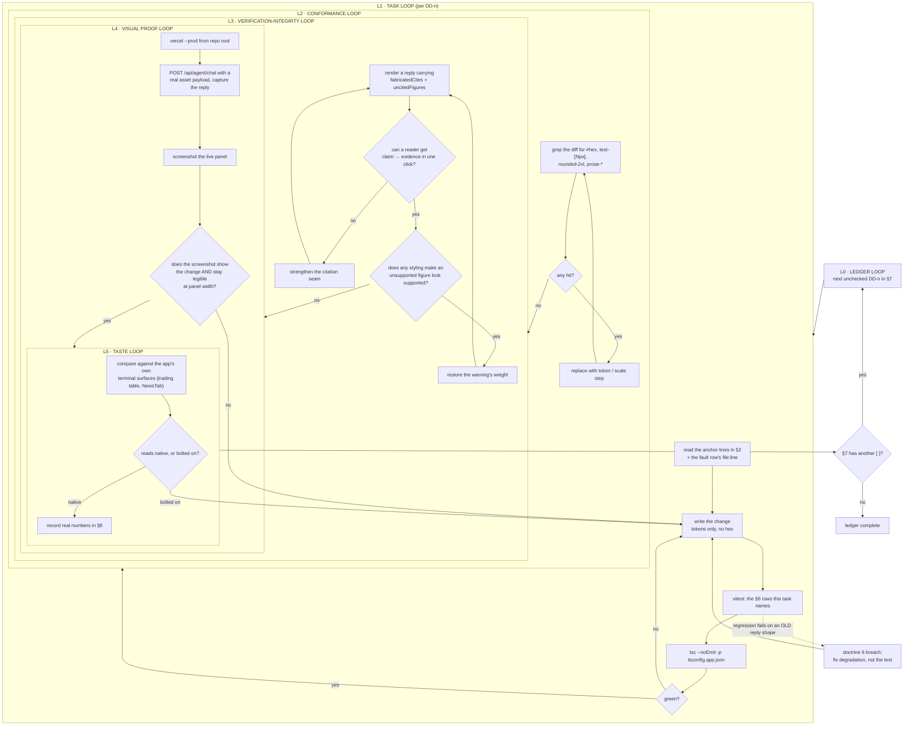

# Dexter Design Roadmap — premium, organised, visibly verified

Companion to `docs/AI_TRADING_AGENT_ROADMAP.md`. That ledger made Dexter *correct*
(DX-1..DX-16: real tools, real citations, earned trust grades). This one makes the
correctness **legible**. Nothing here changes what the agent knows — only what the
user can see, trust, and act on.

Scope: `apps/market-ui/src/components/trading/Assistant.tsx` (545 lines, holds the
panel plus three inline sub-components), its render contract with
`apps/market-ui/api/agent/[fn].ts`, and the design tokens in
`apps/market-ui/src/index.css` / `apps/market-ui/tailwind.config.js`.

---

## 0. Faults — measured, with evidence

Every row was read out of the current source or observed in a live prod probe on
2026-08-01. No row is a matter of taste alone.

| # | Fault | Evidence | Why it matters |
|---|-------|----------|----------------|
| **F1** | **The markdown styling is inert.** The answer body is wrapped in `prose prose-invert prose-sm prose-p:leading-relaxed prose-pre:bg-[#0B0E14]` — but `@tailwindcss/typography` is not installed. | `Assistant.tsx:461` requests the classes; `tailwind.config.js:72` is `plugins: [require("tailwindcss-animate")]`; `package.json` has no `@tailwindcss/typography` | Every `prose-*` class compiles to nothing. `##` headings, `-` lists, `**bold**` and tables render at raw browser defaults inside a chat bubble. **This is the single largest cause of "I don't like the design."** |
| **F2** | **The footer lies about the model.** Static string `Powered by Gemini 3.1 Pro`. | `Assistant.tsx:540`; live prod reply returns `"provider":"deepseek","model":"deepseek-v4-flash"` | The reply already carries the true provider/model and the UI ignores it. This is the exact string in the original broken screenshot — the one artifact of the dead Gemini path that survived DX-1. A panel that misreports its own engine cannot ask to be trusted about a price. |
| **F3** | **Dexter ignores the app's design system entirely.** Hardcodes `#0B0E14` / `#1F2937` / `#2962FF`, `rounded-2xl`, `text-[10px]`, `text-[11px]`. | `Assistant.tsx:385,387,412,429,457,461,527,533` (17 hardcoded hex uses in `src/`); system defines `--surface`, `--surface-2`, `--line`, `--text-2..4`, `--accent`, `--up`, `--down` at `index.css:15-31`, fonts + `label/data/body` scale + 8px spacing + radii capped at `xl: 8px` at `tailwind.config.js:34-61` | `rounded-2xl` is 16px — twice the system's maximum radius, because only `sm/DEFAULT/md/lg/xl` were overridden. The panel reads as a consumer chat widget bolted onto a trading terminal. It cannot follow theme changes, and it will never look native. |
| **F4** | **Citations are inert text.** The model writes `[1]`, `[2]`; `ReactMarkdown` renders them as literal characters. | `Assistant.tsx:462` renders raw; the source list at `Assistant.tsx:57-63` is a separate 11px grey `font-mono` block | The verification work is *done* — `citations[]`, `fabricatedCites[]`, `uncitedFigures[]` all ship on every reply — but a reader cannot get from a claim to its evidence. "Cited" is true and invisible. |
| **F5** | **Evidence rows are truncated to nothing.** `<span className="truncate">{c.text}</span>` at 11px in a ≤85%-width bubble. | `Assistant.tsx:61` | Live probe citation [2] was `"Drawing dispatched…Snapped to the engine's own prices: 58115→58115.01, 62290→62272.2, 64250→64243.535, …"`. The price-snap audit trail — the strongest proof the agent did not invent levels — is clipped to about four words. |
| **F6** | **Uncited figures are named but not located.** Rendered as a comma list, capped at 6 with `+N`. | `Assistant.tsx:69-73` | Live probe flagged **12 of 29 figures** (`$58,100, $58k, $62,270, $62.9, $64,250, …`). The user is told numbers are unsupported but not which sentence contains them, so the warning is unactionable and reads as noise. |
| **F7** | **The trust verdict is the smallest element on screen.** `text-[10px]` badge. | `Assistant.tsx:37` | The grade is the headline of a verified-answer product. Its reasons (`"17/29 figures sit in a cited sentence"`) exist in `chipPropsFor(...).title` — reachable only by hovering a 10px chip. |
| **F8** | **The whole agentic pipeline collapses to one grey line.** `▸ 6 steps · 32351ms`, collapsed by default. | `Assistant.tsx:81-94` | Analysts → debate → risk → verification is the product's core differentiator. It is currently a disclosure triangle in `text-[11px] text-gray-500`. |
| **F9** | **Research answers are squeezed into chat bubbles.** `max-w-[85%] rounded-2xl p-4` applies to assistant turns too. | `Assistant.tsx:455` | The live probe returned ~400 words with two `##` headings, three sub-sections, bulleted level lists and a bottom line. Bubble geometry is right for a user question and wrong for a structured research answer. |
| **F10** | **No renderer for the content types a trading answer actually has.** Price + change, direction verdict, support/resistance levels, plan (entry/stop/target/R:R), risks — all arrive as undifferentiated prose. | `Assistant.tsx:461-463` is the entire answer renderer | The one thing a trader must scan in under a second — the levels and the plan — has no more visual weight than a hedging sentence. |
| **F11** | **Loading is a single line for up to 300 seconds.** Spinner + `{stage ?? 'Starting'}…`. | `Assistant.tsx:500-502`; `maxDuration = 300` in `api/agent/[fn].ts` | DX-16 streams every stage transition over NDJSON. The UI consumes them one at a time and discards the history, so a 32s `quick` run (and a multi-minute `decide` run) shows no sense of progress or shape. |
| **F12** | **`isDrawing` is dead state.** `msg.isDrawing` is read at `Assistant.tsx:464` but never written by the DX-16 reply path. | `Assistant.tsx:464-473`; no assignment in `sendMessage` (`:323-336`) | The "Chart updated with analysis" confirmation never renders, even though the live probe dispatched two drawings. Chart mutations happen silently. |

**Not a fault:** the agent's substance. The 2026-08-01 prod probe returned a correct,
tool-grounded, fully-cited answer with zero fabricated citations. Every item above is
presentation. Do not "fix" the pipeline in this ledger.

---

## 1. Doctrine — hard rules for this ledger

1. **Never restyle by guessing.** Read the token in `index.css` / `tailwind.config.js`
   before writing a class. A hex literal in a diff is a bug.
2. **Design serves verification.** Every visual decision must make it *easier* to tell
   a supported claim from an unsupported one. Prettiness that hides provenance is a regression.
3. **The UI never asserts more confidence than the payload carries.** Grade, reasons,
   uncited count and failed steps render at full strength. No cosmetic upgrade of a C to look like an A.
4. **Never display a value the server did not send.** Provider, model, latency, step
   count and grade all exist on the reply — render those. F2 is what inventing one looks like.
5. **Additive to the contract.** The reply shape (`text`, `actions`, `steps`, `citations`,
   `fabricatedCites`, `uncitedFigures`, `trust`, `provider`, `model`, `ms`) is already
   correct. Extend it only where a task's spec says so, and keep old replies rendering.
6. **Degrade honestly.** Missing `citations` → no evidence panel, not an empty shell.
   Missing `trust` → no chip, not a fabricated grade. Old `localStorage` sessions
   (`Assistant.tsx:372-381`, last 40 messages) must still render.
7. **No new runtime dependency without reading `package.json` first.** `react-markdown@10`,
   `remark-gfm@4` and `motion@12` are present. Prefer a component map over a plugin.
8. **Prove it visually.** A design task is done when a screenshot of the real panel
   against **prod** shows the change — not when the class names look right.
9. **Terminal, not chatbot.** The reference is the rest of this app (Martian Mono data,
   Archivo Narrow display, 2-8px radii, `up`/`down` semantics), not a consumer AI product.
10. **Never widen scope into the agent.** If a design task seems to need a smarter answer,
    the answer is a *prompt contract* (DD-8), not new reasoning.

---

## 2. Verified anchors — reuse, do not rebuild

Read these before touching anything. All confirmed present on 2026-08-01.

| Anchor | Path | What it already gives you |
|--------|------|---------------------------|
| Semantic tokens | `src/index.css:15-31` | `--bg #070A12`, `--surface`, `--surface-2`, `--line`, `--line-strong`, `--text` / `--text-2` / `--text-3` / `--text-4`, `--accent`, `--accent-ink`, `--up`, `--down`, `--flat` (oklch) |
| Tailwind mapping | `tailwind.config.js:7-61` | Token colour names, `font-sans` Archivo / `font-display` Archivo Narrow / `font-mono` Martian Mono, `text-label` 11px / `text-data` 12px / `text-body` 13px, 8px spacing scale, radii `sm 2px`→`xl 8px` |
| Trust scoring | `src/services/dexterTrust.ts` | `chipPropsFor(trust)` → `{label, tone, title}`, `GRADE_RANK`, `scoreAnswerTrust` |
| Trace model | `src/services/gridTrace.ts` | `CellStep`, `stepGlyph(status)`, `traceSummary(steps)` → `{tools, failed, totalMs}` |
| Reply types | `src/services/dexterTools.ts` | `AgentReply`, `DexterCitation` (`{id, title, source, text}`) |
| Streaming | `api/agent/[fn].ts:113-128` | NDJSON `send`/`finish`; client reader at `Assistant.tsx:218+` |
| Existing renderer | `react-markdown@10` + `remark-gfm@4` | Component-map override API (`components={{...}}`) — no plugin needed |
| Motion | `motion@12` (`motion/react`) | `AnimatePresence`, already imported |

---

## 3. Target — what "premium" means here, concretely

**Layout.** User turns stay compact right-aligned bubbles. Assistant turns become
full-width documents: no avatar column stealing 56px, no 85% cap, no 16px radius.
A left rule (`border-l border-line`) marks the answer instead of a bubble.

**Type.** Answer body `text-body` (13px/1.5) Archivo. `##` → `text-label` uppercase
tracked Archivo Narrow in `--text-3` with a hairline rule. `###` → 12px semibold
`--text-2`. All prices, levels, deltas and durations in Martian Mono — a figure and a
word must never share a typeface.

**Colour.** Tokens only. Direction carries meaning: `--up` / `--down` for momentum and
P&L, `--accent` for interactive, `--text-3` for chrome, never colour as decoration.

**Verification made visible.**
- `[1]` renders as a real chip: click scrolls to and flashes its source row; hover shows the tool payload.
- Uncited figures get a dotted amber underline **in the sentence where they appear**, with a tooltip explaining the flag.
- Fabricated citations render red inline and pin a banner above the answer.
- Trust becomes a header strip: grade, score, round count, and its reasons as a visible list.

**Structured blocks.** The server prompt gains an optional fenced-block contract
(DD-8). When the model emits ` ```dexter-levels ` / ` ```dexter-plan `, the client renders a
real component (level ladder, plan card with R:R bar). When it does not, prose renders
as before — old messages and any non-conforming answer must still look right.

**Progress.** The known pipeline for the routed intent renders up-front as a checklist;
NDJSON events tick stages from pending → running → done with their real durations.

---

## 4. Graph of loops



**Loop invariants**

- L1 never exits on a green test alone — L2 and L3 are gates, not suggestions.
- L3 runs on **every** task, including pure-layout ones: layout is how a warning loses its weight.
- L4 requires a *live* reply. A fixture proves the component; only prod proves the product.
- Any loop may bounce to `A2`. Nothing bounces backwards past `A1` — re-read the anchors instead of guessing twice.

---

## 5. Constraints (inherited, still binding)

- Vercel Hobby caps functions at 12; `apps/market-ui/api` holds 11 + the `agent/[fn].ts` dispatcher. **No new API route.**
- `apps/market-ui/vercel.json` rewrites `/api/*` to Fly with a `(?!tn/|agent/)` negative lookahead — do not touch it.
- Vercel Node ESM: relative imports from `src/` reachable by `api/` need explicit `.js`. Builds fine, 500s at runtime.
- `erasableSyntaxOnly` is on: no constructor parameter properties.
- Only `DEEPSEEK_API_KEY` is live. Gemini quota-dead, Anthropic 401, Groq 401.
- `VITE_API_URL` is commented out in `.env.production` — market-server is unreachable from prod.
- Prod alias: `https://market-ui-self.vercel.app`.

---

## 6. Regression table

| # | Assertion | Where |
|---|-----------|-------|
| 1 | No `prose*` class remains in `Assistant.tsx`, and every markdown node type used by a live answer (`h2 h3 p ul ol li strong em code pre table blockquote a`) has an explicit component override | `Assistant.design.test.tsx` |
| 2 | Source scan: no hex colour literal, no `text-[Npx]`, no `rounded-2xl` in the Dexter component tree | `Assistant.design.test.tsx` |
| 3 | Footer renders `reply.provider` / `reply.model`; the literal string `Gemini` appears nowhere in the component tree | `Assistant.design.test.tsx` |
| 4 | An `[N]` in answer text renders as a citation chip element whose target is the id-`N` source row; `[N]` with no matching source renders in the fabricated style, never as a live chip | `citationChip.test.tsx` |
| 5 | Every `uncitedFigures[]` entry that occurs in the answer text is wrapped in the flagged style **at its position in the prose**; a figure inside a cited sentence is never flagged | `uncitedMark.test.tsx` |
| 6 | Full citation text renders without `truncate`; the price-snap trail from the live probe is readable end to end | `evidencePanel.test.tsx` |
| 7 | Trust strip renders grade, score, rounds and **every** reason string from `chipPropsFor(trust).title` as visible text | `trustStrip.test.tsx` |
| 8 | A reply with `fabricatedCites.length > 0` renders the banner above the answer body, not below it | `evidencePanel.test.tsx` |
| 9 | Trace timeline lists one row per step in order with its real `ms`; a `failed` step keeps its error string; step count matches `traceSummary().tools` | `tracePanel.test.tsx` |
| 10 | ` ```dexter-levels ` and ` ```dexter-plan ` blocks render as components; an unknown `dexter-*` block falls back to a code block and never throws | `structuredBlocks.test.tsx` |
| 11 | A plan block missing entry, stop, target or R:R renders an incomplete-plan warning rather than a partial card | `structuredBlocks.test.tsx` |
| 12 | A reply with none of `citations`/`trust`/`steps` (an old `localStorage` message) renders text only, with no empty panels and no crash | `Assistant.degrade.test.tsx` |
| 13 | Assistant turns render full-width (no `max-w-[85%]`, no avatar column); user turns keep bubble geometry | `Assistant.design.test.tsx` |
| 14 | Stage checklist shows all stages for the routed intent; NDJSON events move exactly one stage to done per event and never mark a stage done before its event | `stageProgress.test.tsx` |
| 15 | `actions.length > 0` renders the chart-updated confirmation (F12: state must be driven by the reply, not a never-written flag) | `Assistant.design.test.tsx` |
| 16 | Tables and level ladders scroll inside their own container; the panel body never scrolls horizontally at 380px width | `Assistant.responsive.test.tsx` |
| 17 | Live prod probe: `POST /api/agent/chat` with a real `asset` payload returns ≥1 citation and the panel screenshot shows chips, trust strip and timeline | §8 progress log |

---

## 7. Ledger

- [x] **DD-1 — Kill the lie, adopt the system.** Replace every hardcoded hex, off-scale
      radius and `text-[Npx]` in the Dexter tree with tokens and scale steps. Footer renders
      the real `provider`/`model` from the reply; delete the `Gemini 3.1 Pro` string.
      Fixes F2, F3. Rows 2, 3.
- [x] **DD-2 — Make markdown real.** Remove the dead `prose*` classes; give `ReactMarkdown`
      an explicit `components` map styled from tokens (headings, lists, tables via
      `remark-gfm`, inline code, blockquote, links). No new dependency.
      Fixes F1. Rows 1, 16.
- [x] **DD-3 — Document layout.** Assistant turns full-width with a left rule; user turns
      keep bubbles. Drop the assistant avatar column and the 16px radius.
      Fixes F9. Row 13.
- [x] **DD-4 — Citation chips.** Render `[N]` as an interactive chip: click scrolls to and
      flashes source `N`, hover previews the tool payload. Unmatched `[N]` renders
      fabricated-red and never becomes a chip.
      Fixes F4. Row 4.
- [x] **DD-5 — Evidence panel as sources.** One card per citation: tool name, latency,
      full untruncated payload, anchor id for DD-4. Fabricated banner moves above the answer.
      Fixes F5. Rows 6, 8.
- [ ] **DD-6 — Locate the uncited figures.** Mark each flagged figure inline at its position
      with a dotted amber underline + tooltip; keep a count in the trust strip. Never flag a
      figure inside a cited sentence.
      Fixes F6. Row 5.
- [ ] **DD-7 — Trust strip.** Promote the 10px chip to a header strip carrying grade, score,
      rounds and every reason as visible text, toned by `chipPropsFor`.
      Fixes F7. Row 7.
- [ ] **DD-8 — Structured answer blocks.** Add the optional fenced-block contract to the
      server prompt (` ```dexter-levels `, ` ```dexter-plan `) and render each as a component —
      level ladder with `up`/`down` semantics, plan card with an R:R bar. Prose path unchanged
      when absent.
      Fixes F10. Rows 10, 11.
- [ ] **DD-9 — Trace timeline.** Replace the collapsed line with a timeline: glyph, label,
      proportional duration bar, provider meta, real error text on failure. Collapsed by
      default, but summarising honestly.
      Fixes F8. Row 9.
- [ ] **DD-10 — Staged progress.** Render the routed intent's full stage list up-front and
      tick stages from the NDJSON events, with elapsed time per stage.
      Fixes F11. Row 14.
- [ ] **DD-11 — Chart-action confirmation.** Drive the confirmation from `reply.actions`
      and name what was drawn. Delete the dead `isDrawing` flag.
      Fixes F12. Row 15.
- [ ] **DD-12 — Header and composer.** Rebuild both on tokens: retire the blur-gradient
      hover, quote the price in Martian Mono with correct currency, keep the Analyze action
      and cancel affordance.
      Fixes F3. Rows 2, 16.
- [ ] **DD-13 — Narrow-width and degradation pass.** Verify at 380px: tables scroll in
      their own container, no horizontal body scroll, old `localStorage` replies render
      cleanly with no empty panels.
      Rows 12, 16.
- [ ] **DD-14 — Ship and prove.** `vercel --prod`, live probe with a real asset payload,
      screenshot the panel, record grade / citation count / step timings in §8.
      Row 17.

---

## 8. Progress log

_(one line per completed task: real numbers only — test counts, probe status codes,
measured ms, screenshot path. No adjectives.)_

- 2026-08-01 — Ledger opened. Faults F1-F12 read out of `Assistant.tsx` (545 lines),
  `tailwind.config.js` (73 lines), `index.css:15-31`. Live prod probe
  `POST https://market-ui-self.vercel.app/api/agent/chat` (`asset:{symbol:BTC,isCrypto:true}`)
  → 200, `deepseek/deepseek-v4-flash`, 32351ms, 3 tool calls, 3 citations,
  trust C/68, 0 fabricated, 12/29 figures uncited. Baseline: `tsc -b` 0 errors,
  `vitest` PASS 353 / FAIL 0.
- 2026-08-01 — **DD-1** done. `Assistant.tsx`: 17 hex literals → `[color:var(--*)]`,
  6 `text-[10px]/[11px]` → `text-label`, 2 `rounded-2xl` → `rounded-xl` (8px),
  inert typography-plugin classes deleted, footer now renders `reply.provider`/
  `reply.model`/`reply.ms` via `EngineMeta` + `lastAgentMeta` (Message gained
  `provider`/`model`/`ms`). New `Assistant.design.test.tsx` = 9 tests (rows 2, 3).
  `npx vitest run` PASS 702 / FAIL 0 / skipped 7 (baseline 693).
  `npx tsc --noEmit -p tsconfig.app.json` 0 errors. `vercel --prod` →
  `market-bnz0i5k2f`, aliased `market-ui-self.vercel.app`. Live probe
  `POST /api/agent/chat` (`asset:{symbol:BTC,isCrypto:true,name:Bitcoin}`) → **200 in
  47.68s**, `deepseek/deepseek-v4-flash`, `ms` 47231, **17 citations**, trust **B/80**
  (1 round), 0 fabricated, 0 uncited, 3 steps — recall 432ms / analysts 17475ms /
  answer 29319ms, 0 actions. Shipped bundle `TradingAssistantPage-DIAlWQGB.js`:
  `Powered by Gemini` absent; 0 hex / `rounded-2xl` / `text-[Npx]` on any
  `Assistant.tsx` code-path (21 other trading components still carry them — out of
  the Dexter tree).
- 2026-08-01 — **DD-2** done. `AnswerBody` + exported `MARKDOWN_COMPONENTS` map
  (19 node types: h1-h6/p/ul/ol/li/strong/em/a/blockquote/hr/code/pre/table/thead/
  th/td), `remark-gfm` wired, 0 `prose*` left, tables + `pre` scroll in their own
  `overflow-x-auto` container, `min-w-0` + `break-words` on the body, no fixed
  px width in the tree. Tests: +9 (row 1 in `Assistant.design.test.tsx` incl. a
  verbatim prod-answer fixture `__fixtures__/dexter-prod-answer.md`; row 16 in new
  `Assistant.responsive.test.tsx`). `npx vitest run` PASS 712 / FAIL 0 / skipped 7
  (was 702). `tsc --noEmit` 0 errors. `vercel --prod` → `market-owhfiv7up`, chunk
  `TradingAssistantPage-8aB5waKO.js` verified: 0 prose classes, h2-rule/table-scroll/
  list-marker class strings all present. Live probes ×6: all HTTP 200; best
  `deepseek/deepseek-v4-flash` ms 47231, 17 citations, B/80, 0 fabricated, 0 uncited,
  steps 432/17475/29319ms (frozen as the fixture). Server-side flakiness observed —
  4 of 6 probes returned `text:""` with trust F/0 "no answer produced" (steps all
  ok, answer step 38-44s) and 1 truncated at 292 chars; pipeline territory, not
  touched per doctrine 10 — noted for a DX follow-up ledger.
- 2026-08-01 — **DD-3** done. Exported `Turn`: assistant turn = full-width
  document, `border-l-2 border-[color:var(--line)] pl-4`, no avatar, no width
  cap; user turn keeps avatar + `max-w-[85%] rounded-tr-none` accent bubble and
  renders plain text (never the markdown map); loading row moved onto the same
  left rule. Tests +3 (row 13). `npx vitest run` PASS 715 / FAIL 0 / skipped 7.
  `tsc --noEmit` 0 errors. `vercel --prod` → `market-h6i4ytbn7`, chunk
  `TradingAssistantPage-CqQPhv_N.js` verified: left-rule string present, user
  bubble kept, `rounded-tl-none` gone. Live probe → 200 in 55.91s, 1843 chars,
  17 citations, trust B/79, 0 fabricated, 1 uncited, steps 792/21418/33292ms.
- 2026-08-01 — **DD-4** done. `CiteChip` + `markdownComponents(cites, scope)`
  wrap p/li/td/th/strong/em and split their string children on `[N]`: matched →
  button with `data-cite-target`, click scrolls + flashes the source row (anchor
  `dexter-cite-<msgId>-<n>`, scoped so two answers citing [1] cannot collide),
  hover title = citation title/source/payload; unmatched → `--down` span, never a
  chip; no `citations` array at all → literal `[N]` unchanged; code/pre never
  touched. Tests +8 (row 4, `citationChip.test.tsx`). `npx vitest run` PASS 723 /
  FAIL 0 / skipped 7. `tsc --noEmit` 0 errors. `vercel --prod` → chunk
  `TradingAssistantPage-DgbzXqwI.js` verified (chip, anchor, fabricated tone all
  present). Live probes ×5, all HTTP 200 (3 empty `text:""` F/0 — the DD-2
  server-side flakiness, unchanged); the answering probe returned 1769 chars,
  **19 markers → 19 chips, 0 fabricated-red**, 17 citations, trust B/79, ms 49647,
  frozen verbatim as `__fixtures__/dexter-prod-cited.json` and asserted in the suite.
- 2026-08-01 — **DD-5** done. `truncate` deleted; one bordered card per citation
  (`[N]` · source · full `whitespace-pre-wrap` payload · DD-4 anchor id) under a
  `Sources` label. `FabricatedBanner` (`role="alert"`, `--down`) moved ABOVE
  `AnswerBody` in `Turn`. Latency comes from `citationMs(source, steps)` — a
  number renders only where a step's `tool` *is* the citation's source; **prod
  currently resolves 0/17**, because the reply times stages (`memory` 722ms /
  `analysts` 17545ms / `llm` 23122ms) while citation sources are `taLevels`,
  `social` and 7 outlet names, so no ms is shown rather than invented (doctrine 4).
  Tests +9 (rows 6, 8, `evidencePanel.test.tsx`, incl. the verbatim F5 price-snap
  trail and the 17 live payloads). `npx vitest run` PASS 732 / FAIL 0 / skipped 7.
  `tsc --noEmit` 0 errors. `vercel --prod` → chunk `TradingAssistantPage-DiCVSDX_.js`
  verified (no truncate, Sources header, banner, `role="alert"`). Live probe → 200
  in 41.72s, 1397 chars, 17 citations, trust B/79, 0 fabricated, 1 uncited,
  longest payload 49 chars — rendered end to end.
