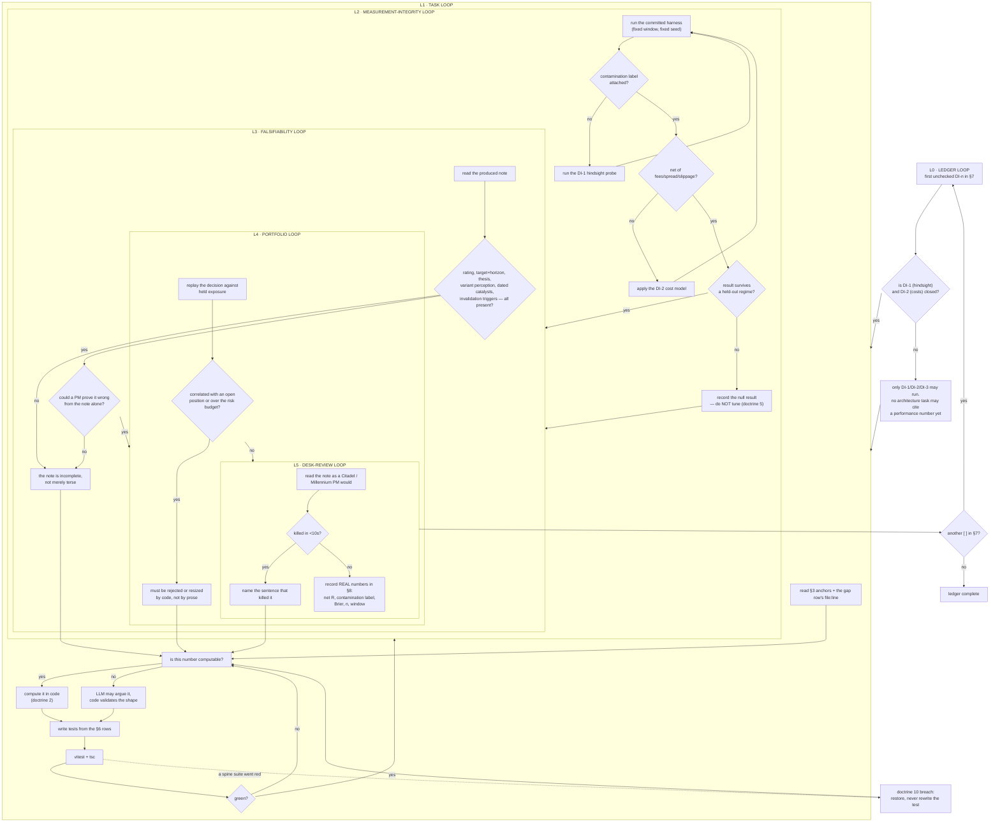

# Dexter Institutional Roadmap — orchestration to a buy-side standard

Third ledger. `docs/AI_TRADING_AGENT_ROADMAP.md` made Dexter **work** (DX-1..DX-17).
`docs/DEXTER_DESIGN_ROADMAP.md` made it **legible** (DD-1..DD-14, closed 14/14).
This one makes it **credible to a professional** — someone at a multi-manager who
reads twenty notes before lunch and kills any of them in ten seconds.

The audience test used throughout: *would a Citadel or Millennium PM act on this,
and would a Goldman research director let it out the door under their name?*

---

## 0. What the field actually found

Searched 2026-08-02. The most important result contradicts the direction this
codebase has been travelling.

> **The funds that treat LLMs as research productivity infrastructure have benefited.
> The funds that treated LLMs as alpha-generation infrastructure have not.**
> — [LLMs in Quant Research: What Actually Works in 2026](https://www.zerve.ai/blog/llms-in-quantitative-research)

The pattern institutional money has settled on is **hybrid**: classical statistical
models generate signals, and the AI layer arbitrates between them, sizes positions
and handles edge cases. Multi-agent structure mirrors a real fund — researcher forms
hypotheses, quant backtests, risk stress-tests, PM integrates — and a **Risk Manager
agent computes position limits from risk metrics** rather than asserting them in prose
([Founderland](https://www.founderland.ai/articles/the-race-to-build-fully-autonomous-ai-hedge-funds-mq6jgzt7),
[Dev|Journal](https://earezki.com/ai-news/2026-04-16-i-built-a-fully-local-ai-native-hedge-fund-system-multi-agent-auditable-no-paid-apis/)).

And the finding that invalidates our own measurements until it is controlled:

> LLM financial knowledge is **not point-in-time reliable**. A strong backtest in a
> recent window "may leak future information through **semantic memory**."
> — [Look-Ahead-Bench (arXiv 2601.13770)](https://arxiv.org/abs/2601.13770)

Related prior art to mine rather than reinvent:
[Reported Alpha from LLM Trading Agents Should Not Be Taken at Face Value](https://arxiv.org/pdf/2605.16895) ·
[Look-Ahead-Freedom as Temporal Non-Interference](https://arxiv.org/html/2607.04958v1) ·
[HindsightBench](https://arxiv.org/html/2607.18867v1) ·
[Agentic Trading: When LLM Agents Meet Financial Markets](https://arxiv.org/pdf/2605.19337) ·
[AlphaForgeBench](https://arxiv.org/pdf/2602.18481) ·
[QRAFTI](https://arxiv.org/pdf/2604.18500) ·
[FundaPod (knowledge-graph memory)](https://arxiv.org/pdf/2605.27864).

For the output standard: an institutional note leads with **rating + price target +
thesis**, and a thesis must identify *something the market is missing*. Catalysts carry
**expected timing**; risks are **concrete and falsifiable** with defined invalidation
triggers
([CFI](https://corporatefinanceinstitute.com/resources/valuation/equity-research-report/),
[M&I](https://mergersandinquisitions.com/equity-research-report/),
[Hebbia](https://www.hebbia.com/resources/equity-research-report)).

---

## 1. Gaps — audited against the current source

Read out of the code on 2026-08-02. Line references are current.

| # | Gap | Evidence | Institutional consequence |
|---|-----|----------|---------------------------|
| **G1** | **Parametric hindsight is completely uncontrolled.** The replay guards *data* leakage (`asOfBars`, `assertNoLookAhead`, `LookAheadError`) but nothing guards the model's *training memory*. | `dexterReplay.ts:1-184`; replay windows 2025-08-27 → 2026-06-13 sit inside `deepseek-v4-flash`'s plausible training range | **Every performance number in DX-15 and DX-17 may be recall, not skill.** Both replay arms went overwhelmingly short into a market that fell 44.13% — indistinguishable from a model that remembers 2026. Until this is measured, no result in either ledger may be quoted. This blocks everything. |
| **G2** | **The LLM is used as alpha generation, the one use the field says fails.** The model picks direction, entry, stop, target and size. | `dexterRisk.ts:118+` `managerPrompt` → `parsePlan`; `TradePlan.sizePct` is model-emitted | Measured result agrees with the literature: 30 decisions, floor ON +1.82R vs OFF +1.54R — indistinguishable. No edge demonstrated. The deterministic engine (`taLevels`) exists but only *decorates the prompt*; it never generates a signal. |
| **G3** | **Position size is a number the model says, not risk math.** Only `rr` is computed. | `dexterRisk.ts:33-41` — comment says "Computed here… never taken from the model" for `rr` only; `sizePct` has no such guard | No volatility targeting, no risk-budget arithmetic, no Kelly cap. A PM cannot accept a size that has no derivation. |
| **G4** | **No portfolio state.** Every decision is standalone. | `api/agent/[fn].ts:294-305` — `runRisk` receives reports + debate only | No existing exposure, no correlation gate, no portfolio heat, no drawdown constraint. Ten "BUY BTC" calls in a row are ten independent full-size decisions. This alone disqualifies the output at a multi-manager. |
| **G5** | **No cost model anywhere.** R-multiples are gross. | `dexterReplay.ts` `summariseReplay`; no fee/slippage/spread term | The n=30 floor-OFF arm took 14 trades at **+0.11R average** — almost certainly negative after commission, spread and slippage. A gross-of-costs backtest is not evidence. |
| **G6** | **Single asset, single timeframe, no cross-section, no regime.** Analysts see one symbol's 120 daily bars. | `dexterGraph.ts:78` `getChartData {days:120}`; `ANALYST_ORDER` is market/news/social/fundamentals | No relative strength versus a universe, no sector or beta context, no regime label. Professional research always positions a name against comparables and the prevailing regime. |
| **G7** | **The debate is not adversarial in substance.** Bull and bear read *identical* reports. | `dexterDebate.ts` `runDebate(ctx, reports, …)` — one `reports` array shared | Disagreement is rhetorical, not evidentiary. Neither side is required to go find the fact that would kill the other. A PM reads this as theatre. |
| **G8** | **Confidence is self-reported and never calibrated.** | `debate.confidence` parsed from model text (`dexterDebate.ts` `parseVerdict`); `dexterOutcome.ts` grades outcomes but never scores calibration | "72% confidence" that has never been checked against realised outcomes is decoration. Brier score is the standard and the journal already holds the data needed to compute it. |
| **G9** | **Analysts cannot dig.** One deterministic evidence shape, one LLM call, output clipped to 1,800 chars. | `dexterGraph.ts:63` `REPORT_MAX_CHARS = 1800`; comment at `:5-9` — "No tool-calling loop per analyst" | A deliberate, correct cost decision that now caps research depth. An analyst that finds a thread cannot pull it. |
| **G10** | **Memory is a flat journal.** | `dexterMemory.ts` `buildPastContext`/`trackRecord` over `dexterJournal` rows | No thesis persistence, no entity linking, no contradiction tracking across sessions. Prior art uses knowledge-graph memory. Dexter cannot say "this contradicts the thesis I held in March." |
| **G11** | **No standardised evaluation.** One ad-hoc replay script, uncommitted, at n=10 then n=30. | `apps/market-ui/replay.mts` (scratch, not in git) | No walk-forward protocol, no train/test temporal split, no held-out regime, no benchmark comparison. Results are not reproducible by anyone else. |
| **G12** | **Output has no institutional skeleton.** Levels block + plan block + prose. | `api/agent/[fn].ts:350-364`; `dexterBlocks.ts` `renderPlanBlock`/`renderLevelsBlock` | Missing: rating, price target with horizon, one-line thesis, **variant perception** (what the market is missing), dated catalysts, falsifiable invalidation triggers separate from the stop. A PM scans for exactly these six things. |
| **G13** | **The repo's entire macro layer is dead code.** `fredService.ts` is 745 lines including a correct FRED/ALFRED **point-in-time vintage** implementation (`realtime_start`/`realtime_end`) — and it cannot make a single successful call. | `fredService.ts:14` — `const FRED_API_KEY = import.meta.env.VITE_FRED_API_KEY \|\| 'abcdefghijklmnopqrstuvwxyz123456'`. Both `FRED_API_KEY` and `VITE_FRED_API_KEY` in `apps/market-ui/.env` are **empty strings**; neither appears in either `.env.production`. Live probe 2026-08-02: `GET /fred/series/observations?series_id=VIXCLS…` → **HTTP 400**, `"The value for variable api_key is not a 32 character alpha-numeric lower-case string"` | Two separate failures. **(a)** The placeholder-key fallback means every macro call fails silently rather than loudly — the same class of fault as the dead `VITE_GEMINI_API_KEY` that DX-1 removed, and `deepResearchService.ts:32` consumes it today. **(b)** `import.meta.env` is a Vite browser construct, so even with a valid key this file is unreachable from `api/agent/[fn].ts`. `fetchFREDVintage` is exactly the right primitive for look-ahead-free macro — and it is currently worth zero. |

**Not a gap:** the verification spine. Citations, trust grading, honest-empty handling,
the deterministic TA engine, the trace, the journal, and the DD-series presentation are
all sound. Build on them; do not refactor them.

---

## 2. Doctrine

1. **Measurement integrity precedes every architectural claim.** Until G1 and G5 are
   closed, no ledger line may cite a performance number without its contamination and
   cost label. Retro-label DX-15 and DX-17 rather than deleting them.
2. **The model never emits a number that code can compute.** Direction may be argued;
   size, stop distance, R:R, exposure and limits are arithmetic. `rr` is already right —
   extend that rule, never relax it.
3. **Hybrid, not autonomous.** Deterministic logic proposes; the LLM arbitrates, vetoes
   and explains. An LLM-only signal is not shipped.
4. **Falsifiability is mandatory.** Every thesis states what would prove it wrong, at
   what level or date. A view with no invalidation condition is not a view.
5. **Honest null results are wins.** "No edge detected at n=30" is a finding worth more
   than a tuned number. Never fit a constant until a backtest turns green.
6. **Costs are part of the result.** Report net of fees, spread and slippage, always,
   with the assumptions stated inline.
7. **Never claim an institution's standard without meeting it.** No fabricated ratings,
   no invented price targets, no borrowed brand language.
8. **Portfolio before position.** A trade is evaluated against existing exposure or not
   at all.
9. **Reproducible or it did not happen.** Every measurement ships as a committed script
   with a fixed seed, a stated window, and a recorded command line.
10. **Do not regress the spine.** Citations, trust, trace, honest-empty and the DD
    presentation contract stay green. This ledger is additive.

---

## 3. Verified anchors

| Anchor | Path | Gives you |
|--------|------|-----------|
| Deterministic TA | `src/services/taLevels.ts` (295 ln) | `taLevels(bars)` → `atr`, `trend`, `support`/`resistance` with touch counts, `fairValueGaps`, `orderBlocks`, `fib` |
| Analyst layer | `src/services/dexterGraph.ts` (247 ln) | `runAnalysts`, `citeBase`, `CITE_BLOCK=10`, `renderReports`, `REPORT_MAX_CHARS` |
| Debate | `src/services/dexterDebate.ts` (162 ln) | `runDebate`, `parseVerdict`, `clampRounds`, `renderTurns` |
| Risk | `src/services/dexterRisk.ts` (309 ln) | `RISK_ORDER`, `managerPrompt`, `parsePlan`, `TradePlan`, `MIN_STOP_ATR=1.5`, `minStopDistance`, `DISCLOSURE` |
| Replay | `src/services/dexterReplay.ts` (184 ln) | `asOfBars`, `replayAt`, `summariseReplay`, `assertNoLookAhead`, `LookAheadError`, `REPLAYABLE_ANALYSTS` |
| Journal / outcomes | `dexterJournal.ts`, `dexterOutcome.ts`, `dexterMemory.ts` | `buildEntry`, `gradeEntry`, `reflectionFor`, `gradeOpen`, `buildPastContext`, `trackRecord` |
| Budget | `src/services/dexterIntent.ts` (146 ln) | `classifyIntent`, `BUDGET`, `CallBudget`, `describeBudget` |
| Blocks | `src/services/dexterBlocks.ts` | `renderPlanBlock`, `renderLevelsBlock` — the DD-8 fenced contract the UI renders |
| Orchestrator | `api/agent/[fn].ts` (530 ln) | stage plan, trace wrapper, memory recall, analysts → debate → risk → answer |

**Exists but must be verified before reuse** — do not assume any of these work:

| Candidate | Path | Status on 2026-08-02 |
|-----------|------|----------------------|
| Macro + point-in-time vintages | `src/services/fredService.ts` (745 ln) | `MACRO_SERIES` (VIX, 10Y-2Y, HY/IG credit spreads, dollar index), `getMacroSnapshot`, `getMacroSummaryText`, **`fetchFREDVintage`** (real ALFRED `realtime_start`/`realtime_end`), BLS v2 client. **DEAD — G13.** Both keys empty, placeholder fallback, probe returns HTTP 400, and `import.meta.env` makes it browser-only. Reviving it needs a free FRED key **and** a `process.env` port. |
| Report design spec | `src/services/pdfDesigner.ts` (386 ln) | `DesignSpec`, `ReportTone`, `PullQuote`, `TableDesign`, `ExhibitStyle`, `SectionLayoutChoice`, `ALLOWED_ACCENTS`. Built for the deep-research PDF path — evaluate for DI-13 before writing a second note renderer. |
| Eval harness | `src/services/evaluation.ts` (578 ln) | `GoldenEntry`, `EvalScore`, `EvalSummary`. Built for deep research, **not** for trading. Mine its shape for DI-3; do not assume it measures anything about trades. |

---

## 4. Graph of loops

**Invariants**

- `GATE` is hard. DI-1 and DI-2 precede every architectural task, because architecture
  justified by a contaminated, gross-of-costs number is architecture built on nothing.
- L2 can exit with a **null result**. That is a pass, and it gets logged as one.
- L3 runs on every task that touches output, L4 on every task that touches sizing.
- Bounces return to `A2` (the compute-or-argue decision), never past `A1`.

---

## 5. Constraints (inherited)

- Vercel Hobby: 12 functions, `apps/market-ui/api` is full — **no new API route**, everything rides `api/agent/[fn].ts`.
- `apps/market-ui/vercel.json` `/api/*` → Fly with `(?!tn/|agent/)`; do not touch.
- Vercel Node ESM needs explicit `.js` on relative imports from `src/` reachable by `api/`.
- `erasableSyntaxOnly`: no constructor parameter properties.
- Only `DEEPSEEK_API_KEY` is live (Gemini quota-dead, Anthropic 401, Groq 401).
- Per-intent call caps in `dexterIntent.ts` `BUDGET` are binding — new agents must fit the budget or raise it explicitly in the ledger.
- Prod alias `https://market-ui-self.vercel.app`; chat body `{messages, asset:{symbol,isTN,isCrypto,name}, stream}`.
- Supabase journal needs `SUPABASE_URL` + `SUPABASE_SERVICE_ROLE_KEY`; absent ⇒ memory silently off.

---

## 6. Regression table

| # | Assertion | Where |
|---|-----------|-------|
| 1 | Hindsight probe: asked as-of date T with no data supplied, the model's recall of post-T prices is scored; the score is recorded per model and window | `hindsightProbe.test.ts` + §8 |
| 2 | Every replay summary carries a `contamination` label (`clean` / `suspect` / `contaminated`) derived from row 1; a summary without one throws | `dexterReplay.test.ts` |
| 3 | Cost model applies fee + spread + slippage per side; a zero-cost run must be explicitly requested, never the default | `dexterCosts.test.ts` |
| 4 | `summariseReplay` reports gross **and** net R; net ≤ gross for any non-zero cost | `dexterReplay.test.ts` |
| 5 | Walk-forward harness splits strictly in time, never trains on a window it tests, and refuses overlapping folds | `walkForward.test.ts` |
| 6 | Deterministic signal layer emits a direction from bars alone, with no LLM in the path | `dexterSignal.test.ts` |
| 7 | The LLM may veto or downgrade a deterministic signal but may not invert it; an inversion attempt is rejected with a reason | `dexterSignal.test.ts` |
| 8 | `sizePct` is computed from ATR, risk budget and equity; a model-supplied size is ignored and the computed one substituted | `dexterSizing.test.ts` |
| 9 | Size is capped by a Kelly fraction and a hard per-position maximum; both bounds are asserted | `dexterSizing.test.ts` |
| 10 | A new position correlated above threshold with an open one is rejected or resized by code; portfolio heat never exceeds the budget | `dexterPortfolio.test.ts` |
| 11 | Regime classifier labels each window from bars alone and is stable under one-bar perturbation | `dexterRegime.test.ts` |
| 12 | Cross-sectional rank computed against a stated universe; a symbol absent from the universe yields an honest null, never a default rank | `dexterCrossSection.test.ts` |
| 13 | Bull and bear each receive at least one piece of evidence the other does not, and each must emit ≥1 falsifiable claim | `dexterDebate.test.ts` |
| 14 | Brier score computed over journalled confidence vs realised outcomes; fewer than N resolved entries yields an honest "not yet calibrated" | `dexterCalibration.test.ts` |
| 15 | Analyst iteration budget is bounded and enforced; exceeding it truncates with a recorded reason, never silently | `dexterGraph.test.ts` |
| 16 | Thesis memory links a new call to the prior thesis on the same symbol and flags a contradiction when the stance flips without new evidence | `dexterThesis.test.ts` |
| 17 | Institutional note renders rating, target + horizon, one-line thesis, variant perception, ≥1 dated catalyst, ≥1 falsifiable invalidation trigger; a missing field renders as an explicit gap, never omitted silently | `institutionalNote.test.ts` |
| 18 | Invalidation triggers are distinct from the stop level and stated as conditions, not prices alone | `institutionalNote.test.ts` |
| 19 | Execution model applies gap risk: a stop gapped through fills at the open, not at the stop | `dexterExecution.test.ts` |
| 20 | All spine suites stay green (dexter*, taLevels, drawGate, grid*, EdgarLink) — 353 passing at ledger open | full run |
| 21 | Live prod probe returns an institutional note with every §6 row 17 field populated or explicitly gapped | §8 |

---

## 7. Ledger

**Gate: DI-1..DI-3 first. No task below DI-4 may cite a performance number until they are closed.**

- [x] **DI-1 — Hindsight audit.** Build a HindsightBench-style probe: at as-of date T, with
      no data supplied, ask the model for post-T prices/events and score recall. Label every
      replay window `clean`/`suspect`/`contaminated`. Retro-label DX-15 and DX-17 in
      `AI_TRADING_AGENT_ROADMAP.md` §8 with the result. Closes G1. Rows 1, 2.
- [x] **DI-2 — Cost model.** Fee + spread + slippage per side, applied in `summariseReplay`.
      Report gross and net. Re-score the n=30 A/B net of costs and record whether either arm
      survives. Closes G5. Rows 3, 4.
- [x] **DI-3 — Walk-forward harness.** Promote `replay.mts` into a committed, seeded script
      with strict temporal splits, non-overlapping folds, a stated universe and a recorded
      command line. Closes G11. Row 5.
- [x] **DI-4 — Deterministic signal layer.** `dexterSignal.ts`: direction proposed from
      `taLevels` output alone (trend / breakout / mean-reversion playbooks), no LLM in the
      path. The LLM may veto or downgrade, never invert. Closes G2. Rows 6, 7.
- [ ] **DI-5 — Risk-based sizing.** `dexterSizing.ts`: size from ATR, risk budget and equity,
      Kelly-capped with a hard per-position maximum. Model-supplied `sizePct` is discarded.
      Closes G3. Rows 8, 9.
- [ ] **DI-6 — Portfolio state and correlation gate.** Open positions, exposure and portfolio
      heat carried into the decision; a correlated or over-budget position is resized or
      rejected in code. Closes G4. Row 10.
- [ ] **DI-7 — Regime classifier.** Deterministic regime label from bars, gating which
      playbook DI-4 may apply. Bars-only is the required path and is **not** blocked.
      Macro-conditioned regime is a stretch goal blocked on G13: it needs a free FRED API
      key (user-only input) plus a `process.env` port of `fredService.ts`. Ship the
      bars-only classifier; ledger-note the macro extension rather than waiting. Row 11.
- [ ] **DI-8 — Cross-sectional context.** Relative strength against a stated universe, with an
      honest null off-universe. Closes G6 with DI-7. Row 12.
- [ ] **DI-9 — Adversarial debate grounding.** Bull and bear each get private evidence and must
      emit falsifiable claims. Closes G7. Row 13.
- [ ] **DI-10 — Calibration.** Brier score over journalled confidence vs realised outcomes,
      surfaced in the note and the UI; honest "not yet calibrated" below the sample floor.
      Closes G8. Row 14.
- [ ] **DI-11 — Analyst iteration budget.** A bounded tool loop per analyst so a thread can be
      pulled, with the budget enforced and truncation recorded. Closes G9. Row 15.
- [ ] **DI-12 — Thesis memory.** Persist theses per symbol, link new calls to prior ones, flag a
      stance flip with no new evidence. Closes G10. Row 16.
- [ ] **DI-13 — Institutional note.** Rating, target + horizon, one-line thesis, variant
      perception, dated catalysts, falsifiable invalidation triggers — as a `dexter-note`
      block the DD-8 renderer draws. Missing fields render as explicit gaps. Closes G12. Rows 17, 18.
- [ ] **DI-14 — Execution realism.** Gap-through fills at the open, partial fills, overnight
      risk. Row 19.
- [ ] **DI-15 — Ship and prove.** `vercel --prod`, live probe, record net R, contamination
      label, Brier, n and window in §8. Rows 20, 21.

---

## 8. Progress log

_(real numbers only — n, window, net R, contamination label, Brier, probe status codes.)_

- 2026-08-02 — Ledger opened. Gaps G1-G13 audited against `api/agent/[fn].ts` (530 ln),
  `dexterRisk.ts` (309), `dexterGraph.ts` (247), `taLevels.ts` (295), `dexterReplay.ts` (184),
  `dexterIntent.ts` (146). Field research: 9 sources, headline finding — LLMs pay off as
  research infrastructure, not as alpha generation. Prior measurements pending labels:
  DX-15 n=10 −4R gross; DX-17 A/B n=30 floor-ON +1.82R vs floor-OFF +1.54R gross,
  buy-and-hold −44.13%, **both arms unlabelled for contamination and gross of costs —
  not quotable until DI-1 and DI-2 close.** Baseline `tsc -b` 0 errors, `vitest` PASS 353.
- 2026-08-02 — Audit corrections after verifying my own claims against source (three
  roadmap assertions were checked and one was wrong). Verified true: `sizePct` is
  `num(text,'SIZE')` at `dexterRisk.ts:186` with only a `>0` check (G3 stands); `rr` is
  computed at `dexterRisk.ts:231` (doctrine 2 precedent stands); bull and bear both render
  the same array via `renderReports(reports)` at `dexterDebate.ts:78` and `:104` (G7 stands);
  no fee/spread/slippage term exists in any `dexter*` module (G5 stands); no Brier or
  calibration code in the dexter path (G8 stands). **Wrong:** the audit initially implied no
  macro or eval machinery existed. `fredService.ts` (745 ln), `pdfDesigner.ts` (386 ln) and
  `evaluation.ts` (578 ln) all exist — added to §3 as verify-before-reuse. `fredService`
  then failed its own probe: keys empty, placeholder fallback, `GET VIXCLS` vintage →
  **HTTP 400** → logged as **G13**.
- 2026-08-02 — **DI-1 closed. Replay window `2025-08-27 → 2026-06-13` is labelled
  `suspect`, by measurement rather than by assumption.** `hindsightProbe.ts` +
  `scripts/hindsight-probe.mts`, run
  `DEEPSEEK_API_KEY=… npx tsx scripts/hindsight-probe.mts` (defaults SYMBOL=BTC,
  AS_OF=2025-08-27, END=2026-06-13, CTRL 2024-01-01→2024-12-31, N=12, REPS=5;
  20 live `deepseek-v4-flash` calls, no RNG — target dates are evenly spaced in the
  window, so the command line reproduces the sample). Result, n=5 replicates:
  price channel **0/60 window closes within 2%** and **0/60 control closes** —
  every date refused in every replicate, both arms; direction channel **0/55 window
  pairs answered**; direction control cleared the sensitivity bar in **1/5**
  replicates, and in that one it was **11/11 correct (acc 1.00)** on 2024.
  Per-replicate verdicts: suspect ×5; worst-of-replicates label **suspect**.
  Reading: the model demonstrably holds 2024's path, yet never answered a single
  pair on the replay window across five tries — evidence pointing at absent memory
  of the window — but the control is sensitive in only 1/5 runs, so the
  pre-registered ladder holds the label at `suspect` (unmeasured) rather than
  `clean`. The ladder was not moved after seeing the data (doctrine 5).
  Two probe designs were discarded before this one, both recorded in the module
  header: an as-of-framed prompt ("the date is T") that made the model refuse
  post-T dates as unknowable *regardless of memory* — caught in its own
  `reasoning_content` — and a price-only probe whose control was blind, which
  would have scored a contaminated window `clean`. Single-run probing was also
  discarded: the control arm answered 11/11 on one run and 0/11 on the next at the
  same temperature, so a window's label is now the worst reading across replicates.
  `summariseReplay` takes the label as a **required argument** and throws without
  it, so no replay number can leave the file unlabelled again. Tests:
  hindsightProbe 34/34 new, dexterReplay 21/21, spine set 449 passing (up from 353
  at ledger open), full repo 944 pass / 0 fail / 7 skipped, `tsc --noEmit -p
  tsconfig.app.json` 0 errors. No UI or api function changed, so no deploy.
  Rows 1, 2 green. G1 measured; **DX-15 and DX-17 retro-labelled `suspect` and
  still gross of costs — quotable only with both labels attached until DI-2.**
- 2026-08-02 — DI-2 partial, logged before the long operation as the loop requires.
  `dexterCosts.ts` + `summariseReplay` gross/net are written and green (dexterCosts
  12/12, dexterReplay 27/27 — rows 3, 4). Cost model, probed not assumed: fee
  **10.0 bps/side** (Binance spot taker, published standard tier), half-spread
  **0.001 bps/side** (measured 2026-08-02, `GET /api/v3/ticker/bookTicker?symbol=
  BTCUSDT` → bid 63684.60 / ask 63684.61, a one-tick $0.01 spread), slippage
  **2.0 bps/side** (stated ASSUMPTION — no fill data exists for a strategy that
  has never traded); **12.001 bps per side, charged at both legs' own prices**.
  Because an R is profit over risk, friction in R scales with stop tightness: at
  BTC 70k a 1.5×ATR stop (3750) costs **0.045R** per round trip, the 0.25×ATR stop
  DX-15 measured costs **0.269R**. The n=30 A/B could not be re-scored from the
  existing record — per-trade rows were printed and discarded — so `replay.mts`
  now persists them per decision, and the A/B is being re-run: n=30 × 2 arms,
  BTC 2025-08-27 → 2026-06-13, 8 LLM calls per decision = **480 calls**, commands
  `CONTAMINATION=suspect REPLAY_N=30 [NO_FLOOR=1] npx tsx replay.mts`. Smoke test
  n=2 green (16 calls, both HOLD). Numbers land in the next entry.
- 2026-08-03 — **DI-2 closed. Neither arm survives net of costs.** A/B re-run,
  BTC **2025-08-28 → 2026-06-14**, n=30 decisions per arm, 480 live
  `deepseek-v4-flash` calls, contamination **suspect**, costs **12.001 bps/side**;
  rows persisted to `replay-floor-{on,off}.json` and re-scored by
  `npx tsx scripts/score-replay.mts replay-floor-on.json replay-floor-off.json`.

  | arm | positions | gross | net | friction | net avg | net SD | SE | mean/SE | wins net |
  |---|---|---|---|---|---|---|---|---|---|
  | floor ON (1.5×ATR) | 6 of 30 | −0.20R | **−0.39R** | 0.19R | −0.066R | 1.077 | 0.440 | **−0.15** | 3/6 |
  | floor OFF | 12 of 30 | −8.20R | **−10.17R** | 1.97R | −0.847R | 0.813 | 0.235 | **−3.61** | 2/12 |

  Buy-and-hold over the same window −41.22%. Floor ON is **indistinguishable from
  zero** (mean/SE −0.15 on 6 trades) — an honest null, not a win; floor OFF is
  **reliably negative** (mean/SE −3.61). Friction per trade tracks stop width
  exactly as the model predicts: 0.032R average with the floor on, 0.164R with it
  off — 5× — because an R shrinks as the stop tightens. Three floor-OFF trades
  paid **0.29–0.35R** in friction alone on stops under 1% of price.

  **Two prior claims fail to reproduce and are withdrawn.** (a) The DX-17 A/B
  figures (floor-ON +1.82R, floor-OFF +1.54R) did not reappear: same window, same
  n, same code path, this run returns −0.20R and −8.20R **gross**. The original
  comparison sat inside run-to-run LLM variance and never demonstrated anything.
  (b) G1's premise that "both arms went overwhelmingly short" does not hold here —
  floor-OFF opened **5 longs of 12** into the fall, which weakens, not strengthens,
  the recall hypothesis DI-1 already labelled unmeasured.
  This is a **fresh n=30 sample, not a re-score of the original trades**: those
  per-trade rows were never persisted and are unrecoverable. From here they are,
  so a re-score costs zero calls.
  Tests: dexterCosts 12/12, dexterReplay 27/27 (rows 3, 4), spine set 467, full
  repo 962 pass / 0 fail / 7 skipped, `tsc --noEmit -p tsconfig.app.json` 0 errors.
  No UI or api function changed, so no deploy. **Gate open: DI-4 onward may run,
  and every figure above carries `suspect` + net-of-12.001bps.**
- 2026-08-03 — **DI-3 closed. Walk-forward harness, and the A/B does not survive
  it either.** `walkForward.ts` generates rolling folds and throws (never warns)
  on: a fold whose test window sits inside its own train window, test windows that
  overlap each other, a missing universe, a window too short for one fold, and an
  empty fold list. `scripts/walk-forward.mts` splits the DI-2 rows and scores each
  fold, zero LLM calls, command
  `npx tsx scripts/walk-forward.mts replay-floor-on.json replay-floor-off.json`
  (defaults 90d train / 0d embargo / 60d test, universe [BTC]).
  Both arms, 3 folds each, 18 of 30 decisions land in a test window (the first 12
  fall in the opening train span and are correctly excluded from scoring):

  | arm | folds w/ trades | positive folds | net/fold mean | SD | SE | mean/SE |
  |---|---|---|---|---|---|---|
  | floor ON | 3/3 | **1** | −0.456R | 1.260 | 0.728 | **−0.63** |
  | floor OFF | 3/3 | **0** | −2.502R | 0.999 | 0.577 | **−4.34** |

  Floor ON's single positive fold (+0.99R net, one trade) is one trade in one
  window — the fold spread says nothing survives. n is small and stated as such:
  5 and 8 trades across three folds respectively.
  **Seeding, stated honestly rather than claimed:** the sampler was the harness's
  real RNG. `dexterLlm` now threads a temperature (`DEFAULT_TEMPERATURE = 0.3`
  unchanged for prod) and `replay.mts` passes **0**, so a re-run is as reproducible
  as the API allows — which is close, not bitwise, and this ledger does not claim
  a seed it does not have. Tests: walkForward 20/20 (row 5), dexterLlm 21/21
  including two new temperature-threading tests, full repo **984 pass / 0 fail /
  7 skipped**, `tsc --noEmit -p tsconfig.app.json` 0 errors (exit 0). No UI or api
  change, so no deploy. Closes G11.
- 2026-08-03 — **DI-4 closed. The signal is deterministic; the model can only
  argue with it.** `dexterSignal.ts` reads a direction out of `taLevels` alone —
  breakout (close ≥ **0.25 ATR** beyond a level with ≥ **2 touches**), else trend
  (the pivot sequence), else mean-reversion (range only, within **0.5 ATR** of a
  held level), else flat. Conviction is bounded per playbook by construction
  (breakout ≤ 0.9, trend ≤ 0.7, fade ≤ 0.6) and is **not fitted to any backtest**.
  Arbitration is four-valued and every branch records its reason: `accepted`,
  `vetoed` (model stands the trade down — allowed), `downgraded` (model cuts
  conviction — allowed), and **`inversion-rejected`** — the model argued the
  opposite direction, the deterministic direction stands, conviction is cut to
  0.5×, and the attempt is written into the reasons rather than dropped.
  Inversion is deliberately NOT folded into veto: a model that could flip a signal
  by arguing the opposite would be generating alpha through the back door, which
  is exactly G2. A model confidence **above** the signal's is not an upgrade.
  Row 6 is enforced structurally — the test parses `dexterSignal.ts`'s import
  lines and fails if `dexterLlm`, `dexterGraph`, `dexterDebate`, `dexterRisk` or
  `dexterTools` appears among them, or if `fetch(` appears anywhere in the file.
  Tests: dexterSignal 22/22 (rows 6, 7), full repo **1006 pass / 0 fail / 7
  skipped**, `tsc` 0 errors (exit 0). No UI or api change, so no deploy.
  **Wiring into `api/agent/[fn].ts` is deliberately deferred to DI-15**: DI-5
  sizing, DI-6 portfolio state and DI-9 debate grounding all modify the same call
  site, and wiring each one separately would ship a half-assembled chain three
  times. Closes G2 at the layer; the live path changes once, at the ship.
