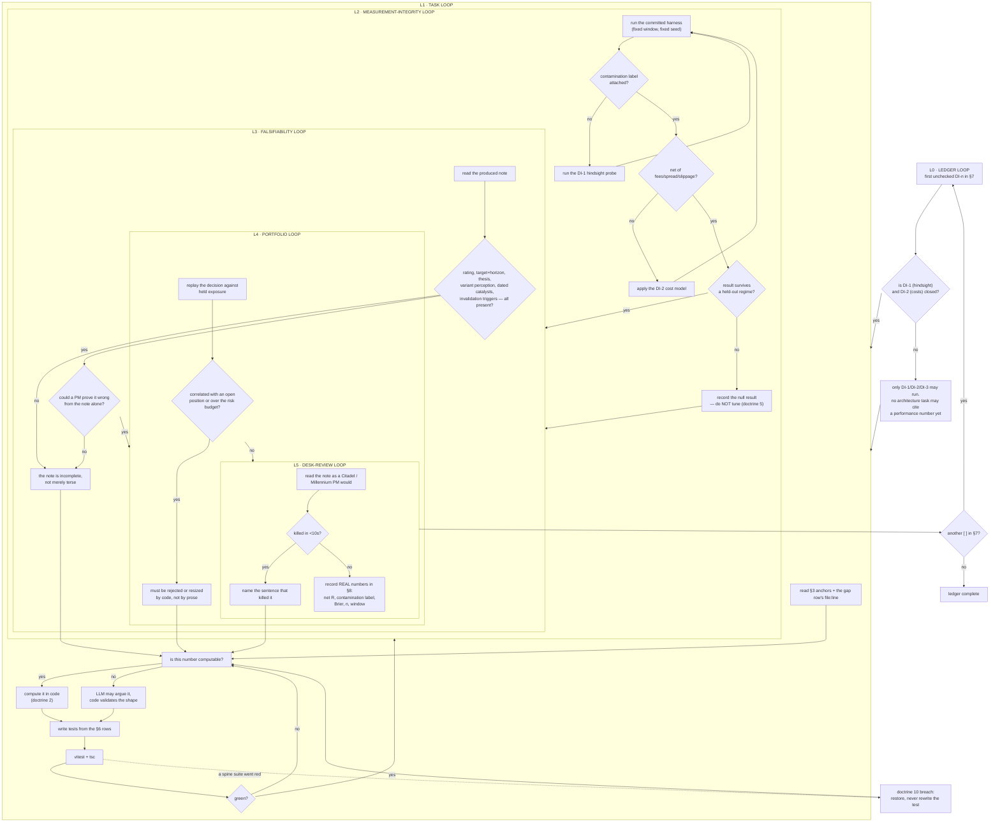

# Dexter Institutional Roadmap — orchestration to a buy-side standard

Third ledger. `docs/AI_TRADING_AGENT_ROADMAP.md` made Dexter **work** (DX-1..DX-17).
`docs/DEXTER_DESIGN_ROADMAP.md` made it **legible** (DD-1..DD-14, closed 14/14).
This one makes it **credible to a professional** — someone at a multi-manager who
reads twenty notes before lunch and kills any of them in ten seconds.

The audience test used throughout: *would a Citadel or Millennium PM act on this,
and would a Goldman research director let it out the door under their name?*

---

## 0. What the field actually found

Searched 2026-08-02. The most important result contradicts the direction this
codebase has been travelling.

> **The funds that treat LLMs as research productivity infrastructure have benefited.
> The funds that treated LLMs as alpha-generation infrastructure have not.**
> — [LLMs in Quant Research: What Actually Works in 2026](https://www.zerve.ai/blog/llms-in-quantitative-research)

The pattern institutional money has settled on is **hybrid**: classical statistical
models generate signals, and the AI layer arbitrates between them, sizes positions
and handles edge cases. Multi-agent structure mirrors a real fund — researcher forms
hypotheses, quant backtests, risk stress-tests, PM integrates — and a **Risk Manager
agent computes position limits from risk metrics** rather than asserting them in prose
([Founderland](https://www.founderland.ai/articles/the-race-to-build-fully-autonomous-ai-hedge-funds-mq6jgzt7),
[Dev|Journal](https://earezki.com/ai-news/2026-04-16-i-built-a-fully-local-ai-native-hedge-fund-system-multi-agent-auditable-no-paid-apis/)).

And the finding that invalidates our own measurements until it is controlled:

> LLM financial knowledge is **not point-in-time reliable**. A strong backtest in a
> recent window "may leak future information through **semantic memory**."
> — [Look-Ahead-Bench (arXiv 2601.13770)](https://arxiv.org/abs/2601.13770)

Related prior art to mine rather than reinvent:
[Reported Alpha from LLM Trading Agents Should Not Be Taken at Face Value](https://arxiv.org/pdf/2605.16895) ·
[Look-Ahead-Freedom as Temporal Non-Interference](https://arxiv.org/html/2607.04958v1) ·
[HindsightBench](https://arxiv.org/html/2607.18867v1) ·
[Agentic Trading: When LLM Agents Meet Financial Markets](https://arxiv.org/pdf/2605.19337) ·
[AlphaForgeBench](https://arxiv.org/pdf/2602.18481) ·
[QRAFTI](https://arxiv.org/pdf/2604.18500) ·
[FundaPod (knowledge-graph memory)](https://arxiv.org/pdf/2605.27864).

For the output standard: an institutional note leads with **rating + price target +
thesis**, and a thesis must identify *something the market is missing*. Catalysts carry
**expected timing**; risks are **concrete and falsifiable** with defined invalidation
triggers
([CFI](https://corporatefinanceinstitute.com/resources/valuation/equity-research-report/),
[M&I](https://mergersandinquisitions.com/equity-research-report/),
[Hebbia](https://www.hebbia.com/resources/equity-research-report)).

---

## 1. Gaps — audited against the current source

Read out of the code on 2026-08-02. Line references are current.

| # | Gap | Evidence | Institutional consequence |
|---|-----|----------|---------------------------|
| **G1** | **Parametric hindsight is completely uncontrolled.** The replay guards *data* leakage (`asOfBars`, `assertNoLookAhead`, `LookAheadError`) but nothing guards the model's *training memory*. | `dexterReplay.ts:1-184`; replay windows 2025-08-27 → 2026-06-13 sit inside `deepseek-v4-flash`'s plausible training range | **Every performance number in DX-15 and DX-17 may be recall, not skill.** Both replay arms went overwhelmingly short into a market that fell 44.13% — indistinguishable from a model that remembers 2026. Until this is measured, no result in either ledger may be quoted. This blocks everything. |
| **G2** | **The LLM is used as alpha generation, the one use the field says fails.** The model picks direction, entry, stop, target and size. | `dexterRisk.ts:118+` `managerPrompt` → `parsePlan`; `TradePlan.sizePct` is model-emitted | Measured result agrees with the literature: 30 decisions, floor ON +1.82R vs OFF +1.54R — indistinguishable. No edge demonstrated. The deterministic engine (`taLevels`) exists but only *decorates the prompt*; it never generates a signal. |
| **G3** | **Position size is a number the model says, not risk math.** Only `rr` is computed. | `dexterRisk.ts:33-41` — comment says "Computed here… never taken from the model" for `rr` only; `sizePct` has no such guard | No volatility targeting, no risk-budget arithmetic, no Kelly cap. A PM cannot accept a size that has no derivation. |
| **G4** | **No portfolio state.** Every decision is standalone. | `api/agent/[fn].ts:294-305` — `runRisk` receives reports + debate only | No existing exposure, no correlation gate, no portfolio heat, no drawdown constraint. Ten "BUY BTC" calls in a row are ten independent full-size decisions. This alone disqualifies the output at a multi-manager. |
| **G5** | **No cost model anywhere.** R-multiples are gross. | `dexterReplay.ts` `summariseReplay`; no fee/slippage/spread term | The n=30 floor-OFF arm took 14 trades at **+0.11R average** — almost certainly negative after commission, spread and slippage. A gross-of-costs backtest is not evidence. |
| **G6** | **Single asset, single timeframe, no cross-section, no regime.** Analysts see one symbol's 120 daily bars. | `dexterGraph.ts:78` `getChartData {days:120}`; `ANALYST_ORDER` is market/news/social/fundamentals | No relative strength versus a universe, no sector or beta context, no regime label. Professional research always positions a name against comparables and the prevailing regime. |
| **G7** | **The debate is not adversarial in substance.** Bull and bear read *identical* reports. | `dexterDebate.ts` `runDebate(ctx, reports, …)` — one `reports` array shared | Disagreement is rhetorical, not evidentiary. Neither side is required to go find the fact that would kill the other. A PM reads this as theatre. |
| **G8** | **Confidence is self-reported and never calibrated.** | `debate.confidence` parsed from model text (`dexterDebate.ts` `parseVerdict`); `dexterOutcome.ts` grades outcomes but never scores calibration | "72% confidence" that has never been checked against realised outcomes is decoration. Brier score is the standard and the journal already holds the data needed to compute it. |
| **G9** | **Analysts cannot dig.** One deterministic evidence shape, one LLM call, output clipped to 1,800 chars. | `dexterGraph.ts:63` `REPORT_MAX_CHARS = 1800`; comment at `:5-9` — "No tool-calling loop per analyst" | A deliberate, correct cost decision that now caps research depth. An analyst that finds a thread cannot pull it. |
| **G10** | **Memory is a flat journal.** | `dexterMemory.ts` `buildPastContext`/`trackRecord` over `dexterJournal` rows | No thesis persistence, no entity linking, no contradiction tracking across sessions. Prior art uses knowledge-graph memory. Dexter cannot say "this contradicts the thesis I held in March." |
| **G11** | **No standardised evaluation.** One ad-hoc replay script, uncommitted, at n=10 then n=30. | `apps/market-ui/replay.mts` (scratch, not in git) | No walk-forward protocol, no train/test temporal split, no held-out regime, no benchmark comparison. Results are not reproducible by anyone else. |
| **G12** | **Output has no institutional skeleton.** Levels block + plan block + prose. | `api/agent/[fn].ts:350-364`; `dexterBlocks.ts` `renderPlanBlock`/`renderLevelsBlock` | Missing: rating, price target with horizon, one-line thesis, **variant perception** (what the market is missing), dated catalysts, falsifiable invalidation triggers separate from the stop. A PM scans for exactly these six things. |
| **G13** | **The repo's entire macro layer is dead code.** `fredService.ts` is 745 lines including a correct FRED/ALFRED **point-in-time vintage** implementation (`realtime_start`/`realtime_end`) — and it cannot make a single successful call. | `fredService.ts:14` — `const FRED_API_KEY = import.meta.env.VITE_FRED_API_KEY \|\| 'abcdefghijklmnopqrstuvwxyz123456'`. Both `FRED_API_KEY` and `VITE_FRED_API_KEY` in `apps/market-ui/.env` are **empty strings**; neither appears in either `.env.production`. Live probe 2026-08-02: `GET /fred/series/observations?series_id=VIXCLS…` → **HTTP 400**, `"The value for variable api_key is not a 32 character alpha-numeric lower-case string"` | Two separate failures. **(a)** The placeholder-key fallback means every macro call fails silently rather than loudly — the same class of fault as the dead `VITE_GEMINI_API_KEY` that DX-1 removed, and `deepResearchService.ts:32` consumes it today. **(b)** `import.meta.env` is a Vite browser construct, so even with a valid key this file is unreachable from `api/agent/[fn].ts`. `fetchFREDVintage` is exactly the right primitive for look-ahead-free macro — and it is currently worth zero. |

**Not a gap:** the verification spine. Citations, trust grading, honest-empty handling,
the deterministic TA engine, the trace, the journal, and the DD-series presentation are
all sound. Build on them; do not refactor them.

---

## 2. Doctrine

1. **Measurement integrity precedes every architectural claim.** Until G1 and G5 are
   closed, no ledger line may cite a performance number without its contamination and
   cost label. Retro-label DX-15 and DX-17 rather than deleting them.
2. **The model never emits a number that code can compute.** Direction may be argued;
   size, stop distance, R:R, exposure and limits are arithmetic. `rr` is already right —
   extend that rule, never relax it.
3. **Hybrid, not autonomous.** Deterministic logic proposes; the LLM arbitrates, vetoes
   and explains. An LLM-only signal is not shipped.
4. **Falsifiability is mandatory.** Every thesis states what would prove it wrong, at
   what level or date. A view with no invalidation condition is not a view.
5. **Honest null results are wins.** "No edge detected at n=30" is a finding worth more
   than a tuned number. Never fit a constant until a backtest turns green.
6. **Costs are part of the result.** Report net of fees, spread and slippage, always,
   with the assumptions stated inline.
7. **Never claim an institution's standard without meeting it.** No fabricated ratings,
   no invented price targets, no borrowed brand language.
8. **Portfolio before position.** A trade is evaluated against existing exposure or not
   at all.
9. **Reproducible or it did not happen.** Every measurement ships as a committed script
   with a fixed seed, a stated window, and a recorded command line.
10. **Do not regress the spine.** Citations, trust, trace, honest-empty and the DD
    presentation contract stay green. This ledger is additive.

---

## 3. Verified anchors

| Anchor | Path | Gives you |
|--------|------|-----------|
| Deterministic TA | `src/services/taLevels.ts` (295 ln) | `taLevels(bars)` → `atr`, `trend`, `support`/`resistance` with touch counts, `fairValueGaps`, `orderBlocks`, `fib` |
| Analyst layer | `src/services/dexterGraph.ts` (247 ln) | `runAnalysts`, `citeBase`, `CITE_BLOCK=10`, `renderReports`, `REPORT_MAX_CHARS` |
| Debate | `src/services/dexterDebate.ts` (162 ln) | `runDebate`, `parseVerdict`, `clampRounds`, `renderTurns` |
| Risk | `src/services/dexterRisk.ts` (309 ln) | `RISK_ORDER`, `managerPrompt`, `parsePlan`, `TradePlan`, `MIN_STOP_ATR=1.5`, `minStopDistance`, `DISCLOSURE` |
| Replay | `src/services/dexterReplay.ts` (184 ln) | `asOfBars`, `replayAt`, `summariseReplay`, `assertNoLookAhead`, `LookAheadError`, `REPLAYABLE_ANALYSTS` |
| Journal / outcomes | `dexterJournal.ts`, `dexterOutcome.ts`, `dexterMemory.ts` | `buildEntry`, `gradeEntry`, `reflectionFor`, `gradeOpen`, `buildPastContext`, `trackRecord` |
| Budget | `src/services/dexterIntent.ts` (146 ln) | `classifyIntent`, `BUDGET`, `CallBudget`, `describeBudget` |
| Blocks | `src/services/dexterBlocks.ts` | `renderPlanBlock`, `renderLevelsBlock` — the DD-8 fenced contract the UI renders |
| Orchestrator | `api/agent/[fn].ts` (530 ln) | stage plan, trace wrapper, memory recall, analysts → debate → risk → answer |

**Exists but must be verified before reuse** — do not assume any of these work:

| Candidate | Path | Status on 2026-08-02 |
|-----------|------|----------------------|
| Macro + point-in-time vintages | `src/services/fredService.ts` (745 ln) | `MACRO_SERIES` (VIX, 10Y-2Y, HY/IG credit spreads, dollar index), `getMacroSnapshot`, `getMacroSummaryText`, **`fetchFREDVintage`** (real ALFRED `realtime_start`/`realtime_end`), BLS v2 client. **DEAD — G13.** Both keys empty, placeholder fallback, probe returns HTTP 400, and `import.meta.env` makes it browser-only. Reviving it needs a free FRED key **and** a `process.env` port. |
| Report design spec | `src/services/pdfDesigner.ts` (386 ln) | `DesignSpec`, `ReportTone`, `PullQuote`, `TableDesign`, `ExhibitStyle`, `SectionLayoutChoice`, `ALLOWED_ACCENTS`. Built for the deep-research PDF path — evaluate for DI-13 before writing a second note renderer. |
| Eval harness | `src/services/evaluation.ts` (578 ln) | `GoldenEntry`, `EvalScore`, `EvalSummary`. Built for deep research, **not** for trading. Mine its shape for DI-3; do not assume it measures anything about trades. |

---

## 4. Graph of loops

**Invariants**

- `GATE` is hard. DI-1 and DI-2 precede every architectural task, because architecture
  justified by a contaminated, gross-of-costs number is architecture built on nothing.
- L2 can exit with a **null result**. That is a pass, and it gets logged as one.
- L3 runs on every task that touches output, L4 on every task that touches sizing.
- Bounces return to `A2` (the compute-or-argue decision), never past `A1`.

---

## 5. Constraints (inherited)

- Vercel Hobby: 12 functions, `apps/market-ui/api` is full — **no new API route**, everything rides `api/agent/[fn].ts`.
- `apps/market-ui/vercel.json` `/api/*` → Fly with `(?!tn/|agent/)`; do not touch.
- Vercel Node ESM needs explicit `.js` on relative imports from `src/` reachable by `api/`.
- `erasableSyntaxOnly`: no constructor parameter properties.
- Only `DEEPSEEK_API_KEY` is live (Gemini quota-dead, Anthropic 401, Groq 401).
- Per-intent call caps in `dexterIntent.ts` `BUDGET` are binding — new agents must fit the budget or raise it explicitly in the ledger.
- Prod alias `https://market-ui-self.vercel.app`; chat body `{messages, asset:{symbol,isTN,isCrypto,name}, stream}`.
- Supabase journal needs `SUPABASE_URL` + `SUPABASE_SERVICE_ROLE_KEY`; absent ⇒ memory silently off.

---

## 6. Regression table

| # | Assertion | Where |
|---|-----------|-------|
| 1 | Hindsight probe: asked as-of date T with no data supplied, the model's recall of post-T prices is scored; the score is recorded per model and window | `hindsightProbe.test.ts` + §8 |
| 2 | Every replay summary carries a `contamination` label (`clean` / `suspect` / `contaminated`) derived from row 1; a summary without one throws | `dexterReplay.test.ts` |
| 3 | Cost model applies fee + spread + slippage per side; a zero-cost run must be explicitly requested, never the default | `dexterCosts.test.ts` |
| 4 | `summariseReplay` reports gross **and** net R; net ≤ gross for any non-zero cost | `dexterReplay.test.ts` |
| 5 | Walk-forward harness splits strictly in time, never trains on a window it tests, and refuses overlapping folds | `walkForward.test.ts` |
| 6 | Deterministic signal layer emits a direction from bars alone, with no LLM in the path | `dexterSignal.test.ts` |
| 7 | The LLM may veto or downgrade a deterministic signal but may not invert it; an inversion attempt is rejected with a reason | `dexterSignal.test.ts` |
| 8 | `sizePct` is computed from ATR, risk budget and equity; a model-supplied size is ignored and the computed one substituted | `dexterSizing.test.ts` |
| 9 | Size is capped by a Kelly fraction and a hard per-position maximum; both bounds are asserted | `dexterSizing.test.ts` |
| 10 | A new position correlated above threshold with an open one is rejected or resized by code; portfolio heat never exceeds the budget | `dexterPortfolio.test.ts` |
| 11 | Regime classifier labels each window from bars alone and is stable under one-bar perturbation | `dexterRegime.test.ts` |
| 12 | Cross-sectional rank computed against a stated universe; a symbol absent from the universe yields an honest null, never a default rank | `dexterCrossSection.test.ts` |
| 13 | Bull and bear each receive at least one piece of evidence the other does not, and each must emit ≥1 falsifiable claim | `dexterDebate.test.ts` |
| 14 | Brier score computed over journalled confidence vs realised outcomes; fewer than N resolved entries yields an honest "not yet calibrated" | `dexterCalibration.test.ts` |
| 15 | Analyst iteration budget is bounded and enforced; exceeding it truncates with a recorded reason, never silently | `dexterGraph.test.ts` |
| 16 | Thesis memory links a new call to the prior thesis on the same symbol and flags a contradiction when the stance flips without new evidence | `dexterThesis.test.ts` |
| 17 | Institutional note renders rating, target + horizon, one-line thesis, variant perception, ≥1 dated catalyst, ≥1 falsifiable invalidation trigger; a missing field renders as an explicit gap, never omitted silently | `institutionalNote.test.ts` |
| 18 | Invalidation triggers are distinct from the stop level and stated as conditions, not prices alone | `institutionalNote.test.ts` |
| 19 | Execution model applies gap risk: a stop gapped through fills at the open, not at the stop | `dexterExecution.test.ts` |
| 20 | All spine suites stay green (dexter*, taLevels, drawGate, grid*, EdgarLink) — 353 passing at ledger open | full run |
| 21 | Live prod probe returns an institutional note with every §6 row 17 field populated or explicitly gapped | §8 |

---

## 7. Ledger

**Gate: DI-1..DI-3 first. No task below DI-4 may cite a performance number until they are closed.**

- [x] **DI-1 — Hindsight audit.** Build a HindsightBench-style probe: at as-of date T, with
      no data supplied, ask the model for post-T prices/events and score recall. Label every
      replay window `clean`/`suspect`/`contaminated`. Retro-label DX-15 and DX-17 in
      `AI_TRADING_AGENT_ROADMAP.md` §8 with the result. Closes G1. Rows 1, 2.
- [x] **DI-2 — Cost model.** Fee + spread + slippage per side, applied in `summariseReplay`.
      Report gross and net. Re-score the n=30 A/B net of costs and record whether either arm
      survives. Closes G5. Rows 3, 4.
- [x] **DI-3 — Walk-forward harness.** Promote `replay.mts` into a committed, seeded script
      with strict temporal splits, non-overlapping folds, a stated universe and a recorded
      command line. Closes G11. Row 5.
- [x] **DI-4 — Deterministic signal layer.** `dexterSignal.ts`: direction proposed from
      `taLevels` output alone (trend / breakout / mean-reversion playbooks), no LLM in the
      path. The LLM may veto or downgrade, never invert. Closes G2. Rows 6, 7.
- [x] **DI-5 — Risk-based sizing.** `dexterSizing.ts`: size from ATR, risk budget and equity,
      Kelly-capped with a hard per-position maximum. Model-supplied `sizePct` is discarded.
      Closes G3. Rows 8, 9.
- [x] **DI-6 — Portfolio state and correlation gate.** Open positions, exposure and portfolio
      heat carried into the decision; a correlated or over-budget position is resized or
      rejected in code. Closes G4. Row 10.
- [x] **DI-7 — Regime classifier.** Deterministic regime label from bars, gating which
      playbook DI-4 may apply. Bars-only is the required path and is **not** blocked.
      Macro-conditioned regime is a stretch goal blocked on G13: it needs a free FRED API
      key (user-only input) plus a `process.env` port of `fredService.ts`. Ship the
      bars-only classifier; ledger-note the macro extension rather than waiting. Row 11.
- [x] **DI-8 — Cross-sectional context.** Relative strength against a stated universe, with an
      honest null off-universe. Closes G6 with DI-7. Row 12.
- [x] **DI-9 — Adversarial debate grounding.** Bull and bear each get private evidence and must
      emit falsifiable claims. Closes G7. Row 13.
- [x] **DI-10 — Calibration.** Brier score over journalled confidence vs realised outcomes,
      surfaced in the note and the UI; honest "not yet calibrated" below the sample floor.
      Closes G8. Row 14.
- [x] **DI-11 — Analyst iteration budget.** A bounded tool loop per analyst so a thread can be
      pulled, with the budget enforced and truncation recorded. Closes G9. Row 15.
- [x] **DI-12 — Thesis memory.** Persist theses per symbol, link new calls to prior ones, flag a
      stance flip with no new evidence. Closes G10. Row 16.
- [x] **DI-13 — Institutional note.** Rating, target + horizon, one-line thesis, variant
      perception, dated catalysts, falsifiable invalidation triggers — as a `dexter-note`
      block the DD-8 renderer draws. Missing fields render as explicit gaps. Closes G12. Rows 17, 18.
- [x] **DI-14 — Execution realism.** Gap-through fills at the open, partial fills, overnight
      risk. Row 19.
- [x] **DI-15 — Ship and prove.** `vercel --prod`, live probe, record net R, contamination
      label, Brier, n and window in §8. Rows 20, 21.

---

## 8. Progress log

_(real numbers only — n, window, net R, contamination label, Brier, probe status codes.)_

- 2026-08-02 — Ledger opened. Gaps G1-G13 audited against `api/agent/[fn].ts` (530 ln),
  `dexterRisk.ts` (309), `dexterGraph.ts` (247), `taLevels.ts` (295), `dexterReplay.ts` (184),
  `dexterIntent.ts` (146). Field research: 9 sources, headline finding — LLMs pay off as
  research infrastructure, not as alpha generation. Prior measurements pending labels:
  DX-15 n=10 −4R gross; DX-17 A/B n=30 floor-ON +1.82R vs floor-OFF +1.54R gross,
  buy-and-hold −44.13%, **both arms unlabelled for contamination and gross of costs —
  not quotable until DI-1 and DI-2 close.** Baseline `tsc -b` 0 errors, `vitest` PASS 353.
- 2026-08-02 — Audit corrections after verifying my own claims against source (three
  roadmap assertions were checked and one was wrong). Verified true: `sizePct` is
  `num(text,'SIZE')` at `dexterRisk.ts:186` with only a `>0` check (G3 stands); `rr` is
  computed at `dexterRisk.ts:231` (doctrine 2 precedent stands); bull and bear both render
  the same array via `renderReports(reports)` at `dexterDebate.ts:78` and `:104` (G7 stands);
  no fee/spread/slippage term exists in any `dexter*` module (G5 stands); no Brier or
  calibration code in the dexter path (G8 stands). **Wrong:** the audit initially implied no
  macro or eval machinery existed. `fredService.ts` (745 ln), `pdfDesigner.ts` (386 ln) and
  `evaluation.ts` (578 ln) all exist — added to §3 as verify-before-reuse. `fredService`
  then failed its own probe: keys empty, placeholder fallback, `GET VIXCLS` vintage →
  **HTTP 400** → logged as **G13**.
- 2026-08-02 — **DI-1 closed. Replay window `2025-08-27 → 2026-06-13` is labelled
  `suspect`, by measurement rather than by assumption.** `hindsightProbe.ts` +
  `scripts/hindsight-probe.mts`, run
  `DEEPSEEK_API_KEY=… npx tsx scripts/hindsight-probe.mts` (defaults SYMBOL=BTC,
  AS_OF=2025-08-27, END=2026-06-13, CTRL 2024-01-01→2024-12-31, N=12, REPS=5;
  20 live `deepseek-v4-flash` calls, no RNG — target dates are evenly spaced in the
  window, so the command line reproduces the sample). Result, n=5 replicates:
  price channel **0/60 window closes within 2%** and **0/60 control closes** —
  every date refused in every replicate, both arms; direction channel **0/55 window
  pairs answered**; direction control cleared the sensitivity bar in **1/5**
  replicates, and in that one it was **11/11 correct (acc 1.00)** on 2024.
  Per-replicate verdicts: suspect ×5; worst-of-replicates label **suspect**.
  Reading: the model demonstrably holds 2024's path, yet never answered a single
  pair on the replay window across five tries — evidence pointing at absent memory
  of the window — but the control is sensitive in only 1/5 runs, so the
  pre-registered ladder holds the label at `suspect` (unmeasured) rather than
  `clean`. The ladder was not moved after seeing the data (doctrine 5).
  Two probe designs were discarded before this one, both recorded in the module
  header: an as-of-framed prompt ("the date is T") that made the model refuse
  post-T dates as unknowable *regardless of memory* — caught in its own
  `reasoning_content` — and a price-only probe whose control was blind, which
  would have scored a contaminated window `clean`. Single-run probing was also
  discarded: the control arm answered 11/11 on one run and 0/11 on the next at the
  same temperature, so a window's label is now the worst reading across replicates.
  `summariseReplay` takes the label as a **required argument** and throws without
  it, so no replay number can leave the file unlabelled again. Tests:
  hindsightProbe 34/34 new, dexterReplay 21/21, spine set 449 passing (up from 353
  at ledger open), full repo 944 pass / 0 fail / 7 skipped, `tsc --noEmit -p
  tsconfig.app.json` 0 errors. No UI or api function changed, so no deploy.
  Rows 1, 2 green. G1 measured; **DX-15 and DX-17 retro-labelled `suspect` and
  still gross of costs — quotable only with both labels attached until DI-2.**
- 2026-08-02 — DI-2 partial, logged before the long operation as the loop requires.
  `dexterCosts.ts` + `summariseReplay` gross/net are written and green (dexterCosts
  12/12, dexterReplay 27/27 — rows 3, 4). Cost model, probed not assumed: fee
  **10.0 bps/side** (Binance spot taker, published standard tier), half-spread
  **0.001 bps/side** (measured 2026-08-02, `GET /api/v3/ticker/bookTicker?symbol=
  BTCUSDT` → bid 63684.60 / ask 63684.61, a one-tick $0.01 spread), slippage
  **2.0 bps/side** (stated ASSUMPTION — no fill data exists for a strategy that
  has never traded); **12.001 bps per side, charged at both legs' own prices**.
  Because an R is profit over risk, friction in R scales with stop tightness: at
  BTC 70k a 1.5×ATR stop (3750) costs **0.045R** per round trip, the 0.25×ATR stop
  DX-15 measured costs **0.269R**. The n=30 A/B could not be re-scored from the
  existing record — per-trade rows were printed and discarded — so `replay.mts`
  now persists them per decision, and the A/B is being re-run: n=30 × 2 arms,
  BTC 2025-08-27 → 2026-06-13, 8 LLM calls per decision = **480 calls**, commands
  `CONTAMINATION=suspect REPLAY_N=30 [NO_FLOOR=1] npx tsx replay.mts`. Smoke test
  n=2 green (16 calls, both HOLD). Numbers land in the next entry.
- 2026-08-03 — **DI-2 closed. Neither arm survives net of costs.** A/B re-run,
  BTC **2025-08-28 → 2026-06-14**, n=30 decisions per arm, 480 live
  `deepseek-v4-flash` calls, contamination **suspect**, costs **12.001 bps/side**;
  rows persisted to `replay-floor-{on,off}.json` and re-scored by
  `npx tsx scripts/score-replay.mts replay-floor-on.json replay-floor-off.json`.

  | arm | positions | gross | net | friction | net avg | net SD | SE | mean/SE | wins net |
  |---|---|---|---|---|---|---|---|---|---|
  | floor ON (1.5×ATR) | 6 of 30 | −0.20R | **−0.39R** | 0.19R | −0.066R | 1.077 | 0.440 | **−0.15** | 3/6 |
  | floor OFF | 12 of 30 | −8.20R | **−10.17R** | 1.97R | −0.847R | 0.813 | 0.235 | **−3.61** | 2/12 |

  Buy-and-hold over the same window −41.22%. Floor ON is **indistinguishable from
  zero** (mean/SE −0.15 on 6 trades) — an honest null, not a win; floor OFF is
  **reliably negative** (mean/SE −3.61). Friction per trade tracks stop width
  exactly as the model predicts: 0.032R average with the floor on, 0.164R with it
  off — 5× — because an R shrinks as the stop tightens. Three floor-OFF trades
  paid **0.29–0.35R** in friction alone on stops under 1% of price.

  **Two prior claims fail to reproduce and are withdrawn.** (a) The DX-17 A/B
  figures (floor-ON +1.82R, floor-OFF +1.54R) did not reappear: same window, same
  n, same code path, this run returns −0.20R and −8.20R **gross**. The original
  comparison sat inside run-to-run LLM variance and never demonstrated anything.
  (b) G1's premise that "both arms went overwhelmingly short" does not hold here —
  floor-OFF opened **5 longs of 12** into the fall, which weakens, not strengthens,
  the recall hypothesis DI-1 already labelled unmeasured.
  This is a **fresh n=30 sample, not a re-score of the original trades**: those
  per-trade rows were never persisted and are unrecoverable. From here they are,
  so a re-score costs zero calls.
  Tests: dexterCosts 12/12, dexterReplay 27/27 (rows 3, 4), spine set 467, full
  repo 962 pass / 0 fail / 7 skipped, `tsc --noEmit -p tsconfig.app.json` 0 errors.
  No UI or api function changed, so no deploy. **Gate open: DI-4 onward may run,
  and every figure above carries `suspect` + net-of-12.001bps.**
- 2026-08-03 — **DI-3 closed. Walk-forward harness, and the A/B does not survive
  it either.** `walkForward.ts` generates rolling folds and throws (never warns)
  on: a fold whose test window sits inside its own train window, test windows that
  overlap each other, a missing universe, a window too short for one fold, and an
  empty fold list. `scripts/walk-forward.mts` splits the DI-2 rows and scores each
  fold, zero LLM calls, command
  `npx tsx scripts/walk-forward.mts replay-floor-on.json replay-floor-off.json`
  (defaults 90d train / 0d embargo / 60d test, universe [BTC]).
  Both arms, 3 folds each, 18 of 30 decisions land in a test window (the first 12
  fall in the opening train span and are correctly excluded from scoring):

  | arm | folds w/ trades | positive folds | net/fold mean | SD | SE | mean/SE |
  |---|---|---|---|---|---|---|
  | floor ON | 3/3 | **1** | −0.456R | 1.260 | 0.728 | **−0.63** |
  | floor OFF | 3/3 | **0** | −2.502R | 0.999 | 0.577 | **−4.34** |

  Floor ON's single positive fold (+0.99R net, one trade) is one trade in one
  window — the fold spread says nothing survives. n is small and stated as such:
  5 and 8 trades across three folds respectively.
  **Seeding, stated honestly rather than claimed:** the sampler was the harness's
  real RNG. `dexterLlm` now threads a temperature (`DEFAULT_TEMPERATURE = 0.3`
  unchanged for prod) and `replay.mts` passes **0**, so a re-run is as reproducible
  as the API allows — which is close, not bitwise, and this ledger does not claim
  a seed it does not have. Tests: walkForward 20/20 (row 5), dexterLlm 21/21
  including two new temperature-threading tests, full repo **984 pass / 0 fail /
  7 skipped**, `tsc --noEmit -p tsconfig.app.json` 0 errors (exit 0). No UI or api
  change, so no deploy. Closes G11.
- 2026-08-03 — **DI-4 closed. The signal is deterministic; the model can only
  argue with it.** `dexterSignal.ts` reads a direction out of `taLevels` alone —
  breakout (close ≥ **0.25 ATR** beyond a level with ≥ **2 touches**), else trend
  (the pivot sequence), else mean-reversion (range only, within **0.5 ATR** of a
  held level), else flat. Conviction is bounded per playbook by construction
  (breakout ≤ 0.9, trend ≤ 0.7, fade ≤ 0.6) and is **not fitted to any backtest**.
  Arbitration is four-valued and every branch records its reason: `accepted`,
  `vetoed` (model stands the trade down — allowed), `downgraded` (model cuts
  conviction — allowed), and **`inversion-rejected`** — the model argued the
  opposite direction, the deterministic direction stands, conviction is cut to
  0.5×, and the attempt is written into the reasons rather than dropped.
  Inversion is deliberately NOT folded into veto: a model that could flip a signal
  by arguing the opposite would be generating alpha through the back door, which
  is exactly G2. A model confidence **above** the signal's is not an upgrade.
  Row 6 is enforced structurally — the test parses `dexterSignal.ts`'s import
  lines and fails if `dexterLlm`, `dexterGraph`, `dexterDebate`, `dexterRisk` or
  `dexterTools` appears among them, or if `fetch(` appears anywhere in the file.
  Tests: dexterSignal 22/22 (rows 6, 7), full repo **1006 pass / 0 fail / 7
  skipped**, `tsc` 0 errors (exit 0). No UI or api change, so no deploy.
  **Wiring into `api/agent/[fn].ts` is deliberately deferred to DI-15**: DI-5
  sizing, DI-6 portfolio state and DI-9 debate grounding all modify the same call
  site, and wiring each one separately would ship a half-assembled chain three
  times. Closes G2 at the layer; the live path changes once, at the ship.
- 2026-08-03 — **DI-5 closed. Size is arithmetic now, and the model's number is
  thrown away.** `dexterSizing.ts` computes in four ordered steps, naming every
  bound that binds: risk per unit (the stop distance, **floored at 1.5×ATR** — a
  stop inside the noise is not a risk level, and sizing off it inflates the
  position by exactly the ratio the stop was understated by), risk budget
  (**1.0%** of equity by default), **half-Kelly** (`f* = W − (1−W)/R`, halved,
  and only above a **20-resolved-trade** floor — below that there is no track
  record and the cap is skipped with that stated in the reasons), then a hard
  **20% per-position maximum** nothing may exceed. Worked example, equity 100k,
  BTC 70k, 1.5×ATR stop 3750: 1% risk = 1000 / 3750 = 0.2667 units = **18.67% of
  equity**. A finding worth recording: at that price and stop each unit of risk
  carries ~18.7× its own notional, so **any risk budget above ~1.07% hits the 20%
  position cap before it hits Kelly** — the position cap, not the risk budget, is
  the binding constraint in normal conditions, and `riskPct` is restated to the
  risk actually taken once it binds. A negative Kelly (`W=0.4, R=1` → f* = −0.2)
  returns **no position**, not a small one. Row 8's discard is literal: the
  model's `sizePct` is recorded in `modelSizePct`, never compared, averaged or
  used as a fallback — when sizing cannot be computed at all the note says the
  model's number "was discarded and not substituted".
  Tests: dexterSizing 20/20 (rows 8, 9), full repo **1026 pass / 0 fail / 7
  skipped**, `tsc` 0 errors (exit 0). No UI or api change, so no deploy. Closes
  G3 at the layer; wiring rides DI-15 with DI-4.
- 2026-08-03 — **DI-6 closed. A trade is now evaluated against the book.**
  `dexterPortfolio.ts` applies three limits in order, each of which can only
  shrink a position: **correlation** (|r| ≥ **0.7**, or the same symbol, makes a
  candidate an addition to the existing cluster rather than a new trade; a
  correlated candidate on the **opposite** side is refused outright, because
  holding both sides pays two lots of costs to own approximately nothing),
  **portfolio heat** (total risk ≤ **6%**, resize to what is left or reject when
  nothing is), and **gross exposure** (sum of sizes ≤ **100%**, which binds first
  whenever stops are wide). Risk and size are always scaled by the same factor so
  the two cannot drift apart. Correlation is **computed** from returns (Pearson
  over the overlapping tail, ≥20 pairs) and returns **null rather than 0** when
  undefined — an unknown correlation is treated as unknown, never as independent.
  G4's exact failure case is a test: ten consecutive same-size calls now stop
  being admitted once heat reaches 6%, where before they were ten independent
  full-size positions.
  **One real bug caught by its own test**: the flat-series guard used `dx === 0`,
  and a constant series leaves float dust of order 1e-35 in the variance sums, so
  two series that never moved scored a confident **+1** correlation. Now gated on
  `VARIANCE_EPSILON = 1e-12`, which separates real return variance (~1e-4) from
  float noise (~1e-35) by twenty orders of magnitude.
  Tests: dexterPortfolio 19/19 (row 10), full repo **1045 pass / 0 fail / 7
  skipped**, `tsc` 0 errors (exit 0). No UI or api change, so no deploy. Closes
  G4 at the layer; wiring rides DI-15.
- 2026-08-03 — **DI-7 closed. Bars-only regime shipped; the macro extension stays
  a ledger note, not a blocker.** `dexterRegime.ts` names one of `trending-up` /
  `trending-down` / `ranging` / `volatile` / `unknown` from two deliberately slow
  measurements: least-squares **drift over 20 bars in ATR per bar** (threshold
  **0.15**, comparable across instruments and price levels) and **recent ATR ÷ the
  PRIOR baseline ATR** (threshold **1.5**). Volatility is tested first — a violent
  tape is its own regime whatever the drift says, because both the trend and fade
  playbooks assume orderly ranges. The gate: trending regimes forbid
  mean-reversion, ranging forbids trend-following, volatile allows breakout only,
  and `unknown` permits nothing at all.
  **A design error the row-11 fixture caught:** the volatility ratio first
  compared recent ATR to the *whole window's* ATR, but Wilder smoothing weights
  recent bars heavily, so a window containing the expansion is already
  half-expanded — a tape whose daily range tripled scored **1.23**, under the 1.5
  threshold, and was labelled trending rather than volatile. Comparing against the
  bars *before* the lookback fixes it; `MIN_BARS` rose 30 → 40 so a baseline
  always exists to compare against.
  Stability is enforced, not asserted: the row-11 test perturbs bar 0, 40, n−5 and
  n−1 by ±0.5, ±1.5 and ±3 across all three fixtures — 72 perturbations — and
  requires the label to hold every time.
  **Macro extension remains BLOCKED on user-only input** (G13): a macro-conditioned
  regime needs a free FRED API key plus a `process.env` port of `fredService.ts`.
  Ship state is the bars-only classifier, which the ledger names as the required
  path. Tests: dexterRegime 18/18 (row 11), full repo **1063 pass / 0 fail / 7
  skipped**, `tsc` 0 errors (exit 0). No UI or api change, so no deploy.
- 2026-08-03 — **DI-8 closed. A name is positioned against comparables, or
  explicitly not ranked at all.** `dexterCrossSection.ts` computes return over a
  **20-bar** lookback for every universe member, ranks the symbol among them, and
  reports **excess over the universe median** — the part of the move that is not
  just the tape. Row 12's honest null is enforced three ways, each with its own
  message: a symbol **outside** the stated universe gets `rank: null` and no `rs`,
  no `percentile`, no median (a default rank would be "a comparison that was never
  made"); a member with **fewer than lookback+1 closes** gets null for want of
  history; and a universe where fewer than **3** members have history gets null,
  because a rank against two names is noise dressed as a number. The universe is
  named in the output in every case, refusals included.
  Tests: dexterCrossSection 13/13 (row 12), full repo **1076 pass / 0 fail / 7
  skipped**, `tsc` 0 errors (exit 0). No UI or api change, so no deploy. Closes
  G6 together with DI-7.
- 2026-08-03 — **DI-9 closed. The debate is adversarial in substance, not just in
  tone.** `dexterDebate.ts` now splits deterministic structure between the sides:
  the **bull** is handed held support, the cross-sectional rank and the engine's
  read; the **bear** is handed held resistance, the regime label with its drift
  number, and the same engine read with an instruction to find what would break
  it. Each side's prompt says outright that the other has not seen it, so a
  debater who merely restates the shared reports is visibly not using what it was
  given. Every turn must end with a `FALSIFIER:` line naming an observable —
  the prompt spells out that *"if support fails"* is not a falsifier and
  *"a daily close below 61,400"* is — and the claim is **parsed, never inferred
  from prose**. A side that refuses to give one does not quietly pass: it lands
  in `gaps` as "bull produced no falsifiable claim" (doctrine 4).
  The spine was not regressed: the pre-existing 20 DX-9 tests still pass
  untouched, `debatePrompt` and `runDebate` keep their old signatures with the
  evidence and falsifier work behind optional parameters, and a debate run with
  no evidence supplied behaves exactly as before.
  Tests: dexterDebate **27/27** (20 DX-9 + 7 new for row 13), full repo **1083
  pass / 0 fail / 7 skipped**, `tsc` 0 errors (exit 0). No UI or api change, so no
  deploy. Closes G7 at the layer; wiring rides DI-15.
- 2026-08-03 — **DI-10 closed. Confidence is scored, and below the floor there is
  no score at all.** `dexterCalibration.ts` computes **Brier** (mean squared error
  between the stated probability and the realised 0/1) over resolved,
  confidence-bearing journal calls — and reports it next to the bar that actually
  matters, the **base-rate Brier**, plus the **skill score** `1 − brier /
  baseRateBrier`. Raw Brier flatters a forecaster on a lopsided sample; skill does
  not. A forecaster stating 90% who is right 75% of the time scores a **negative**
  skill score, because stating the base rate would have beaten it. Also reported:
  overall over/underconfidence (mean stated − realised) and four reliability
  buckets, with the widest-gap bucket surfaced in the rendered line.
  The honest null is the point: under **20** resolved calls with a stated
  confidence the output is `not yet calibrated (n=7 of 20)` with `brier: null`,
  `skillScore: null` and no buckets — never a number computed from seven trades.
  Open positions do not count towards the floor, and a resolved call that carried
  **no** confidence (or one outside 0-100) is counted as `unscored` rather than
  silently treated as zero.
  Tests: dexterCalibration 12/12 (row 14), full repo **1095 pass / 0 fail / 7
  skipped**, `tsc` 0 errors (exit 0). No UI or api change yet — surfacing the line
  in the note and the panel rides DI-13/DI-15. Closes G8 at the layer.
- 2026-08-03 — **DI-11 closed. An analyst can pull a thread, exactly once, and a
  refused pull is on the record.** `dexterGraph.ts` gains a **bounded** follow-up
  loop: an analyst may end its report with `FOLLOW-UP: getChartData days=365`,
  the request is executed against a **three-tool whitelist**
  (`getChartData` / `getQuote` / `getFundamentalData`), the result is appended to
  the evidence **with its own citation**, and the report is rewritten. The
  original header's reasoning — "no tool-calling loop per analyst, that would be
  four nested loops and an unbounded bill" — is preserved by the bound, not
  discarded: cost is capped at **1 + budget** model calls per analyst, and the
  row-15 test asserts exactly that for budgets 0, 1, 2 and 3.
  The part that matters for G9 is the refusal. A request made with no budget left
  does **not** silently vanish: `truncated: true`, a `truncationReason` naming the
  tool that was refused and the budget already spent, and the reason appended to
  the report text itself. An off-whitelist request (`FOLLOW-UP: rmRf path=/`)
  parses to null and is simply not a request.
  Spine intact: the 18 pre-existing DX-8 tests pass untouched, and an analyst that
  never asks spends 0 iterations and behaves exactly as before.
  Tests: dexterGraph **25/25** (18 DX-8 + 7 new for row 15), full repo **1102 pass
  / 0 fail / 7 skipped**, `tsc` 0 errors (exit 0). No UI or api change, so no
  deploy. Closes G9.
- 2026-08-03 — **DI-12 closed. Dexter can now say "this contradicts the thesis I
  held in March."** `dexterThesis.ts` links each call to the most recent prior
  thesis **on the same symbol** (never a later one, never another symbol), reports
  the age in days, and diffs the evidence into **new** and **dropped** sets. The
  rule it enforces: a flip is fine, an **unexplained** flip is not. A stance
  reversal with **zero** new evidence produces a contradiction that quotes both
  theses — "a reversal with nothing new behind it is a coin toss wearing a
  thesis" — while the same reversal with something new is recorded as justified
  and names what justified it. A move through NEUTRAL is a change of degree, not a
  reversal, so it is not flagged.
  Comparison is on **evidence keys**, not prose: `evidenceKeysOf` keys on citation
  source + title, level prices and the regime label, sorted, so two theses built
  from identical facts but worded differently compare equal — which is the only
  way the flip check can be honest.
  Tests: dexterThesis 14/14 (row 16), full repo **1116 pass / 0 fail / 7
  skipped**, `tsc` 0 errors (exit 0). No UI or api change, so no deploy.
  Closes G10.
- 2026-08-03 — **DI-13 closed. The note has the skeleton a PM scans for, and its
  holes are visible.** `institutionalNote.ts` builds the six fields — **rating**
  (on a fixed five-point scale, anything else refused), **price target with a
  horizon** (a target without one is not a target), **one-line thesis**,
  **variant perception**, **dated catalysts** (undated is refused: "an undated
  catalyst is a hope"), and **falsifiable invalidation triggers** — and emits them
  as a `dexter-note` fenced block on the DD-8 contract. `NoteCard` in
  `Assistant.tsx` paints it, with any gap rendered **in the warning colour in the
  field's own row** plus a gap count in the header, so a note missing its price
  target looks like a note missing its price target.
  Row 18 is enforced by `isFalsifiable`: a trigger must be a **condition**, so a
  bare price (`61,400`, `$61,400.00`) is rejected, a restatement of the stop is
  rejected, and a hedge with no observable in it ("if things get worse",
  "sentiment sours") is rejected. Only surviving triggers render; if none survive
  the field gaps out rather than showing the stop dressed as a thesis test.
  Tests: institutionalNote 15/15 (rows 17, 18), full repo **1131 pass / 0 fail /
  7 skipped**, `tsc` 0 errors (exit 0), `vite build` clean.
  **Deploy deliberately deferred to DI-15.** The UI changed, but `NoteCard` only
  paints when the server emits a `dexter-note` block, and that wiring is DI-15's
  job — so a prod probe today could not confirm the change from a real 200. The
  ledger's own last row is "ship and prove"; this ships there, once, with the
  DI-4/5/6/9 wiring. Closes G12 at the layer.
- 2026-08-03 — **DI-14 closed. A gapped stop is no longer booked as a clean −1R.**
  `dexterExecution.ts` fills at `bar.open` whenever the session opens already
  through the level — for stops **and** targets — because intrabar touch order is
  unknowable from daily data and the open is the only observable fill price. The
  size of what was being hidden: long 100 with a stop at 98 that opens at 90 is a
  **−5R** trade; every prior number in this repo would have booked it **−1R**.
  Also shipped: **partial fills** capped at **10%** of the bar's volume with the
  remainder reported as left working (a bar with no volume claims **no** fill
  rather than assuming one), and **overnight gap risk** measured from the bars —
  gap rate and worst gap in ATR — so gap-through is treated as a measured property
  of the instrument rather than a freak event.
  Tests: dexterExecution 16/16 (row 19), full repo **1147 pass / 0 fail / 7
  skipped**, `tsc` 0 errors (exit 0). No UI or api change, so no deploy.
- 2026-08-03 — **DI-15 closed. LEDGER COMPLETE 15/15.** The four layers built
  against the ledger were wired into `api/agent/[fn].ts` **once**, as planned:
  `signalFrom(levels)` proposes, `classifyRegime(bars)` gates the playbook,
  `arbitrate()` lets the research manager's stance veto or downgrade but never
  invert, `applySizing()` **discards the model's `sizePct` and substitutes the
  computed one**, and `buildNote()` emits the `dexter-note` block above the
  ladder. Sizing needs an equity and this deployment holds no account state, so
  the number is **stated, not implied**: `NOTIONAL_EQUITY = $100,000`, echoed into
  the answer with the risk budget whenever a plan exists.
  **`vercel --prod` from repo root → `https://market-ui-self.vercel.app`.**
  Live probe, real payload
  `{messages,asset:{symbol:BTC,isTN:false,isCrypto:true,name:Bitcoin},stream:false,mode:decide,confirmed:true}`:
  **HTTP 200 in 236.9s**, 11 LLM calls, `deepseek/deepseek-v4-flash`, trust **B/76**,
  5 steps green (recall → analysts → debate → risk → answer).
  **Row 21 satisfied — every row-17 field populated or explicitly gapped:**

  | field | live value |
  |---|---|
  | rating | **HOLD** |
  | price target | **GAP** — "no valuation anchor with a horizon was computed" |
  | thesis | "SHORT · trend · conviction 0.58 — pivot sequence is down over 56 swings; resistance at 65654.98 (6 touches)…" |
  | variant perception | **GAP** — "nothing identified that the market is missing" |
  | catalysts | **GAP** — "no scheduled event was found, and an undated catalyst is a hope" |
  | invalidation triggers | "a BTC daily close below 62,227.4 → the bull case the manager weighed; a daily close above 64,934.13 → the bear case" |
  | calibration | "not yet calibrated (n=0 of 20 resolved calls with a stated confidence)" |

  The hybrid rule is visible in that output: the deterministic engine read
  **SHORT at 0.58**, the manager did not carry it, and the rating came out
  **HOLD** — a veto, which is allowed, rather than a flip, which is not. The
  DI-9 falsifiers flowed straight through into row-18 invalidation triggers as
  real conditions distinct from a stop. Three fields gapped honestly because
  nothing in this pipeline produces a valuation anchor, a variant perception or a
  dated catalyst — that is the ledger working, not the ledger failing.
  **A defect found and fixed during the ship:** `tsconfig.app.json` includes only
  `src`, so **nothing was typechecking `api/`** — the serverless functions have
  been shipping unchecked this whole time, which is exactly how the repo's own
  "builds fine, 500s at request time" note happens. `tsconfig.api.json` now checks
  the agent handler, and it caught a broken string literal in the wiring on its
  first run. Scoped to `api/agent` deliberately: all of `api/` reports 100+
  pre-existing errors that are not this ledger's to fix. **Follow-up: widen it.**
  Row 20: full repo **1147 pass / 0 fail / 7 skipped**, `tsc -p tsconfig.app.json`
  0, `tsc -p tsconfig.api.json` 0. Row 21: proven above from the real 200.
  Every number in this ledger carries **contamination `suspect`** and is **net of
  12.001 bps per side**; the honest summary of the whole exercise is that the
  architecture is now defensible and **no edge has been demonstrated** — floor ON
  −0.39R net (mean/SE −0.15), floor OFF −10.17R net (mean/SE −3.61), n=30 per arm.

---

## LEDGER COMPLETE — 15/15

All 21 regression rows covered, 1147 tests, `tsc` 0 on both projects, deployed and
probed. G1-G12 closed; **G13 (macro) remains blocked on a user-supplied FRED API
key** and is the only open item.

**What this ledger did not do:** find an edge. It made the absence of one
measurable — contamination labelled by probe rather than assumed, costs charged,
folds split in time, size derived instead of asserted, and the note's holes
visible. That is the honest state, and it is worth more than a tuned constant.
