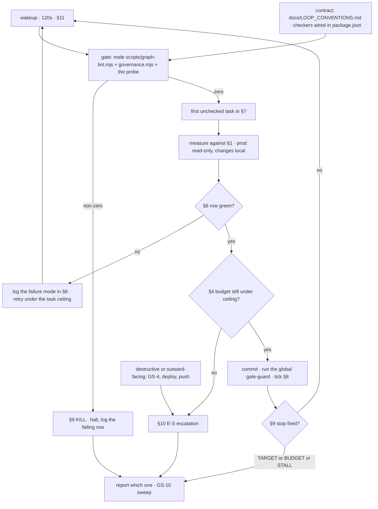

# Gravity Search — Roadmap to Close the Gaps (measured edition)

`gravity_search_gap_roadmap.md` in the repo root was written from source reading. This
ledger replaces it, because four of its five phases are aimed at things that are already
true, already dead, or not the binding constraint. Everything in §1 was measured against
live prod and the live database on 2026-08-17, not inferred from a comment.

The one-line difference: **the corpus already holds the numbers the answers say are
missing.** Adding an EDGAR channel (that roadmap's Phase 1) buys nothing when
`AMD_CostOfGoodsAndServicesSold_FY2025_xbrl` is sitting in Postgres and prod still
answers "cost of goods sold is missing from the sources".

## 1. Measured truth — 2026-08-17

Every number below came from a command run today. Method in parentheses.

**Prod API** (`curl` against `gravity-api-prod.fly.dev`, key `eval-unlimited-fb-2026`)

| Fact | Value |
|---|---|
| `/health` | 200 in 0.42s |
| Deployed image | `deployment-01KWXZC0CXENCP12S536BH6MR2`, machine `d8d079dae2e158`, last updated **2026-07-07** |
| `/v1/search` anon | 401 `Authentication required` |
| Cache-miss medium query | `retrieval_channels: ["structured","bm25"]`, 11 passages, 9.22s, `deepseek-chat`, $0.035 |
| Cache-**hit** query | `retrieval_channels: []`, `passages_used: 0`, `model_used: "unknown"` — the metadata forgets what produced the answer |
| Fly secrets | no `ELASTICSEARCH_URL`, no `NEO4J_*`. `QDRANT_URL` + `QDRANT_API_KEY` still set |

**Retrieval reality.** Ten channels are registered in `orchestrator.py` (`dense`, `bm25`,
`splade`, `graph`, `structured`, `tree_nav`, `page_index`, `turbo_quant`, `gdelt`, `mcp`).
Two returned anything. `dense` returned nothing because the Qdrant cluster is gone —
the secret outliving the cluster is why this looks configured and is not.

**The COGS miss** (the finding that reorders this whole roadmap). Asked prod to compare
NVDA/AMD inventory turnover; it answered *"Inventory turnover cannot be computed for
either company because cost of goods sold is missing from the sources"*. It is not
missing:

```
AMD_CostOfGoodsAndServicesSold_FY2025_xbrl   17,487,000,000 USD   filed 2025-12-27
AMD_InventoryNet_FY2025_xbrl                  7,920,000,000 USD   filed 2025-12-27
```

3,029 cost-of-revenue rows across **324 tickers** exist. The refusal is honest about the
retrieved set and wrong about the corpus: a **selection** failure in `structured_search.py`,
not a coverage gap. Cheapest accuracy point on the board.

**Narrowed during GS-1 — it is the *comparison*, not the metric.** Asked about one company
("What was AMD's cost of goods sold in fiscal 2025?") prod returns 17,487,000,000 correctly,
and even computes AMD's inventory turnover at 2.21× from COGS and average inventory. Asked
to compare two ("Compare NVDA and AMD inventory turnover…") it retrieves 11 passages —
7 NVDA, 4 AMD — and neither company's COGS is among them, so it answers "missing from the
sources". Both companies' figures are in the table (`NVDA_CostOfRevenue_FY2026_xbrl` =
62,475,000,000). GS-3 is therefore about the multi-entity fact budget, not about metric
vocabulary.

**Database** (Supabase `ueuznqilkhyszhgbmpyk`, `ACTIVE_HEALTHY`)

| Table | Rows | Size |
|---|---|---|
| **total DB** | — | **294 MB** of the 500 MB free ceiling |
| `financials` | 460,767 | 197 MB |
| ↳ exact `%_xbrl` rows | 150,743 across **501 tickers** | — |
| ↳ non-xbrl rows | 309,835 across 327 tickers | ~130 MB |
| `chunks` (prose corpus) | 18,445 across **31 tickers** | 69 MB |

The earlier note that the DB was 2,035 MB and would be restricted today is **wrong as of
today** — 294 MB, healthy, 206 MB of headroom. Nothing is on fire; the headroom is the
budget this roadmap spends.

**Eval.** `services/gravity-api/scripts/eval_financebench.py` exists with a 25-question
embedded sample. `baselines/financebench_baseline.json`, captured 2026-06-13: type-aware
accuracy **0.40**, numeric 9/22, citation rate 0.84, 0 errors. At n=25 and p=0.40 the
standard error is **±9.8 points** — that instrument cannot tell a 5-point improvement from
noise, so it cannot be this loop's acceptance gate until §7 GS-7 widens it.

**Free capacity that already works** (tested today with the repo's own keys):
`voyage-3.5-lite` returns 512-dim embeddings on the local `VOYAGE_API_KEY`; pgvector
**0.8.0 is available and not installed** in Supabase. That pair is a dense channel for
$0 — 18,445 chunks × 512 dims as `halfvec` ≈ 19 MB of the 206 MB headroom.

**Not verified today, stated as unknown:** Fly billing standing (the CLI returned a
metrics-token warning, which is not a payment signal); whether `voyage-finance-2` (1024-dim,
the embedder the old vectors used) still has quota; PageIndex / TurboQuant / GDELT / MCP
live behaviour, since neither test query routed to them.

## 2. Capability anchors

Only these exist. A task that needs something not on this list writes it first or
escalates.

| Anchor | Path |
|---|---|
| Channel registry | `app/core/retrieval/orchestrator.py` |
| Exact-fact channel (the COGS bug) | `app/core/retrieval/structured_search.py` |
| Dead dense channel (Qdrant client) | `app/core/retrieval/dense_search.py` |
| RRF + authority scoring | `app/core/retrieval/fusion.py` (`data.sec.gov` already authority 10) |
| Pipeline + metadata emit | `app/core/search_pipeline.py` |
| Agentic path, gated off | `app/core/agents/orchestrator.py`, `settings.agentic_orchestrator_enabled` |
| Embedders (10, incl. voyage/gemini/local) | `app/embeddings/` |
| XBRL companyfacts fetch | `app/ingestion/processing/xbrl_extractor.py` |
| Eval harness + baseline | `scripts/eval_financebench.py`, `baselines/financebench_baseline.json` |
| Loop contract | `docs/LOOP_CONVENTIONS.md` |
| Loop checkers | `scripts/graph-lint.mjs`, `scripts/governance.mjs`, `scripts/loop-lint.mjs`, `package.json` → `npm run loops` |

## 3. Doctrine

1. **A number in the database that the answer says is missing is a retrieval bug.**
   Fix selection before adding sources. §1 has the proof case.
2. **Free tier or escalate.** No paid vector DB, no paid reranker, no paid LLM key without
   §10 E-S. The design constraint is the product constraint.
3. **A registered channel that cannot return anything is a lie in the metadata.** Either it
   answers, or it is unregistered and declared dark.
4. **Measure on prod, change on local, deploy only by escalation.** A claim of "fixed" that
   was never run against a server is not a claim.
5. **The gate never shrinks.** Loosening a probe assertion to make a task pass is what
   `gate-guard.mjs` exists to catch; run it before every commit claiming green.
6. **State the MB delta.** Every task that writes rows or vectors reports DB size before and
   after. §4 is a hard ceiling, not a guideline.

## 4. Budget and resource caps

The binding resources, with today's readings:

| Resource | Now | Ceiling | Rule |
|---|---|---|---|
| Supabase DB | 294 MB | **450 MB** (free tier is 500) | any task crossing 450 halts and escalates |
| Vector storage | 0 | 40 MB | `halfvec(512)`, not `vector(1024)` — 2× cheaper, same recall class |
| Embedding spend | $0 | **$0** | `voyage-3.5-lite` free tier; ~9 M tokens for the full corpus |
| Reranker | Voyage free (171 ms observed) | $0 | no Cohere revival |
| LLM | DeepSeek, $0.035/medium query | **$15 total** for the whole loop | 25-Q eval ≈ $0.88, 150-Q ≈ $5.25 — budget 3 full runs, not 30 |
| Fly | 1 machine, iad | 1 machine | no scale-up, no second region |
| New paid services | none | none | §10 E-S |

## 5. Gaps

- **G1 — dense retrieval is gone.** Qdrant deleted; `dense_search.py` fails silently into `[]`.
- **G2 — the metadata forgets.** Cached answers report zero channels and `model_used: "unknown"`.
- **G3 — exact facts are in the DB and not retrieved** (§1 COGS).
- **G4 — the non-xbrl `financials` rows are wrong values, not just 130 MB.** Measured during GS-1: `NVDA_CostOfRevenue_FY2026_xbrl` = 62,475,000,000 sits beside `NVDA_Cost_of_revenue_2026-05-20_backfill` = **39.5** and two more backfill rows at 141 and 23.4 — same company, near-identical names, unitless garbage values, 309,835 of them competing with the exact rows for the same top-k. This reclassifies GS-4 from a storage task to an accuracy task.
- **G5 — prose corpus covers 31 tickers**; the exact-fact corpus covers 501. Prose questions outside those 31 have nothing to cite.
- **G6 — the eval is ±9.8 points wide** and has no holdout.
- **G7 — eight registered channels, two alive.**
- **G8 — the agentic path is gated off** with a dated comment and 9 files of live complexity behind it.

## 6. Acceptance rows

Machine-checkable, all owned by `scripts/search-probe.mjs` (GS-1) unless noted.

| Row | Assertion |
|---|---|
| R1 | the probe runs end to end and exits non-zero on any failing row |
| R2 | every response — cache hit included — names ≥1 channel and a real `model_used` |
| R3 | **both** shapes return their facts within 2% and cite them — single-entity (AMD FY2025 COGS 17,487,000,000) and multi-entity (NVDA FY2026 cost of revenue 62,475,000,000 **and** the AMD figure in one comparison). Strengthened during GS-1: the single-entity shape was already green on 2026-08-17, so a probe carrying only it would have called GS-3 finished before it started |
| R4 | DB total ≤ 450 MB, printed before and after each writing task |
| R5 | a semantic paraphrase query lists a dense channel in `retrieval_channels` |
| R6 | every ticker the probe asks about resolves to ≥1 prose chunk or is skipped by name |
| R7 | the FinanceBench dev split is run per closing task; the holdout is untouched until GS-10 |
| R8 | no channel is registered that returned nothing on 3 consecutive probe runs |
| R9 | the agentic path returns non-empty on 5/5 complex probes, or is unregistered |
| R10 | cumulative LLM spend printed each iteration, ≤ the §4 cap |

## 7. Task ledger

- [x] **GS-1 · The gate. `scripts/search-probe.mjs` — fixed query set, one assertion per §6 row, non-zero exit on any failure, runs against `--local` by default and `--prod` read-only. Until it exists, writing it IS the task. `review: auto`. Rows R1, R2, R3, R4, R10. ceiling: 3**
- [ ] **GS-2 · Metadata honesty. Cache entries carry the channel list, model and passage count of the run that produced them; the response declares dark channels explicitly instead of omitting them. `review: auto`. Rows R2, R8. ceiling: 3**
- [ ] **GS-3 · The COGS miss. Make `structured_search.py` select by XBRL tag intent — ratio queries pull their components (COGS, inventory, receivables) rather than headline pins only. `review: auto`. Rows R3, R7. ceiling: 4**
- [ ] **GS-4 · Reclaim the 130 MB. Export the 309,835 non-xbrl `financials` rows to disk, prove the exact rows answer everything the probe asks, then STOP at the DELETE — it is destructive and irreversible. `review: human`. Rows R4. ceiling: 2**
- [ ] **GS-5 · Dense retrieval for $0. pgvector `halfvec(512)` in Supabase + `voyage-3.5-lite`, new channel wired into the orchestrator fan-out and RRF. Report MB used and free-tier tokens consumed. `review: auto`. Rows R4, R5, R7. ceiling: 4**
- [ ] **GS-6 · Prose coverage. Ingest filings for the FinanceBench company list only, bounded by the §4 ceiling; stop at the ticker that would cross it and say which. `review: auto`. Rows R4, R6. ceiling: 3**
- [ ] **GS-7 · A gate that can measure. Full 150-question FinanceBench, pre-registered 60 dev / 90 holdout split, deterministic numeric grading with unit normalisation and 2% tolerance — no model-graded stop. `review: auto`. Rows R7, R10. ceiling: 3**
- [ ] **GS-8 · Dark channel decision. Every channel that returned nothing across 3 probe runs is unregistered or declared dark in the metadata; the silent `except: return []` fallbacks log which channel went dark and why. `review: auto`. Rows R8. ceiling: 2**
- [ ] **GS-9 · Agentic: fix or remove. Trace why `ctx.final_answer` never reaches the Writer, then either land it behind COMPLEX-only routing with holdout evidence, or unregister the path and mark it broken in the docstring. `review: auto`. Rows R9, R7. ceiling: 4**
- [ ] **GS-10 · Sweep. Run the full probe, the dev split and the holdout once, record every §6 row's final state and every §4 reading, and say plainly which of §5 G1-G8 remain open. `review: auto`. Rows R1-R10. ceiling: 2**

## 8. Progress log

Grammar, one line per iteration: `- GS-n · iter k · R1 green, R4 green · <measured numbers>  [· fail: <mode>]`.
Escalations: `- ESCALATION · GS-n · <what was asked, what came back>`.

- GS-1 · iter 1 · R1 green, R2 red, R3 red, R4 green, R10 green · `scripts/search-probe.mjs` + `supabase/migrations/0005_gravity_db_stats.sql`. Prod, 4 runs: R2 red both fresh and cached (channels [], model_used "unknown"); R3 single 1/1 facts cache=true, multi **0/2 facts cache=false 8 citations 12.3s** — the failure reproduces fresh, not from cache; R4 db 294.1MB/450, chunks 69.1MB/18,445 rows, financials 196.9MB/460,578 rows; R10 $0.0350 this run, $0.0730 cumulative of $15 over 4 runs. Three findings, all logged into §1/§5/§6: (a) the single-entity shape was ALREADY green, so R3 was strengthened to require the multi-entity comparison before GS-3 runs; (b) a red row whose owner task is still `[ ]` now reports KNOWN and exits 0 — a gate that halts on the bug it exists to catch can never let the fix land, and it turns fatal the moment its owner is `[x]`; (c) without a per-run `ref` marker the second probe run graded the first run's cache — $0.0000, channels [], 1.3s — so the probe cache-busts client-side, prod being read-only. Not verified: `--local` mode, no server was running. Schema added to prod: read-only `gravity_db_stats()`, service_role only, revoked from anon and authenticated
- GS-0 · iter 0 · R1 n/a, R4 green · baseline before any task: DB 294 MB, financials 197 MB / 460,767 rows, chunks 69 MB / 18,445 rows / 31 tickers, prod channels ["structured","bm25"], prod cache-hit channels [], FinanceBench 25-Q type-aware 0.40 (2026-06-13), LLM spend $0.00

## 9. Stop — three conditions, name which fired

- **TARGET** — no `[ ]` remains in §7 **and** the GS-10 sweep ran with the probe exiting 0.
- **BUDGET** — 10 tasks, 26 iterations, or $15 of LLM spend, whichever comes first.
- **STALL** — 3 consecutive iterations with no §6 row changing state and no new failure mode.
  On stall: stop and report. Do not invent an eleventh task to stay alive.

A failed gate is a result. If GS-5 shows free-tier dense retrieval cannot beat bm25 on the
dev split, that is a finding worth more than a green checkbox.

## 10. Escalations — halt, do not decide alone

- **E-D · destructive DB writes.** GS-4's `DELETE`, any `VACUUM FULL`, any table drop.
- **E-S · spend.** Any paid key, any Qdrant plan, any Supabase upgrade, crossing the §4 $15 LLM cap.
- **E-F · deploy.** Pushing an image to Fly, restarting the prod machine, changing prod secrets. Prod is read-only to this loop.
- **E-P · publishing.** `git push`, any PR, anything outward-facing.
- **E-C · corpus.** Ingesting a source the loop did not write and has not read.

## 11. Cadence

120s between iterations. Every task here is work this agent performs itself — write code,
run the probe, read the number — so there is no external process to wait on and a longer
tick is idle time. The exception is a FinanceBench run: scope it, background it, read the
exit code when it lands, never poll it.

## 12. Loop graph


