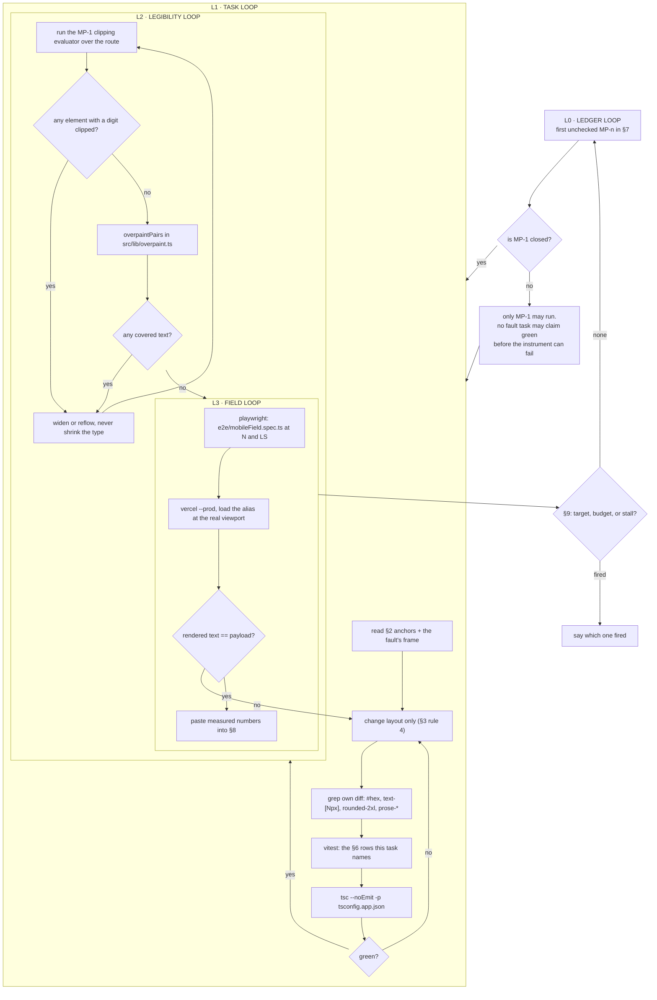

# Mobile Parity Roadmap — the phone must be as useful as the desktop

**Ledger.** Task IDs `MP-n`. Loop file `MOBILE_PARITY_LOOP.sh`.
Contract: `docs/LOOP_CONVENTIONS.md` — done-criteria, truth rules, repo hard
constraints, escalation, cadence, stop, persistence. Not repeated here.

---

## 1. Why V3 exists

`docs/MOBILE_APP_ROADMAP.md` (V1) closed 16/16 with 109 checks green, then the phone
showed 16 faults. `docs/MOBILE_FIELD_ROADMAP.md` (V2) built an overpaint evaluator and
a landscape project, and closed the faults it could see.

The 2026-08-05 frames in `attachments/` show V2's gates are still green while the phone
is still wrong. **That is a blind instrument, not a regression.**

V2 measures two things: whether one element paints over another
(`overpaintPairs` in `src/lib/overpaint.ts`), and whether the DOM's price text matches
the API payload (`e2e/mobileField.spec.ts`, row R7). A cell that clips its own text
passes both. `textContent` is the whole string; `getClientRects()` reports the element
visible; no second element covers it, so no pair exists. The pixels are wrong and every
assertion is green.

V3's premise: **a number a user cannot read is wrong, whatever the DOM says.** The new
axis is legibility — rendered glyphs versus the string the element claims to hold.

Beyond legibility, V2 asked "does it overflow?" and never asked "is this usable?". A
phone that renders a nine-column research grid as one letter per line is not overflowing.
It is useless. §5 separates the two: **F-faults are correctness, U-faults are utility.**

## 2. Anchors — read these before touching anything

Every path and symbol below was verified to exist. Never invent one.

| what | where |
|---|---|
| markets table, price cell, sticky identity column | `src/components/trading/MarketList.tsx` — `price` column def ~line 64, price `<td>` ~line 407, pinned identity `<td>` ~line 395 |
| overpaint evaluator (V2's instrument) | `src/lib/overpaint.ts` — `overpaintPairs`, `collectPaintBoxes` |
| V2 field gates | `e2e/mobileField.spec.ts` — rows R7, R8, R9, R11 |
| V1 sweep | `e2e/mobileSweep.spec.ts` |
| bottom tab bar | `src/components/MobileNav.tsx` |
| viewport projects | `apps/market-ui/playwright.config.ts` |
| desktop reference behaviour | `e2e/desktopBaseline.spec.ts` |

**Evidence is `attachments/Screenshot_20260805-*.png`, 16 real-device frames.** They are
the specification. Where a fault row and a frame disagree, the frame wins and you say so
in §8. Read only the frames your task's fault names. Treat any new file in
`attachments/` as an escalation.

## 3. Doctrine

1. **Legibility over structure.** "It does not overflow" is not "it can be read".
   Every numeric assertion compares *rendered* text to the payload, not DOM text.
2. **Mobile is a second layout, not a shrunken first one.** A panel that sits beside
   another on desktop becomes a destination on a phone. Any task whose answer is
   "make it smaller" is the wrong answer.
3. **Parity is utility, not pixels.** The phone does not need the desktop's layout. It
   needs the desktop's *answers* reachable in the same number of decisions.
4. **Scope is layout and presentation only.** Never edit a service, fetcher, API route
   or scoring function. A mobile task that seems to need different data needs a
   different layout, not a different payload.
5. **Tokens only in new code** — no hex literal, no `text-[Npx]`, no `rounded-2xl`
   (off-scale), no `prose-*` (`@tailwindcss/typography` is not installed, so every
   `prose` class compiles to nothing). Legacy hex may stay unless a task names it.
   Grep your own diff for those four patterns before calling a task done.
6. **A gate that cannot fail on the current tree is not a gate.** Every row in §6 must
   be shown red before the task that turns it green. Record the red measurement in §8.

## 4. Device matrix

Classes are the `playwright.config.ts` project names. `LS` is above the `md` breakpoint
(788 ≥ 768) and therefore renders the **desktop** shell in a 360px-tall viewport — that
is the trap V2 found and it still bites.

| class | project | viewport |
|---|---|---|
| XS | `mobile-320` | 320 × 568 |
| N | `mobile-360` | 360 × 780 |
| S | `mobile-390` | 390 × 844 |
| M | `mobile-430` | 430 × 932 |
| LS | `mobile-landscape` | 788 × 360 |
| LX | `mobile-landscape-740` | 740 × 360 |
| T | `tablet-768` | 768 × 1024 |

## 5. Faults

**F — correctness. A user reads something untrue or cannot read it at all.**

| id | fault | frame |
|---|---|---|
| F1 | Markets table prints truncated prices at scroll offset 0: Bitcoin `7.07`, Ethereum `9.46`, BNB `7.55`, USDC `0076`, XRP `0613`, TRON `3291`. Leading digits are clipped, not covered — R7 is green | `122124`, `121925` |
| F2 | Whole document scrolls horizontally on `/trading`; row labels and the identity chip are cut at the left edge | `121925` |
| F3 | `Categories` / `Portfolio` tab labels collide with the floating `+ Columns` control — text over text | `122124`, `121925` |
| F4 | At LS the desktop shell renders: icon rail plus two panels in 360px of height. `LOG IN` / `SIGN UP` clip past the right edge | `121426`, `121607` |
| F5 | PDF preview modal has no dismiss control inside the viewport and its title is cut mid-word | `122241` |

**U — utility. Nothing is untrue; the screen is unusable.**

| id | fault | frame |
|---|---|---|
| U1 | Research Grid headers render one letter per line (`THE/SIS`, `CAT/ALY/STS`, `VAL/UAT/ION`); cells collapse to dots and pipes. The grid conveys nothing on a phone | `121203` |
| U2 | Grid cell badges overlap — `DECLINE` paints over `RAG`, `LITIGATION` over `RAG` | `121203` |
| U3 | Company tab prior-period column (`$130.50B`) sits flush against the delta (`+65.5%`) with no gap and low contrast | `121333` |
| U4 | At LS the on-screen keyboard leaves ~90px of usable height; the search view has no compact mode | `121402` |

## 6. Acceptance rows

Each §7 task names the rows it must turn green. **Written before the tasks that satisfy
them.** `R1` is the instrument; the rest are assertions.

**Instrument — must exist, and must fail on the unmodified tree, before anything else**

1. A **legibility evaluator** exists in `src/lib/legibility.ts`, unit-tested, exported as
   `clippedText`. For a root selector it returns every element whose rendered text is
   narrower than the text it holds — `scrollWidth > clientWidth + 1`, or whose rect is
   not fully contained by the nearest ancestor with `overflow` not `visible`. It reports
   the element, its `textContent`, and the clipped width in px. This is the instrument
   F1 needs and `overpaintPairs` structurally cannot provide.

**F rows — correctness**

2. On `/trading` at XS, N, S, M and LS, at horizontal scroll offsets 0, 150 and 400:
   `clippedText('table')` returns **zero** entries whose text contains a digit.
   *This is the F1 gate. Nothing weaker closes F1.*
3. On `/trading` at every class in §4, for the first 8 rows, the price cell's rendered
   text parses to a number within ±0.5% of the same symbol's `last`/`priceUsd` read off
   the `/api/crypto/markets` response — **and** that cell reports zero clipped px.
   Row 3 is row R7 plus the legibility half R7 cannot see.
4. `document.documentElement.scrollWidth <= clientWidth` on `/`, `/search`, `/trading`,
   `/companies`, `/history` at XS, N, S, M, LS, LX — after the route's primary content
   has rendered, not on first paint.
5. `overpaintPairs` returns zero pairs where the covered element carries text, on
   `/trading` and `/search` at N and LS. Reuses V2's instrument unchanged.
6. Every control in the top chrome of `/trading` — including `LOG IN` and `SIGN UP` — has
   a rect fully inside the viewport at LS and LX.
7. Every modal and drawer reachable on a mobile route exposes a dismiss control whose
   rect is fully inside the viewport at XS, N and LS, and whose title is not clipped.

**U rows — utility**

8. On `/search` Research Grid at N: no column header's rendered height exceeds 3× the
   line-height of its own computed font size. A header stacked one letter per line fails
   this and nothing else catches it.
9. On `/search` Research Grid at N, every visible cell either renders ≥ 12 characters of
   its own `textContent` or is replaced by a control that opens the full value.
10. At LS, the app renders the mobile shell, not the desktop shell: `MobileNav` is in the
    accessibility tree and the desktop icon rail is not.
11. On the Company tab at N, the prior-period value and the delta have ≥ 8px of
    horizontal gap and the prior-period text meets 4.5:1 contrast against its background.

**Parity row**

12. For each of `/trading`, `/search` Company tab and `/companies`, the number of taps to
    reach the primary answer at N is ≤ the number of clicks at `desktop-baseline` + 1,
    measured by a scripted path recorded in §8.

## 7. Task ledger

Do the **first unchecked** task only. Its spec text is the requirement; the rows it names
are the acceptance tests.

- [ ] **MP-1 · Build the instrument that can see clipping.**
      Nothing else may start. Write `src/lib/legibility.ts` exporting `clippedText`, and
      unit-test it against a fixture with a known-clipped and a known-clean element.
      Then run every §6 row against the **unmodified** tree and record, per fault F1–F5
      and U1–U4, either the failing assertion with its measured number or the sentence
      explaining why it does not reproduce headlessly.
      Then edit §12's L2 node to name `src/lib/legibility.ts` and `clippedText` directly.
      The graph deliberately does **not** name them yet — `scripts/graph-lint.mjs`
      resolves every file and symbol a node cites, so naming an instrument before it
      exists makes the graph red from ledger open, and a permanently red check is one
      you learn to skip. The graph grows with the code. **Rows R1.**

- [ ] **MP-2 · F1 — the markets table must never render a price the server did not send.**
      The price `<td>` in `src/components/trading/MarketList.tsx` is right-aligned and
      clips its own leading digits inside the pinned identity column's shadow. Fix so
      that at every offset in row 2 the rendered price is the whole number. Do not solve
      it by shrinking the font below the type scale. **Rows R2, R3.**

- [ ] **MP-3 · F2 — no route scrolls the document horizontally.**
      Find the child that exceeds the root width on `/trading` and contain it. The table
      may scroll inside its own container; the document may not. **Rows R4.**

- [ ] **MP-4 · F3 — the floating `+ Columns` control must not paint on the tab strip.**
      **Rows R5.**

- [ ] **MP-5 · F4 + U3 — landscape renders the mobile shell.**
      788 ≥ `md`, so LS currently gets the desktop three-panel layout in 360px of height.
      Gate the shell on height as well as width. Top-chrome controls must fit.
      **Rows R6, R10.**

- [ ] **MP-6 · F5 — every modal is dismissable and its title readable.**
      **Rows R7.**

- [ ] **MP-7 · U1 + U2 — the Research Grid becomes a phone layout.**
      A nine-column matrix is not a phone screen. One ticker at a time, its cells as a
      list, the comparison behind a control. Badges may not overlap. **Rows R8, R9, R5.**

- [ ] **MP-8 · U4 — the Company tab reads at 360px.**
      Gap and contrast for the prior-period column. **Rows R11.**

- [ ] **MP-9 · Parity sweep.**
      Record the tap path for each surface in row 12 and close the row with numbers, or
      log the honest gap and close it as a null. **Rows R12.**

## 8. Progress log

One line per iteration. Real numbers — n, viewport, measured px, status codes,
counts. **No adjectives.**

- 2026-08-06 · ledger opened · 5 F-faults and 4 U-faults catalogued from 8 of 16 frames
  · R1 not yet built, so every row below R1 is currently unmeasured, not green.

## 9. Stop

- **TARGET** — no `[ ]` remains in §7 **and** MP-9's sweep actually ran.
- **BUDGET** — 9 tasks or 20 iterations, whichever comes first.
- **STALL** — 3 consecutive iterations with no row changing state and no new failure
  mode. Report which row is stuck and on what. Do not widen scope or re-run a green
  sweep to manufacture activity.

## 10. Escalation

Per `docs/LOOP_CONVENTIONS.md` §4, plus: any new file in `attachments/`; any change that
would edit a service, fetcher, API route or scoring function; any fault that cannot be
reproduced headlessly at any class in §4.

## 11. Cadence

Every iteration is edit → test → deploy → verify → log, performed by the agent, with no
external state to wait on. `ScheduleWakeup` **120 seconds**.

## 12. Graph of loops

