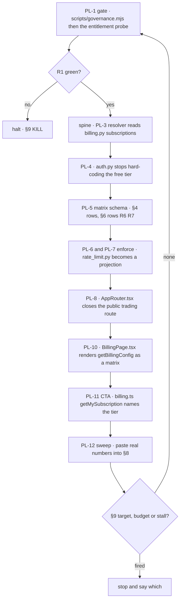

# PLANS — a paywall that actually holds, from /search to /trading

**Ledger.** Tasks `PL-1..PL-12`, gaps `E1-E6` / `S1-S4`, acceptance rows `R1-R14`.
Commit scope `plans`.

**The request.** A TradingView-style tiered pricing surface for AlphaGravity — an
upgrade button and a per-feature matrix spanning the search surface and the trading
surface — plus the harness and the loop to build it.

**The correction this ledger makes to that request.** The pricing table is the *last*
task, not the first. AlphaGravity already sells three plans and **enforces none of
them**. A prettier table on top of an unenforced paywall sells a promise the server
does not keep. §1 is the measurement; §7 puts the spine before the paint.

**And the checkout it would feed is half-off.** Live `GET /v1/billing/config` on
`gravity-api-prod.fly.dev`, fetched 2026-08-13, returns **`paypal:true payoneer:true`
and nothing else** — Paddle (card) and crypto are configured in code but disabled in
production. Four providers exist in `billing.py`; two are reachable by a buyer. §1f.

---

## 1. What TradingView does, and what is actually true here

TradingView's plan table (the reference the request supplied, four columns
Essential / Plus / Premium / Ultimate at $12.95 / $29.95 / $59.95 / $199.95 per month
billed annually) is not a list of adjectives. Three properties make it work:

1. **Every row is the same question asked of every tier.** "Charts per tab" is
   2 / 4 / 8 / 16. "Price alerts" is 20 / 100 / 400 / 1,000. The row exists in all
   four columns; only the number changes.
2. **Absence is rendered, not omitted.** `✗ Volume footprint` sits greyed and
   struck-through in Essential and Plus. The buyer sees the ceiling they are under.
3. **The number is the product's real limit.** The table is a rendering of the
   entitlement the server enforces, not marketing copy maintained separately.

Measured against this tree on 2026-08-13, all three are false here.

**1a — Our plan schema cannot express a matrix.** `billing.py:88-120` defines each
plan as `features: list[str]` (prose bullets: `"Unlimited searches"`,
`"Deep Research mode"`) plus `limits: {"searches_per_day": int, "seats": int}`.
Two numeric dimensions exist for the entire product. `BillingPage.tsx:205` renders
them with `plan.features.map(...)` — three independent bullet lists side by side.
There is no row that exists in every column, so there is nothing to compare and
nothing to grey out. A TradingView table is not a restyle of this component; it is a
different data shape.

**1b — The tier vocabularies disagree, and the disagreement fails silently.**

| source | file | tiers |
|---|---|---|
| billing config | `billing.py:88-125` | `free`, `pro`, `team` |
| rate limiter | `rate_limit.py:30-36, 61-67` | `free`, `individual`, `team`, `enterprise`, `unlimited` |
| org table | `20260430_rbac.sql:36` | `free`, `pro`, `enterprise` |

`rate_limit.py:98` reads `MINUTE_LIMITS.get(tier, 10)`. A user on the `pro` plan is
not a key in that dict, so the lookup takes the default: **10 requests/minute — the
free-tier limit.** The monthly table at `rate_limit.py:61` has the same hole. Nobody
raises, nobody logs; the paying customer is throttled at the free rate and the
symptom is indistinguishable from normal.

**1c — The subscription is never read on the request path.** `auth.py:134-142`, the
Supabase branch of `_to_auth_dict`, returns a literal:

```python
"entitlements": ["public"],
"tier": "free",
```

Production market-ui authenticates through Supabase. So the tier every request
carries is the constant `"free"`, before 1b even gets a chance to mis-key. The only
symbol `billing.py` exports to the rest of the service is `ensure_billing_schema`
(`main.py:54`) — a DDL call. `billing_subscriptions` is written by the webhooks and
read by `/v1/billing/me` and the admin list. **No code path between a paid
subscription and a served request exists.**

**1d — The surface the request wants to sell is public, and confirmed so in
production.** `AppRouter.tsx:170` mounts `/trading` *outside* `ProtectedRoute` — the
whole trading terminal renders with no session. `trading.py:98` declares
`@router.post("/ask")` with no auth dependency at all, so the Hermes LLM call behind
it is unauthenticated and unmetered spend.

That was a code reading. `PL-1` then measured it live on 2026-08-13:

```
POST https://gravity-api-prod.fly.dev/api/trading/markets/ask
     {"asset":"BTC","question":"probe"}     →  200
```

No token, no session, no rate-limit header. **Note the path.** Every other route in
this service is `/v1/...`; this one is the router's own prefix `/trading/markets`
(`trading.py:12`) under the app prefix `/api` (`main.py:353`), so `/v1/trading/ask`
returns 404 and a probe written against it would have reported the endpoint as
harmless. `R10` carries the correct path.

**1e — The product has no paywall boundary.** Grepping `src/` for `upgrade` returns
eight files; the only one that is a real call-to-action is `BillingCancelPage.tsx`,
which you reach *after* abandoning a checkout. Zero gates, zero quota meters, zero
in-context upsells across `/search`, `/companies`, `/documents` and `/trading`.

**1f — There is no instant checkout in production.** Measured against the live API
2026-08-13, not read from the source defaults:

```
GET /v1/billing/config  →  200
free | $0   | {"searches_per_day":10,"seats":1} | 3 features
pro  | $49  | {"searches_per_day":-1,"seats":1} | 5 features
team | $499 | {"searches_per_day":-1,"seats":5} | 6 features
providers: paypal:true payoneer:true
```

Two consequences. First, the live plans are byte-identical to the `billing.py` defaults,
so nobody has ever customised pricing through the admin API and §1's line references
describe what is actually served. Second, **card checkout is off.** The remaining
non-PayPal path is Payoneer, which `BillingPage.tsx:157` correctly describes as
*"Plan activates within 24h after we confirm receipt"* — a manual transfer an
administrator confirms by hand. A TradingView-style "Start now" button implies a
30-second upgrade. Half of ours is a bank transfer and a wait. This is not a UI
problem and `PL-10` cannot fix it; see `S5` and §10 `E-C`.

**What is NOT a target.** TradingView's per-tier numbers (charts per tab, parallel
chart connections, alerts that don't expire) describe a charting product with a
multi-pane layout engine and a persistent server-side alert daemon. This tree has
neither. §4's matrix uses *our* capability rows, measured from the code in §2. A
roadmap that copies their row labels is describing someone else's product.

---

## 2. Anchors — the capability inventory

Every row in §4 must resolve to something in this table. Nothing else may be sold.

**What this table proves, and what it does not.** Each file below was confirmed to
exist on disk. **None of them was exercised.** A 16KB `sso.py` proves someone wrote
SSO, not that a SAML login completes. Treat this as a list of candidates to sell, not
a list of working features — §3 rule 6 forbids selling a row whose feature is dead,
and only `PL-12`'s sweep can tell the difference. Any row still unexercised when
`PL-12` runs is struck from §4 rather than shipped.

**Search surface** — `/search`, `/companies`, `/documents`, `/history` (protected,
`AppRouter.tsx:180-204`):

| capability | where it lives | today's gate |
|---|---|---|
| QA search | `SearchPage.tsx:47` mode `qa` | rate limit only, always free-tier |
| Research Grid | `SearchPage.tsx:47` mode `grid`; `grid_search.py` | none |
| Grid schedules | `grid_schedule.py`; `0005_grid_schedules.sql` | none |
| Company intelligence | `SearchPage.tsx:47` mode `company`; `CompanyPage.tsx` | none |
| Deep Research | `SearchPage.tsx:47` mode `research`; `deepResearchService.ts` | none |
| Document upload / ingest | `DocumentsPage.tsx`; `documents.py` | none |
| History + report viewer | `HistoryPage.tsx`; `ReportViewerPage.tsx` | none |
| Programmatic API keys | `apiKeys.ts` | none |
| Workspaces (seats) | `workspaces.py` | none |
| SSO / SAML | `sso.py` | none |
| MFA | `MfaSetupPage.tsx` | none |
| Audit log | `auditClient.ts` | none |

**Trading surface** — `/trading` (public, `AppRouter.tsx:170`):

| capability | where it lives | today's gate |
|---|---|---|
| Multi-market terminal | `MarketHub.tsx`; `Markets.tsx` | none, and no session |
| Chart + indicators | `Chart.tsx`; `TnChart.tsx` | none |
| Screener / column chooser | `MarketList.tsx` | none |
| Order book / depth | `OrderBook.tsx` | none |
| News terminal | `components/trading/tabs/` | none |
| Portfolio | `PortfolioPanel.tsx` | none |
| Comparator | `TnComparator.tsx` | none |
| Community / social | `CommunityPanel.tsx`; `TnSocialView.tsx` | none |
| Dexter AI agent | `dexterGraph.ts` + 20 sibling services | none |
| Ask Hermes | `trading.py:98` | **no auth at all** |

---

## 3. Doctrine — what makes this loop different

1. **The spine before the paint.** No task that changes a pixel of pricing UI may be
   checked `[x]` before `PL-5` is green. An upgrade button over an unenforced tier is
   a lie rendered at 60fps.
2. **One tier vocabulary, one resolver.** Every tier decision in the service reads
   the same function. A second `MINUTE_LIMITS`-shaped dict added anywhere is a
   regression, and `R3` is what catches it.
3. **A missing key is an error, never a default.** `1b` happened because `.get(tier, 10)`
   turned an unknown plan into the free plan. Resolvers raise on an unknown tier; the
   caller decides the fallback explicitly and logs it.
4. **Never widen a gate to make a test pass.** Enforcement code is gate code. Loosening
   a limit, deleting an assertion, or adding an early-return bypass is exactly what
   `gate-guard` exists to catch — run it before every commit that claims green.
5. **Prices and public surfaces are not the loop's to decide.** §4's numbers are
   PROPOSED. Rendering a price to a real user, or closing `/trading` to anonymous
   visitors, is an escalation under §10 — both are outward-facing and one of them
   moves money.
6. **Sell only §2.** If a row in §4 does not resolve to a file in §2, delete the row.
   The corpus is S&P 500 SEC filings, BVMT and ~200 crypto assets; no tier may imply
   coverage we do not have.

---

## 4. The proposed matrix — ⚠ PRICES UNCONFIRMED (§10 E-P)

Four tiers, ascending, mirroring the reference table's shape. The ladder the request
described — search first, trading unlocked above it — is encoded in the two
capability blocks: everything a tier gets in **Research** it also gets before any
**Terminal** row turns on.

| | **Free** | **Analyst** | **Professional** | **Institutional** |
|---|---|---|---|---|
| **price / mo, billed annually** | $0 | $39 | $99 | $399 |
| **billed monthly** | $0 | $49 | $129 | $479 |
| seats | 1 | 1 | 3 | 10 |

**Research — the /search surface**

| row | Free | Analyst | Professional | Institutional |
|---|---|---|---|---|
| QA searches / day | 10 | 500 | 2,000 | unlimited |
| requests / minute | 10 | 60 | 120 | 600 |
| Company profiles | ✓ | ✓ | ✓ | ✓ |
| Research Grid runs / day | 2 | 50 | 250 | unlimited |
| Grid columns per run | 5 | 20 | 50 | unlimited |
| Scheduled grids | ✗ | 3 | 25 | unlimited |
| Deep Research runs / day | ✗ | 10 | 50 | 250 |
| Document uploads / mo | 5 | 200 | 2,000 | unlimited |
| History retention | 7 days | 1 year | unlimited | unlimited |
| Report export (memo / PDF) | ✗ | ✓ | ✓ | ✓ |
| API keys | ✗ | 1 | 5 | 25 |
| Audit log | ✗ | ✗ | ✓ | ✓ |
| SSO (SAML) | ✗ | ✗ | ✗ | ✓ |

**Terminal — the /trading surface**

| row | Free | Analyst | Professional | Institutional |
|---|---|---|---|---|
| Markets | 1 (crypto) | all 6 | all 6 | all 6 |
| Watchlist symbols | 10 | 100 | 500 | unlimited |
| Chart indicators | 3 | 10 | 25 | 50 |
| Screener columns | 8 | 30 | all | all |
| Order book / depth | ✗ | ✓ | ✓ | ✓ |
| News terminal | headlines | full | full | full |
| Portfolio tracking | ✗ | ✓ | ✓ | ✓ |
| Comparator | ✗ | ✓ | ✓ | ✓ |
| Ask Hermes / day | 5 | 100 | 500 | unlimited |
| Dexter agent runs / day | ✗ | 10 | 100 | unlimited |
| Dexter debate + risk trio | ✗ | ✗ | ✓ | ✓ |
| Decision journal + replay | ✗ | ✗ | ✓ | ✓ |

**The Free row is held at today's live value on purpose.** `searches_per_day: 10` is
what production serves (§1f). Loosening the free tier is a growth decision with a
revenue cost, not a formatting choice, and this loop does not get to make it by typing
a bigger number into a table. Any change to the Free column is §10 `E-P`.

Legacy plan ids map forward, so no existing subscriber loses access:
`pro → professional`, `team → institutional`, `individual → analyst`,
`enterprise → institutional`. The map is data, asserted by `R3`.

---

## 5. Gaps

**Entitlement spine**

- **E1** — no resolver: nothing maps `user_id → plan → limits` on the request path (§1c).
- **E2** — vocabulary split three ways, failing silently to free (§1b).
- **E3** — `auth.py:142` hard-codes `tier: "free"` for every Supabase session (§1c).
- **E4** — plan schema holds two numbers; the matrix needs ~25 (§1a).
- **E5** — no usage counters readable by the UI, so a quota meter would be decorative.
- **E6** — no denial path: nothing anywhere returns "you are over your plan limit".

**Surface**

- **S1** — `/trading` renders with no session (§1d).
- **S2** — `/v1/trading/ask` accepts unauthenticated LLM spend (§1d).
- **S3** — plan cards are three bullet lists, not a matrix (§1a).
- **S4** — zero in-context upgrade CTAs (§1e).
- **S5** — no instant checkout: card and crypto disabled in prod, leaving PayPal and a
  manual 24h Payoneer transfer (§1f). The upgrade button's destination is the
  constraint on this whole ledger, and no §7 task removes it.

---

## 6. Acceptance rows

Each row is one binary check. `R1` is the gate: it runs first and a red `R1` halts the
loop whatever the task list says.

**Instruments.** `R1-R8` and `R15` are asserted by `scripts/entitlement-probe.mjs`
(`PL-1`). `R9-R14` are browser-observable and run in the existing Playwright harness
at `apps/market-ui/e2e/` — `npm run e2e`, with the signed-in fixture from
`auth.setup.ts`. A row whose instrument is not named is a wish; these are the two that
exist, and no third one may be invented to grade this loop.

| row | asserts | how it is measured |
|---|---|---|
| **R1** | the entitlement probe runs and every assertion is binary | `node scripts/entitlement-probe.mjs` exits 0 |
| **R2** | exactly one tier vocabulary is defined in the service | probe greps for a second limits dict; finds 0 |
| **R3** | every legacy plan id resolves forward | 4/4 of `pro`,`team`,`individual`,`enterprise` map |
| **R4** | an unknown tier raises, never silently defaults | probe asserts the raise |
| **R5** | a `professional` JWT is served `professional` limits | live request; header shows 120, not 10 |
| **R6** | every capability key names a source file that exists | probe reads `PL-5`'s capability declarations; 0 orphan `source=` paths |
| **R7** | every §4 row is defined for all 4 tiers | 0 holes in the matrix |
| **R8** | over-limit returns 402/429 with the plan named, not a 500 | live request past the cap |
| **R9** | `/trading` requires a session | anonymous fetch redirects to `/auth` |
| **R10** | `/v1/trading/ask` rejects an anonymous call | anonymous POST returns 401 |
| **R11** | the pricing table renders all §4 rows in all 4 columns | DOM count = rows × 4 |
| **R12** | unavailable rows render struck-through, not omitted | `✗` cells present in DOM |
| **R13** | a denied action shows an upgrade CTA naming the needed tier | click-through from the denial |
| **R14** | the quota meter's number equals the server's counter | UI value == `/v1/usage` value |
| **R15** | every tier the table sells has a reachable checkout | live `/v1/billing/config`; enabled providers > 0 and at least one is instant |

---

## 7. Tasks

- [x] **PL-1 — the gate.** Write `scripts/entitlement-probe.mjs`: the kill authority
      for this loop. It asserts `R2`, `R3`, `R4`, `R6`, `R7` statically against the
      source, and `R5`, `R8`, `R15` against a running API when one is reachable
      (skipping, and *saying* it skipped, when it is not — a skipped check is never a
      pass). Add it to the `loops` script chain. No later task may be checked before
      this one is green.

- [x] **PL-2 — one vocabulary.** Define the four tiers plus the legacy map in one
      module, server-side, and one mirrored constant in `packages/shared-types/`.
      Delete `MINUTE_LIMITS` / `MONTHLY_LIMITS` as independent tables — they become a
      projection of the matrix. `R2`, `R3`.

- [x] **PL-3 — the resolver.** `entitlements_for(user_id) → dict`, reading
      `billing_subscriptions` with a short cache. Unknown tier raises (§3 rule 3).
      `R4`.

- [ ] **PL-4 — wire auth.** Replace the literal at `auth.py:142` with a resolver call
      so a Supabase session carries its real tier. `R5`.

- [ ] **PL-5 — the matrix schema.** Extend the plan config from
      `features: list[str]` to `capabilities: dict[str, int | bool | "unlimited"]`,
      keeping `features` for prose. Admin PUT accepts and validates it: every
      capability key must exist in all four tiers. `R6`, `R7`. **This is the spine —
      §3 rule 1 blocks PL-9 and PL-10 until it is green.**

- [ ] **PL-6 — enforce: research.** Gate the §4 Research rows at their call sites.
      Over-limit returns 402 naming the plan and the row. `R8`.

- [ ] **PL-7 — enforce: terminal.** Gate the §4 Terminal rows. `R8`.

- [ ] **PL-8 — close the public surface.** Move `/trading` inside `ProtectedRoute`
      and add auth to `trading.py:98`. `R9`, `R10`. **⚠ ESCALATION before merge —
      outward-facing, §10 E-T.**

- [ ] **PL-9 — usage counters.** Expose per-capability consumption through
      `usage.py` so a meter can be honest. `R14`.

- [ ] **PL-10 — the pricing table.** Rebuild the plan surface as a four-column matrix:
      every §4 row in every column, `✗` rendered struck-through, annual/monthly toggle
      showing the saving, one "Start now" per column. `R11`, `R12`. **⚠ prices stay
      placeholder until §10 E-P clears.**

- [ ] **PL-11 — the upgrade moment.** At each denial point, an inline CTA naming the
      capability, the current usage, and the tier that lifts it. `R13`.

- [ ] **PL-12 — the sweep.** Run every §6 row against both surfaces and all four
      tiers. **Additionally exercise every §4 row once** — §2 proved the files exist,
      not that the features run, and a row that cannot be demonstrated is struck from
      the table instead of sold. Paste the full matrix into §8, including the strike
      list. A red row here reopens its task rather than closing the ledger.

---

## 8. Log

Append one line per iteration: task, rows checked, **real numbers**, no adjectives.

| date | task | result |
|---|---|---|
| 2026-08-13 | — | ledger opened. Measured: 3 tier vocabularies, 0 enforcement paths, 1 public paid surface, 0 upgrade CTAs. |
| 2026-08-13 | PL-3 | `app/billing/entitlements.py` joins `billing_subscriptions` to a tier — the read path §1c said did not exist. **19 pytest assertions, all passing in 0.14s** (`tests/test_entitlements.py`). Three leak directions closed and each one tested: a non-active status does not entitle (`canceled`, `past_due`, `none`, `incomplete`, `""` all → free, 5 parametrised cases); an expired `current_period_end` → free however good the status column reads, so a failed webhook cannot become a permanent upgrade; an unresolvable plan name → free with the name logged at error, never guessed. Legacy names map through (`pro`→professional, `team`→institutional). Cache 60s, verified by call-counting a fake pool: second read hits 1 query not 2, `invalidate()` forces 2, and a downgrade lands once the TTL passes. A database failure degrades to free instead of raising — verified with a pool that throws — because a limiter that 500s the search endpoint when Postgres blinks is worse than one that under-serves. **Deviation from the task text**: it specified `entitlements_for(user_id) → dict`; it returns the frozen `Tier` instead, which is what every caller needs and is typed. Row R4 was widened while claiming it — it scanned only `rate_limit.py`, so the next `.get(tier, …)` could land in `entitlements.py` unchallenged; it now scans 3 files and also catches `.get(plan, …)`. `R4` reads **no defaulting lookup in 3 files**. |
| 2026-08-13 | PL-2 | three tier vocabularies collapsed to one. `app/billing/tiers.py` holds 5 tiers (4 sold + `unlimited`, which `auth.py` issues to the dev bypass and internal service keys and which is therefore kept, not sold) and the 4 legacy aliases. `rate_limit.py` now owns **0** tier tables, down from 2 — verified by `hasattr`: `MINUTE_LIMITS` False, `MONTHLY_LIMITS` False. Rows: **R2 0 tier dicts** (was 2), **R3 4/4 mapped** (was 0/4), and R4 came green early as a side effect — `.get(tier, 10)` is gone, so it reads `no defaulting lookup` under `PL-3`, which still owns the DB resolver. Limits verified by execution, not by reading: free 10/min 10/day 100/mo · analyst 60/500/5000 · professional 120/2000/25000 · institutional 600/∞/∞ · unlimited 100000/∞/∞; all 4 legacy ids resolve; `resolve('platinum')` raises. **Nothing loosened**: free keeps its 100/month and gains a 10/day ceiling it never had, so every existing user is capped at least as tightly as before. One deliberate increase — `professional` was being served the free tier's 10/min through the §1b bug and now gets the 120 §4 sells it. `enterprise`, whose old 10000/min is above institutional's 600, has never been sellable (billing offers free/pro/team only), so no subscription can be sitting on it. Added a third enforcement layer (per-day) with its own 429 and `X-RateLimit-Daily-*` headers; TTLs measured 24085s to UTC midnight, 1579285s to 1 Sep. A `TierId` / `LEGACY_TIER_ALIASES` mirror lands in `packages/shared-types`; `tsc` build clean. One gate defect fixed: R4 was reading a docstring that *quoted* `.get(tier, 10)` and going red on prose — the detector now strips Python comments and docstrings (`stripPy`, 5 new self-check assertions proving code still matches and prose no longer does), because the alternative fix is rewording the comment, which teaches the loop to hide from its gate. Self-check total now counts itself: **15 assertions**, previously a hardcoded "10" that had drifted. |
| 2026-08-13 | PL-1 | gate built and armed. `R1` PASS, `R15` PASS, 11 pending, 2 skipped, 0 failing, exit 0; `--self-check` 10 assertions green. Enforcement is a ratchet off §7's checkboxes, so nothing is graded before its task is claimed and nothing can be un-graded after. Measured while building it: `R2` 2 tier dicts (`MINUTE_LIMITS`, `MONTHLY_LIMITS`), `R3` 0/4 legacy ids mapped, `R4` `.get(tier, 10)` still live, `R7` 28 rows × 4 tiers 0 holes, `R9` `/trading` route at char 8466 vs guard at 9001 = public, **`R10` anonymous POST → 200**, `R15` enabled `paypal,payoneer` / instant `paypal`. Three defects found and fixed during the build, two of them mine: `R2` counted `_MEM_COUNTERS` (a Redis fallback cache, not a vocabulary); `R10` was written against `/v1/trading/ask` which 404s — the real path is `/api/trading/markets/ask` and the wrong one would have reported the hole as closed; and `process.exit()` over an open fetch pool aborted the process, reaching the shell as **127**, so the gate's own verdict was untrustworthy — now `process.exitCode`. `R6` was restated from "every §4 row resolves to a §2 file" (not mechanically checkable — §4 rows are prose labels) to "every capability key names a source file that exists", checkable once `PL-5` lands. Full `vitest` not run: the diff is one root script, one `package.json` line and this ledger — no `apps/` code changed. |
| 2026-08-13 | audit | ledger reviewed against the LIVE api before any task ran. `/health` 200 in 0.57s, `/v1/billing/config` 200: plans byte-identical to the `billing.py` defaults, **2 of 4 providers enabled** (paypal, payoneer). Four defects found in this ledger and fixed: the four-provider claim (now §1f + `S5` + `R15`), §2 sold file-existence as capability (now caveated, `PL-12` widened), `R11-R14` named no instrument (now `apps/market-ui/e2e/`), and the Free tier had been raised 10→20/day by the ledger itself with no authority (reverted to 10). 6 markets confirmed in `markets.ts`. No prior billing ledger exists — no duplication. |

---

## 9. Stop — three conditions, name which one fired

- **TARGET** — no `[ ]` remains in §7 **and** `PL-12`'s sweep is in §8 with every
  `R1-R14` row green.
- **BUDGET** — 12 tasks or 30 iterations, whichever comes first.
- **STALL** — 3 consecutive iterations with no row changing state and no new failure
  mode. On stall, stop and report; do not keep ticking.
- **KILL** — `R1` red halts the loop immediately, whatever §7 says.

No stop condition here is graded by a model score, so no holdout or judge is required.

---

## 10. Escalation — halt and ask

- **E-P — prices.** §4's numbers are proposed by the loop, not decided by the owner.
  No price may render to a real user until confirmed. `PL-10` ships with placeholders.
- **E-T — closing `/trading`.** It is public today; people may be using it. Closing it
  is outward-facing and irreversible for anonymous sessions.
- **E-L — the ladder.** §4 assumes trading unlocks *above* search on one ladder. The
  alternative — trading as a priced add-on to any tier — is a different matrix. Ask
  before building the second one.
- **E-C — the checkout is half-off and only the owner can turn it on.** `S5`. Enabling
  Paddle or crypto needs credentials this loop does not have and must never ask for.
  `R15` reports the state; it does not fix it. If the answer is "PayPal only", say so
  and `PL-10` drops the tiers that a manual transfer cannot plausibly close.
- **E-D — existing subscribers.** Anyone already paying `pro` or `team` must not lose
  access at the cutover. The map in §4 is the plan; confirm it against the live
  `billing_subscriptions` rows before `PL-4` ships.
- Plus the standing triggers in `docs/LOOP_CONVENTIONS.md` §4 — never `git push`
  unasked, never decide alone on anything irreversible.

---

## 11. Cadence

120s between iterations. Every task here is work this agent performs itself — write
code, run the probe, verify — so there is no external state to wait for and a longer
tick is pure idle. Matches `docs/LOOP_CONVENTIONS.md` §5.

---

## 12. The loop graph


