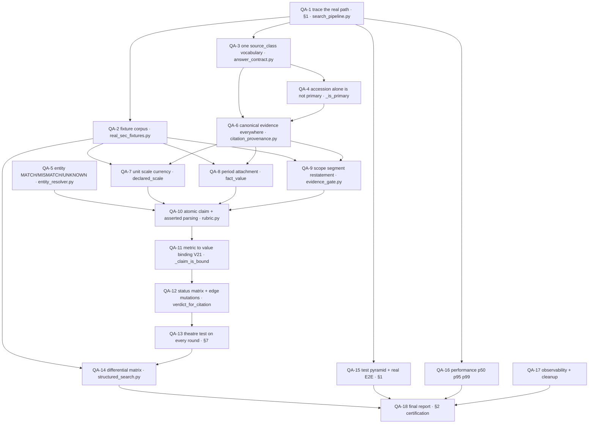

# Round 8 — evidence integrity, to certification or to a named blocker

Branch `feat/web-research-sec-integration`. Baseline `aa2440c` (2532 passed).
Built from `docs/quick-answer/AlphaGravity Quick Answer — R8 World-Class
Hardening Roadmap.md`, read in full before this file was written.

Invocation: **`/loop Execute docs/quick-answer/R8_LOOP.md`**

One file, like R6 and R7. The graph, the rows, the rules and the ledger live
together because three rounds of keeping them apart taught that a graph nothing
reads rots into a lie.

---

## 1. What "world class" means here, and what it cannot mean

The objective, in the roadmap's own words:

> a Quick Answer system where a financially wrong answer cannot obtain VERIFIED
> evidence merely because the right number, metric word, or citation happens to
> appear somewhere nearby.

**That is achievable by this loop, and it is a different claim from the one
seven audits have declined.** Rounds 1–7 could not certify because certification
was defined as *is this better than ChatGPT*, which needs a human-authored
reference set that no loop can produce. R8's success criteria contain no such
item. Every one of them is a mechanical property of the evidence path, and a
loop can settle mechanical properties.

**So the honest statement of the goal is:** by the end of this round, either
every criterion in the roadmap's §26 is demonstrated and the round says
`CERTIFIED`, or the round names exactly which criteria are not and why. Both are
successful outcomes. A third outcome — a green suite and a confident summary —
is the failure this round exists to make impossible.

**Three criteria will decide which**, and they are the ones the roadmap places
last:

| Criterion | Why it decides | Attacked in |
|---|---|---|
| a fixture corpus with non-USD, restated and segmented filings, **not fabricated** | If the repository holds no such filing, the currency, restatement and segment criteria cannot be demonstrated at all | QA-2, **first**, not last |
| the actual Quick Answer route and WebSocket path tested end to end | Everything else is unit-level. Without this the round proves properties of functions, not of the system | QA-1 feasibility, QA-15 |
| performance measured end to end, p50/p95/p99 | Local infrastructure is not production. A number measured against stubs is not the number | QA-1 feasibility, QA-16 |

**These are settled in loop 1, not loop 12.** Discovering in the last loop that
a required fixture does not exist is how a round ends in an apology. If any of
the three is impossible, it is recorded as `BLOCKED` with the reason on the
first day and the round proceeds around it.

---

## 2. Stop is three conditions

- **Target** — every row CLOSED or OPEN-with-reason, both evals run, and
  `docs/quick-answer/R8_FINAL_AUDIT.md` written with a certification decision of
  `CERTIFIED`, `NOT CERTIFIED` or `BLOCKED`. The decision defaults to
  `NOT CERTIFIED`.
- **Budget** — 20 loops. The suite takes 11–16 minutes, so this is roughly a
  day of wall time and it is the cap, not a target.
- **Stall** — 3 consecutive loops with no verdict change and no new failure
  mode. On stall: stop and report, do not keep ticking.

**There is no external audit at the end of this round.** Seven have been run;
the last three found less than the round's own rigs did. QA-13's theatre test
and QA-12's differential matrix are the replacement, and they are stronger
because they execute. If the round wants an eighth opinion it has failed to
build an instrument it trusts.

---

## 3. The graph

Dependency order, which is **not** the roadmap's section order. Fixtures and
feasibility come first because they decide whether the end is reachable.



The graph is checked, not drawn:

```bash
node scripts/graph-lint.mjs docs/quick-answer/R8_LOOP.md
```

Every node names a file, a section or a symbol that must resolve, and the
linter exits non-zero when one stops resolving. `graph-lint.mjs` could not see
`.py` paths or snake_case symbols until this round extended it — a Python
roadmap's graph was passing on its section numbers alone, which is the scope
opt-out failure mode with the checker itself as the culprit.

---

## 4. The rows

Each row states its roadmap section, its deliverable, and **the specific way it
is allowed to fail**. A row with no stated failure mode has not been thought
about.

### QA-1 — trace the real path, and settle the three deciders

Roadmap §1. **No code changes.** Produce `docs/quick-answer/R8_DATAFLOW.md`
with actual file and function names for: query → `search_pipeline` → retrieval
channels → source objects → citation construction → provenance → generation →
answer contract → FinalGate → publication → cache write → cache replay.

Then answer three questions with a command, not an opinion:

1. Does a test exercise the real route and the real WebSocket path today?
2. Can end-to-end latency be measured without live infrastructure, and if not,
   what exactly is missing?
3. Which of the roadmap §17 fixture dimensions exist in this repository —
   non-USD, restated/amended, segmented?

**Fails as:** a dataflow document that paraphrases the architecture rather than
naming the functions. If a reader cannot grep every name in it, it is prose.

### QA-2 — the fixture corpus

Roadmap §17. Extend `real_sec_fixtures.py`. **Do not fabricate SEC data.** Use
corpus text or filings already on disk.

**Fails as:** a dimension quietly dropped because no fixture exists. Missing
dimensions are recorded as `BLOCKED` in the ledger with the search that failed,
not left out of the matrix.

### QA-3 — one `source_class` vocabulary

Roadmap §3. Find every producer and consumer of `source_class` and its
neighbours, define one canonical mapping, add a contract test that no consumer
interprets another producer's string.

**Fails as:** a new enum added beside the old strings instead of replacing
them — the seventh vocabulary round 3 counted.

### QA-4 — an accession alone is not primary provenance

Roadmap §2.3. `_is_primary` and `provenance` currently treat a valid-looking
accession as sufficient. Require coherent filing identity. Negative tests: fake
accession with web, local, blog and news source classes, and a valid accession
embedded in arbitrary prose.

**Fails as:** tightening this rejects real citations. The primary-provenance
rate on the existing fixtures is measured before and after, and a drop is
investigated rather than accepted.

### QA-5 — entity binding has three states

Roadmap §4. `MATCH` / `MISMATCH` / `UNKNOWN`, and `UNKNOWN` never satisfies a
requirement. Canonical normalization for ticker, legal name, common name, CIK,
issuer and document title. `ABC` must not match `ABCDEF`.

**Fails as:** normalization that is a substring matcher wearing a new name.

### QA-6 — the canonical evidence object reaches every source class

Roadmap §2.1, §2.2. R7 measured that `provenance` returns `None` without an
accession, so prose citations carry no fields. Decide, with a measurement of how
many real citations that affects, whether the object extends to prose evidence
or whether prose is graded honestly by the text path forever.

**Fails as:** labelling web or local evidence as filing evidence to make the
fields non-empty. Source identity, financial fact identity and verification
strength stay three separate things.

### QA-7 — unit, scale and currency are semantic

Roadmap §8. Scale comes from evidence — a header, prose, structured metadata —
never from a number's appearance. Currency mismatch fails: USD, EUR, GBP, JPY,
CNY, and the `$` `€` `£` symbols.

**Fails as:** adding scale to XBRL values that are already absolute, which R7
row E2 decided against for reasons that still hold.

### QA-8 — period attachment

Roadmap §7. `MATCH` / `MISMATCH` / `UNKNOWN`, and `UNKNOWN` does not satisfy a
required period. FY vs FY, Q vs Q, quarter vs full year, TTM vs FY, calendar vs
fiscal, comparative columns. **This is V17**, open since round 6.

**Fails as:** period checked in production and not in the evaluator, which is
exactly the state V17 describes.

### QA-9 — scope, segment, restatement

Roadmap §9, §10. Consolidated vs segment vs geographic vs continuing vs
discontinued. `ORIGINAL` / `RESTATED` / `AMENDED` / `UNKNOWN`, and two
conflicting facts stay `CONFLICTING` rather than collapsing to `VERIFIED`.

**Owner decision, QA-1:** there is no amended or restated filing in this
repository — zero `/A` forms across 1408 manifest rows, and only 20 filing
files on disk at all. The semantics are built and tested against constructed
evidence, and the §26 criterion is recorded **`UNPROVEN` on real filing
data**. One real `10-K/A` in `data/filings*/` upgrades it to `PROVEN` without
touching the implementation.

**Fails as:** the synthetic evidence quietly becoming the claim, with the
`UNPROVEN` label dropped from the final report.

### QA-10 — the atomic claim

Roadmap §5, §14. `_claim_is_bound` works per SENTENCE, not per proposition —
its own T9 caveat. Decompose into atomic claims each carrying entity, metric,
value, currency, unit, scale, period, scope and segment. Define the semantic
rule for what a sentence asserts before touching punctuation.

**This is the largest row and it may not fit one loop.** If it does not, say so
and stop; do not half-build it.

**Fails as:** a punctuation list. If the fix is characters rather than a rule,
it is the wrong fix.

### QA-11 — metric to value binding

Roadmap §6. **This is V21**, pinned open in
`KNOWN_SHARED_EDGE_GAPS` since round 6. Adjacent table rows, several numbers in
one paragraph, one number serving two metrics, prior/current year columns,
quarterly/annual columns, percentages beside dollars, EPS beside revenue,
margins beside absolutes.

**Fails as:** a concept-to-English mapping table. R7 escalated this and the
decision was that the claim must carry its own metric — QA-10 is what makes
this row possible, which is why it sits after it.

### QA-12 — the status compatibility matrix and edge mutations

Roadmap §11, §12, §13. The differential rig's invariant fires only on
`UNSUPPORTED`, and `verdict_for_citation` returns that **only** when a citation
fails to resolve; every value, entity and period disagreement returns
`CONFLICTING`. So the invariant is close to vacuous and round 7 said so without
fixing it. Replace it with the full production×grader matrix. Add the edge
mutations the roadmap lists, including citation-index transposition.

**Fails as:** widening "rejects" to include `CONFLICTING` and then pinning the
new violations as known gaps. A matrix that grows exemptions is the ratchet, not
the fix.

### QA-13 — the theatre test, run against every round

Roadmap §19. For each regression test this project has: revert the production
fix, confirm the test fails, restore, confirm it passes, then change fixture
wording, citation order and the numbers, and confirm the result still follows
semantics. **A test that passes before its own fix is theatre and is replaced.**

Run it against rounds 3 through 7, not only against R8's own tests. **Expect it
to invalidate some existing green tests.** That is the row working.

**Fails as:** running it only on new tests, which proves nothing about the
suite's history.

### QA-14 — the differential matrix

Roadmap §18. For every QA-2 fixture: `CORRECT`, `WRONG_VALUE`, `WRONG_UNIT`,
`WRONG_SCALE`, `WRONG_CURRENCY`, `WRONG_PERIOD`, `WRONG_ENTITY`, `WRONG_SCOPE`,
`WRONG_SEGMENT`, `WRONG_METRIC`, `WRONG_CITATION`, `WRONG_CITATION_INDEX`,
`CONFLICTING`, `UNSUPPORTED`, each with an explicitly defined expected result.

**Fails as:** a matrix whose expected results were written after seeing the
actual ones.

### QA-15 — the test pyramid and the real end-to-end

Roadmap §20, §21. Six layers: semantic unit, provenance integration, pipeline
integration, API and WebSocket E2E, cache replay, production-like fixture. The
only permitted substitution is an external dependency that genuinely cannot run.

**Fails as:** substituting the component under test, which makes the E2E a
mock's self-portrait.

### QA-16 — performance, measured separately

Roadmap §22. Retrieval, generation, provenance construction, FinalGate,
serialization, cache hit, cache miss, end to end. p50, p95, p99.

**Owner decision, QA-1:** bring up local infrastructure (`make infra`) and
populate the stores, rather than reporting only the pure stages. That makes
retrieval, generation and true end-to-end measurable — **locally**. The word
`local` is required in every number this row publishes, and
`R8_FINAL_AUDIT.md` must say it too: local hardware with a locally seeded
store is not the production environment.

**Fails as:** a number from a grader microbenchmark presented as Quick Answer
latency, or a local number presented as a production one.

### QA-17 — observability and cleanup

Roadmap §23, §24. Telemetry sufficient to answer why a claim was verified,
which evidence supported it, which entity and period matched, which gate
rejected it. Then classify every duplicate concept as canonical, transport,
legacy or derived and write it down.

**Fails as:** cosmetic refactoring, which §24 forbids explicitly.

### QA-18 — the final report

Roadmap §27. `docs/quick-answer/R8_FINAL_AUDIT.md`, the twelve named sections,
every claim tagged `PROVEN` / `TESTED` / `READ` / `INFERRED` / `UNPROVEN` /
`BLOCKED`, and one certification decision.

**Fails as:** the word "world-class" appearing anywhere that evidence does not.

---

## 5. Rules, all binding

The roadmap's fifteen non-negotiables hold in full and are not restated here.
On top of them, the rules R6 and R7 were built on, because they are what made
those rounds' findings survive contact:

- **Every new test runs against UNFIXED code first and is observed to fail**,
  and the failing output goes into the ledger row and the commit. A test that
  passes before its fix is theatre — QA-13 exists to find the ones already in
  the tree.
- **Never delete, skip, weaken or loosen a test.** Run
  `node ~/.claude/scripts/gate-guard.mjs` before any commit claiming a fix. A
  legitimate removal is an escalation naming which assertion went and why it no
  longer grades anything real.
- **Reconcile every count delta** against the tests the commit adds. A rise
  larger than that means duplication; smaller means something stopped running.
- **Never write** `world class`, `certified`, `production ready` or `fixed`
  while any row is OPEN.
- **Append one ledger row per attempt. Never edit a row — supersede it.**
- **Keep `docs/quick-answer/R8_PROGRESS.md`** current: discovered issue, root
  cause, files and functions, implementation, tests, remaining uncertainty.
- Push before quoting a SHA outside the session.

---

## 6. Escalation

Halt and ask; do not decide alone:

- deploys, pushes to `main`, spend
- any file entering the repo the loop did not write and has not read
- **any change to what production calls verified**
- **any change to what the benchmark counts as correct**
- any change that would make FinalGate refuse an answer it accepts today
- removing or weakening an existing assertion, including one QA-13 finds to be
  theatre
- anything unverifiable this iteration

Escalation is the loop working. Seven rounds of this project have been improved
by it and none delayed by it.

---

## 7. What this round must NOT do

- **Not an eighth audit.** See §2.
- **Not a second evidence model.** Roadmap rule 6. `provenance` is the canonical
  object; extend it.
- **Not a new metric vocabulary.** R14, T1, T2, V16 are one mistake made four
  times.
- **Not benchmark-score optimisation.** Roadmap line 7 and rule 13.
- **Not unrelated architecture.** Roadmap rule 14.

---

## 8. The evals, both, every loop

```bash
cd services/gravity-api
.venv/Scripts/python.exe -m pytest tests/ -q --ignore=tests/live --ignore=tests/eval
node ~/.claude/scripts/gate-guard.mjs
node scripts/graph-lint.mjs docs/quick-answer/R8_LOOP.md
```

Baseline **2532 passed** at `aa2440c`. Runs take 11–16 minutes; pytest buffers
its dots, so an empty output file is not a hang. Background it and let the
harness report completion — never a `sleep` loop.

---

## 9. Ledger

| # | Loop | Row | What | Verdict | Backend | gate-guard | Commit | Red-before-fix |
|---|---|---|---|---|---|---|---|---|
| 0 | — | — | — | BASELINE | 2532 passed / 0 failed | clean | `aa2440c` | n/a |
| 1 | 0 | §3 | `graph-lint.mjs` could not see `.py` paths or snake_case symbols, so a graph over `services/gravity-api` passed on its section numbers alone | CLOSED | n/a | clean | `15fc5ac` | n/a — checker capability, not a defect fix. Self-check 9/9 still passes and all 8 existing graphs still pass; two gained refs (12→13, 20→24), so the change strictly increased what is checked |
| 2 | 1 | QA-1 | The real Quick Answer path traced end to end into `docs/quick-answer/R8_DATAFLOW.md`, no code changed | CLOSED | 2540 passed / 0 failed | clean | `14a0f63` | n/a — a trace, not a fix. 19 publication sites in `SearchPipeline.search`, of which **3** are `type="answer"` (751 cache hit, 1327 refusal, 2116 generated) and each has a gate immediately before it (744, 1320, 2107). Recorded **READ, not PROVEN** — QA-13 must execute each path |
| 3 | 1 | QA-1 | A **fourth** publication path exists: line 794 is a bare `yield event` delegating to `app/core/agents/orchestrator.py`, with no `_gate_check` around it in `search_pipeline.py` | OPEN — outside the scope fence | 2540 passed / 0 failed | clean | `14a0f63` | n/a — measurement. Agentic is not `reasoning_depth="fast"`, so it is out of R8's fence, but the roadmap §15 warning "do not assume there are only three paths" was correct and is recorded rather than absorbed |
| 4 | 1 | QA-1 | Decider 3 — the fixture corpus is far smaller than the manifests imply | BLOCKED, decided | 2540 passed / 0 failed | clean | `14a0f63` | n/a — measurement. 1408 manifest rows / 218 tickers, but **20 files on disk / 3 tickers** (ZTS, AFL, PNW); 1388 rows point at files not kept. Zero `/A` forms and zero 20-F/40-F/6-K anywhere. Owner decision: restatement semantics built on synthetic evidence and labelled `UNPROVEN` on real data |
| 5 | 1 | QA-1 | Decider 1 — the real route and the real pipeline are each tested, and never together | OPEN — QA-15 owns it | 2540 passed / 0 failed | clean | `14a0f63` | n/a — measurement. `test_search_stream_contract.py` drives the real WebSocket route but injects `FakePipeline`; `test_quick_answer_pipeline_e2e.py` drives the real `SearchPipeline` with only external boundaries stubbed. §21 forbids replacing the component under test, and `FakePipeline` replaces exactly it |
| 6 | 1 | QA-1 | Decider 2 — end-to-end latency is not measurable without live stores and a live LLM | RESOLVED by decision | 2540 passed / 0 failed | clean | `14a0f63` | n/a — measurement. Pure stages (provenance, FinalGate, serialization, cache hit/miss) are measurable now; retrieval, generation and true end-to-end are not. Owner decision: bring up local infrastructure and populate it, and label every resulting number `local` |
| 7 | 1 | QA-2 | `AFL_JAPAN_OPERATIONS` — Aflac's 2026 10-K Japan segment table, verbatim, accession `0001628280-26-011402`. The only genuinely multi-currency table in the corpus; closes currency, dual scale and segment in one excerpt | CLOSED | 2540 passed / 0 failed | clean | `14a0f63` | n/a — a fixture, not a fix. Count reconciled at +8 rather than the predicted +7: the new file adds 7 and `test_every_real_sec_excerpt_counts_as_a_primary_filing` is parametrized over `ALL_EXCERPTS`, which went 3 → 4 |
| 8 | 1 | QA-2 | **V25** — a table header may declare more than one scale. `declared_scale` returns a single float and takes the first match, so `(In millions of dollars and billions of yen)` resolves to `1e6` and the yen column is read a thousandfold small | OPEN — pinned, fix escalated | 2540 passed / 0 failed | clean | `14a0f63` | Measured on the verbatim excerpt: `¥1,009 billion` (the filing's own figure) → refused; `¥1,009 million` (wrong by 1000×) → bound; `$6,744 million` → bound. Exactly inverted. V14 and V19's class a third time — the earlier three fixtures each declared exactly one scale and could not surface it |
| 9 | 1 | QA-2 | **V26** — currency is never compared. Nothing in the binding path distinguishes `$` from `¥`, `€` or `£` | OPEN — pinned, fix escalated | 2540 passed / 0 failed | clean | `14a0f63` | `€6,744 million` and `£6,744 million` both bind against the US dollar figure. Roadmap §8.3 requires a matching numeric value with the wrong currency to fail |
| 10 | 1 | §1 | QA-2's fixture found V25 before QA-7, the row that owns scale, had started | ORDERING VINDICATED — recorded | 2540 passed / 0 failed | clean | `14a0f63` | n/a — a note on method. On the roadmap's own ordering §17 runs after §8, so the unit/scale row would have been declared done against single-scale fixtures. Putting the corpus first is why V25 exists as a finding rather than as a later surprise |
| 11 | 1 | QA-7 | **V25 SUPERSEDES ROW 8** — a header declares a scale per currency. `declared_scales` returns `{"USD": 1e6, "JPY": 1e9}` for the Aflac header and the claim's own currency picks the entry; the unkeyed entry stays the fallback for ordinary `(in millions)` headers | CLOSED | 2544 passed / 0 failed | clean | `fdb54c9` | Red before the fix, on the verbatim excerpt: `¥1,009 billion` (the filing's own figure) → refused; `¥1,009 million` (wrong by 1000×) → bound. After: → bound / → still bound **for a different reason, see row 13**. UAL `1e6` and LYV `1e3` unchanged, asserted |
| 12 | 1 | QA-7 | **V26 SUPERSEDES ROW 9** — currency is now compared. Both sides must name a currency for the check to fire | CLOSED | 2544 passed / 0 failed | clean | `fdb54c9` | Red before the fix: `€6,744 million` → bound, `£6,744 million` → bound, against the US dollar column. After: both refused. One-directional by construction — a claim naming no currency is not penalised (asserted on UAL), and `currency_of` returns empty for a sentence naming two rather than guessing |
| 13 | 1 | QA-7 | **V27** — a filing footnote marker is read as a figure. `(1)` in `Net earned premiums (1)` parses to 1.0; under the yen column's billions scale `1.0 × 1e9` is 0.9% from `¥1,009 billion`, inside the 1% tolerance | OPEN — pinned, fix escalated | 2544 passed / 0 failed | clean | `fdb54c9` | The thousandfold-wrong `¥1,009 million` still binds — through a spurious FIGURE, not a wrong multiplier, so V25's fix could not reach it. V20's class (a marker counted as a figure) one layer over, source-side. Recorded alongside: `_readings` returns `(408)` as POSITIVE 408, so this layer applies no accounting-negative convention at all, while `citation_verdict._extract_numbers` returns −408 for the same text. Divergence recorded, not fixed |
| 14 | 1 | §6 | **The suite count was being reconciled against a baseline no command reproduces.** Every round since row 0 quoted a passed-count; the invocation behind it collected 56 fewer tests than `python -m pytest tests -q` does from `services/gravity-api` | CLOSED by re-baselining | 2606 collected / 2550 passed / 56 skipped / 0 failed | clean | `dcffd4e` | Found while reconciling V27: the run reported 56 skips where the previous run reported none. `2606 = 2544 + 6 new + 56`, exact. The 56 are documented opt-ins, not muted assertions — 29 `tests/live/test_sec_authority.py` (`GRAVITY_LIVE_SEC=1`) and 27 `tests/eval/test_deepeval_rag.py` (`GRAVITY_API_URL`), the latter returning under QA-16's local infrastructure. Counts from row 15 on cite the explicit command |
| 15 | 1 | QA-7 | **V27** — a scaled reading may not invent precision the source never wrote. `_matches` refuses to apply a scale when the source reading carries fewer significant digits than the claim | CLOSED | 2606 collected / 2550 passed / 56 skipped / 0 failed | clean | `dcffd4e` | Red before the fix: `¥1,009 million` (wrong by 1000×) → bound, because `(1)` parses as 1.0 and `1.0 × 1e9` is 0.9% from `1.009e9`. After: refused. One-directional and asserted as such — `$6.7 billion` against a source reading `6,744` in a millions table still binds, so the guard only ever refuses a coarse source under a precise claim. **Escalated before landing** per §6: it changes what the benchmark counts as correct. Owner chose the sig-digit guard over a footnote-parse heuristic, on the ground that the heuristic could not separate `(1)` the footnote from `(408)` the accounting negative and no fixture proved it could |
| 16 | 1 | QA-7 | **V28** — the grader read accounting parentheses as positive while production read them as negative. `_readings` now applies production's rule and emits the negative reading instead of the positive, not alongside it | CLOSED | 2614 collected / 2558 passed / 56 skipped / 0 failed | clean | `88e6985` | Red before the fix: `_readings("net (408) (928)")` → `{408.0, 928.0}`, production `_extract_numbers` → `{-408.0, -928.0}`. The gate is a cross-check against `_extract_numbers` itself rather than a restatement of the rule, so the grader cannot drift from production without failing |
| 17 | 1 | QA-7 | **V30** — production negates any figure behind an opening paren without checking whether the currency symbol is inside it, so a prose restatement reads as negative | OPEN — pinned, production fix escalated | 2614 collected / 2558 passed / 56 skipped / 0 failed | clean | `88e6985` | `_extract_numbers("Net sales ($416,161 million) for the year.")` → `[-416161000000.0]`. A correct positive answer read as negative, inside the layer `citation_verdict` calls to decide support. **Found by V28, not by inspection**: adopting production's rule verbatim turned two prior-round tests red — `test_a_lone_parenthetical_is_still_the_claim` and `test_a_parenthetical_that_is_the_only_claim_still_counts` — and both are correct. The grader takes the narrow rule (symbol inside the parens = prose aside); production is unchanged because fixing it changes what production calls verified |
| 18 | 1 | §6 | **A blast-radius check was scoped to 7 test files when 25 touch the rubric.** V28 was reported clean on 110 passing tests and then broke two others | CLOSED — method corrected | 2614 collected / 2558 passed / 56 skipped / 0 failed | clean | `88e6985` | n/a — a note on method, and the second ordering result of this round. The full suite caught it, not the targeted run. The file set is now derived rather than listed: `grep -rln "head_to_head|_readings|rubric" tests`. Had the narrow check been trusted, V30 would have shipped as a grader regression instead of surfacing as a production defect |
| 19 | 1 | QA-7 | **V29** — the filing footnote marker still parses as a figure, now -1.0 rather than 1.0 | OPEN — pinned, no harm demonstrated | 2614 collected / 2558 passed / 56 skipped / 0 failed | clean | `88e6985` | V27's guard stops a one-digit reading satisfying a precise claim and V28's sign stops it matching a positive one, so nothing currently reaches a user through it. Recorded because a spurious figure caught twice by something else is still a spurious figure |
| 20 | 1 | QA-8 | **V17** — open since round 6. `_claim_is_bound` never looked at periods: the machinery in `rubric.py` fed the `period_entity` SCORE and was never consulted by the binding path, so evidence and correctness were decided with the period ignored | CLOSED for comparative tables | 2627 collected / 2571 passed / 56 skipped / 0 failed | clean | `5100b37` | Red before the fix, on United's real three-year table: `$57,063 million in FY2025` (the 2024 column) → bound; `$53,717 million in FY2025` (the 2023 column) → bound; `$59,070 million in FY2019` (a year absent from the table) → bound. Every digit true, only the year wrong. After: all three refused, with the correct FY2025 claim and a claim naming no period both still binding as controls |
| 21 | 1 | QA-8 | **V31** — production called a CORRECT answer a period conflict. `_periods` could not read a table's column-header years, so the source period set was empty and the filing date became its only member | CLOSED | 2627 collected / 2571 passed / 56 skipped / 0 failed | clean | `5100b37` | Red before the fix: `$59,070 million in FY2025` cited to the real UAL passage → `conflicting`, reason `period_mismatch`, with the right figure and the right year. Layer C's own comment states the invariant it broke — *the filing date can only widen what counts as agreement, never narrow it* — and `_periods_disagree` fires on `none line up`, so a single-element set never lines up. **Escalated before landing** per §6. Both layers now share one `column_years`, as they already share `declared_scale` |
| 22 | 1 | QA-8 | V17's reach is comparative tables only, and the differential rig proves it | LIMIT — recorded | 2627 collected / 2571 passed / 56 skipped / 0 failed | clean | `5100b37` | n/a — measurement. `period-wrong` is still in `KNOWN_SHARED_GAPS` and the rig still passes 27/27, because its synthetic evidence is a SINGLE-column table: `column_years` returns `[]` and the alignment check correctly forms no opinion. Reusing production's `_periods_disagree` for the set-level case would close it and is a wider rule than the one approved, so it is offered as the next decision rather than absorbed |
| 23 | 1 | QA-8 | V31's residue on prose passages, pinned by owner choice | OPEN — pinned | 2627 collected / 2571 passed / 56 skipped / 0 failed | clean | `5100b37` | A passage naming no year at all still lets the filing date create a conflict alone. The column-year fix covers tabular passages, which is where filings put their figures; the widen-only guard that would cover prose was the option not taken. Asserted in both directions so the choice cannot rot into an accident |
| 24 | 1 | QA-7 | **V30 SUPERSEDES ROW 17** — production negated any figure behind an opening paren without checking whether the currency symbol sat inside it. `negative = "(" in group(1) and not group(2)` | CLOSED | 2627 collected / 2571 passed / 56 skipped / 0 failed | clean | `239d7fd` | Red before the fix: `_extract_numbers("Net sales ($416,161 million) for the year.")` → `[-416161000000.0]`. After: `[416161000000.0]`, and `(408)`, `$(408)`, `(1,234) million` all still negative in both layers. **Escalated before landing** per §6 — it changes what production calls verified |
| 25 | 1 | QA-8 | **V17 SUPERSEDES ROW 22** — the set-level check landed, reusing production's `_periods_disagree`. A claim naming a period that lines up with none the excerpt names no longer binds | CLOSED | 2627 collected / 2571 passed / 56 skipped / 0 failed | clean | `239d7fd` | Red before the fix: the rig's `period-wrong` mutation — evidence *Results of Operations for fiscal 2025*, claim *in fiscal 2019* — bound. Row 22 recorded this as V17's reach limit and offered the wider rule as a decision; the owner took it |
| 26 | 1 | §6 | **`KNOWN_SHARED_GAPS` shrank for the first time**, from `{metric-wrong, period-wrong}` to `{metric-wrong}` | MILESTONE — recorded | 2627 collected / 2571 passed / 56 skipped / 0 failed | clean | `239d7fd` | n/a — a note on method. The list has only grown since round 6. The rig reported its own closure: its failure message reads *that is good news — remove it from `KNOWN_SHARED_GAPS` so the improvement is locked in*, and that is precisely how this was found. gate-guard judged the shrink strengthening rather than weakening. Suite count unchanged at 2571 because both gates already existed as pins and only flipped — stated rather than glossed, since a fix commit that adds no tests is the shape §6 exists to catch |
| 27 | 1 | QA-3 | **V32** — five lists described one idea, and only `is_primary_class` bridged any of them. `scope.PRIMARY_CLASSES` did not contain `SEC_EVIDENCE`, the string `citation_provenance.payload()` actually stamps on every SEC citation | CLOSED | 2643 collected / 2587 passed / 56 skipped / 0 failed | clean | `a17c2dc` | Red before the fix: `classify_member(source_class="SEC_EVIDENCE", supported=True)` → `SECONDARY_CANDIDATE`, noted *"the filing itself was not read, so this is a lead rather than a confirmed match"* — about a citation carrying an accession, a CIK and `verification_status: verified`. `sec_xbrl`, the enum's own member, failed the same check. **Escalated before landing** per §6 |
| 28 | 1 | QA-3 | The reason V32 survived: `classify_member` is never called from `app/` | ROOT CAUSE — recorded | 2643 collected / 2587 passed / 56 skipped / 0 failed | clean | `a17c2dc` | n/a — measurement, and the same disease as ledger row 5. Only tests call it, always with the literal `"sec_filing"` they choose themselves, so the consumer had never seen a string a producer emits. A vocabulary verified green by tests that supply the vocabulary is the precise failure roadmap §3 asked this row to find |
| 29 | 1 | §6 | Two prior-round tests asserted `edgar` and `edgar_text` are *the pipeline's real evidence class names*; `research/evidence.py`, which those tests' own docstring cites, defines only `SEC_EVIDENCE`, `LOCAL_EVIDENCE`, `WEB_EVIDENCE` | INVERTED, not deleted | 2643 collected / 2587 passed / 56 skipped / 0 failed | clean | `a17c2dc` | n/a — a test correction, named because §6 treats changing a prior gate as an escalation. `edgar`/`edgar_text` are channel names (`ChannelReport("edgar_text", ...)`); `xbrl` is a `source_type`, the class being `sec_xbrl`. Both tests now require those names to be positively REFUSED, and both primary lists gained the missing `SEC_EVIDENCE` and `sec_xbrl` — a stronger claim than the one replaced. gate-guard judged it a rewrite at greater strength |
| 30 | 1 | QA-4 | **V33** — `provenance()` gates on `valid_accession()`, a REGEX MATCH, so a well-formed but fabricated accession produced a full provenance object stamped `SEC_EVIDENCE` | CLOSED | 2656 collected / 2600 passed / 56 skipped / 0 failed | clean | `ef6cd56` | Red before the fix, all five stamped `SEC_EVIDENCE`: real Aflac metadata; `9999999999-99-999999` with no issuer, CIK, form or date; a blog with an invented accession; a web page with one; and a Reuters article quoting Aflac's REAL accession. The gate now also requires a CIK and a form or a filing date. **Escalated before landing** per §6 |
| 31 | 1 | QA-4 | QA-3 raised V33's stakes rather than creating them | INTERACTION — recorded | 2656 collected / 2600 passed / 56 skipped / 0 failed | clean | `ef6cd56` | n/a — measurement. Before QA-3 a wrong `SEC_EVIDENCE` stamp meant one thing in production and another in the grader. After it, `is_primary_class` is the single predicate, so a fabricated accession earns primacy in **both** at once. Unifying a vocabulary makes whatever wrongly enters it wrong everywhere, which is an argument for QA-4 following QA-3 and not the reverse |
| 32 | 1 | QA-4 | The first version of the rule vetoed any passage whose `source_class` declared itself non-filing, and it was WRONG | CORRECTED before landing | 2656 collected / 2600 passed / 56 skipped / 0 failed | clean | `ef6cd56` | n/a — a note on method. It broke `test_sec_wins_when_a_passage_somehow_carries_both`, green since round 2, which asserts that a passage carrying real EOG identity AND web fields is still that filing. That test is right: an accession names a document that can be opened and audited. The rule became coherent IDENTITY instead — every negative case fails for want of a filer, not for its label — and the interaction is now pinned in QA-4's own file so the veto cannot be reintroduced. **Caught by the widened blast-radius run that ledger row 18 mandated**; the narrow 7-file check that row 18 corrected would have missed it |
| 33 | 1 | §6 | A prior-round stub carried an accession and a CIK only, and V33's gate now also needs a form or a date | FIXTURE COMPLETED — named | 2656 collected / 2600 passed / 56 skipped / 0 failed | clean | `ef6cd56` | n/a — a test change, named because §6 treats altering a prior gate as an escalation. `test_a_verified_filing_does_not_make_an_unsupported_claim_verified` is about `is_verified` never leaking out of a payload; **both its assertions are untouched** and only its metadata gained `form: 10-K`. Its sibling twelve lines above already passed a form for the same accession, and every realistic fixture in the repo — `SEC_META`, `meta()`, the AFL excerpt — carries a form and a date. **This was the ONLY real citation the tightening rejected across 2600 tests**, which is the before/after measurement roadmap §2.3 asks this row for |
| 34 | 1 | QA-5 | **V34** — production's entity layer compared a passage's ticker with ITSELF. `_normalize_citations` set the citation's ticker to `c.get("ticker") or _pf("ticker")`, and `_pf` reads the passage, so with no model-supplied ticker the check was `x != x` and `entity_mismatch` was unreachable | CLOSED | 2671 collected / 2615 passed / 56 skipped / 0 failed | clean | `ce8ec09` | Red before the fix: claim *"Microsoft total net sales were $416,161 million in FY2025 [1]"* against a passage with ticker `AAPL`, issuer `Apple Inc.`, CIK `0000320193` and text naming Apple → **`verified`**. A claim about one company certified against another's filing. **Escalated before landing** per §6 |
| 35 | 1 | QA-5 | The fix is a SET of scope tickers, not one ticker, and that is load-bearing | DESIGN — recorded | 2671 collected / 2615 passed / 56 skipped / 0 failed | clean | `ce8ec09` | n/a — measurement. A comparison query is legitimately about several companies, so `!= the ticker` would have failed every comparison the product supports. Asserted directly: scope `{AAPL, MSFT}` citing an Apple passage stays `verified`. One-directional as ever — with no resolved scope the citation grades exactly as before |
| 36 | 1 | QA-5 | The claim-side alternative was measured and REJECTED | ALTERNATIVE CLOSED — recorded | 2671 collected / 2615 passed / 56 skipped / 0 failed | clean | `ce8ec09` | n/a — measurement. Keying the check on companies named in the claim looked cheaper and is unusable: `_extract_company_mentions` returns `Data Center`, `Total`, `Services`, `Operating`, `Company` and `Net Income` from ordinary answer sentences, so the rule would fire on nearly every real answer. Recorded so a later round does not re-derive it |
| 37 | 1 | QA-5 | `citation_verdict` is unchanged, and a test pins that it still forms no opinion alone | SCOPE — recorded | 2671 collected / 2615 passed / 56 skipped / 0 failed | clean | `ce8ec09` | n/a — a note on reading. The verdict layer was never broken; it was never handed two different tickers. Pinned so this row cannot later be misread as having tightened the verdict layer, and so a future change that does tighten it is visible as a change |
| 38 | 1 | QA-6 | **The measurement this row exists for**: how many real citations lack the canonical evidence object | MEASURED | 2692 collected / 2636 passed / 56 skipped / 0 failed | clean | `758a7f7` | n/a — measurement, against the real corpus backup `chunks_full.jsonl` (1.17 GB, **read from outside the repository** — flagged, not absorbed). **478,433 prose chunks; 0 carry an accession in any identity field**; 587 contain an accession-shaped string somewhere, all inside filing TEXT rather than provenance; **1** distinct key-shape, with no `metadata` field at all. `provenance()` returned `None` and `source_payload()` returned `{}` for 100% of prose citations — not most, all |
| 39 | 1 | QA-6 | `local_payload()` — a prose citation now states its own source identity | CLOSED | 2692 collected / 2636 passed / 56 skipped / 0 failed | clean | `758a7f7` | Built only from fields those rows genuinely carry: issuer, ticker, form, filing date, document title, section, page. Returned LAST by `source_payload`, so an accession or a web URL always wins and this is never a default. A row with no identity still returns `{}` rather than an object of empty strings |
| 40 | 1 | QA-6 | §2.2's line — source identity, fact identity and verification strength stay three things | ENFORCED BY TEST | 2692 collected / 2636 passed / 56 skipped / 0 failed | clean | `758a7f7` | n/a — §2.2's failure mode is labelling local evidence as filing evidence to make the fields non-empty. **Nine fields are asserted ABSENT** — accession, accession_number, xbrl_concept, value, unit, cik, filing_url, view_filing_url, primary_document — the class stays `LOCAL_EVIDENCE`, and a test pins that `is_primary_class` still refuses it. Without that pin this row would have granted 478,433 corpus chunks the authority of a filed document |
| 41 | 1 | QA-9 | The `UNPROVEN` decision now rests on the corpus, not the manifest | STRENGTHENED | 2715 collected / 2659 passed / 56 skipped / 0 failed | clean | `a7d78db` | n/a — measurement. The owner decision was recorded against 1,408 manifest rows; measured across **478,433 chunks there are still zero `/A` forms**, across 10 distinct `filing_type` values. Same conclusion, far better evidence. One real `10-K/A` in `data/filings*/` upgrades it without touching the implementation |
| 42 | 1 | QA-6 | **V35** — `local_payload` would have stated `form: "document"` on 95% of prose citations. **A defect this round shipped an hour earlier** | CLOSED | 2715 collected / 2659 passed / 56 skipped / 0 failed | clean | `a7d78db` | Red before the fix: **454,503 of 478,433 chunks (95%) carry `filing_type: 'document'`**, the placeholder ingestion writes when it does not know the form. Emitting it puts a filing-shaped value on a citation naming no filing — §2.2's failure mode one field over, found by QA-9's corpus pass rather than by review of QA-6 |
| 43 | 1 | QA-9 | **V36** — `payload()` dropped `restated`, and `bool(m.get("restated"))` recorded absence of evidence as evidence | CLOSED | 2715 collected / 2659 passed / 56 skipped / 0 failed | clean | `a7d78db` | Red before the fix: `payload(original) == payload(restated)` → **True**, byte-identical. Now four states — ORIGINAL / RESTATED / AMENDED / UNKNOWN — and UNKNOWN is the one it exists for: an absent flag was indistinguishable from a positive claim the figure was never restated. AMENDED reads the FORM, a fact about the filing rather than an assertion about a figure |
| 44 | 1 | QA-9 | **V37** — `scope` had two states where §9 names five, so a discontinued operation and a business segment were the same value | CLOSED | 2715 collected / 2659 passed / 56 skipped / 0 failed | clean | `a7d78db` | Red before the fix: geographic → `segment`, discontinued-operations → `segment`. Now read from the XBRL axes and members, which the taxonomy defines — so unlike the restatement half this needs **no `UNPROVEN` caveat**. An unrecognised axis still falls back to `segment`, which claims less than inventing a state |
| 45 | 1 | QA-9 | §10's *two conflicting facts stay CONFLICTING* — NOT forced into this row | DEFERRED TO QA-12 | 2715 collected / 2659 passed / 56 skipped / 0 failed | clean | `a7d78db` | n/a — measurement. `verdict_for_citation` resolves to the chunk the citation NAMES, so a contradicting passage elsewhere in the retrieval set is never consulted, which is correct at citation level. The requirement belongs to the answer layer and lands in QA-12's status matrix rather than being bent to fit here |
